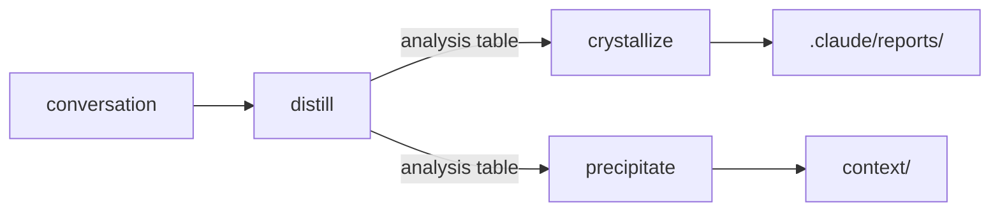

# Designing Knowledge Extraction Tools

<!-- front matter -->
**Structure**: Analytical Essay
**Date**: 2026-03-05T09:17
**Model**: claude-opus-4-6
**Agent**: Claude Code VSCode Extension 2.1.66
**Source**: reconstruction

## Introduction

After establishing a governance framework — document hierarchy, mechanism classification, knowledge routing all in place — a new problem surfaced: where does the thinking process that produced these governance decisions live?

The evaluation of design alternatives, trial-and-error sequences, user challenges and corrections — the critical material that constitutes decision quality — all live in conversation sessions. Conversations are the native work interface of AI-assisted engineering, yet also the most fragile knowledge carrier. Context compression is an unhookable platform event — when compression occurs, neither the user nor the AI receives advance notice. Once completed, alternative comparisons and trade-off reasoning are reduced to summaries, making complete decision records unextractable.

This means the most valuable knowledge — not "what was done" but "why it was done this way" — has a time window. It must be structurally extracted while conversation detail still exists, or it is permanently lost. This essay analyzes the tool pipeline designed for this purpose: a three-stage architecture from evaluation to structuring to persistence, and the attribution routing mechanism that drives knowledge flow between destinations.

## Analysis

### Pipeline Topology: Three Tools, Three Stages, One Input Source

Splitting knowledge extraction into multiple tools rather than building a single all-in-one tool was based on three observations. First, a **human decision point** exists between evaluation and generation — the user sees evaluation results and decides the next step, rather than tools auto-chaining. Second, evaluation has **independent value** — even without generating any report, knowing which knowledge is worth extracting helps the user. Third, generation **may not happen** — evaluation may conclude "content insufficient."

Three tools, named using a chemistry metaphor, each handle one stage:

Distill (distillation) is the upstream evaluation node: scans conversations, identifies topics, assesses depth and maturity, marks attribution tendency. Output is a single analysis table — no recommendations, no follow-up actions, no file creation. Crystallize (crystallization) is the structuring node: matches conversation content to the appropriate report format and generates reports. Precipitate (precipitation) is the persistence node: deposits project-specific knowledge into the knowledge base or co-located documentation.

In this topology, distill is the shared upstream triage node for two divergent paths, not a subset of precipitate. An early analysis misjudged functional overlap due to verb drift in precipitate's description ("distill knowledge" used where "extract knowledge" was meant). A user correction revealed the real issue — this was a terminology problem, not structural overlap. The two downstream paths produce entirely different outputs: one produces internalization reports, the other produces project knowledge.

### Attribution as Routing: Internalize, Externalize, or Both

Distill's three-way attribution assessment (internalize / externalize / both) is the pipeline's routing mechanism. Each topic is marked as "suited for internalization" (understanding itself is the value), "suited for externalization" (persistence in the project is the value), or "both" (the principle needs to be understood, the specific decision needs to be recorded).

This attribution tendency directly predicts the appropriate downstream tool. Internalization topics flow to crystallize, producing structured reports written to the reports directory. Externalization topics flow to precipitate, depositing into the knowledge base or co-located files. Topics with both attributions take what they need from each — the principle crystallizes into a report, the decision precipitates as project knowledge.

Attribution routing exposed a gap in the governance framework. The existing code-as-documentation rule stated where knowledge should NOT go (knowledge base is transitional debt), but lacked a **positive routing table** for where knowledge SHOULD go. Without positive guidance, the knowledge base became the default destination by inertia. The fix was a knowledge routing table specifying destinations by knowledge nature, defaulting to the highest-priority row — lower rows are fallbacks, not preferences.

The attribution system was designed as **non-prescriptive** — distill marks tendency but does not decide. When crystallize receives an "externalize" topic, it informs the user that precipitate may be more appropriate, but does not refuse generation. This preserves user autonomy while providing judgment anchors.

### Structure Selection as Core Value

Crystallize's core value is not report generation — it is **structure selection**: judging the natural shape of content, matching it to the correct report structure, rather than fitting content into a fixed template. This judgment operates through a first-match test: content documenting a multi-phase process with decisions along the way matches Experience Report; content developing an argument from observation through analysis to principle matches Analytical Essay; content capturing a specific technical finding with an investigation process matches Technical Note. When none match or content is too thin, generation is declined.

The importance of structure selection was most clearly validated in a six-round structure debate. While selecting a structure for an analytical piece on knowledge attribution, the process went through the user proposing four sections, the AI reordering reflection and conclusion, the user requesting reader-friendliness, the AI proposing five narrative sections, the user requesting academic rigor, and the AI proposing five academic sections. Finally the AI self-corrected — the "Theoretical Foundation" section was empty because the governance framework was self-built, not based on external literature. After six rounds, the answer was the starting point: the user's original four-section proposal (Introduction → Analysis → Reflection → Conclusion) was the content's natural shape all along.

This experience validated a judgment criterion: four sections was the natural number of this content — not the result of applying a template, but the shape of the content itself. Can any section be deleted without losing the argument? No. Should any section be split? No (insufficient volume). Should any two merge? No (clear cognitive shift between each pair). Can section order be swapped? No (each depends on the preceding section's premise).

### The Write-Once Principle

Reports are defined as **write-once internalization artifacts** — they exist to help users absorb knowledge, not to be maintained or referenced by other documents. This definition produced three cascading design decisions.

First, **reports are not referable**. Files in the reports directory must not become reference sources for other documents. If an insight needs to be referenced, it belongs to externalize attribution and should go through precipitate into the knowledge base or co-located files. This prevents reports from degrading from "internalization channel" to "informal knowledge base."

Second, **templates were eliminated**. Blank structure skeletons with cognitive annotations were initially proposed as "cognitive scaffolds" to teach users the thinking structure. Analysis revealed them to be redundant: the skill definition file already contains complete structure definitions (for AI consumption), and generated reports are concrete instances of each structure (for user internalization). Templates sit awkwardly between both — a degraded version of the skill definition for the AI, inferior to actual reports for users. "Template success is measured by abandonment" — once users have read several same-structure reports, they internalize the thinking pattern, and the template serves no further purpose.

Third, **re-crystallization is not editing**. When new session content needs to be combined with existing reports, the operation uses existing reports as material to generate a **new independent report**, not modify the old one. The old report is untouched; the new report is an independent artifact. The write-once principle makes re-crystallization inherently safe — no downstream consumers break when a new report supersedes an old one.

The write-once boundary was further sharpened by a later test case. When asked whether earlier reports could be re-crystallized with the improved process (readability guidelines, density tiers), all three reports correctly failed the re-crystallization gate — no new content (narrative arc unchanged), no new angle (same perspective), the only difference being improved output process. The conclusion: **write-once artifacts are time-point snapshots of both content AND process capability.** Improved processes apply forward to future reports, not backward to historical ones.

### Quality Controls: Readability, Density Management, Background Alignment

After producing several reports, a fundamental readability issue was identified: reports were "over-structured, high terminology density, insufficient narrative feel." Cross-report patterns included jargon acceleration mid-document — consecutive paragraphs each introducing new terms without buffering — missing connective tissue between sections, and assumed prior context.

Decision Point density management was one specific solution. Decision Points in Experience Reports are embedded as inline callouts within narrative, with different strategies by count: 2-4 use full callout format for all; 5-7 reserve full format for the most impactful decisions, weaving others into narrative prose; 8 or more reserve full format for only the 2-3 most consequential, with all others woven into prose. Additional constraint: no more than two consecutive full-format callouts without an intervening narrative paragraph.

Readability guidelines were organized as a standalone reference document covering four dimensions. The Terminology Introduction Protocol requires every domain term's first appearance to include a parenthetical explanation or example-first introduction, with no more than two new terms per paragraph. Narrative Continuity Rules require transition sentences between phases, scene-setting rather than compressed summaries in Background sections, and no orphaned structural elements (tables and callouts must have narrative context). A sentence complexity limit prohibits three or more independent concepts in a single sentence.

The quality gate gained two additions. A structural balance check: if structural elements (tables, callouts) exceed prose line count, add narrative connective tissue — not padding, but the difference between a reference document and a readable report. A background alignment review: after drafting the full report, re-read Background against the completed Discovery section — Background content that Discovery never builds on should be removed (it is history, not a starting condition); Discovery context that Background did not establish should be added.

### Batch Coordination and Cross-Session Persistence

When the same session produces multiple reports, two additional mechanisms activate. A Batch Coordination Plan establishes internal coordination before report generation — scope boundaries prevent content overlap, and handoff points ensure one report's conclusion naturally connects to the next's starting conditions. The coordination plan is an internal working document, not persisted and not appearing in any output.

A Reading Guide completes after report generation — containing reading order, cross-report connections, and session background. The key design principle is "the reading guide is navigation, not reference" — it helps readers orient themselves but does not quote report content or create downstream dependencies. This is consistent with the write-once principle: all artifacts in the reports directory are endpoints, not sources for other documents.

A cross-session metadata index (Report Index) records each report's date, topic, structure, and key themes for three anticipated consumption scenarios: distill detecting already-crystallized topics (deduplication), crystallize discovering related existing reports (re-crystallization assessment), and knowledge-capture reminders improving signal accuracy. The index contains only metadata — no report content, maintaining compatibility with the "not referable" constraint.

Since context compression cannot be hooked, a heuristic always-on rule (knowledge-capture-reminder) was created that suggests distillation when four signals appear: three or more independent decision topics accumulated, a single topic with three or more rounds of user challenge-revision cycles, topic shift after extended discussion on a previous topic, or the user explicitly signaling a task switch or end of work. The rule suggests but does not auto-invoke — the user decides whether and when to distill.

## Reflection

The pipeline design surfaces several cross-tool tensions.

**The human decision point between evaluation and generation is deliberate inefficiency.** Auto-chaining would be faster, but loses the user's opportunity to judge "is this topic worth structuring?" Inefficiency is a feature, not a bug — it protects the user's control over knowledge flow.

**The three-way attribution is simplification, not precise classification.** Real knowledge frequently has both internalization and externalization value, and the "both" label merely acknowledges this fact rather than resolving it. But simplification is correct here — an overly granular classification system would transform distill from a lightweight evaluation into a burdensome judgment exercise, contradicting its design intent.

**The write-once principle is conceptually clean but practically tense.** Reports being not referable means valuable insights must be "duplicated" to the knowledge base (via precipitate) to be referenceable by other documents. This appears redundant but is actually routing — the same insight takes different forms and lifecycles at different destinations. The report version is written for reader internalization; the knowledge base version is written for machine querying.

**The timing of quality control additions reveals a tool evolution pattern.** Readability guidelines were not conceived in the initial design but backfilled after multiple reports exposed actual quality issues. This supports a more general observation: quality control mechanisms for tools can often only be accurately designed after the tool has been used, because the shape of quality problems requires actual output to reveal.

## Conclusion

This knowledge extraction pipeline's design points to three transferable principles.

**Content drives structure, not structure drives content.** Matching content's natural shape to the correct format is the core value — the six-round structure debate returning to its starting point is the clearest evidence. Forcing content into a fixed template loses the information carried by the shape itself.

**Attribution routing matters more than functional decomposition.** The pipeline's value lies not in having three tools instead of one, but in the three-way attribution (internalize / externalize / both) providing a judgment framework — every piece of knowledge is asked "where is its value realized?" The answer to this question determines both destination and form.

**The non-referability of write-once artifacts is not a limitation but a protection.** Allowing references would let reports silently drift from "channels for understanding" to "knowledge sources requiring maintenance," eventually inheriting the same debt accumulation problem as the knowledge base. Severing the reference chain is a necessary condition for reports to remain reports.
