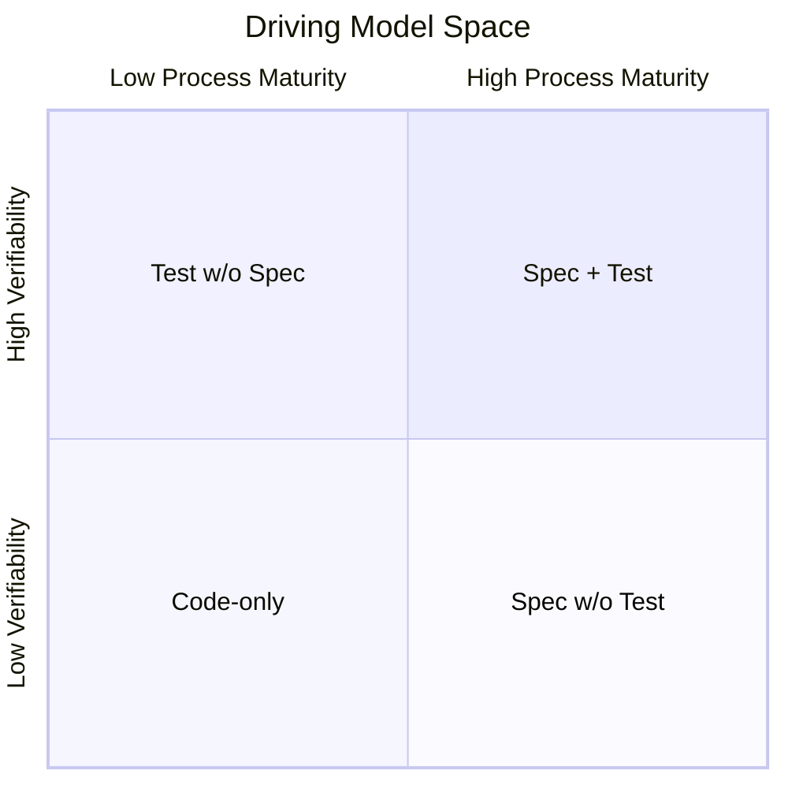
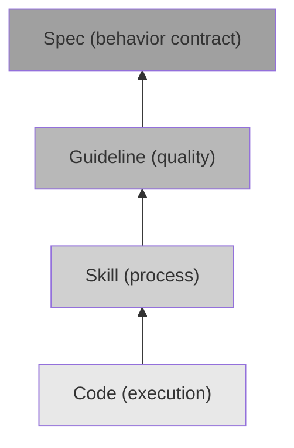

# Evolution Dynamics of Driving Models: The Four-Plus-One Structure and Stacking Coexistence

<!-- front matter -->
**Structure**: Analytical Essay
**Date**: 2026-03-09T23:00
**Model**: claude-opus-4-6
**Agent**: Claude Code VSCode Extension 2.1.72
**Source**: conversation

## Introduction

Once five driving models are independently defined, a natural question emerges: what is the relationship between them? Is it a strict linear sequence — every project must progress from code-driven step by step toward spec-driven? Or a buffet — pick freely, combine at will?

Neither extreme interpretation fits observation. A linear sequence implies "later models are better," ignoring the decisive role of context. Buffet-style free combination ignores structural dependencies between models — some models, when force-introduced without their prerequisites met, do not produce the expected effect.

This essay analyzes the evolutionary structure between driving models, proposing a "four-plus-one" architecture: four models form a process maturity evolution axis, test-driven operates as an orthogonal verifiability dimension, and the two axes function independently.

## Analysis

### The Orthogonality of Test-Driven

Among the five models, test-driven occupies a unique position. The other four — code-driven, skill-driven, guideline-driven, spec-driven — each answer process-level questions: "What is the basis for the next decision?" They form an evolution path from "no external structure" to "complete behavioral contracts."

Test-driven answers a question from a different dimension entirely: "Is behavior verifiable?" This question is orthogonal to process maturity. A code-driven project can have a comprehensive test suite — tests verify "what the code does" even without specs defining "what the code should do." Similarly, a spec-driven project can lack automated tests — specs define expected behavior, but verification relies on manual inspection.

This orthogonality can be visualized as a two-dimensional space:

The lower-left is pure code-driven (no process structure, no automated verification). The upper-right is spec-driven plus test-driven (complete behavioral contracts plus automated verification). But the upper-left and lower-right are equally meaningful positions: projects with tests but no specs (test-driven's value is independent of specs), and projects with specs but no automated tests (specs' value is independent of tests).

The practical implication of orthogonality: test-driven can be layered on at any point along the evolution axis, without waiting for process maturity to reach some threshold. A code-driven project introducing test-driven is perfectly reasonable — it increases behavioral verifiability even while behavioral intent remains implicit in code.

### The Process Maturity Evolution Axis

Excluding test-driven, the remaining four models form an evolution axis. Their arrangement is not arbitrary — the problem each model solves is the structural gap of the previous one.

The evolution order is: code-driven → skill-driven → guideline-driven → spec-driven. Each migration step is triggered by the previous model's structural failure becoming intolerable. The following table presents the trigger conditions:

| From | To | Trigger Condition | Core Gap |
|------|----|-------------------|----------|
| Code-driven | Skill-driven | Operational inconsistency begins causing quality fluctuations | Lack of process standardization |
| Skill-driven | Guideline-driven | Skills are correctly executed but output quality is inconsistent | Lack of quality definition |
| Guideline-driven | Spec-driven | Quality meets standards but cannot answer "what behavior counts as done" | Lack of behavioral contracts |

Migration is unidirectional — not because rollback is technically impossible, but because each migration's trigger is the previous model's structural limit. Rolling back means re-confronting an already-identified limit. A team that has recognized "operational inconsistency causes quality fluctuations" will not deliberately abandon skill-driven after introducing it — unless skill-driven itself introduces larger problems.

But unidirectional does not mean non-skippable. Not every project must traverse all four stages. If a project's initial conditions already include equivalents of prerequisite models (e.g., team members bring experience in operational consistency), it can skip the corresponding stage and enter a later model directly. The sequence describes capability dependency relationships, not a mandatory temporal order.

### Stacking Coexistence: Evolution Is Addition, Not Replacement

A key property of the evolution axis: migrating to a new model does not mean the previous model disappears. Instead, the previous model is demoted to an infrastructure layer of the new model.

When a project migrates from code-driven to skill-driven, code remains the execution layer — it hasn't disappeared, it just no longer holds decision authority. When migrating from skill-driven to guideline-driven, skills still handle processes and code still serves as the execution layer — they continue operating, but guidelines now hold authority over quality decisions.

This stacking structure can be represented as:

Each layer builds on the previous one without replacing it. This means a project that has reached spec-driven simultaneously has four layers: specs define behavioral contracts, guidelines ensure quality floors, skills ensure process consistency, and code serves as the final execution layer. Each layer has its role; removing any one produces functional degradation.

Another aspect of stacking coexistence is the accumulation of maintenance costs. Each layer requires maintenance: specs must sync with requirements, guidelines must sync with technical evolution, skills must sync with the toolchain, and code must stay consistent with all upper layers. This is why migration timing matters — each new layer adds maintenance cost, and migration is worthwhile only when the previous layer's structural failure cost exceeds the new layer's maintenance cost.

### Migration Anti-Patterns

Understanding the evolutionary structure enables identification of three common migration anti-patterns.

**Layer-skipping migration.** Jumping directly from code-driven to spec-driven, skipping skill-driven and guideline-driven. The result: specs are written but there is no execution process (missing skill layer), execution happens but quality is inconsistent (missing guideline layer). Specs exist but do not produce the expected effect — because intermediate infrastructure layers are missing. This differs from "skipping": skipping occurs because prerequisites are already satisfied by equivalents; layer-skipping occurs when prerequisites are unmet and the later model is force-introduced.

**Ritualistic adoption.** Introducing a new driving model without truly granting it decision authority. For example, establishing specs but still using code as the authority — specs become decorative artifacts requiring maintenance but not followed. This is worse than not introducing at all, because it adds maintenance cost without delivering benefits.

**Global enforcement.** Forcibly applying the highest-level driving model to every module in the project. Some modules may be small, rarely changed, and low-risk — for them, code-driven or skill-driven is sufficient. Globally enforcing spec-driven is not more rigorous but over-engineering — adding unnecessary maintenance burden to low-risk areas.

The three anti-patterns share a root cause: ignoring the stacking nature of the evolutionary structure. Each layer's introduction has prerequisites (the previous layer's structural failure) and costs (the new layer's maintenance burden). Migration divorced from these two considerations, regardless of whether the direction is "correct," will produce problems.

## Reflection

### Universality of the Sequence

Is the process maturity evolution axis (code → skill → guideline → spec) universally applicable? Or does it hold only in specific types of projects?

The sequence's underlying logic is: each step fills the previous step's semantic gap. Code lacks process standardization → skills fill it. Skills lack quality definition → guidelines fill it. Guidelines lack behavioral contracts → specs fill it. This "gap-driven filling" pattern is universal — as long as a project's complexity grows enough to expose these gaps.

But the order of exposure may vary by project. A highly regulated industry (finance, healthcare) may need behavioral contracts from day one — its starting point is already spec-driven. A rapidly iterating product team may need behavioral specs before quality guidelines — because "what counts as done" is more urgent than "what counts as good quality."

Therefore, the evolution axis describes the logical order of capability dependencies, not a temporal order every project must follow. Most projects' actual experience will roughly follow this sequence, but skipping, parallelism, and even localized rollback are all possible.

### Four-Plus-One Is Description, Not Prescription

The "four-plus-one" architecture is itself a driving model — it attempts to provide an analytical framework for project evolution. As an analytical framework, its value lies in explanatory power (can it help understand observed phenomena), not in predictive power (can it accurately predict what to do next).

Real project evolution is influenced by too many contextual factors — team culture, technology stack characteristics, business pressures, historical inertia — for any analytical framework to fully incorporate. "Four-plus-one" provides a skeleton for thinking, not a prescription for action.

## Conclusion

The relationship between driving models is neither a linear sequence nor free combination but a structured evolutionary framework. Test-driven operates as an orthogonal verifiability dimension that can be layered on at any stage. Code-driven, skill-driven, guideline-driven, and spec-driven form a process maturity evolution axis where each migration step fills the previous step's structural gap. Evolution is addition, not replacement — previous models are demoted to infrastructure layers and continue operating.

Three transferable principles:

1. **Test-driven is orthogonal to process maturity and should not be placed in the evolution sequence.** Treating test-driven as a step "after code-driven, before skill-driven" leads to false prerequisite assumptions — believing a process framework must exist before writing tests. In reality, tests can be independently introduced at any stage because they address verifiability, not process maturity.

2. **Evolution is stacking — new models build on previous models without replacing them.** A spec-driven project still needs guidelines, skills, and code. Removing any layer produces degradation. This means each new layer adds maintenance cost, and migration timing depends on cost crossover — when the previous layer's structural failure cost exceeds the new layer's maintenance cost.

3. **The common root cause of migration anti-patterns is ignoring stacking structure.** Layer-skipping ignores prerequisites, ritualistic adoption ignores authority transfer, and global enforcement ignores module differences. Recognizing these three anti-patterns has more operational value than memorizing the evolution sequence — because most migration failures are not about wrong direction but wrong approach.
