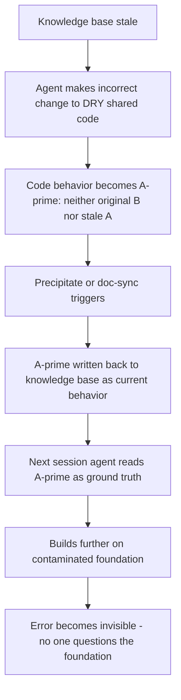
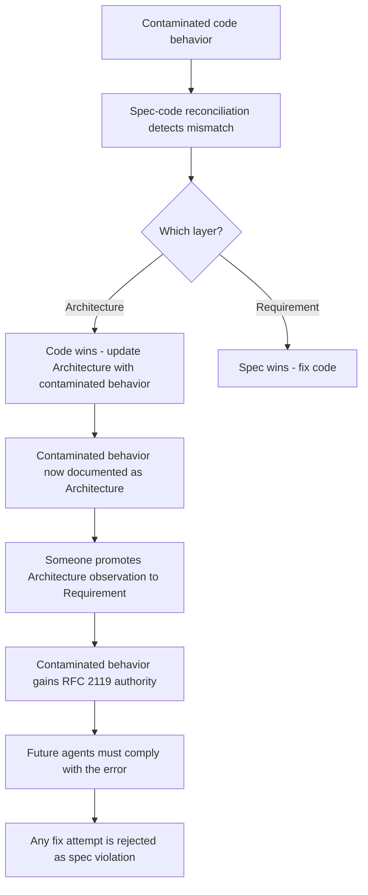

# The Latent Harm of Code Cleanliness: From Point Risks to Systemic Collapse

<!-- front matter -->
**Structure**: Analytical Essay
**Date**: 2026-03-11T22:30
**Model**: claude-opus-4-6
**Agent**: Claude Code VSCode Extension 2.1.72
**Source**: conversation

## Introduction

An agent is a sequence completion machine — its "existence" equals the tokens visible in the context window. Under this premise, multiple aspects of traditional code quality practices can create causal breakpoints: encapsulation deletes local context, design patterns introduce bindings determined only at runtime, and abstraction layers exceed the agent's tracing capability.

This essay expands on how these risks manifest in concrete code practices, from point-level semantic dilution to design pattern and syntax-level risk grading, through to systemic collapse when multiple practices compound — including secondary contamination and the contamination endgame of spec-driven development.

## Analysis: Point Risk Vectors

### Semantic Dilution

Semantic dilution refers to a precise concept losing its discriminative power after being replaced by a generalized expression. The judgment criterion is: **are the degrees of freedom implied by the code structure actually exercised in the system?**

```javascript
// Dilution: appears to support multiple sorting strategies
function getSort(type) {
    if (type === 'name') return sortByName;
    if (type === 'date') return sortByDate;
    if (type === 'size') return sortBySize;
    return sortByName;
}

// But all call sites always pass 'name':
list.sort(getSort('name'));
```

```python
# Dilution: appears to support multiple sorting strategies
class SortableList:
    def sort(self, key: str = "name", reverse: bool = False,
             comparator: Callable = None, locale: str = None):
        if comparator:
            self.items.sort(key=comparator, reverse=reverse)
        elif key == "name":
            self.items.sort(key=lambda x: x.name, reverse=reverse)
        elif key == "date":
            self.items.sort(key=lambda x: x.date, reverse=reverse)
        # ... more branches

# But the entire project has only one call site:
file_list.sort("name")
```

```rust
// Dilution: generics imply "any Sortable can be used"
fn sort_items<T: Sortable>(items: &mut Vec<T>, strategy: SortStrategy) {
    match strategy {
        SortStrategy::ByName => items.sort_by(|a, b| a.name().cmp(&b.name())),
        SortStrategy::ByDate => items.sort_by(|a, b| a.date().cmp(&b.date())),
        SortStrategy::BySize => items.sort_by(|a, b| a.size().cmp(&b.size())),
    }
}

// But the entire project has only one call site:
sort_items(&mut files, SortStrategy::ByName);
// Generic T + enum SortStrategy creates "double phantom freedom" —
// strong typing makes dilution more hidden because it looks like "well-designed generics"
```

The three branches and the `type` parameter imply a **nonexistent axis of variation**. The agent will believe the system has multiple sorting strategies in operation and will carefully protect these "strategies" during modifications — but in reality they are never exercised. Unused degrees of freedom constitute dilution; they consume the agent's attention (context window space) to understand a possibility that will never occur.

Note the Rust case: strong type systems make dilution **harder to detect**. Generic `T: Sortable` + `SortStrategy` enum looks like reasonable design — the type checker ensures everything compiles — but in reality only one path is exercised. Type safety does not equal semantic safety.

High abstraction itself does not equal dilution. The judgment line is: do the degrees of freedom implied by the abstraction have **≥ 2 consumers** exercising different paths? If yes, it is reasonable abstraction. If no, it is semantic dilution. This criterion also applies to premature generalization — building interface + factory + registry for only one consumer.

### Design Pattern Risk Grading

The agent risk of design patterns depends on one dimension: **whether binding relationships are statically visible or determined only at runtime**. The agent's strength is static analysis; its weakness is runtime reasoning. Any pattern that defers decisions from write-time to runtime amplifies the agent's weakness.

The table below is sorted by risk, with high-risk patterns at the top:

| Pattern | Risk | Agent Breakpoint |
|---|---|---|
| **Observer** | High | Cannot statically trace "who is listening"; event names are strings — grep finds subscribers but cannot confirm execution order and side-effect interactions |
| **Strategy** | High | Agent must traverse all implementations to judge "which path does the current scenario take"; with a single implementation, the entire pattern is noise |
| **Decorator/Chain** | High | Behavior stacks at runtime; static analysis cannot see the final combination; agent's answer to "what does this call actually do" is probabilistic |
| **Mediator** | High | God object risk — agent's context window cannot fit the entire mediator; partial reading leads to missed coordination logic |
| **Abstract Factory** | High | Two layers of indirection (factory selection + product construction); agent needs 3 jumps to see the actual object; any jump error along the way cascades |
| Template Method | Low | Binding visible in the inheritance chain |
| Builder | Low | Construction steps visible in static code |
| Facade | Low | Simplifies interface; reduces rather than increases jumps |

**High-risk commonality**: binding relationships determined only at runtime. **Low-risk commonality**: bindings visible in static structure; agent can fully trace via grep + inheritance chain.

### Dangerous Syntax: The Risk Spectrum Across Three Languages

Similar to design patterns, syntax-level risks stem from the same root cause: making "what is seen" inconsistent with "what executes." The following covers dynamically weakly-typed (JavaScript), dynamically strongly-typed (Python), and statically strongly-typed (Rust), forming a complete risk spectrum.

**JavaScript** — broadest blind spots:

| Syntax | Risk | Reason |
|---|---|---|
| Mixin (runtime dynamic) | Extreme | Override order of same-named methods depends on mixin order; agent cannot determine final form from a single file; ExtJS `mixins` are especially dangerous — override rules differ from class inheritance |
| Proxy / Reflect | Extreme | Intercepts arbitrary property access; static analysis completely fails; agent sees `obj.foo` but cannot determine what actually executes |
| Monkey Patching | Extreme | `SomeClass.prototype.method = ...` rewrites behavior at any location; affects globally but grep only finds assignment points, not impact scope |
| getter/setter | Medium | Looks like property access but actually executes a function; agent often assumes `obj.x` is a pure read and ignores side effects |

```javascript
// Proxy: static analysis completely fails
const handler = {
    get(target, prop) {
        console.log(`accessed ${prop}`);  // side effect
        return prop in target ? target[prop] : fetchFromRemote(prop);
    }
};
const config = new Proxy({}, handler);
config.timeout;  // ← agent thinks this is property access, may actually trigger HTTP request

// Mixin (ExtJS style): override order not visible
Ext.define('MyPanel', {
    mixins: ['Draggable', 'Resizable'],  // both define onMouseDown — who wins?
    // agent cannot determine from this line — must check mixin source + ExtJS mixin priority rules
});
```

**Python** — equally broad blind spots, but different in form:

| Syntax | Risk | Reason |
|---|---|---|
| `__getattr__` / `__getattribute__` | Extreme | Arbitrary property access intercepted; `obj.foo` may trigger HTTP requests, ORM queries |
| Metaclass | Extreme | `class Foo(metaclass=Meta)` — the class construction process itself is rewritten; agent sees `class Foo` but that doesn't mean Foo looks that way |
| Decorator stacking | High | `@cache @retry @auth def f()` — after three layers of wrapping, `f`'s signature, return value, and exception behavior all differ from the original definition |
| `*args, **kwargs` passthrough | High | `def wrapper(*args, **kwargs): return inner(*args, **kwargs)` — agent cannot infer from wrapper what parameters inner accepts |
| Mixin (multiple inheritance) | High | MRO determines method resolution order; `class C(A, B)` and `class C(B, A)` behave differently; agent often ignores order differences |
| `@property` | Medium | Appears to read an attribute but may actually trigger computation, I/O, or even state mutation |

```python
# __getattr__: arbitrary attribute access becomes RPC call
class RemoteService:
    def __getattr__(self, name):
        def method_proxy(*args, **kwargs):
            return requests.post(f"{self.url}/{name}", json={"args": args})
        return method_proxy

svc = RemoteService(url="http://api.internal")
svc.get_users()  # ← agent thinks this is a local method call, actually HTTP POST

# Metaclass: class construction process rewritten
class AutoRegister(type):
    registry = {}
    def __new__(mcs, name, bases, namespace):
        cls = super().__new__(mcs, name, bases, namespace)
        mcs.registry[name] = cls  # side effect: registered to global registry
        return cls

class Handler(metaclass=AutoRegister):  # ← agent sees class definition
    pass                                 #    doesn't see it's been registered somewhere
```

**Rust** — blind spots concentrated but at critical lower layers:

| Syntax | Risk | Reason |
|---|---|---|
| `dyn Trait` (dynamic dispatch) | High | Static analysis only sees trait interface, not actual implementation — equivalent to JS runtime binding |
| `macro_rules!` / proc macro | High | Expanded code differs from source — equivalent to Python metaclass; agent reads something different from what actually compiles |
| `unsafe` block | High | Compiler guarantees are void in this region; agent cannot rely on the type system to infer correctness |
| Trait blanket impl (`impl<T: X> Y for T`) | Medium | Implicitly adds methods to all qualifying types; agent cannot see explicit impl declarations |
| `Deref` coercion | Medium | `obj.method()` may resolve at any layer in the deref chain — equivalent to JS getter trap |

```rust
// dyn Trait: static analysis only sees the interface
fn process(handler: &dyn EventHandler) {
    handler.on_event(event);  // ← which implementation? agent only sees trait signature
}

// proc macro: source code ≠ compiled code
#[derive(Builder)]       // ← expands to generate dozens of lines of impl code
struct Config {          //    agent reads a struct definition that isn't the complete type
    host: String,
    port: u16,
}
// After expansion, Config has ConfigBuilder, build(), set_host(), etc.
// But source code shows none of these methods

// unsafe: compiler guarantees void
unsafe {
    let ptr = some_ptr as *mut Node;
    (*ptr).next = new_node;  // ← agent cannot rely on type system to judge correctness
                              //    lifetime and aliasing rules not guaranteed in this region
}
```

The comparison across three languages reveals an important conclusion: strong typing significantly shrinks the agent's blind spot area but does not eliminate it. JS/Python blind spots are broad (nearly all dimensions); Rust blind spots are concentrated (mainly in dynamic dispatch and macro expansion). However, residual risks tend to appear in the system's most critical lower layers — `unsafe` and proc macros are typically used in infrastructure code, and once the agent makes errors there, the blast radius is maximum.

### Implicit Async Context

Implicit async context is an extreme case of the "never existed" type in the causal breakpoint spectrum. Code syntactically appears synchronous, but actual execution involves asynchronous timing, and state changes that may occur in between **never appear as tokens in the code text**.

```javascript
const user = await getUser();
// ← Logic dead zone: other async flows may have modified shared state
//    but there are no tokens here hinting at this possibility
const order = await getOrder(user.id);
// agent assumes user is still the same user from before
```

```python
# Python's async/await has the same logic dead zone
async def process_order():
    user = await get_user()
    # ← Logic dead zone: other coroutines may have modified shared state
    #    asyncio event loop yields control here
    order = await get_order(user.id)
    # agent reads line by line, cannot see the world changing between awaits
```

The agent performs causal inference by simulating line by line sequentially. World changes between two `await`s are completely invisible in the code text. The agent does not "see it but misunderstand" — that segment of the causal chain **never existed in its input**. Specific failure modes include: ignoring race conditions, inferring `Promise.all` side-effect execution order by written order, and missing error paths in `try/catch` where parallel operations have already partially completed.

### Convergence: Code Text ≠ Actual Behavior

All risk vectors above — semantic dilution, high-risk design patterns, dangerous syntax, implicit async — share a single characteristic: **a gap exists between the textual representation of code and its actual execution behavior**. Humans use intuition, experience, and active exploration to bridge this gap. The agent has only token sequences; the gap is a blind spot.

## Reflection: From Point Risks to Systemic Collapse

A single causal breakpoint causes local errors. But when multiple code practices simultaneously create causal breakpoints, risk escalates from linear addition to exponential amplification.

### Compounding Amplification of DRY + Centralized Knowledge Base

After DRY eliminates duplication, code paths converge to a single copy. A centralized knowledge base converges the source of understanding to a single location. When both converge simultaneously, the agent's error margin drops to zero:

| | Duplication + No Knowledge Base | DRY + Centralized Knowledge Base |
|---|---|---|
| When agent misunderstands | Breaks one copy; other copies unaffected | Breaks the only copy; all consumers affected |
| When knowledge becomes stale | Each copy has local context for cross-verification | The sole source of understanding is the stale knowledge base; nowhere to cross-verify |
| Repair cost | Low — local repair | High — must understand differential needs of all consumers |

In essence, DRY converges code paths and the centralized knowledge base converges understanding sources. Simultaneous convergence of both equals the agent's error margin dropping to zero. Humans compensate in this architecture through memory and intuition; the agent has neither.

### Silent Solidification of Secondary Contamination

Compounding amplification is not the endpoint. When the results of incorrect modifications are **written back to the knowledge base**, errors solidify from a temporary state into "fact" — this is secondary contamination:



This chain is silent. Each stage looks like a normal operation — code changed, docs synced, next session works normally. No step actively signals "contamination here." In human teams, code review or a senior member who "remembers how things were" might intercept it. Agent sessions have no memory continuity; each is a fresh starting point of trust — whatever the knowledge base says is believed.

### The Contamination Endgame of Spec-Driven Development

The ultimate form of secondary contamination is the erosion of the specification itself. In the dual-layer spec structure, the Architecture layer's rule is "code wins — when code contradicts Architecture, update the Architecture." This rule's design intent is to allow code evolution. But when the code itself has been contaminated, this rule becomes a **contamination highway**:



The critical turning point is the Architecture → Requirement promotion. The reversibility of this promotion drops sharply:

| Stage | Reversibility |
|---|---|
| Code contaminated | Reversible — git revert |
| Architecture updated | Reversible — but requires someone to realize it's wrong |
| Architecture → Requirement promotion | **Nearly irreversible** — all subsequent agents will "fix code to comply with spec," rejecting any repair attempt |

In traditional development, an outdated spec is merely "a document nobody reads." In spec-driven development, spec is an enforced contract. An outdated spec is not ignored — it is **actively enforced** by the agent. This transforms "stale documentation" from a passive risk into an active destructive force.

## Conclusion

Code quality practice risks can be classified into three tiers. The first tier is point risks: semantic dilution, high-risk design patterns, dangerous syntax, implicit async — each creating local causal breakpoints. The second tier is compounding risks: DRY + centralized knowledge base converging simultaneously, reducing the agent's error margin to zero. The third tier is systemic collapse: secondary contamination silently solidifies, until the spec-driven framework begins actively protecting errors.

All risks share one common characteristic: code text ≠ actual behavior. Humans bridge the gap with intuition; agents cannot. Recognizing the existence of this gap is the prerequisite for designing effective responses.
