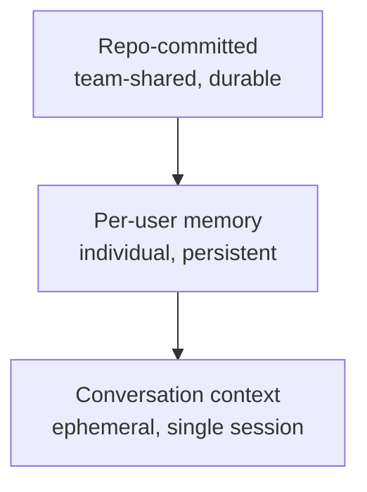

# Knowledge Layering: Memory Architecture for AI-Assisted Teams

<!-- front matter -->
**Structure**: Technical Note
**Date**: 2026-03-12T16:00
**Model**: claude-opus-4-6
**Agent**: Claude Code VSCode Extension 2.1.72
**Source**: conversation

## Problem

AI-assisted development tools introduce a new infrastructure question: where should knowledge be stored? Traditional development teams carry knowledge in code, documentation, and verbal communication. The addition of an AI agent introduces two new storage layers — the agent's persistent memory and conversation context. When the boundaries between these three layers blur, teams encounter duplicate records, stale information, and knowledge that can't be found.

This is not a hypothetical risk. In practice, a common symptom is: the agent's memory records code structure information, but the code has since been refactored — memory and reality diverge, and the agent makes incorrect suggestions based on outdated information. Another symptom: team member A accumulates extensive project context in their agent's memory, but team member B's agent knows none of it — personal memory cannot support team collaboration.

## Investigation

### Three-Layer Knowledge Model

Observing how AI agent tools actually operate, knowledge naturally distributes across three layers, each with different durability, visibility, and applicable scope.

The diagram below shows the relationship between layers — higher layers are more durable and shared, lower layers more ephemeral and personal:

**Repo-committed layer** encompasses all knowledge committed to version control — code, specs, co-located documentation, rule definitions. This layer is visible to all team members, protected by version control, and is the most durable knowledge carrier. Its update cost is highest (requires a commit), but its reliability is also highest.

**Per-user memory layer** is the persistent memory maintained by the agent for individual users. It survives across conversations but is visible only to that single user's agent. Typical contents include user role preferences, recurring feedback, and reference pointers to external systems. This layer's durability falls between repo and conversation — it outlives conversations but lacks version control protection.

**Conversation layer** is the immediate context within a single conversation. It contains the current task's reasoning process, attempted approaches, and intermediate results. After the conversation ends, this information exists only in compressed transcripts and is no longer actively used.

### Graceful Degradation

A key design property of the three-layer model is graceful degradation: when a layer is missing, the system falls through to the next layer rather than stopping.

Specs don't exist? Fall through to co-located documentation. Co-located docs don't exist? Fall through to code search. No user preferences in personal memory? Use default behavior. No prior discussion context in the conversation? Reason from scratch. The absence of any layer is not catastrophic — it merely increases reasoning cost and reduces result precision.

This property lets the system operate at any knowledge density. A newly onboarded team member whose agent's personal memory is empty and whose repo-layer specs may be sparse can still work by searching code. As usage time increases, the personal memory layer gradually fills, specs gradually enrich, and system efficiency naturally improves — but there is never a "must prepare first before starting" threshold.

### Anti-Patterns

The three-layer model works well when boundaries are clear, but three anti-patterns commonly emerge in practice.

**Anti-pattern one: storing ephemeral state in durable layers.** Saving current task progress, temporary debugging clues, or to-do items into personal memory. This information loses meaning after the current conversation ends but continues occupying memory space, increasing agent noise. The correct approach is to use in-conversation task tracking, not memory.

**Anti-pattern two: duplicating repo knowledge in memory.** Recording code structure, file paths, or API shapes in personal memory. The authoritative source for this information is the code itself — copies in memory become stale immediately after code changes, with no mechanism to trigger synchronization. The correct approach is to let the agent read code directly when needed.

**Anti-pattern three: treating memory as documentation.** Attempting to build a complete project knowledge base in personal memory, recording architectural decisions, design rationale, and historical context. If this knowledge has value, it should exist in the repo layer (specs, co-located docs, commit messages) for team sharing. Memory's correct use is recording "information about the user" and "information about how to interact with the user," not "information about the project."

### Knowledge Promotion Triggers

When should knowledge move from one layer to another? Here are four promotion triggers.

First, **recurrence**. The same knowledge is needed across multiple conversations. If the agent needs the same context for the third time, that context should be promoted from conversation layer to memory layer. If this context would also be valuable to other team members, it should further promote to the repo layer.

Second, **decision constraint**. Knowledge has influenced implementation decisions. A design constraint discovered during conversation that would affect future implementation direction should not remain in the conversation layer waiting to be forgotten. Based on the constraint's scope — personal preferences promote to memory layer, team-shared design principles promote to repo layer.

Third, **correction feedback**. The user has corrected the agent's behavior. This type of knowledge should almost always promote to the memory layer, because it represents a gap between user expectations and the agent's default behavior. Failing to promote means the user must repeat the same correction in every conversation.

Fourth, **cross-personnel value**. Knowledge would be useful to other team members. This is the core criterion for promoting from memory layer to repo layer — personal memory serves one person, repo knowledge serves the entire team. When an insight's value transcends individual use cases, it should be committed to version control.

Notably, knowledge can also skip layers during promotion. An important design constraint discovered in conversation might promote directly to the repo layer (via commit), skipping the memory layer — because its value is inherently team-level, not personal-level.

### Degradation Failure Modes

Graceful degradation assumes "the next layer can provide sufficient substitute information." When this assumption doesn't hold, degradation fails.

**Repo layer absence has the greatest impact.** If the code itself isn't clear (vague naming, chaotic structure), falling through to code search still cannot yield reliable understanding. This is why "code as documentation" is a foundational requirement — it serves not just human readers but also acts as the last line of defense in the AI agent's degradation path.

**Memory layer absence has moderate impact.** Without personal memory, the agent uses default behavior, which is usually acceptable. The real loss is accumulated interaction preferences — users need to re-teach the agent their working style. For new members, this cost is unavoidable; for system migrations or memory loss, this cost is frustrating repeated labor.

**Conversation layer degradation is the norm.** Long conversations trigger context compression, where details are replaced by summaries. This isn't failure — it's an inherent design reality. The correct response is to promote valuable knowledge to more durable layers before compression occurs. This is precisely why tools like distill and crystallize exist.

## Finding

The core insight of the three-layer knowledge model is: each layer exists not to pursue completeness but to provide a degradation path when the layer above is unavailable. This design philosophy determines what each layer should store — not "what knowledge is most important" but "when the upper layer is missing, what substitute can this layer provide."

This explains why personal memory should not duplicate repo knowledge: the repo layer is the most reliable, and its existence frees the memory layer from bearing "project knowledge" responsibility. Memory's true value is storing what the repo layer cannot express — personal preferences, interaction feedback, external references.

This also explains the logic behind language selection. When a document's primary consumer is an AI agent, using English maximizes processing efficiency. When the primary consumer is human team members, using the team's working language (e.g., Traditional Chinese) minimizes comprehension cost. This isn't a question of "which language is better" — it's a question of "who's reading." Spec documents are frequently parsed by agents, so English; reports are read and internalized by humans, so the native language. Consumer identity determines language selection, not content nature.

## Application

Applying this model to team collaboration yields three practical recommendations.

First, **separate the submission paths for personal memory and team knowledge.** Personal memory resides in the user's agent configuration directory (e.g., `~/.claude/projects/`), not committed to version control. Team knowledge is committed to the repo through specs, co-located docs, and rule definitions. The two should not mix — committing personal memory to version control imposes personal preferences on the team; storing team knowledge in personal memory creates information silos.

Second, **build promotion habits, not promotion procedures.** Requiring team members to fill out a knowledge promotion checklist after every conversation is impractical. A more effective approach is cultivating judgment: when you've explained the same thing for the third time across conversations, it's time to promote. When your agent gives bad advice and the corrected understanding would also help colleagues, it shouldn't stay only in your memory.

Third, **accept asymmetric knowledge density.** Different team members will have different personal memory densities, and different domains will have different spec coverage rates. This is not an imbalance requiring correction — it's the system's natural state at different maturity levels. The graceful degradation design guarantees that even when a layer is completely blank, the system still operates, just less efficiently. Pursuing uniform knowledge density is perfectionism misapplied.
