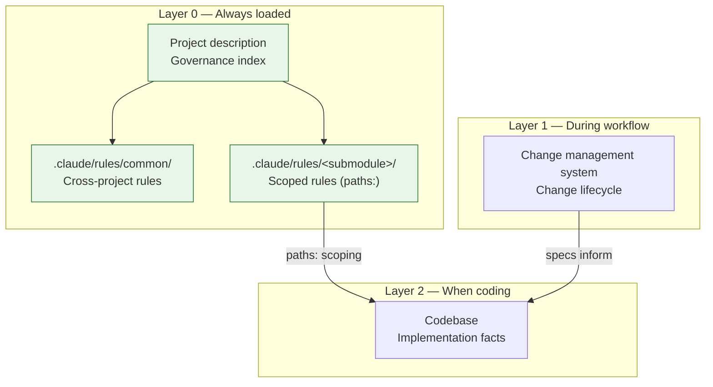

# AI Agent Governance Architecture — From Three-Layer Model to Knowledge Dissolution

<!-- front matter -->
**Structure**: Experience Report
**Date**: 2026-03-18T21:00
**Model**: claude-opus-4-6
**Agent**: Claude Code VSCode Extension 2.1.72
**Source**: conversation

## Background

A multi-submodule product had engineering rules scattered across three locations — the project description file, a workflow configuration, and a knowledge base directory — with no defined priority. The AI agent loaded the project description every session, but architecture decisions and coding disciplines weren't in it. The workflow configuration mixed behavioral constraints with template format rules, and behavioral constraints only took effect during specific workflows. The knowledge base had 37 files, some already superseded by formal specifications, with no mechanism for retiring outdated content.

The trigger for restructuring: after introducing a structured change management system, the number of rule sources grew from two to three, making the confusion worse.

## Discovery

### Act One: Centralization — Putting Rules in the Always-Loaded File

The first instinct was to establish layers: the project description as Layer 0 (always loaded), workflow config as Layer 1 (during workflows), codebase as Layer 2 (implementation facts). Any rule that applies to "all code changes" belongs in Layer 0; rules needed "only when writing artifacts" stay in Layer 1.

This worked for the "where to find rules" problem. Seven binding constraints were extracted from the architecture vision document into the project description, six engineering disciplines were established, and the workflow config was trimmed to template format rules only.

But centralization created new tension: the project description grew from 120 to 280 lines, mixing project overview (build instructions, packaging, service lifecycle) with governance rules (architecture decisions, coding disciplines, logging standards). Worse, language-specific examples loaded even when editing unrelated code, wasting the agent's attention.

### Act Two: Knowledge Begins to Flow — Dissolution over Translation

After centralization, the next problem surfaced: the knowledge base contained files in a language designated for human-reviewed specifications, while AI-readable documents should be in a different language. The obvious fix was translation.

In practice, translation preserved structure but not value — a legacy archaeology note, translated, was still an archaeology note. Its actionable insights (constraints on new designs) hadn't been placed in their proper governance layer.

> **Decision Point**: Dissolution over translation — extract actionable knowledge into its proper governance layer, then delete the source
> — Alternatives: In-place translation (preserves structure, doesn't place value); move to new directory (changes location, not substance)
> — Outcome: Four archaeology files dissolved into two structured reference tables plus absorption into architecture decisions. A four-step dissolution cycle was established to prevent future accumulation

This turning point established a principle: knowledge migration is extraction and placement, not relocation. Each piece of knowledge should flow to its most natural permanent home — constraints become governance rules, reference data becomes structured reference, behavioral specifications become formal specs. Source files don't get moved; they get absorbed and disappear.

The four-step dissolution cycle (spec coverage scan → mark or delete covered content → route new knowledge → assess dissolution progress) triggers after each change is archived, ensuring the knowledge base doesn't re-accumulate.

### Act Three: Finding Rules a Home — Three Pivots

The project description was too bloated. Rules needed a separate home.

The first attempt was a custom `governance/` directory — clean structure, one file per topic. But this invented a directory the AI framework didn't know about. The agent wouldn't automatically read it; the project description would need explicit pointers, solving bloat with indirection.

The second attempt was to accept the status quo: since the project description is the only file guaranteed to load, maybe bloat is an acceptable cost. But 280 lines was just the beginning — as other submodules needed their own coding standards, it would only grow.

> **Decision Point**: Adopt the AI framework's native `.claude/rules/` mechanism instead of a custom directory
> — Alternatives: Custom `governance/` directory (requires manual agent guidance); keep everything in project description (bloats, no scoping)
> — Outcome: All `.md` files under `.claude/rules/` auto-load. `paths:` frontmatter restricts loading scope. Cross-project rules in `common/` (always loaded), submodule-specific rules in `<submodule>/` (loaded when working in that submodule). No custom mechanism invented

The third pivot found the right answer. The principle: before inventing mechanisms, verify the framework doesn't already provide one. The native rules system not only auto-loaded but supported path scoping — language-specific conventions only appeared when editing that submodule's files.

This mechanism also solved governance ownership. Using submodule names as directory mapping established a clear hierarchy — the root project's cross-project rules, the root project's rules for a submodule, and the submodule's own rules, each with clear ownership.

### Crisis: The Submodule Boundary

With the design complete, implementation immediately hit a git submodule constraint.

The plan was to extract rules to `.claude/rules/` while simultaneously cleaning up duplicated content from the submodule's own project description. But a submodule is an independent git repository — modifying it requires a separate commit, then the root project updates the submodule pointer in another commit. Two commits cannot be atomic. If only one merges, the system is inconsistent.

After implementing halfway, the work was rolled back.

> **Decision Point**: Accept temporary duplication as a deliberate transitional state
> — Alternatives: Modify both root and submodule simultaneously (commit coupling, not atomic); wait until submodule is ready (delays root governance)
> — Outcome: Root repo's `.claude/rules/` is the authoritative source. Duplicated content in the submodule is marked transitional. Cleanup deferred to a separate submodule commit. Duplication is intentional design, not oversight

This was one of the most important lessons: the tension between clean architecture and real-world boundaries resolves not by forcing atomicity, but by accepting transitional states with clear direction — where the authoritative source lives, when cleanup happens, and that the duplication is deliberate.

### Finale: The Governance Model Takes Shape

After three changes and four design pivots, the final model:

The project description transformed from "full text" to "governance index" — it describes the model, defines lookup order, explains knowledge routing rules, but no longer contains the actual engineering rules. Rules live in `.claude/rules/`, managed by cross-project and submodule domains. The knowledge base converges through dissolution cycles, with new knowledge routed to permanent locations by nature.

## Decisions

| # | Decision | Trigger | Outcome |
|---|----------|---------|---------|
| 1 | Three-layer governance (Layer 0/1/2) | Rules scattered across 3 sources, no priority | Clear loading timing and override rules |
| 2 | Language boundary: human review → local language, AI query → English | Subdirectories had no language classification | Testable decision criterion |
| 3 | Dissolution over translation | Translation doesn't place value | Knowledge flows to permanent layer, source disappears |
| 4 | Four-step dissolution cycle | Knowledge base accumulates without retirement mechanism | Triggers after each change archive |
| 5 | Native `.claude/rules/` mechanism | Custom directory requires manual guidance | Auto-loading + path scoping |
| 6 | Submodule name → directory mapping | Need scoped governance | Clear ownership + autonomy path |
| 7 | Accept temporary duplication (submodule boundary) | Git cannot atomize cross-repo commits | Transitional state explicit, direction explicit |

## Supplementary Knowledge

### Why `paths:` Scoping Matters

In a multi-submodule project, different submodules may use entirely different tech stacks. If all rules always load, the agent sees irrelevant rules when editing code in a different stack — this wastes context window and can cause confusion (agent attempts to apply inapplicable rules).

`paths:` frontmatter makes rules load only when operating on matching files. This isn't access control — anyone can read any rule file. This is **attention management** — ensuring the agent sees only relevant rules in any given context.

### Parent Repo Governing Submodules: Atypical but Justified

In typical git submodule usage, the parent only pins versions; submodules are fully autonomous. But when all submodules are components of the same product with no independent reuse scenario, the parent as governance hub is justified — cross-project architecture decisions naturally live at the product level, not the component level.

The design must preserve an autonomy path: when a submodule needs independent operation, move its rules from the parent's `.claude/rules/<submodule>/` to the submodule's own `.claude/rules/`. No structural change needed — just file relocation.

## Key Lessons

1. **Framework-native mechanisms first** — Before inventing custom directories, formats, or loading mechanisms, verify whether the AI framework already provides equivalent functionality. A native mechanism that auto-loads is better than a custom one that requires guidance, even if the custom one has cleaner semantics.

2. **Dissolution over translation** — When knowledge must migrate between locations, don't move it intact. Extract actionable content, place it in its natural permanent home, then let the source disappear. Translation preserves structure but not value; dissolution extracts value but not structure.

3. **Transitional states are design, not compromise** — When real constraints (like submodule commit boundaries) prevent atomic changes, an explicit transitional state is better than forced atomicity. The keys: clear direction (where the authoritative source lives), clear exit criteria (when to clean up duplication), deliberate intent (not forgotten cleanup).

4. **Separate governance index from governance content** — The always-loaded file should be an index (describe the model, define lookup order), not full text (contain all rules). This keeps the entry point lean while allowing content to load on demand and evolve independently.

5. **Divide language boundary by consumer** — "Human reviews → local language, AI queries → English" is a testable, sustainable criterion, more stable than per-directory language assignments. When a new directory appears, asking "who is the consumer" determines the language.
