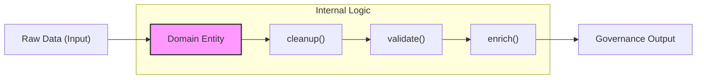

# DDD and AI Agents: Enhancing Collaboration via Cognitive Compression

<!-- front matter -->
**Structure**: Analytical Essay
**Date**: 2026-03-29T02:25
**Model**: Gemini 3 Flash
**Agent**: Antigravity IDE 1.19.6.0
**Source**: conversation

## 1. Introduction: Symptoms of Latent Entropy

In the early stages of automation pipelines, developers often rely on "Procedural Scripts" to solve immediate problems. While this pattern offers high initial delivery speed, it sows the seeds of **"Architectural Entropy."** As business logic becomes increasingly complex, AI Agents begin to exhibit significant cognitive friction. Because logic is scattered across independent scripts, agents must scan vast amounts of irrelevant code just to locate a simple behavior.

This essay analyzes how **Domain-Driven Architecture (DDD)** performs physical restructuring to compress fragmented commands into self-healing **"Domain Entities,"** ultimately achieving high-efficiency collaboration between humans and AI agents.

## 2. Analysis

This section deconstructs how DDD optimizes AI Agent performance from the perspectives of "Cognitive Space" and "Causal Logic."

### 2.1 Architectural Entropy and Cognitive Friction: Marginal Burden on AI Agents

When an AI Agent handles a task, its decision path is often severed by non-standardized script structures. In legacy architectures, behavior (Scripts) and data (Data) are physically separated, and the agent cannot be certain if its actions have "perceived" the latest system state. This **"State Uncertainty"** forces the agent to perform extra validation steps, consuming valuable Context Window capacity.

By encapsulating behavior within domain entities, we achieve **"Cognitive Compression."** When an agent calls an entity method, it is invoking a verified "Logic Package" without needing to worry about internal implementation details, maximizing **"Semantic Resolution"** for complex tasks.

### 2.2 From Imperative to Declarative: Self-Healing Domain Entities

Migrating logic from external scripts into domain classes marks a structural shift from **"Imperative"** to **"Declarative"** governance.

**Connective Tissue**: In this architecture, the AI Agent only needs to determine "if maintenance is required," while the "how" is executed instinctively by the domain object. This demarcation of behavioral boundaries establishes a set of physical **"Behavioral Safeguards"** for the agent, preventing structural collapses previously caused by script conflicts.

### 2.3 Bi-directional SSOT and Synchronization

Governance centers on the maintenance of a **"Single Source of Truth (SSOT)."** We implemented synchronization mechanisms to resolve timing conflicts between human-edited (unstructured) and machine-readable (structured) sources.

- **State Identification**: Automatically triggers migration from readable sources to machine-ready sources via status checks.
- **Causal Release**: When an AI Agent releases a new rule, it executes a replenishment action via a domain interface, ensuring all subsequent production steps perceive the new state immediately, establishing a robust causal chain.

## 3. Reflection

The refactoring reveals a future direction for AI-friendly architectures: code should not just be for "computers to execute" but for "AI to understand its intent and limitations." When an architecture becomes **"Self-descriptive,"** the AI Agent transforms from a tool executor into an "Enforcer" well-versed in domain rules.

## 4. Practical Contrastive Examples

To clearly lock semantic boundaries, we contrasted key implementation differences:

| Context | Legacy Script Pattern (Chaos) | Domain-Driven Pattern (Governance) |
| :--- | :--- | :--- |
| **Logic Dispatch** | `subprocess.call(["script.py", args])` (Ambiguous causality, agent handles OS paths) | `entity.execute_task(context)` (Explicit causality, entity state transitions traceable) |
| **Path Management** | Hardcoded relative paths `../../db/` | Paths provided via Infrastructure configuration |
| **Verification** | Relies on external procedures for checks (Check isolated from object, feedback often delayed) | Built-in entity auditing (Instant Loop) |

## 5. Conclusion

Domain-Driven Architecture successfully returns the production pipeline from an "Unstable State" to a "Manageable Boundary." For AI Agents, this architectural overlay is not just a cleanup of code format, but a **"Cognitive Efficiency Upgrade."** When domain boundaries (Bounded Context) are clearly defined, the release of AI productivity will no longer be limited to handling minor errors but will fully turn toward deep mining of high-value knowledge features.
