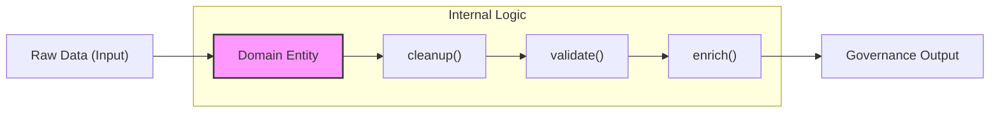

# 領域驅動架構與 AI Agent 的協作效能：從認知壓縮到行為護攔

<!-- front matter -->
**Structure**: 分析論文 (Analytical Essay)
**Date**: 2026-03-29T02:25
**Model**: Gemini 3 Flash
**Agent**: Antigravity IDE 1.19.6.0
**Source**: conversation

## 1. 導言 (Introduction)：系統熵增與認知摩擦

在自動化內容生產管線的發展初期，開發者傾向於利用「程序化腳本 (Procedural Scripts)」解決即時問題。這種模式雖能提供極高的初始開發速度，卻也埋下了 **「架構熵 (Architectural Entropy)」** 的種子。隨著業務邏輯分層（如術語鎖定、格式修復）日益複雜，AI Agent 在操作時會展現出嚴重的認知摩擦：由於邏輯散落在多個獨立腳本中，Agent 必須讀取大量無關代碼來定位一個簡單的清理行為。

本文分析如何透過 **領域驅動架構 (Domain-Driven Architecture, DDD)** 進行物理級的架構重組，將散亂的命令壓縮為具備自癒能力的「領域實體 (Domain Entity)」，並最終達成人類與 AI 代理人之間的高效協作。

## 2. 分析 (Analysis)

### 2.1 認知壓縮：降低 Agent 的搜尋熵 (Search Entropy)

當 AI Agent 處理複雜任務時，其決策路徑常被非標準化的腳本結構切斷。在遺產架構中，由於行為（Scripts）與數據（Data）物理分離，Agent 無法確定特定的校正步驟是否已感知最新的系統狀態。這種 **「狀態不確定性」** 迫使 Agent 執行額外的檢查步驟，佔用了寶貴的上下文窗口（Context Window）。

透過將行為收納至領域實體，我們實現了 **「認知壓縮 (Cognitive Compression)」**。當 Agent 呼叫一個實體方法時，它是在調用一個經過驗證的「邏輯封包」，而不需要關心內部的實作細節，這極大化了處理複雜任務的 **「語義解析度」**。

### 2.2 從命令式到聲明式：領域實體的自癒能力

將操作邏輯遷移至領域類別內部，標誌著從 **「命令式 (Imperative)」** 到 **「聲明式 (Declarative)」** 的治理轉向。

**敘事連結**：在這種架構下，AI Agent 只需要判斷「是否需要執行維護」，而「如何維護」則是由領域對象本能地執行。這種行為邊界的劃分，為 Agent 建立了一套物理級的 **「行為護攔 (Behavioral Safeguards)」**，防止了過往因腳本衝突導致的資料結構崩潰。

### 2.3 雙向真相來源與同步機制

治理的核心在於對 **「單一真相來源 (Single Source of Truth, SSOT)」** 的維護。透過建立領域實體間的同步機制，解決了人類編輯（非結構化）與機器處理（結構化）之間的時序衝突。

- **狀態鑑定**：透過同步檢查，自動觸發從「可讀源」向「可機讀源」的狀態遷移。
- **因果發布 (Causal Release)**：當 AI Agent 釋放新規則時，它透過領域接口執行補足動作，確保所有後續生產步驟都能即時感知新狀態，建立了一種強固的因果鏈。

## 3. 反思 (Reflection)

重構的過程揭示了 AI 友善架構的未來方向：代碼不應執行「讓電腦執行」，更應是「讓 AI 理解其意圖與限制」。當架構具備了 **「自描述性 (Self-descriptive)」**，AI Agent 就能從一個工具執行者，轉型為一位熟知領域規則的「執法者」。

## 4. 實務對弄 (Practical Contrastive Examples)

| 維度 | 遺產腳本模式 (Chaos) | 領域驅動模式 (Governance) |
| :--- | :--- | :--- |
| **行為調度** | `subprocess.call(["script.py", target])` (意圖不明，Agent 須處理底層路徑) | `entity.execute_task(context)` (意圖顯式，實體狀態轉換可追蹤) |
| **路徑治理** | 硬編碼相對路徑 `../../db/` | 透過基礎設施配置提供路徑常量 |
| **品質驗證** | 依賴外部程序進行檢查 (檢查與對象隔離，修正動作延遲) | 實體預載審計行為，即時反饋閉環 |

## 5. 結論 (Conclusion)

領域驅動架構成功地將生產管線從「不穩定狀態」拉回到「可管理邊界」。對於 AI Agent 而言，這種架構重疊不僅僅是代碼格式的清理，更是 **「認知效率的升級」**。當領域邊界被清晰劃定，AI 生產力的釋放將不再受限於處理零星的語法錯誤，而是能全面轉向對高價值知識特徵的深度挖掘。
