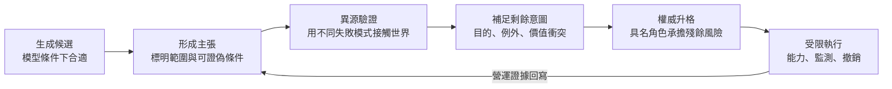

# 機率生成如何進入工程：從主張、驗證到可撤銷承諾

<!-- front matter -->
**Structure**: Reading Guide
**Date**: 2026-09-16T06:16
**Model**: GPT-5.6 Sol
**Agent**: Codex VS Code extension 26.908.40401
**Source**: conversation

## 這組報告真正要回答的問題

生成式 AI 進入工程後，最容易被問的是「模型準不準」。這個問法太快跳到效能，略過了更前面的制度問題：一段文字在什麼條件下算主張？誰有資格判定它？尚未被規格承載的目的由誰補足？一項主張又如何取得改變外部世界的權限？

這組報告把問題重新整理為一條因果鏈。它不把 AI 當成特殊物種，也不把「人類審查」當成萬用答案。它分析的是任何機率性建議系統進入工程控制迴路時，都必須跨越的五種邊界：

1. **生成與主張的邊界**：語言模型提供的是條件分布下的候選，不是世界已經替它背書的事實。
2. **一致與驗證的邊界**：多份產物互相一致，只能排除部分內部矛盾；若來源共用同一假設，錯誤也會一起通過。
3. **規格與意圖的邊界**：文件能保存已作出的決定，卻無法預先消除所有價值衝突、例外與未知情境。
4. **建議與授權的邊界**：流暢、親和與角色扮演會改變信任，但不能創造核准權或責任主體。
5. **核准與控制的邊界**：即使決定合理，執行仍須受最小能力、影響半徑、監測、逾時與撤銷約束。

共同命題因此不是「AI 不可靠」，而是：

> 任何生成物要成為工程承諾，都必須加入生成器本身沒有的新資訊，並跨過會真正拒絕錯誤的結構邊界。

## 認知階梯

五篇報告依賴的是因果順序，不是工具使用流程。先知道輸出的認識論地位，才能設計有效驗證；先知道驗證能證明什麼，才能看見規格仍留下什麼；只有意圖與證據都明確後，授權才有內容；授權成立後，才談得上安全執行。

最後一條回線很重要。工程承諾不是一次性簽核；部署後的失敗、漂移與申訴會改變原本的證據狀態。沒有回寫的治理，只保存當時做過什麼，無法修正之後知道了什麼。

## 五篇報告的分工

| 報告 | 核心問題 | 主要形式工具 | 讀完應能拒絕的誤判 |
| :--- | :--- | :--- | :--- |
| [從生成到主張](probabilistic-output/report.zh-TW.md) | 為何高似然文字不是高可信決定？ | 真值謂詞、主張契約、升格前置條件 | 「講得完整，所以可以直接做」 |
| [驗證不是重複生成](self-consistent-failure/report.zh-TW.md) | 為何多模型一致仍可能共同失敗？ | oracle、條件相依、來源圖 | 「三個 reviewer 都同意，所以機率相乘」 |
| [規格的邊界](residual-intent/report.zh-TW.md) | 為何完整規格仍保留人的判斷？ | 偏函數、衝突集合、升級狀態 | 「沒寫到的情況就讓模型合理補完」 |
| [權威不是語氣](authority-type-system/report.zh-TW.md) | 建議如何合法成為可執行決定？ | 角色型別、職責分離、信任校準 | 「它像隊友且有人按過 approve」 |
| [把代理能力關進可撤銷系統](engineering-containment/report.zh-TW.md) | 如何把錯誤限制在可承受範圍？ | capability、風險預算、狀態機 | 「核准過便可持續自主執行」 |

每一篇都自成論證閉環，不要求讀者先讀其他報告。導讀只提供一條較省力的閱讀順序。

## 四個容易混在一起的詞

| 詞 | 在本系列中的意思 | 不等於 |
| :--- | :--- | :--- |
| 候選 | 尚待外部判定的可能答案 | 低品質答案 |
| 證據 | 能提高或降低某主張可信度的可追溯觀察 | 更多文字、更多贊成票 |
| 核准 | 有權角色接受已揭露的殘餘風險 | 證明結果必然正確 |
| 責任 | 發生偏差時必須監測、停止、通報或補救的行動義務 | 在事故後找一個人歸咎 |

「人類在迴路中」也不是第五個神奇詞。若人只重讀模型提供的敘事，沒有取得不同資料、提出反例、擁有拒絕權或承擔後續行動，他只是在同一失敗模式上增加一個介面步驟。

## 快速判斷：目前缺的是哪一層

下表從可觀察症狀反推缺失邊界。它不是成熟度評分，而是故障定位。

| 現象 | 真正缺口 | 第一個該問的問題 |
| :--- | :--- | :--- |
| 回答流暢但無法指出何時算錯 | 主張尚未形成 | 可證偽條件與適用範圍是什麼？ |
| 規格、程式與測試全都一致 | 驗證可能同源 | 哪個觀察不是由同一假設生成？ |
| 測試全過但使用者說做錯產品 | 剩餘意圖未被承接 | 誰擁有 validation，而不只是 verification？ |
| 有 review 紀錄卻沒人能說明風險 | 權威型別混用 | 誰有權接受哪一類殘餘風險？ |
| 決定合理但錯誤迅速擴散 | 執行缺乏圍籬 | 系統在哪個條件下會自動停止或降級？ |

## 一條可攜帶的總檢查式

對任何可能改變外部狀態的 AI 產物，依序問：

1. 它目前是候選、主張、證據、決定，還是執行紀錄？
2. 它可能錯在哪裡，而且哪個觀察會讓它硬性失敗？
3. 驗證資訊是否真的異源，還是同一生成鏈的重新表述？
4. 哪些目的、例外或價值衝突仍沒有被規格代表？
5. 誰有權接受殘餘風險，也有能力停止與補救？
6. 執行者取得的能力是否小於等於這次任務真正需要的能力？
7. 決定如何到期、被覆寫、被撤銷，並把結果回寫成新證據？

若前一題沒有答案，就不應用後一題的流程完成度掩蓋它。工程化的重點不是把每份輸出包上更多文件，而是讓每一次升格都留下新的、可反駁的資訊。
