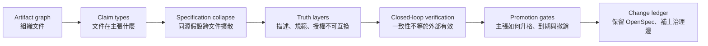

# OpenSpec 的權威邊界：從文件一致到可撤銷承諾

<!-- front matter -->
**Structure**: Reading Guide
**Date**: 2026-09-16T06:45
**Model**: GPT-5.6 Sol
**Agent**: Codex VS Code extension 26.908.40401
**Source**: conversation

## 這組報告真正追問什麼

OpenSpec 解決了一個真實而困難的協作問題：讓人與 agent 在修改 brownfield 系統以前，先把提案、行為差異、設計與工作清單放進同一個 change folder。它的 delta 與可客製 artifact graph 也讓規格不必每次整份重寫。截至 2026-09-16，官方仍將 OPSX 定位為 fluid、iterative 的標準工作流，並把主規格稱為目前「共同同意之行為」的 source of truth。

這些能力回答的是「如何把變更說清楚並保持一致」。本組報告追問的是另一層：一致的文件憑什麼取得權威？一句含糊需求如果被同一個 agent 展成 proposal、spec、design、tasks，再由同一組 artifacts 驗證與封存，完整的目錄可能只證明同一個假設被複製得很整齊。

整組論證因此不是「OpenSpec 好或不好」，而是一條可以逐步檢驗的因果鏈：

圖中的每一個箭頭都補上一個不能跳過的問題。若直接從 artifact graph 跳到治理方案，容易把缺口誤解成「多加幾份文件」；若沒有先區分真值層與驗證拓撲，approval 也只會變成另一個 checkbox。

## 七個閱讀入口

| 你目前卡住的問題 | 建議切入 | 這篇提供的不可替代判準 |
| :--- | :--- | :--- |
| 想先確認 OpenSpec 官方實際保證什麼 | OpenSpec 的忠實解剖 | 分離儲存結構、命令效果與治理保證 |
| 一份文件同時混進目的、事實與決定 | Artifact 不是 Claim | 為主張標定型別、來源、反駁條件與 owner |
| proposal/spec/design/tasks 明明分開卻仍同錯 | 規格坍縮 | 區分檔案分離與認識論獨立 |
| `source of truth` 到底可不可信 | Truth 升格 | 區分 observed、canonical、normative、authorized |
| verify 全綠為何仍可能做錯事 | OPSX 封閉迴圈 | 區分 artifact-code coherence 與外部 validation |
| 何時能 archive、誰可核准、怎麼撤銷 | 風險升格閘門 | 用狀態機與風險相稱規則取代完成旗標 |
| 想保留 OpenSpec 優點並補足缺口 | 變更帳本重建 | 把 typed artifacts、異源證據與外部控制接回 schema |

這七篇並非七種對同一問題的改寫。前兩篇建立觀察語言；中間三篇找出自我證成的因果機制；最後兩篇才把機制轉成可執行的升格與撤銷設計。

## 三條閱讀路徑

若時間有限，可以依你的決策層級選擇路徑。每條路徑仍以自包含報告為單位，不要求記住其他篇的術語。

| 路徑 | 閱讀順序 | 適合情境 |
| :--- | :--- | :--- |
| 工具評估 | 忠實解剖 → 封閉迴圈 → 變更帳本 | 正在決定是否採用或客製 OpenSpec |
| 概念釐清 | Artifact 不是 Claim → 規格坍縮 → Truth 升格 | 團隊對 spec、truth、approval 的語意有爭議 |
| 治理落地 | Truth 升格 → 風險升格閘門 → 變更帳本 | 準備設計 CI gate、owner 與 production observation |

## 貫穿全組的判讀公式

整組報告可壓縮成四個彼此不能替代的判斷：

| 判斷 | 問題 | 綠燈真正代表 |
| :--- | :--- | :--- |
| 結構完整 | 必要 artifacts 是否存在 | 工作材料齊全 |
| 內部一致 | spec、design、code、tests 是否相符 | 同一承諾被一致實現 |
| 外部有效 | 承諾是否符合使用者、政策與運行世界 | 做的是對的事 |
| 合法升格 | 有權角色是否基於足夠證據接受風險 | 可在指定範圍內暫時生效 |

任何一格都不能由另一格反推。最危險的狀態不是明顯混亂，而是結構完整、內部一致，卻在外部有效與合法升格兩欄空白。那時流程愈順，錯誤反而愈容易取得「已完成」的外觀。

## 閱讀後應保留的核心立場

OpenSpec 可以是很好的 agreement layer、delta manager 與變更帳本。它不必獨自成為需求研究、獨立驗證、組織授權與 production control 的總和。精準的工程做法不是否定工具，而是限制每個 artifact 與命令能宣稱的範圍，再把缺少的證據、責任、到期與撤銷路徑接到真正能執行它們的系統上。
