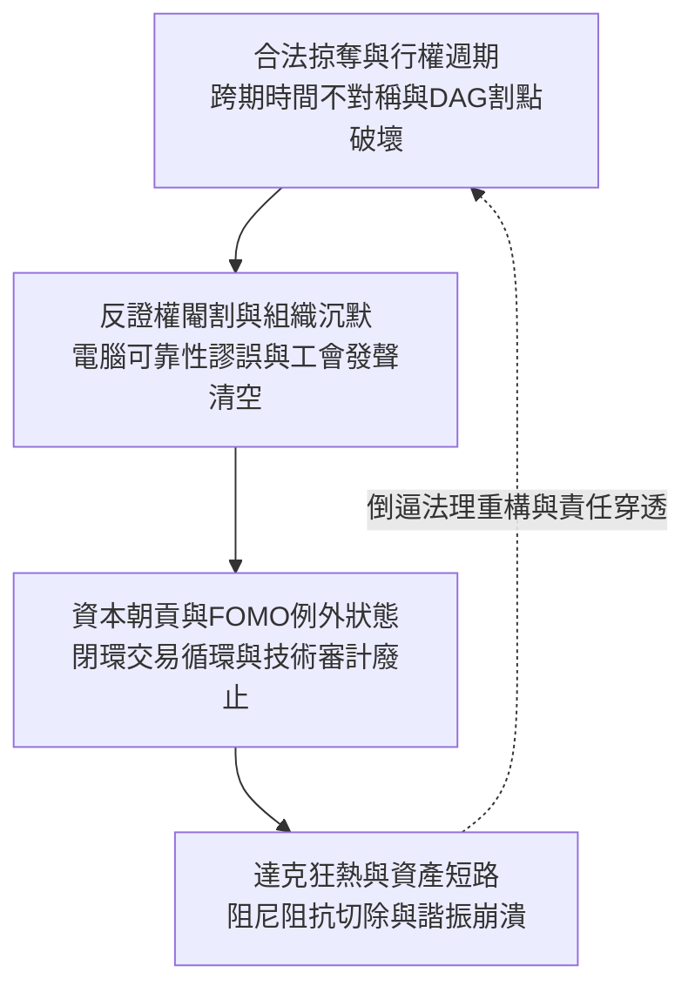

# 演算法資本主義下的治理斷裂與組織解構：權力、代理、法理與掠奪拓樸

<!-- front matter -->
**Structure**: Reading Guide
**Date**: 2026-09-18T06:31
**Model**: Gemini 3.8 Flash
**Agent**: Antigravity IDE 2.5.5
**Source**: conversation

## 這組報告真正要回答的問題

當演算法決策、黑箱模型與數位自動化全面嵌合進現代公司治理與公共行政體系時，主流話語往往將其簡化為「生產力提升」、「數位轉型」或「技術摩擦力消除」。然而，這套技術樂觀主義敘事蓄意遮蔽了一場深刻的政治經濟學與認識論質變：**演算法並非中立的計算工具，而是權力重構、責任轉移與資本掠奪的拓樸載體**。

本系列（2026-09-18-a）聚焦於**「主體、權力、代理與資本拓樸」**的深層病理，探討在金融化資本主義與技術崇拜的交織下，組織治理如何發生系統性的道德與法理崩潰。我們試圖回答以下核心問題：
1. 為什麼管理層能利用技術黑箱作為時間阻尼器，在破壞物理安全前完成合法的財富套現？
2. 為什麼自動化系統的引入，會物理性閹割第一線專業勞動者的抗辯權與組織發聲通道？
3. 錯失恐懼（FOMO）如何被政治化為卡爾·施密特式的內部「例外狀態」，迫使組織向閉環資本朝貢？
4. 當狂熱信徒將企業的實體資產負債表與黑箱預測無阻尼短路時，系統性共振崩潰是如何必然發生的？

共同核心命題在於：
> 當組織以演算法之名廢除自身的理性審計、抗辯通道與控制論阻尼時，技術自動化便退化為一種純粹的合法掠奪技術與體制性自欺發動機。

## 認知階梯

本系列的四篇報告依循權力與資本的因果拓樸展開，從個體高階主管的跨期套利動機，擴展至組織內部的抗辯權閹割，進而升級至宏觀金融敘事的結構勒索，最終匯聚於資產負債表短路的共振災難：

每一篇報告皆具備獨立的認識論論證閉環，並嚴格遵循「第一性哲學與拓樸證明在先，歷史真實案例甘為客觀解剖標本」的最高準則。

## 四篇專題報告的分工與映射

| 報告單元 | 核心探索主題 | 拓樸分析模型 | 解剖歷史標本 (Specimen) | 讀完應能破除的技術迷思 |
| :--- | :--- | :--- | :--- | :--- |
| **A-1** [合法掠奪與行權週期](legal-looting-and-vesting/report.zh-TW.md) | 為何高管能在物理災難前合法套現離場？ | 時間週期非對稱 ($T_{\text{vesting}} \ll T_{\text{collapse}}$)、DAG 割點故意插入 | **波音 737 MAX 墜機災難** (430億庫藏股、MCAS黑箱外包、6200萬跳傘) | 「技術事故只是工程師的偶發疏失，與高管薪酬期權無關」 |
| **A-2** [反證權閹割與組織沉默](contestation-severance-and-silence/report.zh-TW.md) | 為何機器輸出能摧毀司法舉證與工會發聲？ | 貝氏條件機率倒置、圖電導趨零 $\Phi(S) \to 0$、組織反證拓樸阻斷 | **英國郵政 Horizon 系統冤案** (廢除 s.69 推定、736人定罪、內部隱瞞審計) | 「電腦系統是客觀中立的，帳目短缺必然是人為侵占」 |
| **A-3** [資本朝貢與FOMO例外狀態](fomo-pretext-and-credit-tribute/report.zh-TW.md) | 外部炒作如何強制癱瘓內部技術審計？ | 明斯基龐氏拓樸、有向閉環流動性迴圈、結構洞話語權尋租 | **1999 電信光纖泡沫與當代算力朝貢** (Global Crossing/Enron 頻寬交換、SaaS綑綁稅) | 「全面擁抱最新模型是生存唯一出路，常規審查是官僚阻力」 |
| **A-4** [達克效應與資產負債表短路](dunning-kruger-systemic-shock/report.zh-TW.md) | 狂熱信徒如何以演算法端到端短路燒毀資本？ | 阻尼阻抗切除 $Z \to 0$、非平穩分佈破缺、各態歷經性吸收壁 | **Zillow Offers iBuying 破產崩盤** (Zestimate端到端購屋、阿克洛夫逆向選擇、5億打銷) | 「演算法能消除人類偏見與摩擦力，端到端決策效率最高」 |

## 核心拓樸術語對照表

為確保跨篇章閱讀時的語義確定性，本系列將關鍵社會技術現象嚴格錨定於結構定義中：

| 拓樸術語 | 在本系列中的嚴格定義 | 偽科學或庸俗管理學的混淆概念 |
| :--- | :--- | :--- |
| **割點 (Cut Vertex)** | 在資訊與責任傳遞網絡中，一旦被惡意插入或破壞，即導致子圖完全孤立、反饋中斷的關鍵節點。 | 尋常的「中階管理階層」或「專案經理」 |
| **時間非對稱 ($\Delta T$)** | 資本收益獲取週期（行權、獎金分配）遠短於系統性物理風險暴露與坍塌潛伏期的結構差距。 | 單純的「短期主義」或「缺乏長遠眼光」 |
| **阻尼阻抗 ($Z_{\text{friction}}$)** | 組織內部由第一線專業默會知識、合規委員會與人類反覆勘驗所構成的審查阻力，用以吸收極端隨機噪聲。 | 應被演算法自動化全面清洗的「低效科層摩擦」 |
| **閉環朝貢 (Directed Cycle)** | 資本在晶片商、新創與雲端巨頭之間透過跨期承諾與抵用券互相灌注，在未產生實體產出的情況下人為推升名義營收的封閉圖路徑。 | 健康的「高科技共生生態系統」 |
