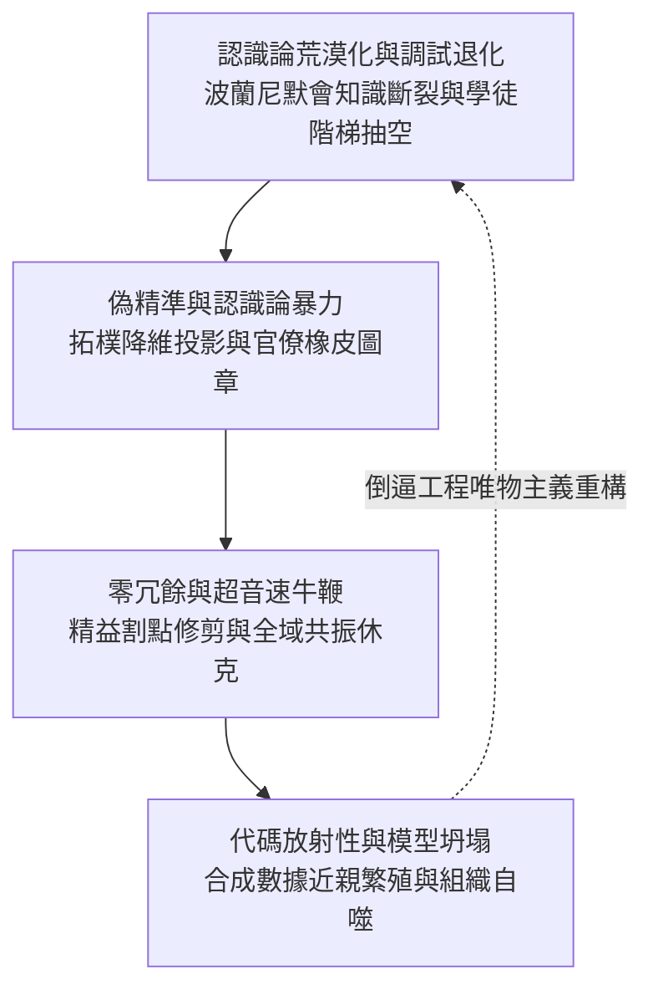

# 演算法社會的物質病理與認識論衰變：實體、工程、供應鏈與自噬拓樸

<!-- front matter -->
**Structure**: Reading Guide
**Date**: 2026-09-18T06:37
**Model**: Gemini 3.8 Flash
**Agent**: Antigravity IDE 2.5.5
**Source**: conversation

## 這組報告真正要回答的問題

當數位自動化、生成式神經網絡與精益管理全面接管現代文明的物質底座時，主流話語習慣於將其包裝為「無摩擦（Frictionless）」與「無限擴展（Infinite Scalability）」的工程勝利。然而，熱力學定律與控制理論從未豁免過任何數位系統：**任何試圖消滅物理阻抗、裁撤人類默會經驗、追求零冗餘的工程操作，必然在更深維度累積致命的系統性病理**。

本系列（2026-09-18-b）聚焦於**「物質基礎、客觀工程、認識論荒漠化與自噬拓樸」**，探討當技術系統脫離客觀物理反饋與人類因果審計時，如何在物質與符號層面走向深層瓦解。我們試圖回答以下核心問題：
1. 為什麼代碼生成工具的普及，會導致人類「調試反射（Debugging Reflex）」的代際滅絕與系統自癒能力的喪失？
2. 官僚演算法如何透過數值偽精準（Spurious Precision），對複雜多維的真實人類生活發動不可逆的「認識論暴力」？
3. 為什麼追求極致精益與及時制（JIT）的全球軟硬體供應鏈，會在自動化推送下引爆摧枯拉朽的「超音速牛鞭效應」？
4. 當整個技術生態以合成數據（Synthetic Data）進行近親繁殖時，資訊熱力學第二定律是如何必然觸發「模型坍塌」與「代碼放射性」的？

共同核心命題在於：
> 脫離物理阻力、默會實踐與工程冗餘的純粹演算法崇拜，本質上是一場不可逆的文明熵增與自噬過程。

## 認知階梯

本系列的四篇報告依循系統從心智、制度、物理網絡到語料生態的物質衰變鏈條展開，層層遞進：

每一篇報告皆具備獨立的論證閉環，並貫徹「第一性哲學與物理拓樸證明在先，真實歷史災難甘為客觀解剖標本」的嚴謹標準。

## 四篇專題報告的分工與映射

| 報告單元 | 核心探索主題 | 拓樸分析模型 | 解剖歷史標本 (Specimen) | 讀完應能破除的技術迷思 |
| :--- | :--- | :--- | :--- | :--- |
| **B-1** [認識論荒漠化與調試退化](epistemic-desertification-and-atrophy/report.zh-TW.md) | 為何自動化生成會導致系統除錯能力的代際失傳？ | 波蘭尼默會神經拓樸、因果鏈修剪、班布里奇自動化悖論 | **法航 447 號班機空難** (皮託管結冰、備用法則降級、盲目拉桿墜海) | 「有了 AI 代碼助手，初級工程師可以直接做高級架構設計」 |
| **B-2** [偽精準與認識論暴力](false-precision-and-epistemic-violence/report.zh-TW.md) | 為何高解析度純量評分會淪為制度化迫害工具？ | 高維流形 $\mathcal{M}$ 的純量投影 $\pi$、古哈特/坎貝爾定律、責任洗滌槽 | **荷蘭托兒津貼醜聞 (Toeslagenaffaire)** (雙重國籍標籤、2.6萬家庭破產、呂特內閣總辭) | 「演算法給出了0.892的精確分數，因此評估是客觀公正的」 |
| **B-3** [零冗餘的致命脆性](supply-chain-hyper-fragility/report.zh-TW.md) | 追求極致資本效率為何導致全球系統瞬間休克？ | 星狀樹狀拓樸退化、頻域共振峰 $|H(j\omega)| \to \infty$、無阻尼推送 | **2024 CrowdStrike 世紀大當機** (Channel 291 核心層推送、850萬台BSOD、全球航空停擺) | 「精益管理消除了庫存與備份浪費，系統運作最有效率」 |
| **B-4** [代碼放射性與模型坍塌](code-radioactivity-and-model-collapse/report.zh-TW.md) | 遞歸使用合成數據為何引發組織的自噬性死亡？ | 資訊幾何支撐集收縮、長尾分佈滅絕、Slopsquatting 投毒 | **Nature 2024 模型坍塌數學證明 & 開源公地污染** (遞歸訓練方差發散、狄拉克奇異崩潰、幽靈依賴寄生) | 「真實世界數據耗盡沒關係，靠合成數據可以無限擴展」 |

## 核心物理與拓樸術語對照表

為確保跨篇章閱讀時的語義確定性，本系列將關鍵物質與工程病理現象嚴格錨定於結構定義中：

| 拓樸與工程術語 | 在本系列中的嚴格定義 | 偽科學或庸俗管理學的混淆概念 |
| :--- | :--- | :--- |
| **調試反射 (Debugging Reflex)** | 人類在長期直面編譯錯誤與物理異常中形成的肌肉神經本能，能在海量噪聲中瞬間穿透抽象屏障、定位底層因果機制的能力。 | 可被提示詞工程（Prompting）替代的「手動敲代碼技能」 |
| **拓樸降維暴力 ($\pi$)** | 官僚體系將不可約簡的無限維社會脈絡與質性生活，強制映射為一維可計算純量數值，並以此剝奪實體抗辯權的行政暴力。 | 中立客觀的「數字化轉型」或「智慧風控模型」 |
| **超音速牛鞭效應** | 供應鏈在全自動即時反饋管道與同質化軟體堆疊下，零時延反饋引爆高頻諧振，將局部微小錯誤在秒級時間內放大為全球系統休克的動力學現象。 | 傳統實體商業中的「庫存週期性波動」 |
| **代碼放射性 (Code Radioactivity)** | 未經因果審計的似真合成代碼合併入庫後，難以被傳統測試捕獲，持續釋放隱性競態與資源洩漏毒素，且鑑識成本極高的技術債現象。 | 單純的「代碼風格不統一」或「待重構小缺陷」 |
| **模型坍塌 (Model Collapse)** | 統計學習模型在遞歸吸收自身生成的合成數據時，不可逆地丟失分佈尾部資訊，導致方差發散與功能性退化的退化過程。 | 可以靠加大模型參數解決的「過擬合（Overfitting）」 |
