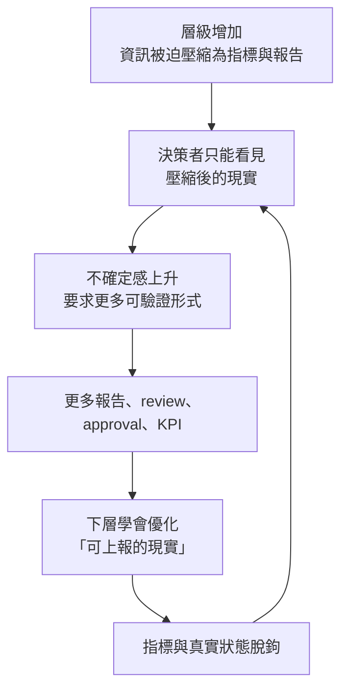

# 指標是壓縮的殘骸：遠距治理的資訊結構

**Structure**: Analytical Essay
**Date**: 2026-09-22T08:04
**Source**: conversation
**Model**: Kimi K3
**Agent**: GitHub Copilot Chat v0.66.0

## 導言

考慮一條在一線完全真實的陳述：「這個系統雖然沒出事，但有幾個脆弱耦合正在累積。」它包含三個不可分的成分：目前的事實（沒出事）、對結構的判斷（耦合脆弱）、以及對趨勢的預測（正在累積）。現在讓它沿著組織層級向上傳遞。每經過一層，接收者都要做一次摘要，而摘要的選擇壓力永遠偏向**可驗證、可比較、可放入一格表格**的成分。到了高層手上，這句話可能只剩：

```
incident = 0
SLA = green
architecture review = complete
```

三個成分死了兩個半：事實留下來了，判斷和預測被丟掉了——因為它們不可驗證、不可跨團隊比較、不適合放進儀表板。高層據此判斷系統健康，而這個判斷不是愚蠢的結果，是**只能看到壓縮後的世界**的必然結果。

本文的主張是：Goodhart 定律式的指標失真，本質上不是指標設計不良的問題，而是**遠距治理問題**——決策權與真實資訊之間的距離，決定了失真會發生到什麼程度。這個重定位聽起來像換個說法，但它會改變修復問題時該問的問題。

## 分析

### 一、層級即壓縮：摘要鏈的資訊結構

大規模協作之所以需要制度化，原因經常被搞錯。不是因為管理者愚蠢或懶惰，而是因為**上層不可能直接觀察所有一線情境**——一個管三百人的主管，一天只有二十四小時，他只能依賴摘要、指標、流程和代理人。資訊每往上傳一層，就經歷一次壓縮；每一次壓縮都丟掉脈絡。這不是選擇，是認知預算的物理約束。

小團隊裡這個問題較輕：主管能直接知道誰真正解決了問題、誰只是做了表面工作。這種默會知識（tacit knowledge）——誰的話可信、哪個模組其實沒人敢碰、上次事故真正的導火線——充當了未經壓縮的資訊通道。組織一大，默會知識消失，就只能引入形式化代理：用文件代替共事，用評分代替了解，用流程代替信任。因此本文的第一個基本判斷是：

> **真正不可避免的是資訊壓縮，不一定是僵化本身。**

壓縮是物理，僵化是選擇——這個區分會在文末的邊界討論裡變得重要。

向上溝通的文獻對壓縮機制有直接的支持。Athanassiades (1973) 是研究階層組織中向上溝通失真的早期經典。Glauser (1984) 的綜述把影響向上資訊流的因素分為下屬特性、主管特性、上下級關係、訊息特性與結構特性五類——五類中只有一類關於下屬本人，資訊能否準確上傳因此不只是個人意願問題。Whetsell, Kroll & DeHart-Davis (2020) 在一個 143 人的市政府中發現，正式地位、權限路徑與部門歸屬都會影響員工向誰尋求資訊——組織圖不只是紙上形式，它會改變知識的流動路徑，哪些訊息會相遇、哪些永遠不會。

### 二、自我強化的指標迴圈

壓縮帶來不確定感，而不確定感會觸發一個惡性迴圈：



這個迴圈最棘手的地方在於**它裡面沒有壞人**。上層要求更多可驗證的東西是合理的——他們看不見現場，可驗證性是他們唯一的依靠；下層優化可上報的現實也是合理的——他們被這些東西考核，不優化才是失職。每個局部都理性，整體卻走向一個誰都沒有選擇的終點：制度治理自己的表徵，而不是治理真正的系統。

迴圈還有一個時間結構值得注意。指標脫鉤（F）不會立刻被察覺，因為真實狀態的惡化有延遲——架構腐化要幾年才爆發，安全債要累積到事故才顯現。這意味著迴圈可以轉很多圈才被發現，而每多轉一圈，「可上報的現實」與「真實的現實」之間的落差就更大，修復成本也更高。等到落差大到無法掩蓋時，它通常以事故而非報告的形式被發現。

### 三、Goodhart 的重定位：從統計現象到距離現象

Goodhart 的原始思想來自貨幣政策：一個原本穩定的統計關係，一旦被拿來作為控制目標，關係本身就會崩掉；後來被泛化為我們熟悉的「指標成為目標即失效」。Campbell 定律給出了社會面向的版本：量化指標被用於決策的程度越高，它承受腐化壓力的程度就越高，它所要測量的社會過程被扭曲的程度也越高。

但把這些現象放回組織結構裡看，它們有一個共同的幾何特徵：**測量者與被測量的現實之間存在距離，而代理指標是跨越這段距離的橋**。橋會被優化，是因為橋是決策者唯一能踩到的東西；而橋被優化得越舒服，就越少人記得橋的對岸還有一塊大陸。失真程度因此不只是指標品質的函數，也是距離的函數——距離越遠，代理的負載越重，它被壓垮得越快。這是本文把兩條文獻線接起來的推論，不是下述任何一篇研究的結論。

這個重定位在實證與形式化兩側都有可對照的材料。Fire & Guestrin (2019) 分析超過一億兩千萬篇論文，展示發表數、引用數、h-index 在被大規模用來評價學術表現後，如何逐漸失去作為品質代理的效力——學術界不是變笨了，而是整個領域的行為向代理收斂了。這與「架構文件和 review 次數最終取代真正的架構品質」是同一個結構，只是換了行業。Karwowski et al. (2023) 則在強化學習中把問題數學化：當 reward 只是真實目標的不完美代理時，把代理最佳化超過某個臨界點之後，真實目標的表現反而可能下降。管理制度問題在這裡有一個幾乎逐點對應的形式模型——組織是學習者，KPI 是 reward，系統健康是真實目標，而過度最佳化代理的懲罰在數學上和在管理上一樣真實。

把整條鏈寫出來：

$$
\text{層級與距離} \rightarrow \text{資訊壓縮} \rightarrow \text{依賴代理指標} \rightarrow \text{行為向代理收斂} \rightarrow \text{代理失效}
$$

鏈的前半段屬於組織溝通與階層文獻，後半段屬於績效測量與 Goodhart／Campbell／委託代理文獻。過去的討論常把兩段分開處理——溝通學者談失真，經濟學者談激勵——但它們其實是同一條因果鏈的上下游：**壓縮決定了代理為什麼必然被引入，Goodhart 決定了代理被引入後為什麼必然失真**。切開任何一段單獨處理，都會漏掉另一半提供的約束條件。

## 反思

這個框架改變了修復問題的問法。如果失真的根源是距離而非指標品質，那麼「設計更好的指標」就永遠是次優解——更好的代理仍是代理，它縮小誤差但不縮短距離；甚至因為它更可信，決策者會更放心地把判斷交給它，脫鉤被發現的時間反而更晚。真正的修復方向只有兩類：**縮短資訊路徑**（讓決策者離現實更近），或**保留不經高度壓縮的通道**（讓現實偶爾繞過指標抵達決策者）。這兩類通道該如何具體設計、各自有什麼失效模式與前置條件，是另一個需要獨立處理的問題；本文的結論只依賴「純粹優化指標無效」這一點，而那兩類方向的存在性已足夠。

還要指出一個本文刻意未展開的缺口：壓縮解釋了「上傳的資訊如何被優化」，但沒有解釋「為什麼有些關鍵資訊根本不上傳」。即使管道存在、距離不遠、指標設計精良，下層仍可能主動保留壞消息——出於恐懼、出於「說了也沒用」的學習、甚至出於對組織的保護欲。這涉及沉默的動機結構，是指標迴圈之外一條獨立的失真通道：壓縮處理的是訊號在管道中的衰減，沉默處理的是訊號從未進入管道。兩者需要不同的診斷工具，本文只處理前者。

## 結論

可遷移的原則如下：

1. **指標是壓縮的殘骸**。任何指標都應被理解為「丟掉脈絡之後剩下的東西」，而不是現實本身的縮影；讀指標時該問的是它被壓縮了幾次、每次丟了什麼，而不是它準不準。
2. **Goodhart 是遠距治理問題**。失真的強度跟隨決策權與真實資訊的距離；對策的主軸是縮短距離，不是提高指標精度。
3. **壓縮不可避免，僵化不是**。制度化是大規模協作的資訊代價，但組織仍能選擇保留多少未壓縮通道；把壓縮當成可以完全消除的東西是幻想，把它當成完全不可管理的東西是放棄。
4. **每個局部理性的系統仍可能整體失真**。指標迴圈裡沒有壞人；這正是它難以打破的原因——修復必須改結構，不能靠要求任何一方「更誠實」或「更努力」。
5. **脫鉤以事故的形式被發現**。指標與現實的落差有時間延遲，且落差隨迴圈圈數擴大；組織若想更早發現，就只能主動去看壓縮前的現場，而不是等報告變紅。

## 參考文獻

- Athanassiades, J. C. (1973). The distortion of upward communication in hierarchical organizations. *Academy of Management Journal*, 16(2), 207–226. [doi:10.2307/255323](https://doi.org/10.2307/255323)
- Campbell, D. T. (1979). Assessing the impact of planned social change. *Evaluation and Program Planning*, 2(1), 67–90. [doi:10.1016/0149-7189(79)90048-X](https://doi.org/10.1016/0149-7189(79)90048-X)
- Glauser, M. J. (1984). Upward information flow in organizations: Review and conceptual analysis. *Human Relations*, 37(8), 613–643. [doi:10.1177/001872678403700804](https://doi.org/10.1177/001872678403700804)
- Fire, M., & Guestrin, C. (2019). Over-optimization of academic publishing metrics: Observing Goodhart's Law in action. *GigaScience*, 8(6), giz053. [doi:10.1093/gigascience/giz053](https://doi.org/10.1093/gigascience/giz053)
- Goodhart, C. A. E. (1984). Problems of Monetary Management: The UK Experience. In *Monetary Theory and Practice: The UK Experience* (pp. 91–121). Macmillan. ISBN 9780333360606. [doi:10.1007/978-1-349-17295-5_4](https://doi.org/10.1007/978-1-349-17295-5_4)
- Karwowski, J., et al. (2023). Goodhart's Law in reinforcement learning. *arXiv:2310.09144*. [arXiv](https://arxiv.org/abs/2310.09144)
- Whetsell, T. A., Kroll, A., & DeHart-Davis, L. (2020). Formal hierarchies and informal networks. *arXiv:2006.08019*. [arXiv](https://arxiv.org/abs/2006.08019)
