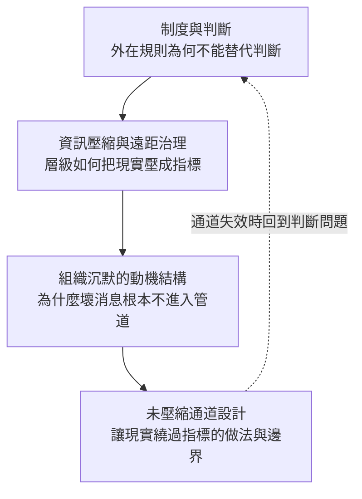

# 指標看不見的：判斷、壓縮與組織沉默

**Structure**: Reading Guide
**Date**: 2026-09-22T08:04
**Source**: conversation
**Model**: Kimi K3
**Agent**: GitHub Copilot Chat v0.66.0

## 這組報告真正要回答的問題

大型組織為什麼會系統性地看不見自己的問題？常見的回答把責任歸給指標設計不良、管理者能力不足或員工不敢說話——都是局部且可循環指責的解釋。本系列（2026-09-22-a）試圖給出一個結構性的回答：失真不是任何一方的失誤，而是三層機制疊加的默認輸出。

共同核心命題是：

> 外在制度能約束行為，卻不能保證產生正確判斷；層級壓縮使決策者只能看見指標；而組織沉默讓最關鍵的資訊根本不進入指標。三者疊加之後，制度開始治理自己的表徵，而不是治理真正的系統。

## 認知階梯

四篇報告沿著一條因果鏈展開，從治理哲學的前提，到資訊結構的機制，到被遺漏的另一半，最後到緩解的邊界：

四篇各自獨立成文、互不引用，任何一篇單獨閱讀都能得到一個完整且正確的切片。導讀的順序只反映因果鏈的方向，不是理解的依賴關係。

## 四篇報告的分工與映射

| 報告單元 | 核心問題 | 關鍵概念 | 主要文獻支點 | 讀完應能破除的迷思 |
| :--- | :--- | :--- | :--- | :--- |
| **A-1** [有流程不等於有判斷](rules-without-judgment/report.zh-TW.md) | 外在制度為何不能產生判斷？ | 政刑 vs 德禮、合規不等於品質、規則累積的自我瓦解 | 《論語·為政》、《道德經》 | 「把規則寫得夠完整，就能讓人無法做錯」 |
| **A-2** [指標是壓縮的殘骸](compression-and-remote-governance/report.zh-TW.md) | 指標失真為什麼是結構必然？ | 層級即壓縮、指標迴圈、Goodhart 作為遠距治理問題 | Athanassiades 1973、Glauser 1984、Fire & Guestrin 2019、Karwowski 2023 | 「指標失真靠設計更好的指標就能解決」 |
| **A-3** [沒有人說，不代表沒有事](silence-typology-and-climate/report.zh-TW.md) | 關鍵資訊為何不進入管道？ | 沉默氛圍、順從／防衛／親社會三型、沉默的指標不可見性 | Morrison & Milliken 2000、Van Dyne 2003、Tangirala & Ramanujam 2008、Donaghey 2011 | 「員工沒回報問題，就是沒有問題」 |
| **A-4** [讓現實繞過指標](reality-bypass-channels/report.zh-TW.md) | 失真已存在時還能做什麼？ | 未壓縮通道、通道的再殖民、沉默的獎勵結構 | Colquitt 2001 互動正義、沉默文獻的四項修正 | 「開放回饋管道就等於資訊會流動」 |

## 核心術語對照表

| 術語 | 在本系列中的定義 | 常見的混淆 |
| :--- | :--- | :--- |
| **判斷（judgment）** | 在規則未覆蓋的情境中，依內化規範做出「不應該這樣做」的決定能力。 | 與「經驗」或「資歷」混為一談 |
| **資訊壓縮** | 資訊沿層級上傳時逐層摘要、丟棄脈絡的結構性過程；大規模協作的必要代價。 | 與「溝通不良」或「報告寫得差」混為一談 |
| **沉默氛圍** | 組織中廣泛共享的「談論問題是危險或無用的」的信念；由結構生產，非個人性格。 | 與「員工不夠積極」或「文化問題」等歸因混為一談 |
| **未壓縮通道** | 讓決策者直接接觸壓縮前現實的制度化安排（直觸一線、dissent、narrative 等）。 | 與一般的「回饋管道」混為一談——後者可能只有形式沒有回應 |

## 來源與範圍說明

本系列蒸餾自一段關於治理、制度化與指標失真的對話（涵蓋《論語》詮釋、Goodhart 的組織定位與文獻索引），加上對組織沉默文獻線的獨立展開。第三篇的沉默類型學與第四篇的四項修正條件超出了原對話的範圍，屬於文獻檢索後的補充論證。各篇均為分析性論述，不含執行過的模型或實測數據；文中的假想案例僅用於說明邊界，不代表觀測到的事實。
