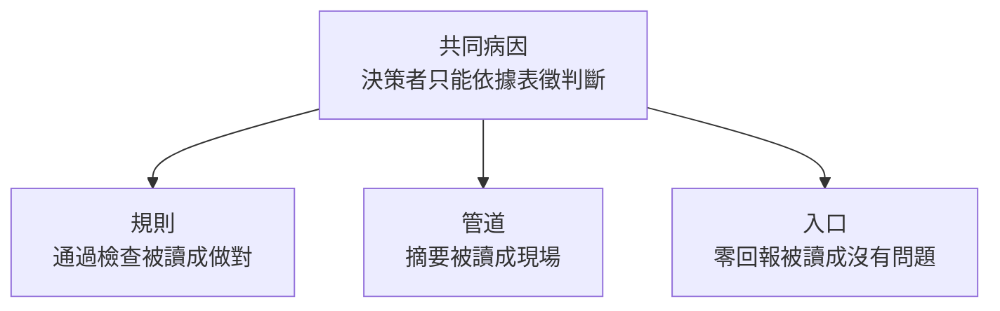

# 表徵治理：通過、摘要與零回報如何取代現場

**Structure**: Reading Guide
**Date**: 2026-09-24T09:10
**Source**: conversation
**Model**: Claude Opus 5.5
**Agent**: GitHub Copilot Chat v0.66.0

## 這組報告真正要回答的問題

大型組織為什麼會系統性地看不見自己的問題？常見的回答把責任歸給指標設計不良、管理者能力不足或員工不敢說話——都是局部、可以互相推諉的解釋。這組報告給的回答是結構性的：離現場越遠的決策者，越只能依據一個可檢查的表徵做判斷，而這個表徵在三個不同的位置上與它代表的現實脫鉤。

共同病因是：

> 決策者治理的是現場的表徵，不是現場本身。通過檢查被讀成做對，摘要被讀成現場，沒有回報被讀成沒有問題。

三篇是同一病因的三個切面，不是一套依序展開的解方。

## 三個切面

三篇各自獨立成文、互不引用，任何一篇單獨閱讀都能得到該切面的完整結論。下圖只表示三篇切的是同一病因的不同位置，不表示閱讀順序或前提關係。



三個位置彼此獨立：規則覆蓋不了新情境，與摘要鏈長短無關；摘要丟掉判斷與預測，與有沒有人保留資訊無關；有人保留資訊，與規則寫得好不好無關。治好其中一個，不治好另外兩個。

## 三篇的分工

| 切面 | 報告 | 核心主張 | 現場 |
| :--- | :--- | :--- | :--- |
| 規則 | [通過檢查的決定仍可能是錯的，為此補上的規則也會被通過](compliance-is-not-judgment/report.zh-TW.md) | 合規不蘊含品質；規則是判斷的沉澱物，為事故補上的規則本身又是一個可被通過的形式 | 挑戰者號的 Criticality 1 豁免、發射限制的六次豁免、問題結案 |
| 管道 | [決策者看得到的只剩摘要，更好的指標也只是更好的摘要](summary-is-all-the-top-sees/report.zh-TW.md) | 層級摘要迫使決策者依賴代理，代理在被用於控制後脫鉤；改良指標停留在摘要之內 | 挑戰者號 51-E 審查：18 頁分析縮成一頁 |
| 入口 | [沒有人回報問題，不能用來證明沒有問題](no-report-is-not-evidence/report.zh-TW.md) | 沉默由結構生產時，零回報的似然比接近 1；先查沉默的生產者，再建管道 | 挑戰者號發射前一日：要求有問題就回報，直到發射都沒有收到 |

三篇共用挑戰者號調查委員會報告，各取不同段落。來源相同不是分組的理由；分組的理由是三者切的是同一個病因。

## 每篇各自擋住的誤讀

規則篇：這不是反制度論；地板仍然需要，本篇排除的是把通過地板讀成站對位置。

管道篇：不是「報告要寫長」，也不是「決策者失職」；問題在於沒有一條通道讓判斷與預測繞過摘要。

入口篇：不是「零回報代表有問題」，而是零回報不代表任何事；也不是「工程師應該更勇敢」。

## 核心術語對照表

| 術語 | 在這組報告中的意思 | 常見的混淆 |
| :--- | :--- | :--- |
| **合規（compliance）** | 決定通過了明文規則的檢查 | 與實質正確混為一談 |
| **判斷（judgment）** | 在規則未覆蓋的情境中做出決定的能力 | 與經驗或資歷混為一談 |
| **代理指標（proxy）** | 決策者用來代替無法直接觀察之狀態的可觀測量 | 與它代表的狀態本身混為一談 |
| **組織沉默（organizational silence）** | 組織成員保留、而非表達與工作相關的資訊與意見 | 與「員工不夠積極」的個人歸因混為一談 |
| **似然比（likelihood ratio）** | 觀測在兩種世界狀態下出現機率的比值，決定觀測能否更新信念 | 與「沒有訊號就是好訊號」混為一談 |

## 來源與範圍說明

這組報告蒸餾自一段關於治理、制度化與指標失真的對話，並以組織沉默文獻補充論證。原有一篇討論「繞過指標的通道」的解方稿，其中的通道設計與失效條件併入管道篇，程序正義與獎勵結構併入入口篇，不再另立一篇。各篇均為分析論述；事故只引用調查報告寫明的部分。

## Metadata

```toml
tags = ["分析論述", "組織沉默", "代理指標", "Goodhart 定律", "資訊壓縮"]
```
