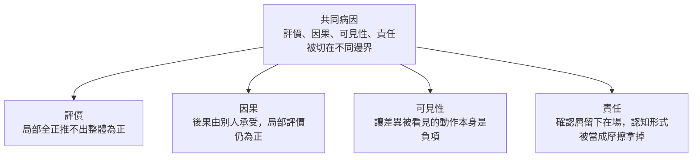

# 切在不同邊界上：局部可證明，全域不可維持

**Structure**: Reading Guide
**Date**: 2026-09-24T09:00
**Source**: conversation
**Model**: Claude Opus 5.5
**Agent**: GitHub Copilot Chat v0.66.0

## 這組報告真正要回答的問題

為什麼一個系統可以每個局部都挑不出錯，整體卻在劣化，而且回溯時找不到任何一個可以歸咎的決定？常見的回答是沒有人看全局，或治理不夠強。這組報告給的回答更窄：系統把評價、因果、可見性與責任切在不同的邊界上。被執行的只有局部評價函數；決定全域能否維持的那些項，不在任何一個被執行的函數裡。

共同病因是：

> 局部可證明性與全域可維持性是分開的。每一個被執行的檢查都在自己的邊界內為真，而它要支撐的那個整體結論，住在邊界之外。

四篇是同一病因的四個切面，不是一套依序展開的解方。

## 四個切面

四篇各自獨立成文、互不引用，任何一篇單獨閱讀都能得到該切面的完整結論。下圖只表示四篇切的是同一病因，不表示閱讀順序或前提關係。



## 四篇的分工

| 切面 | 報告 | 核心主張 | 現場 |
| :--- | :--- | :--- | :--- |
| 評價 | [局部通過，不是整體通過](local-pass-is-not-global/report.zh-TW.md) | 局部評價全為正推不出整體為正；交叉項沒有位置，彙總各局部通過只是多一層局部通過 | 亞利安五號首飛（Ariane 501） |
| 因果 | [合理決定的主要後果，若不由做決定的局部承受，局部為正就不是品質](cost-not-borne-locally/report.zh-TW.md) | 主要後果必須由做決定的局部承受；低摩擦常是衝突位移，不是衝突解決 | 火星氣候軌道器（Mars Climate Orbiter） |
| 可見性 | [為什麼差異一被看見就被當成失敗](visibility-as-failure/report.zh-TW.md) | 沒有終止條件的可見性會被正確地拒絕；可比較的摩擦讀數會變成目標 | Edmondson 的醫院單位錯誤偵測研究 |
| 責任 | [不容易被機器處理的認知，不是應該消除的摩擦](cognition-misread-as-friction/report.zh-TW.md) | 猶豫與未定被誤分類為摩擦；人被裁成四個介面節點，確認層只能看見在場 | 來源對話中的確認層段落 |

## 每篇各自擋住的誤讀

評價篇：找出交叉項沒有被計算，不等於已經有人負責因果，也不等於設一個整體負責人就能補上。

因果篇：讓後果回到局部，不等於局部評價因此含有交叉項；轉嫁停了，組合仍可能失敗。

可見性篇：把差異攤開沒有產生一個主人；這篇不能收成「做一個健康摩擦指標」。

責任篇：病不是認知外包，也不是人變笨；開場不是流程批判，還原要發生在分類那一步，不在最後一個按鈕上。

## 核心術語對照表

| 術語 | 在這組報告中的意思 | 常見的混淆 |
| :--- | :--- | :--- |
| **局部自洽（local coherence）** | 在一組假設、一個目標、一條邊界之內，決定可以被推出 | 與「局部正確」混為一談 |
| **交叉項** | 兩個以上決定交會時才出現、不在任何局部函數裡的項 | 與「沒人看守的縫隙」混為一談 |
| **轉嫁** | 決定的正號依賴主要後果落在別處 | 與單純的外部性混為一談 |
| **終止條件** | 差異被攤開之後，有辦法被命名、限定範圍並結束 | 與「不允許摩擦」混為一談 |
| **在場** | 確認層能觀測到的唯一謂詞：人在某個節點被等待 | 與「理解」混為一談 |

## 來源與範圍說明

這組報告蒸餾自一段討論局部自洽陷阱的對話，從「每個局部都合理、回溯找不到錯誤決定」出發，經過邊界、契約、摩擦與低摩擦的衝突位移，收到確認層只證明人在場。各篇均為分析論述；公共事故只引用調查報告寫明的部分，文中假想的例子只用來標出邊界，不代表觀測到的事實。

## Metadata

```toml
tags = ["分析論述", "局部自洽", "評價函數", "因果轉嫁", "可見性"]
```
