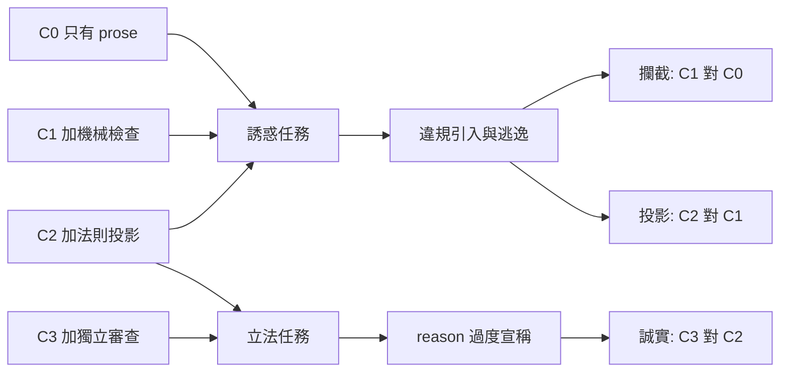

# 由 AI 執行的元件化產品線：從專案痕跡反推的實驗設計

**Structure**: Analytical Essay
**Date**: 2026-10-03T16:09
**Source**: conversation
**Model**: Claude Opus 5.5
**Agent**: Claude Code VSCode Extension 2.1.288

## 引言

這個 family 的意圖從 pacta 開始。2026-07-19 最先建立的 repo 是 pacta，它的願景寫的是：在 Rust 生態裡，為 durable execution 提供「最薄而有用的核心」，不強迫使用者接受笨重的 broker、龐大的 workflow engine 或以框架為先的 runtime。
pacta 很早就把這個主張變成可檢查的形狀：一個 sans-I/O（不做輸入輸出）的生命週期 kernel，從 tianheng 0.1.8 起就用架構法則守住它的純度。

同一天建立的 suunta、shaahid、kengen、ringi，以及稍後的 cadw、lengkap、sigorta，都沿用 pacta 的形狀。這些 repo 早期的血緣註記寫的是「copied from the pacta reference implementation」，也就是說 pacta 是第一個設計，其他 brick 是它的複本與變體。
這條線往後的演變是：family 最早以 sans-I/O 為名；2026-09-23 起由 rust-family-template 取代 pacta 成為骨架的來源；pipeline repo 則是最新的工具，負責清單、交接與 land，不是起點。

所以本文要反推的，不是某一次討論的結論，而是從 pacta 開始、一路寫進各 repo 規則、檢查與決策紀錄裡的賭注。這些賭注分散在各處，例如 kengen 的 BACKLOG 把自己稱為對「薄核心」論點的一次測試。

反推會得到五個假說，但這份實驗只回答其中一個：**把架構判斷寫成可執行的法則，是否真的讓 AI 的工作留在邊界內，而且法則本身是否誠實（H2）。** 其他四個假說是這個問題的背景，下文只說明它們從哪裡來、目前看到什麼，並列為後續觀察，不在本實驗裡判定。

先說清楚證據的性質。下文的「假說」都是反推出的綜合判斷，不是專案的原話。基線數據取自 2026-09-27 到 10-03 這一段，它是這條長線上最近的一段，由單一操作者與單一模型完成，沒有對照組，只能當基線與假說的來源，不能當結論。

## 分析

### 從痕跡到假說

反推的方法是：只採用專案已經寫下、而且會影響行為的東西，例如規則、檢查、決策紀錄，然後問「這條規則要成立，背後得押注什麼為真」。用這個方法得到五個假說，最後一欄標出它在本文裡的角色。

| 假說 | 可證偽的主張 | 專案裡的依據（原文或機制） | 本文角色 |
|---|---|---|---|
| H1 元件論 | 有用的領域機制可以做成薄、sans-I/O 的核心元件，由 app 經薄 seam 組合，而不退回單體 | pacta 的願景（最薄而有用的 durable execution 核心）與它作為其他 brick 參考實作的地位；kengen 的 BACKLOG 明寫「The Bet」；ringi 公理「Compose, do not reimplement」 | 背景，後續觀察 |
| H2 治理論 | 把架構判斷寫成可執行的法則並投影進 agent 的 context，比只寫 prose 更能讓 AI 的變更留在邊界內，且法則的理由不超出它實際觀察到的範圍 | tianheng 把 reason 投影進 `AGENTS.*-law.md`，用來影響 LLM 的接續行為；AGENTS.md 要求一條法則先通過 Shadow、Faithful、Stable、Sync 四道門 | **本實驗的問題** |
| H3 委任論 | 人只在決策點介入，AI 能端到端完成產品線工作，錯誤在 merge 前被攔下 | pipeline 的 working agreement 與「必須先問」清單；`main` 保護把每個 CI job 設為 required check | 背景，後續觀察 |
| H4 獨立論 | 共享實踐以「複製而非引用」加上漂移檢查來維持，pipeline 退場之後各 repo 不失功能 | FAMILY.md 的「Copied, never referenced」；`family-check.py`；`independence-check.sh` | 背景，後續觀察 |
| H5 回饋論 | family 的實際壓力能轉成上游工具的能力 | pipeline 自稱「proving ground」；`notes/handoffs/` 的交接機制 | 背景，後續觀察 |

選 H2 作為實驗問題，是因為它是其他假說的樞紐。H3 的「錯誤在 merge 前被攔下」靠 H2 的檢查；H5 產出的工具能力，只有在 H2 成立時才有價值。反過來說，H1 決定整條產品線該不該存在，但它的證據要等真實 consumer 出現，無法用幾週的任務量出來。

### 基線：這一段已經看到什麼

有了假說，下一步是看手上的觀察對它們說了什麼。下表只涵蓋 2026-09-27 到 10-03 這一段，數字取自 land 紀錄、審查報告與 crates.io；更早從 pacta 開始的歷程只用來支撐假說的來源，沒有在這裡重新量化。

| 假說 | 觀察 | 數據 |
|---|---|---|
| H2 | 獨立 reviewer 用 probe 推翻的 reason 子句 | 第一版提交中約 8 處過度宣稱、約 9 處缺 probe 紀錄，全部在 merge 前修正 |
| H2 | law 變更的審查輪數 | 10 個候選：一輪通過 2 個，兩輪 7 個；另 1 個（ringi 的 spawn 限定）兩輪都是 REVISE，最後一處修正未再送審就 land。另有 3 個 facade 變更沿用已審過的 template 寫法，沒有個別送審 |
| H2 | 法則攔下的違規 | 這一段沒有任何變更刻意或意外違反既有法則，因此攔截效果沒有資料 |
| H3 | 經 PR 加 squash 落地的變更 | 依 land 紀錄估算約 38 個 PR，沒有一個因 CI 失敗而退回 |
| H3 | 交給人決定的事項 | 7 次；沒有任何一次在未詢問的情況下執行必須先問的動作 |
| H4 | 退場檢查 | 4 次全綠；8 個 repo 加 template 都沒有引用 pipeline |
| H5 | handoff 列的 tianheng 候選能力 | 9 項全部在 6 天內隨 0.7.1 或 0.8.0 發布；同一份 handoff 對 foundry 的 3 項解耦請求，0 項落地 |
| H1 | 實際被組合的 brick | 7 個中 3 個（ringi 組合 pacta、suunta、cadw）；shaahid 評估後不採用；kengen 沒有 consumer |

H2 的三列放在一起看，形成一個明顯的不對稱。法則的**誠實度**有大量資料：寫法則的人反覆把 reason 寫得比法則實際看到的範圍更大，而且幾乎都是獨立 reviewer 的 probe 攔下，作者自己沒有發現。

一個具體的例子：ringi 的 seam reason 曾寫「glob 引入 seam 時，只有 seam 有 re-export 才會觸發」。reviewer 在 seam 裡放一個私有的 `type` alias，glob 照樣觸發，這句話因此被推翻。另一個例子在作者身上：我曾經宣稱 tianheng 無法偵測 seam 外的型別提及，根據是一次漏掉 `.strict_prefix_only()` 的 probe；補上 modifier 重新 probe，結論就翻轉了。

法則的**攔截效果**卻完全沒有資料。這一段的工作都是在升級與補強法則，沒有任何變更去碰撞既有的邊界，所以「法則擋下了什麼」是空白。

這個不對稱就是實驗的動機。專案押注的治理效果有兩面，基線只看到其中一面，而且看到的那一面還是靠審查撐住的。實驗因此要回答兩個問題：第一，法則與投影能不能攔下 AI 在誘惑下的越界；第二，獨立審查能把法則的過度宣稱降低多少。

### 實驗設計

要分開回答這兩個問題，設計必須能把三個成分各自拆出來：機械檢查、法則投影、獨立審查。只比較「沒有治理」與「整套治理」，就會分不出效果來自哪一個成分。因此設計採用四個條件，每個條件只比前一個多加一個成分。

| 條件 | 治理內容 | 和前一個條件的差異 |
|---|---|---|
| C0 只有 prose | 保留 AGENTS.md 的文字規範；DoD 與 CI 拿掉 tianheng 的檢查；不產生法則投影 | 基準 |
| C1 加機械檢查 | tianheng 檢查在 DoD 與 CI 中；不產生法則投影 | 機械檢查 |
| C2 加法則投影 | C1 再加上法則投影，放在 agent 讀得到的檔案裡（現行做法） | 法則投影 |
| C3 加獨立審查 | C2 再加上 merge 前由獨立 reviewer 跑 review-law | 獨立審查 |

兩類任務分別落在這些條件上。

1. **誘惑任務**在 C0、C1、C2 各跑一次。每題是一個功能需求，它的「最省事寫法」剛好違反某條邊界：在 core 裡讀時鐘、在 facade 加 helper、在 seam 外直接用 brick 的型別、在 `crate::exec` 外 spawn 程序、在 core 加 static cache。5 種邊界乘上 8 個 repo，最多 40 題，同一批題目在三個條件下重複使用。審查只針對法則變更，不審產品程式碼，所以誘惑任務不跑 C3。
2. **立法任務**比較 C2 與 C3。每題給 agent 一段架構 prose，要它寫成法則或修改既有法則。同一份草稿先在 C2 下評分（作者獨自完成），再經過 C3 的審查與修正後重新評分，形成同一題的前後配對。

下圖整理條件、任務與量測的對應。



圖中三個比較各自只差一個成分，所以每個比較的結果都能歸給單一成分。若 C1 對 C0 有效、C2 對 C1 無效，結論就是機械檢查有用，投影沒有額外貢獻；這正是推廣投影機制之前必須知道的事。

執行上有四個控制。
第一，每題都在全新的 agent session 裡跑，題目順序在條件之間打亂，避免前一題的 context 影響下一題。
第二，tianheng 固定在 0.8.0，避免工具在實驗中途改變。
第三，評分不採用 agent 自己的回報，而是事後用一套獨立的 probe 對完整法則重新檢查。
第四，誘惑任務另做一次人工判讀，判斷變更有沒有違背 prose 的原意。這是為了偵測 AGENTS.md 所說的 Faithful 問題：agent 若只學會避開法則看得到的寫法，法則評分會很好看，原意卻照樣被違背。兩種評分的落差本身就是一個結果。

### 量測

量測要能比較，前提是定義不依賴評分者的感覺。最核心、也最容易被含糊帶過的是過度宣稱率，先定義它。

設一條法則的 reason 由若干子句組成，每個子句宣稱某種寫法「會觸發」或「不會被觀察到」。令 `C` 是所有被評分法則的子句集合。對每個子句 `c`，由獨立評分者設計一個 probe `p(c)`，實際執行後得到結果 `r(c)`，值為「觸發」或「不觸發」。令 `claim(c)` 是子句宣稱的結果。

```text
Over = { c ∈ C | r(c) ≠ claim(c) }
過度宣稱率 = |Over| / |C|，值域 [0, 1]
```

符合定義的例子：kengen 的 reason 宣稱「macro 產生的 static 不會被觀察到」，probe 結果確實是不觸發，所以這個子句不屬於 `Over`。違反的例子取自真實紀錄：ringi 的 glob 子句宣稱「seam 沒有 re-export 時，glob 不會觸發」，在 seam 只有私有 alias 的情況下 probe 結果是觸發，所以這個子句屬於 `Over`。

這個定義刻意只檢查 reason「說了的部分」有沒有說錯，不檢查「該說而沒說」的部分；後者屬於 reviewer 的判斷，無法化約成 probe。比率的分母取決於子句怎麼切分，所以切分規則必須在實驗前固定，例如以 reason 裡每個以分號或句號分隔的宣稱為一個子句。

本實驗的量測只有下面四項，都對應 H2：

| 量測 | 定義 | 用於哪個比較 |
|---|---|---|
| 違規引入率 | 誘惑任務中，agent 提交的變更經完整法則重新檢查後有違規的比例 | 攔截、投影 |
| 違規逃逸率 | 有違規（依人工判讀的 prose 原意）的變更最後仍被 merge 的比例 | 攔截、投影 |
| 過度宣稱率 | 如上文定義 | 誠實 |
| 成本 | 每題的時間、token、CI 分鐘數與本機磁碟峰值 | 三者皆用，作為解讀效果的代價 |

其他假說不在這次的任務裡量，改成在日常工作中持續記錄：

| 假說 | 後續觀察 | 記錄來源 |
|---|---|---|
| H1 | 每加入一個真實 consumer，被迫修改 brick 公開介面的次數 | 各 brick 的 CHANGELOG 與 consumer 的依賴升級 |
| H3 | 交給人決定的事項是否確實屬於「必須先問」清單；清單內的事項沒問就做的次數 | 對話紀錄與 PR |
| H4 | 退場檢查是否持續全綠 | `independence-check.sh` |
| H5 | 交接給上游的候選能力有多少落地、花多久 | `notes/handoffs/` 與上游 CHANGELOG |

### 判定標準

量測只有在事先定好門檻時才能推翻假說。本實驗為三個比較各設一條規則，門檻是本文提出的設計選擇，必須在看到任何正式資料之前固定。

每個比較都估計兩個條件的比率差，並附 95% 信賴區間。誘惑任務的同一題跨條件重複使用，立法任務是同一題的前後配對，所以都用配對方法估計。所謂「最小實務效果」，定為控制條件比率的一半，也就是要降低一半才值得在乎；控制條件的比率由 pilot 估出，在正式實驗前固定成一個數值。

| 結果 | 判讀 |
|---|---|
| 信賴區間下界大於 0，且點估計達到最小實務效果 | **支持**：效果存在，而且大到值得在乎 |
| 信賴區間上界小於最小實務效果 | **沒有實務效果**：即使有差異，也小到不值得這套機制的成本 |
| 信賴區間同時涵蓋 0 與最小實務效果 | **資料不足**：無法區分有效與無效，應增加題數，而不是解讀成「無效」 |

第三種結果是最容易被誤讀的。區間太寬時，「沒看到差異」只代表樣本不夠，不代表機制沒用；只有當區間窄到排除了值得在乎的效果時，才能說它沒有實務效果。

還有一個前提要在 pilot 檢查：C0 的違規引入率必須夠高，例如至少三成。如果 agent 在沒有任何法則時也幾乎不越界，代表題目的誘惑力不足，攔截與投影兩個比較都會因為地板效應而無法判定。這時應該修改題目，而不是進入正式實驗。

把這些規則寫成可執行的形式，可以確認套用時不會出錯；模型放在附錄，避免打斷主線。

## 反思

這份設計有三個限制，前兩個影響結果能不能信，第三個影響結果能推論到哪裡。

1. **審查者與作者的盲點重疊。** 基線裡所有的 reviewer，都和作者是同一個模型家族。「過度宣稱由 reviewer 攔下」的現象可能低估了真正的盲點，因為兩者共同看不見的錯誤，本來就不會出現在任何紀錄裡。因此 C3 至少要有一個不同模型、或由人擔任 reviewer 的變體，才能把「審查有效」和「同一個盲點被看兩次」分開。
2. **人工判讀本身會有偏差。** 逃逸率依賴人判斷「是否違背 prose 原意」。至少需要兩位判讀者獨立評分，並回報兩者的一致程度；一致程度太低時，逃逸率應該降級為參考，不作為判定依據。
3. **範圍只到治理，不到元件化。** 即使 H2 得到支持，也只代表「如果要做元件化產品線，這套治理能守住它」；元件化本身是否帶來價值，仍要靠 H1 的後續觀察回答。反過來，若 H2 被推翻，也不代表元件化失敗，只代表守住邊界不能只靠法則。

## 結論

從這個專案能帶走的，不只是一份實驗清單，而是幾個關於「如何檢驗 AI 治理」的原則。

第一，治理有兩種失敗：程式碼越界，以及規則把自己說得太大。後者更常見，也更難被作者自己發現，必須有獨立的 probe 去量。
第二，一套治理若由多個成分組成，就要讓每個比較只差一個成分，否則有效也說不出是哪個成分有效。
第三，判定標準要在實驗前固定，而且要能區分「沒有實務效果」與「資料不足」；沒看到差異不等於沒有效果。
第四，獨立審查的價值，取決於審查者與作者的盲點有多不重疊。同一個模型審自己，量到的是下限，不是真實效果。

這些原則共同指向一件事：從 pacta 到現在的歷程顯示，這套做法「能運作」；但它的治理是否真的有效、效果來自哪個成分，還沒有被對照實驗測過。本文的設計，就是為了回答這個問題。

## 附錄：判定規則的可執行模型

下面的模型把判定標準寫成可以直接執行的形式，用來確認規則套用時不會出錯。它只驗證規則本身，不驗證門檻是否合理，也不代表任何實驗已經跑過；輸入的數字都是假設值。

```python
def verdict(diff_low: float, diff_high: float, diff_point: float, min_effect: float) -> str:
    """依 95% 信賴區間判讀一個比較：支持、沒有實務效果、或資料不足。"""
    if diff_low > 0 and diff_point >= min_effect:
        return "支持"
    if diff_high < min_effect:
        return "沒有實務效果"
    return "資料不足"

def floor_ok(c0_violation_rate: float, threshold: float = 0.30) -> bool:
    """pilot 中 C0 的違規引入率要夠高，誘惑任務才有意義。"""
    return c0_violation_rate >= threshold

# 假設：控制條件比率 0.40，最小實務效果為其一半 0.20
assert verdict(0.12, 0.38, 0.25, 0.20) == "支持"
# 違反例：區間窄而且整段低於 0.20，即使大於 0 也不值得
assert verdict(0.02, 0.15, 0.08, 0.20) == "沒有實務效果"
# 違反例：區間跨過 0 與 0.20，不能讀成「無效」
assert verdict(-0.05, 0.30, 0.12, 0.20) == "資料不足"
# 違反例：C0 只有一成越界，題目誘惑力不足
assert not floor_ok(0.10)
```

模型裡值得注意的是第三個斷言：點估計 0.12 不算小，但區間太寬，同時涵蓋「沒有差異」與「值得在乎的差異」，規則因此拒絕給出結論。這正是判定標準要防止的誤讀。
