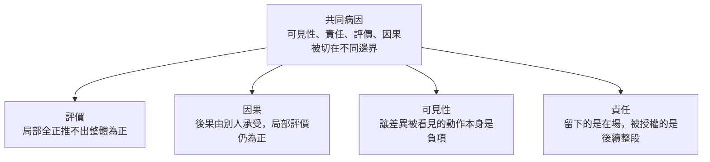

# 切在不同邊界上：局部可證明，全域不可維持

<!-- front matter -->
**Structure**: Reading Guide
**Date**: 2026-09-23T02:39
**Model**: Grok 4.7
**Agent**: GitHub Copilot Chat v0.66.0
**Source**: conversation

## 這組報告真正要回答的問題

為什麼一個系統可以每個局部都挑不出錯，整體卻在劣化，而且回溯找不到任何一個可以歸咎的決定？常見的回答是沒有人看全局，或是治理不夠強。本系列（2026-09-23-a）給的回答更窄：系統把可見性、責任、評價與因果切在不同的邊界上。被執行的只有局部評價函數。決定全域是否還維持得住的那些項，不在任何一個被執行的函數裡。

共同核心命題是：

> 局部可證明性與全域可維持性是分開的。把決定全域的項顯性化，在某個局部評價裡是負項，於是顯性化本身會被關掉。關掉之後分離仍在，只是不再被看見。

這四刀是來源對話自己的分組，不是已證明的完備分類。系列只承諾這四刀。

## 四個切面

四篇各自獨立成文、互不引用。任何一篇單獨閱讀都能得到該切面的完整結論。導讀的順序只是切面的排列，不是理解的依賴。



這張圖只說明四篇切的是同一病因的四個面。它不表示閱讀順序，也不表示任一節點是另一節點的前提。

## 四篇報告的分工

| 報告 | 進入問題 | 這篇必須自己講完的 | 只當案例，不另開一篇 |
| :--- | :--- | :--- | :--- |
| [為什麼每個決定都對，整體還是壞了](local-score-not-global/report.zh-TW.md) | 回溯為什麼找不到錯誤的決定？ | 局部評價全正推不出整體評價為正。交叉項沒有位置。彙總各局部評價的整體負責人，只是多一層局部通過。 | 給認知治理打分數。那是同一條規則裝到治理自己身上。 |
| [為什麼合理決策的後果總是別人在付](cost-borne-elsewhere/report.zh-TW.md) | 局部自洽何時會變成轉嫁？ | 主要後果必須由做決定的局部承受。否則局部評價仍然為正。衝突從便宜位置移到昂貴位置，不是被解決。 | 規格驅動把下游擠成垃圾桶。那是同一個位移的一個現場。 |
| [為什麼差異一被看見就被當成失敗](visibility-as-failure/report.zh-TW.md) | 為什麼不能忍受把差異攤開？ | 沒有終止條件的可見性會被正確地拒絕。該停的是無出口的摩擦，不是差異本身。可比較的摩擦讀數會變成被最佳化的對象。 | 領域驅動設計。它是裝在邊界上的儀器，看不見不經過邊界的重組。 |
| [為什麼留下確認的人，確認到的不是理解](presence-is-not-understanding/report.zh-TW.md) | 確認層到底確認了什麼？ | 在場不是理解。沒有自己的模型，確認授權的是後續整段。被當成摩擦拿掉的猶豫與未定，正是反駁所需的形式。 | 語彙先把世界切好、校準用同一套詞確認自己。來源沒有收成結論，只留成張力。 |

## 每篇內部要自己擋住的誤讀

這些句子寫在各篇裡，不指向其他篇。

評價那篇要寫明：找出交叉項沒有被計算，不等於已經有人負責因果，也不等於把差異攤開會被允許。

因果那篇要寫明：讓後果回到局部，不等於局部評價因此含有交叉項。轉嫁停了，組合律仍可能失敗。

可見性那篇要寫明：把差異攤開並沒有產生一個主人。這篇不能收成「做一個健康摩擦指標」。

責任那篇要寫明：人沒有模型，不是因為規格寫錯，也不是因為少了一次全局審查。開場不能是流程批判，收尾不能是人變笨。

## 來源與範圍說明

本系列蒸餾自一段標題為「局部自洽陷阱解析」的對話。對話從「每個局部都合理、回溯找不到錯誤決定」出發，經過邊界、契約、領域驅動設計、摩擦、績效、低摩擦的衝突位移，收到確認層只證明人在場。

四篇都是分析論述。文中的處理時間、依賴圖、規格下游，都是假想案例，用來說明邊界，不代表觀測到的事實。沒有執行過的模型，也沒有實測數據。

工程現場與管理現場在本系列裡不是兩個系列。同一條規則換了例子，結論沒有分開。拆成技術系列與管理系列，會把同一篇寫成兩種方言。

## Metadata

```toml
tags = ["分析論述", "局部可證明性", "全域可維持性", "評價函數", "因果轉嫁"]
```
