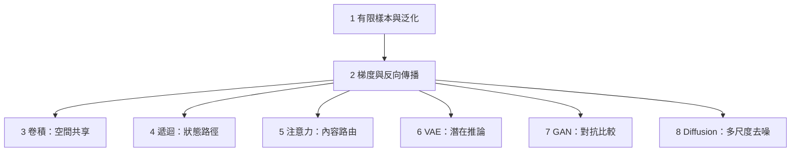

# 閱讀導覽：能力不是一個分數，而是一條受約束的形成路徑

這八篇報告可以按一條因果鏈閱讀。第一篇先回答「從有限資料可以主張多少」，第二篇再說明誤差如何變成參數更新。沒有這兩個基礎，架構名稱很容易被誤當成能力來源。

接著有三條可彼此對照的路徑：卷積用空間共享換取樣本效率；遞迴以狀態轉移壓縮歷史；注意力則以內容相依權重直接路由資訊。三者都把某種關係變得容易表示，也都排除或弱化其他關係。

最後三篇轉向生成。VAE 把生成寫成帶近似後驗的機率推論，GAN 讓判別器提供會移動的比較訊號，擴散模型則把資料到噪聲的已知過程反轉成多尺度估計。它們的共同問題不是「哪個最聰明」，而是學習訊號能否同時支持品質、覆蓋與可驗證性。

每篇的程式碼分兩層。NumPy 段落把機制縮到可手算的規模，讓變因與控制組一眼可見；接著的「框架對照」段落用 PyTorch 在 autograd 與 `nn` 模組上量同一個觀察量，確認結論不是手寫實作的產物。兩層都只做過語法檢查，本批次的環境沒有安裝 NumPy 或 PyTorch，因此正文不宣稱輸出已執行驗證。

圖中只有前兩篇是共同前置。第三至第八篇都可獨立閱讀；箭頭表示概念依賴，不表示技術世代或優劣排序。若只關心一種模型，直接閱讀對應報告也能取得必要前提、機制、實驗與限制。
