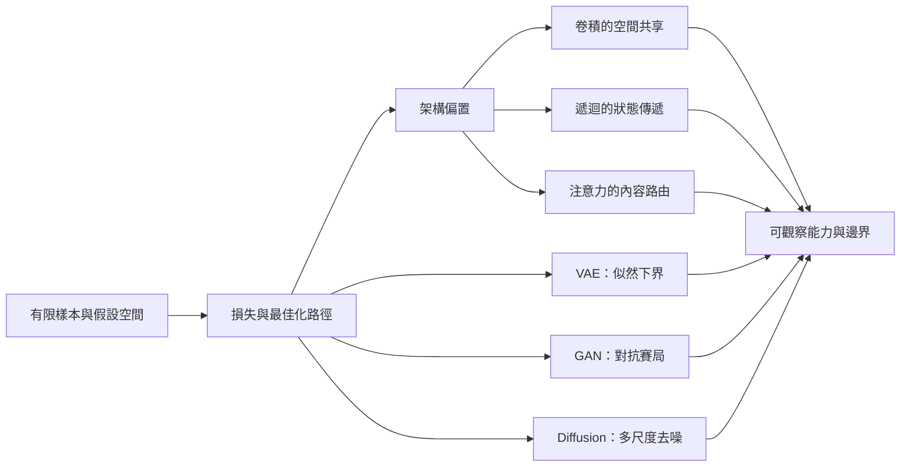

# 從有限證據到生成分佈：統計學習如何形成模型能力

本系列處理一個問題域：模型能力如何由資料、目標、最佳化與架構限制共同形成。它不把「學會」當作單一事件，而把可觀察行為拆回可估計的風險、可傳遞的梯度、可利用的結構偏置，以及不同生成目標所建立的分佈近似。

**series**: `從有限證據到生成分佈：統計學習如何形成模型能力`

## 系列因果弧

圖中的分岔不是模型家族清單。前三個節點建立共同判準，後續五個節點展示不同結構與目標如何改變資訊路徑。所有分支最後都回到同一個驗證要求：能力必須以資料分佈、控制變因與可反駁指標來界定。

## 報告角色與閱讀順序

| 順序 | 報告 | 核心問題 | 不可替代角色 | 邊界 | tags |
| :--- | :--- | :--- | :--- | :--- | :--- |
| 1 | [有限樣本何時足以支持能力主張](learning-from-finite-samples/report.zh-TW.md) | 經驗風險降低何時能外推到目標分佈？ | 建立全系列的估計與反駁基準 | 不處理梯度如何求得 | 統計學習、經驗風險、泛化、模型選擇 |
| 2 | [誤差如何成為參數更新](backpropagation-and-optimization/report.zh-TW.md) | 反向傳播與梯度下降如何共同形成可學習路徑？ | 區分求導機制、更新規則與實際能力 | 不討論特定架構的結構先驗 | 反向傳播、梯度下降、條件數、梯度檢查 |
| 3 | [卷積何時能把局部性換成樣本效率](convolutional-spatial-bias/report.zh-TW.md) | 權重共享何時幫助平移泛化，何時排除任務所需資訊？ | 展示空間結構偏置的收益與代價 | 不把平移等變性擴張成任意幾何不變性 | 卷積神經網路、結構偏置、平移等變性、感受野 |
| 4 | [遞迴狀態何時能保留可學習的歷史](recurrent-state-and-gates/report.zh-TW.md) | 狀態影響與梯度訊號如何穿過時間？ | 分離前向記憶與反向可訓練性 | 不把門控視為內容必然保存的保證 | 遞迴神經網路、長短期記憶、梯度消失、狀態空間 |
| 5 | [注意力如何路由資訊而不等於記憶](attention-as-routing/report.zh-TW.md) | 內容相依加權如何縮短路徑，又為何不能直接解釋輸出？ | 建立資訊路由、順序與解釋性的邊界 | 不涵蓋整個大型語言模型系統 | 自我注意力、Transformer、位置編碼、可解釋性 |
| 6 | [VAE 的潛在變數何時會被使用](variational-latent-information/report.zh-TW.md) | ELBO 如何同時要求重建與先驗匹配，並可能容許後驗坍縮？ | 解析顯式潛在推論的資訊取捨 | 不以潛在方向自動對應人類語意 | 變分自動編碼器、證據下界、重參數化、後驗坍縮 |
| 7 | [GAN 為何能生成銳利樣本卻漏掉模式](adversarial-distribution-matching/report.zh-TW.md) | 兩個同步移動的目標如何提供訊號並造成覆蓋失效？ | 解析隱式分佈比較與非定態最佳化 | 不以少量樣本品質代表整體分佈 | 生成對抗網路、模式坍縮、分佈覆蓋、賽局最佳化 |
| 8 | [擴散去噪如何把生成拆成可學習步驟](diffusion-denoising-path/report.zh-TW.md) | 已知加噪程序如何產生可監督的反向生成問題？ | 連接多尺度噪聲預測、分數與採樣誤差 | 不宣稱步數與品質具有單調關係 | 擴散模型、去噪分數匹配、噪聲排程、反向採樣 |

這個順序先固定「能力主張需要什麼證據」，再解釋參數如何改變。卷積、遞迴與注意力接著提供三種結構偏置的對照。最後三篇比較生成模型如何用不同學習訊號逼近資料分佈。

## 展開方向盤點

| 展開類型 | 狀態 | 實際落點 |
| :--- | :--- | :--- |
| 共用前提就地自含 | 本次展開 | 每篇就地定義資料、目標、控制變因與能力邊界；不要求讀者先讀系列其他篇。 |
| 概念地圖／詞彙表 | 本次展開 | 本地圖以因果弧統整術語；每篇只保留其論證需要的首次定義，避免獨立詞彙表取代說明。 |
| 反例與不適用邊界 | 本次展開 | 每篇都設置反例、不能推出的結論，以及能推翻主張的觀察條件。 |
| 結構化資產 | 本次展開 | 系列與各篇使用因果圖、比較表、公式和可執行 NumPy 實驗來外化依賴與控制。 |

## 後續 backlog

下列問題與本問題域相鄰，但需要不同的證據與篇幅，因此不放進本系列正文：最佳化器隱式偏置的完整理論、群等變網路的表示論、長上下文系統的外部記憶、生成模型的人類偏好對齊，以及大規模訓練的硬體—演算法共同設計。
