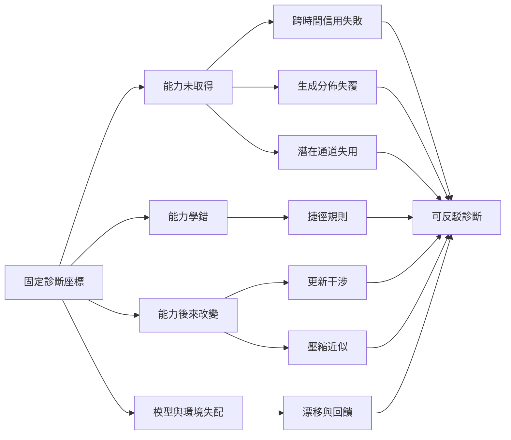

# 模型能力失效的因果診斷地圖

## 問題域

本系列處理的不是「分數為何變低」這個表面問題，而是如何把下降拆成可反駁的機制：能力可能從未取得、取得了不穩定規則、被後續更新覆寫、被部署近似改變，或在不變模型下因環境失配而失效。系列的共同方法是固定反事實比較條件，以機制特有的觀察量排除替代解釋。

`series = ["模型能力失效的因果診斷：取得、覆寫、近似與環境失配"]`

## 凍結後的報告角色與邊界

下表也是閱讀順序。每個 slot 只承擔一個核心問題；後面的報告可以使用前面的診斷觀念，但正文仍各自建立必要前提。

| 順序 | 報告 | 核心問題 | 不可替代角色 | 邊界 | tags |
| :--- | :--- | :--- | :--- | :--- | :--- |
| 1 | 診斷座標 | 同一分數下降如何分辨模型、資料、推論與測量的改變？ | 建立全系列的反事實座標 | 不診斷特定訓練算法 | 能力評估、反事實比較、測量契約、模型監測 |
| 2 | 跨時間信用分配 | 為何遞迴網路可表示長程依賴卻學不到？ | 隔離 Jacobian 連乘造成的取得失敗 | 不涵蓋生成模型坍縮 | 遞迴神經網路、梯度消失、信用分配、最佳化 |
| 3 | 生成分佈覆蓋 | 為何 GAN 樣本看似逼真卻只覆蓋少數模式？ | 區分品質與覆蓋並定位對抗動態 | 不把所有低多樣性歸為模式坍縮 | 生成對抗網路、模式坍縮、分佈覆蓋、對抗訓練 |
| 4 | 潛在通道使用 | 為何 VAE 的解碼器可能完全忽略潛在變數？ | 用 ELBO 分解診斷資訊通道失效 | 不以低 KL 單獨定罪 | 變分自動編碼器、後驗坍縮、互資訊、變分推論 |
| 5 | 捷徑學習 | 高測試分數為何仍可能建立在錯誤理由上？ | 分離同分佈成功與跨環境穩定性 | 不假定人類指定特徵必然是因果特徵 | 偽相關、捷徑學習、環境切分、穩健性 |
| 6 | 持續學習干涉 | 新任務更新如何破壞已取得能力？ | 將遺忘定位到共享參數上的目標衝突 | 不把參數距離當成功能損失 | 災難性遺忘、梯度干涉、持續學習、穩定可塑性 |
| 7 | 壓縮保真度 | 資源近似如何造成平均分數看不見的局部損失？ | 統一比較量化、剪枝與蒸餾的行為失真 | 不宣稱三種壓縮共享低階機制 | 模型壓縮、量化、剪枝、知識蒸餾、校準 |
| 8 | 分佈與回饋 | 參數不變時，環境與模型回饋如何改變風險？ | 區分外生漂移、決策回饋與生成資料遞迴 | 不宣稱所有合成資料都會坍縮 | 分佈漂移、表演性預測、資料回饋、資料來源 |
| 9 | 可反駁診斷 | 如何把退化警報轉成有停止條件的因果判斷？ | 將前述機制收束為版本化、統計化的診斷程序 | 不以監測警報代替根因證據 | 退化診斷、行為切片、不確定性、可重現評測 |

## 系列因果拓撲

這張圖解決「各篇是失效類型清單，還是有依賴的推理流程」的閱讀問題。

圖中前四條分支是互斥假說的起點，不是完整分類學。最後匯入診斷程序，表示任何故事都必須落成可重放對照；它不能證明現實系統只會有單一病因。

## 展開方向盤點

四類方向均已決定去向。狀態描述的是本次系列要做到的工作，不是形式配額。

| 展開類型 | 狀態 | 落點與理由 |
| :--- | :--- | :--- |
| 共用前提就地自含 | 本次展開 | 每篇就地定義「能力是模型、資料、推論與測量共同形成的條件式行為」，避免依賴導讀。 |
| 概念地圖／詞彙表 | 本次展開 | 以本地圖的因果拓撲和逐篇首次定義統一「取得失敗、學錯、覆寫、近似、失配」；不另建重複詞彙表。 |
| 反例與不適用邊界 | 本次展開 | 每篇均列不能推出的結論、替代解釋與反駁條件，因為同一症狀可由多種機制造成。 |
| 結構化資產 | 本次展開 | 因果流程使用 Mermaid；機制隔離使用可執行 NumPy；多條件比較使用表格。 |

生成式展開已落在三處：把三種「坍縮」拆成三個 slot；把壓縮的平均保真度深化為個體翻轉、校準與硬體收益三軸；把分佈漂移深化為外生變化、決策回饋與遞迴生成三種資料生成程序。跨域公平、資安攻擊與人類組織治理雖相關，但無法由本問題域直接證成，因此不納入本次正文。
