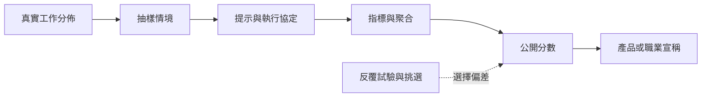

# 評測分數如何成為市場訊號

<!-- front matter -->
**Structure**: Analytical Essay
**Date**: 2026-09-07T00:28
**Model**: GPT-5.6 Sol
**Agent**: Codex VS Code extension 26.901.22334
**Source**: reconstruction

## 導言 (Introduction)

GPT-4 技術報告用專業考試與學術基準呈現能力，同一報告也列出幻覺、有限情境與評測污染等限制。[GPT-4 Technical Report](https://arxiv.org/abs/2303.08774) 市場傳播卻容易留下「考試超越人類」，省略提示、樣本、選擇程序與職業的其他任務。

核心問題不是評測是否行銷，而是有限測量何時足以支持更大的產品宣稱。

## 分析 (Analysis)

對模型 $f$、資料集 $D$ 與指標 $m$，分數是

$$
\hat S(f;D,m)=\frac{1}{n}\sum_{i=1}^{n}m(f(x_i),y_i).
$$

這只直接估計 $D$ 與 $m$ 所定義的任務。從分數到工作效用還需要三個中介：樣本代表性、評分與真實損失的一致性、部署流程與測試條件的一致性。任一失效，準確分數也可能成為錯誤市場訊號。

HELM 的原始研究用多情境與準確率、校準、穩健性、公平性、毒性、效率等多指標，目的正是暴露單一排名壓掉的取捨。[Holistic Evaluation of Language Models](https://arxiv.org/abs/2211.09110) 反覆查看同一測試集再選最好結果，則會形成適應性過擬合；Reusable Holdout 的研究形式化了這項風險。[Dwork 等人](https://pubmed.ncbi.nlm.nih.gov/26250683/)

這張圖把分數轉成宣稱的三次選擇外化。讀者應觀察：不確定性不是只在抽樣誤差。



### 可重現的機制隔離

下面假設候選模型真實正確率相同，只改變查看同一有限評測的候選數。觀察量是公開的最佳分數。

```python
import random

def best_score(trials, seed=21, n=100, p=0.70):
    rng = random.Random(seed)
    scores = []
    for _ in range(trials):
        scores.append(sum(rng.random() < p for _ in range(n)) / n)
    return max(scores)

for trials in (1, 5, 20, 100):
    print(trials, round(best_score(trials), 3))
```

控制變因是真實正確率、樣本數與 seed；操弄變因是試驗次數。預期最佳觀察值隨挑選機會增加而上升。程式不表示所有高分虛假，也未模擬模型間真差異；它只隔離「多看再挑」的機制。

## 反思 (Reflection)

反例是測量目標與部署任務完全相同，而且評測協定預先註冊、一次執行、樣本持續更新。此時分數可直接支撐狹窄產品宣稱。另一個邊界是單次負面 Demo：它足以反駁「永不失敗」，不能估計平均錯誤率。

不能由考試成績推出模型能承擔整個職業。職業還包含資訊蒐集、工具操作、例外處理與責任。也不能因資料可能污染就否定所有評測；應把污染、挑選次數與未見測試的結果納入不確定性。

驗證契約如下。資料分成 60% 開發、20%公開驗證、20%封存測試，按真實使用情境分層。seed 固定為 21，且試驗次數預先登記。指標至少含任務效用、校準、失敗嚴重度、延遲與成本。控制變因是模型版本、提示、工具、解碼與評分器。觀察量是公開分數到封存測試及端到端工作的落差。若落差在預設容許值內且跨情境穩定，狹窄宣稱成立；若排名翻轉或實務損失不改善，宣稱被反駁。封存集查詢額度用盡即停止比較並換新資料。

## 實務對比 (Practical Contrastive Examples)

錯誤說法是「模型在法律考試超越多數考生，所以可以取代律師」。較好的說法是「在指定版本、提示與評分規則下，模型於該試題取得某分數；文件查證、客戶溝通與法律責任另行測試」。

錯誤 Demo 只播放成功路徑並把它稱為日常可靠度。較好的展示分開呈現能力上限、隨機任務的平均表現與已知失敗，並公開重試次數。市場仍得到可比較訊號，但外推距離可見。

## 結論 (Conclusion)

Benchmark 與 Demo 是能力的測量介面，不是能力本身。可信市場訊號必須保留資料、提示、指標、挑選程序與部署差異。分數可以簡化決策；只有當簡化留下可反駁的外推契約，它才不是把有限證據包裝成無限能力。
