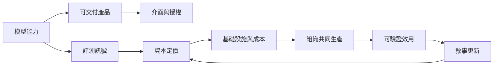

# 閱讀指南：追蹤每一次「所以」

這七份報告追蹤同一種常見跳躍：模型在有限條件下產生輸出，於是產品可靠、企業有價值、勞動會改變，最後市場故事彷彿成為現實。閱讀時應把每個「所以」改寫成可測量的轉換。

圖中的箭頭不是保證，而是待驗證的契約。模型可以很強，產品仍可能因整合或救濟失敗而無效；評測可以準確，仍可能無法代表實際工作；資本可以改善供應，也可能先形成折舊與產能壓力。

建議依 [產品邊界](ai-product-delivery-boundary/report.zh-TW.md)、[介面責任](conversational-interface-accountability/report.zh-TW.md)、[評測訊號](benchmark-to-market-signal/report.zh-TW.md)、[資本定價](capital-prices-ai-futures/report.zh-TW.md)、[單位經濟](ai-saas-unit-economics/report.zh-TW.md)、[組織共同生產](organizational-coproduction/report.zh-TW.md)、[敘事反身性](narrative-reflexivity-loop/report.zh-TW.md)閱讀。若只關心採購，可讀前兩篇與單位經濟；若只關心市場敘事，可從評測訊號一路讀到反身性。

每篇都有相同的驗證紀律：先重建真實案例的因果，再用玩具模型隔離一個機制，最後列出資料、切分、seed、指標、控制、反駁與停止條件。玩具輸出只證明機制方向，不替真實世界估計效果量。
