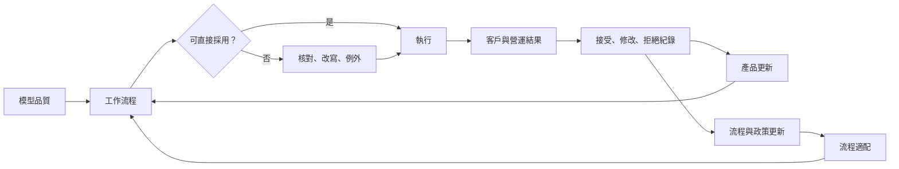

# 生產力由模型與組織共同生產

<!-- front matter -->
**Structure**: Analytical Essay
**Date**: 2026-09-07T00:28
**Model**: GPT-5.6 Sol
**Agent**: Codex VS Code extension 26.901.22334
**Source**: reconstruction

## 導言 (Introduction)

一項涵蓋 5,000 多名客服人員的實地研究發現，導入生成式 AI 助理後，每小時解決問題數平均提高約 15%，效果主要集中在較新、較低技能的工作者；高技能員工的增益較小。這不是模型固定「增加 15% 生產力」，而是工具、特定客服流程與人員經驗交互作用的結果。[Generative AI at Work](https://academic.oup.com/qje/article/140/2/889/7990658)

核心問題是：為何同一工具進入不同流程與人群，會產生不同甚至相反的結果？

## 分析 (Analysis)

技術與組織互補（Organizational Complementarity）指技術能力必須搭配流程重排與技能調整才形成產出。可用分析函數表示：

$$
Y=Aq^\alpha o^{1-\alpha},\qquad 0<\alpha<1.
$$

$q$ 是任務上的模型品質，$o$ 是資料、權限、流程、訓練與例外處理的適配度，$A$ 是其他條件。乘法形式讓短板可見，但不是經驗普遍定律。真正效果還可能依技能 $s$ 改寫為 $Y(q,o,s)$。

客服案例可回推為：工具從高績效對話萃取可用模式，較新員工在即時建議下更快採用這些模式，解決率因此提高；原本已掌握模式的資深者可新增的知識較少。中介變數是建議採納、學習速度、處理時間與解決品質，而不是登入率。

共同生產還包含人工補償（Human Compensation）：員工核對、改寫、找資料與處理例外。當日常工作被自動化，剩下的案例可能更難，人員又因少練習而較難接手。Bainbridge 將這種設計張力稱為自動化反諷。[Ironies of Automation](https://www.sciencedirect.com/science/article/pii/0005109883900468)

這張圖把隱形工作與資料回流放回系統。讀者應注意回流資料也受介面和管理政策塑形。



失效點包括員工無權拒絕、難例累積、回流標籤偏向管理目標，以及速度改善被重工抵銷。

### 可重現的機制隔離

以下固定模型品質，操弄流程適配，並加入技能異質性。觀察量是平均產出及群組差異。

```python
def output(model_quality, process_fit, skill, alpha=0.5):
    complement = model_quality ** alpha * process_fit ** (1 - alpha)
    learning_gain = (1 - skill) * 0.20 * process_fit
    review_drag = skill * 0.10 * (1 - process_fit)
    return complement + learning_gain - review_drag

for fit in (0.4, 0.9):
    novice = output(0.9, fit, 0.2)
    expert = output(0.9, fit, 0.9)
    print(fit, round(novice, 3), round(expert, 3))
```

控制變因是模型品質和函數係數；操弄變因是流程適配與技能。預期強流程提高兩組結果，但增益不同。程式不能證明新手永遠受益較多；它只是隔離互補與異質性的可能機制。

## 反思 (Reflection)

反例是可完全自動化、輸入規格固定且錯誤成本低的任務。若組織適配只需一次 API 串接，$o$ 的變異很小，模型改善可能主導結果。另一個反例是專家使用高品質科研工具：專家可能因判斷力而取得更大增益。

所以不能把客服研究外推到所有職業，也不能以平均值代表每種技能。把全部流程改造算成 AI 效益會高估模型；把永久合規覆核都算成模型失敗，也會低估完整服務。

驗證契約如下。資料是員工×週面板，導入前後各至少八週；依團隊與技能分層，70%估計、30%封存。隨機試驗 seed 為 53。指標包含每小時成功件數、一次解決率、客戶品質、重工、升級、覆核分鐘與員工學習。控制變因是案件難度、班次、團隊、模型版本與管理政策。觀察量是流程適配和技能是否中介效果。若只改善登入或速度而品質與總工時未改善，生產力宣稱被反駁；若客戶傷害或員工無法接管超過門檻，停止部署擴張。

## 實務對比 (Practical Contrastive Examples)

錯誤做法是購買工具後要求全員使用，以登入率當成功。較好的做法先選可逆、可覆核、低錯誤成本的子任務，建立基線，再分階段比較端到端結果與不同技能群組。

錯誤做法把人工覆核列為三個月後歸零的暫時成本。較好的做法把覆核分成學習期缺陷、模型不確定、法律責任與高風險例外；只有第一類可合理預期快速下降。

## 結論 (Conclusion)

AI 生產力不是模型隨安裝附送的常數。它由模型品質、流程適配、技能、人工補償與資料回流共同生產。可信的採用證據必須量測端到端結果、異質效果與新增工作；若只量登入、速度或平均值，組織付出的那一半因果就會消失。
