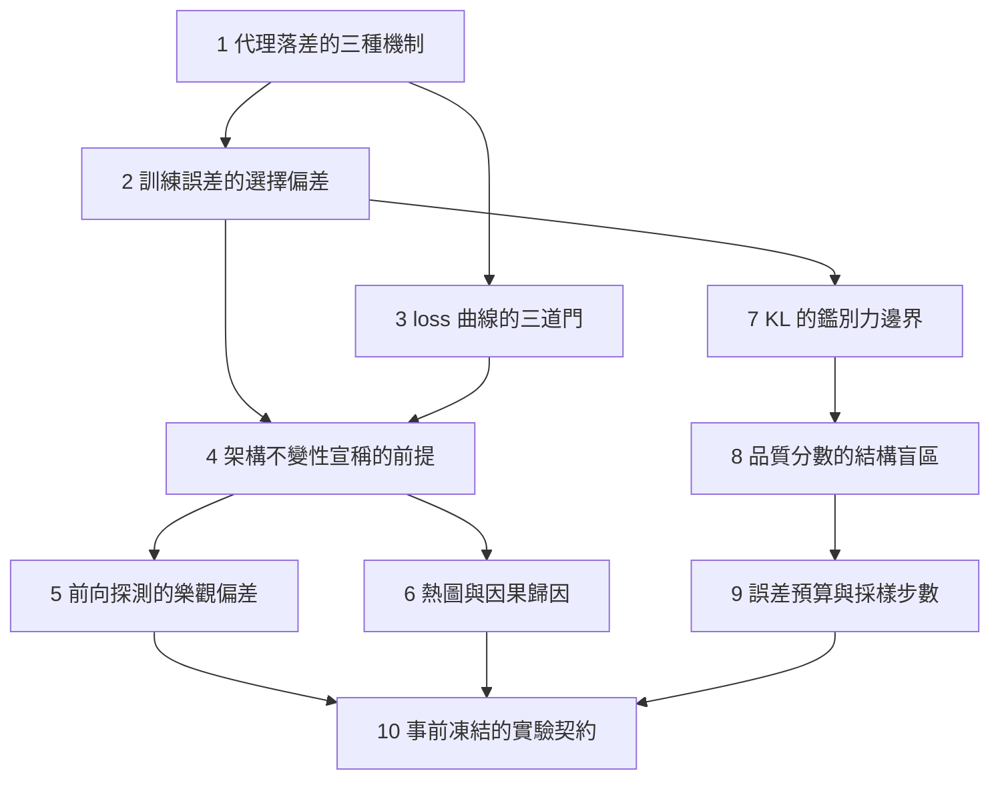

# 導讀：訓練訊號與能力證據

每一個訓練期的數字都在誠實地回答某個問題。問題在於，它回答的那個問題，通常比你以為的窄。

訓練誤差回答「這批證據被解釋得多好」，不回答「解釋能走多遠」。loss 曲線回答「更新是否改善了被計算的目標」，不回答「目標是否就是你要的能力」。注意力熱圖回答「這次前向計算如何加權」，不回答「哪些輸入造成了輸出」。這些落差各有不同的成因，但它們共用一個結構：**訊號是某個無法直接觀測的量的代理，而誤判發生在把代理當成本體的那一步**。

本系列的十篇報告，前九篇各自解剖一個具體的代理落差，最後一篇把補救動作固化成可執行的實驗契約。

## 閱讀順序一覽

1. 「指標變好」不是能力證據：代理落差的三種機制
2. 訓練誤差為何是有偏的：候選集規模與選擇偏差
3. loss 在降不代表在學：求導、更新與泛化的三道門
4. 移一個像素就翻：卷積不變性宣稱的前提破壞
5. 「資訊還在狀態裡」為何不算證據：前向探測與反向梯度的分離
6. 熱圖不是模型的理由：注意力權重與因果歸因的距離
7. KL 為何在強解碼器下失去意義：潛在通道的使用率量測
8. 品質分數為何看不見缺模式：生成評估的二維前緣
9. 多跑幾步不會讓它變準：擴散採樣的誤差預算
10. 怎麼設計一個會失敗的實驗：事前凍結的八欄契約

## 閱讀順序與依賴

箭頭代表**概念依賴**，不代表閱讀強制性。每篇皆自包含，需要的前提都在該篇內就地建立；箭頭指出的是「先讀哪篇能省下建立脈絡的成本」。

## 四個閱讀區段

**第一段（第 1 篇）建立詞彙。** 它把代理落差拆成三種機制——選擇偏差、條件命題的前提破壞、中介誤認——並說明每種機制需要哪一類獨立證據。後續每篇都在演示其中一種。

**第二段（第 2、3 篇）處理純量指標。** 這是最常見也最容易誤讀的訊號形態。第 2 篇用一個公開的公共衛生預測系統崩盤，說明為什麼「在巨大候選集裡挑出最貼合的那個」會讓誤差本身失去估計意義。第 3 篇拆開一條下降的 loss 曲線，指出它同時掩蓋了三個必須分別驗證的命題。

**第三段（第 4 到 6 篇）處理架構宣稱與內部觀測。** 訊號從數字換成「架構文件宣稱的性質」「從狀態探測到的內容」與「模型內部的可視化」——三者都是可以量到、而且量得到正面讀數的東西。第 4 篇說明數學性質是條件命題，而條件常在離散化與邊界處理中失效。第 5 篇說明「資訊還在狀態裡」這個讀數為何系統性偏樂觀：保留量可以高達七成，而同一位置的學習訊號精確為零。第 6 篇說明看得見的中介量為何不等於起作用的成因。

**第四段（第 7 到 9 篇）處理生成模型的讀數。** 這裡的落差移進目標函數與評估指標本身。第 7 篇說明 KL 是一個雙義讀數：同一個接近零的數字，可能代表通道正確地閒置，也可能代表它被繞過，而讓它失去鑑別力的因素正是工程上視為改進的東西。第 8 篇說明品質分數對缺模式的盲區是結構性的——坍縮的生成器讀數可以優於真實資料。第 9 篇說明單一旋鈕為何無法同時改善多個獨立的誤差來源。

**收束（第 10 篇）** 把前九篇的補救動作寫成一份事前凍結的契約：資料、切分、seed、指標、控制變因、觀察量、反駁條件、停止條件。它的檢驗標準只有一條——這個實驗設計得出「主張是錯的」這個結論嗎？

## 全系列的單一判準

若只帶走一句話：**任何能力主張都必須附帶一個能推翻它的觀察**。沒有這個觀察，指標再好也只是在描述訓練過程，不是在描述能力。

這也界定了本系列的範圍。十篇的起點都是一個**看起來變好**的讀數，問的都是「這個好是真的嗎」。從已經變差的分數往回找成因，是一個不同的問題，需要不同的證據，本系列不處理。
