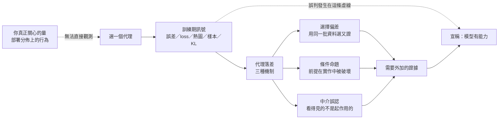

# 訓練訊號與能力證據：當指標變好，你到底知道了什麼

本系列處理一個問題域：機器學習系統在訓練期產生的**可觀察成功訊號**，與它在部署期展現的**實際能力**之間，存在系統性的落差。這個落差不是偶發的實作疏失，而是由訊號的產生方式決定的——每一個訓練期指標都是某個真正關心的量的**代理**，而代理與被代理者之間的距離，正是誤判的棲身之處。

**範圍聲明（系列邊界）**：本系列只處理**訊號看起來變好**的情況。每一篇的起點都是一個正面讀數——訓練誤差低、loss 在降、架構文件宣稱具備某性質、狀態探測說資訊還在、熱圖看起來合理、KL 很漂亮、樣本很逼真、步數加得夠多、實驗已經做完。問題永遠是「這個好是真的嗎」，而不是「什麼東西壞了」。

這個限制是刻意的，因為兩種問法需要的證據完全不同。從下降的分數往回找成因，是一個歸因問題：你已經知道有事情不對，要決定是模型、資料、推論或測量改變了。從一個看起來變好的讀數往前推能力，是一個**儀表效度**問題：讀數本身可能完全誠實，而它回答的問題比你以為的窄。本系列只做後者。

系列因此不討論「怎麼把模型訓練得更好」，也不討論退化診斷。它討論一件更前置的事：當你看到一個變好的數字、一張漂亮的圖、一個宣稱具備某性質的架構時，**你到底獲得了什麼證據，又沒有獲得什麼證據**。

**series**: `訓練訊號與能力證據：當指標變好，你到底知道了什麼`

## 系列因果弧

訊號之所以能騙人，不是因為它造假，而是因為它誠實地回答了一個比你以為的更窄的問題。下圖是全系列共用的骨架：每一次誤判都發生在同一個位置——從「訊號」直接跨到「能力」的那條虛線。

圖的重點在兩條線的對比。實線是**訊號到落差再到證據**的合法路徑：先承認代理落差、指名它屬於哪種機制、補上對應的獨立證據，才有資格宣稱能力。虛線是實務中最常走的捷徑，也是全系列每一篇的攻擊對象。

三種機制不是分類學上的窮盡，而是本系列蒐集到的可反駁樣本：它們各自有明確的觸發條件、可量測的症狀，以及不同的補救動作。骨幹篇建立這個分類，後續八篇各自展示一種機制在特定場景中的完整因果鏈，最後一篇把補救動作固化為可執行的實驗契約。

## 報告角色與閱讀順序

| 順序 | 報告 | 核心問題 | 不可替代角色 | 邊界 | tags |
| :--- | :--- | :--- | :--- | :--- | :--- |
| 1 | [「指標變好」不是能力證據：代理落差的三種機制](proxy-gap-mechanisms/report.zh-TW.md) | 訓練期訊號要補上什麼，才能支撐能力主張？ | 建立代理落差的三機制分類，供全系列共用 | 不處理任何特定架構或目標函數的細節 | 泛化、模型評估、驗證設計、統計學習 |
| 2 | [訓練誤差為何是有偏的：候選集規模與選擇偏差](selection-bias-in-training-error/report.zh-TW.md) | 為什麼在同一批資料上挑出的最低誤差是有偏的？ | 建立選擇偏差機制的定量骨幹 | 不處理梯度如何求得 | 選擇偏差、經驗風險、模型選擇、分佈偏移 |
| 3 | [loss 在降不代表在學：求導、更新與泛化的三道門](loss-curve-three-gates/report.zh-TW.md) | 求導、更新與泛化為何是三道獨立的門？ | 拆開被 loss 曲線壓成一件事的三個命題 | 不討論特定架構的結構先驗 | 反向傳播、梯度下降、學習率、梯度檢查 |
| 4 | [移一個像素就翻：卷積不變性宣稱的前提破壞](architectural-invariance-claims/report.zh-TW.md) | 架構的數學性質宣稱，在什麼條件下才真的成立？ | 建立條件命題機制：前提如何被實作破壞 | 不把平移的結論外推到任意幾何變換 | 卷積神經網路、平移等變性、結構偏置、感受野 |
| 5 | [「資訊還在狀態裡」為何不算證據：前向探測與反向梯度的分離](forward-memory-backward-signal/report.zh-TW.md) | 前向探測這個儀表為何系統性地偏樂觀？ | 證成「保存讀數」與「可訓練讀數」不可互換，並量出落差上限 | 不診斷長程失敗的成因分類，只界定儀表效度 | 遞迴神經網路、長短期記憶、梯度消失、信用分配 |
| 6 | [熱圖不是模型的理由：注意力權重與因果歸因的距離](attention-maps-are-not-reasons/report.zh-TW.md) | 可觀察的內部權重與因果歸因，距離有多遠？ | 建立中介誤認機制的判準與檢驗手段 | 不主張內部觀測完全無資訊 | 自我注意力、可解釋性、歸因方法、Transformer |
| 7 | [KL 為何在強解碼器下失去意義：潛在通道的使用率量測](unused-latent-channel/report.zh-TW.md) | 一個雙義讀數如何在正常與失效時給出相同數字？ | 界定 KL 的鑑別力邊界，並給出替代的使用率量測 | 不作後驗坍縮的成因分類，也不以潛在方向對應人類語意 | 變分自動編碼器、證據下界、後驗坍縮、互資訊 |
| 8 | [品質分數為何看不見缺模式：生成評估的二維前緣](sample-quality-versus-coverage/report.zh-TW.md) | 為什麼品質指標對缺模式的盲區是結構性的，而非靈敏度問題？ | 證成單軸評估的結構盲區，並把評估改寫成二維前緣 | 不診斷模式坍縮的成因，也不外推高解析影像的感知品質 | 生成對抗網路、模式坍縮、分佈覆蓋、生成模型評估 |
| 9 | [多跑幾步不會讓它變準：擴散採樣的誤差預算](sampling-steps-error-budget/report.zh-TW.md) | 當誤差有多個來源時，單一旋鈕為何無法同時改善？ | 建立誤差預算的分解與歸因方法 | 不宣稱步數與品質具有單調關係 | 擴散模型、採樣器、噪聲排程、誤差分解 |
| 10 | [怎麼設計一個會失敗的實驗：事前凍結的八欄契約](falsifiable-experiment-contract/report.zh-TW.md) | 能力主張要如何寫成事前可反駁的命題？ | 把全系列的補救動作固化為事前契約 | 不處理上線後的退化監測與警報歸因 | 驗證設計、預註冊、可重現性、實驗控制 |

閱讀順序由依賴關係決定，不由主題難度決定。第一篇建立全系列共用的判準；第二、三篇處理最常見的純量指標，它們是後續每一篇的比較基準；第四、五篇轉向架構宣稱，機制從「統計」換成「前提被破壞」；第六篇處理可視化這種特殊訊號；第七到九篇進入生成模型，代理落差從「觀測方式」移到「目標函數本身」；第十篇收束成可執行程序。

跳讀是允許的，每篇皆自包含。但第一篇提供的三機制詞彙會在其餘各篇被就地重述，先讀它可以省下重複建立脈絡的成本。

## 讀者假定與入門梯度

本系列的讀者是**寫過訓練程式、但不必讀過機率論教科書的工程師**。每篇因此固定包含一個「先把數字走一遍」的小節：在引入任何一般化的符號之前，先用一組具體的小數字把該篇的核心量算出來。這個小節不是科普性的稀釋，而是**論證的一部分**——它讓後續的一般式有一個可對照的錨點，讀者能隨時退回去檢查符號是否還在說同一件事。

同理，每篇的公開案例先於公式出現。順序固定為：真實事故 → 症狀 → 回推成因 → 一般化主張 → 邊界 → 該量什麼。

## 展開方向盤點

| 展開類型 | 狀態 | 實際落點 |
| :--- | :--- | :--- |
| 共用前提就地自含 | 本次展開 | 三機制詞彙、風險與分佈的定義、控制變因的意義，皆在每篇需要處就地重述，措辭保持一致；不以「另一篇已說明」代替。新增「先把數字走一遍」小節作為入門梯度。 |
| 概念地圖／詞彙表 | 本次展開 | 本地圖以「誤判 → 機制 → 該量什麼」三欄統整全系列；各篇只保留自身論證所需的首次定義，不設獨立詞彙表取代說明。 |
| 反例與不適用邊界 | 本次展開 | 每篇設一個「這個誤判什麼時候其實是對的」小節，明列該篇主張失效的條件，防止矯枉過正成新的教條。 |
| 結構化資產 | 本次展開 | 每篇附一段可執行的最小重現腳本（僅依賴標準函式庫或 NumPy，標註是否實際執行），以及一張責任邊界或誤差傳播圖。 |

四類皆為「本次展開」，因此無需理由欄；判定依據是各類在本系列問題域中都有可回溯的具體落點，非形式填充。

## 後續 backlog

下列問題與本問題域相鄰，但需要不同的證據基礎與篇幅，本次不納入正文：

- **最佳化器隱式偏置的完整理論**：與第三篇的主張相鄰，但需要建立完整的收斂分析框架，超出「訊號與能力落差」的範圍。
- **群等變網路的表示論**：第四篇只需要「平移對稱是特例」這個結論，完整的群論構造屬於另一個問題域。
- **大型語言模型的評估污染**：訓練資料洩漏測試集是本系列選擇偏差機制的直接延伸，但涉及的證據形態（資料集稽核、n-gram 重疊）與本系列的實驗契約不同構。
- **人類偏好對齊中的獎勵模型錯配**：屬於代理落差機制，但代理的產生方式（人類標註）引入的問題與本系列蒐集的三種機制皆不同。
- **硬體—演算法共同設計對數值行為的影響**：與第九篇的誤差預算相鄰，但需要數值分析與硬體層的證據。
