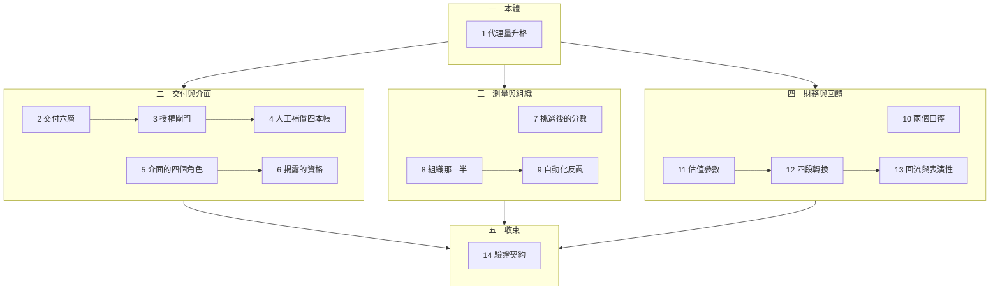

# 導讀：從代理量到可追責結果

一份簡報上寫著「模型正確率提高 6 個百分點」。接下來的那句話幾乎決定了後面幾季的走向——而那句話通常是「所以流程效益提高」。

這個系列的全部內容，是說明那句話為什麼不是結論，以及要補上什麼才算是。

## 閱讀順序一覽

1. 一段的證據，整條鏈的結論：代理量升格的形式錯誤
2. 買到的是哪幾層：模型輸出與可追責結果之間的交付邊界
3. 文字在哪一點變成後果：授權閘門的兩個參數
4. 覆核何時只是責任裝飾：人工補償的四本帳
5. 語氣不是權限：一個名字吞掉的四個角色
6. 告知之後還缺什麼：揭露的資格條件與救濟鏈
7. 挑選之後的最佳值：公開分數與部署表現之間的三段落差
8. 組織那一半的因果：同一個工具為何產生相反的結果
9. 留下來的案例更難：自動化反諷與人工後盾的兩段衰退
10. 兩個口徑不同步：用量成長為何吃掉貢獻利益
11. 敘事寫進哪一個參數：成長、機率、成本與折現率的重分配
12. 四段轉換：反身迴圈在哪一段沒有閉合
13. 系統參與造成的世界：回流資料與表演性預測
14. 一個效用宣稱要附什麼：驗證契約的九個欄位

## 這個系列在回答什麼

十四篇共用一個結構。每一次效用宣稱都會走到同一個位置：手上有鏈上某一段的讀數，需要說出整條鏈的結果。而那一段與最終結果之間隔著若干次轉換——授權、整合、覆核、救濟、採用、成本吸收——每一次轉換都可能失效，而它們大多沒有被量測。

繞不過這件事。能做的只有一個動作：逐段檢視轉換點，並把沒有固定的那些寫進宣稱裡。

系列的每一篇都是這個動作在某個具體處境中的樣貌，加上該處境特有的陷阱。

## 四段結構

**第一段只有一篇，它建立本體。** 第 1 篇證明代理量升格是一個形式錯誤，不是估計失誤：代理量固定不動時，端到端的可能值可以跨過零點兩側。它同時立下全系列共用的四個詞——代理量、轉換點、未固定座標、端到端效用。

這一篇是後面所有篇章的前提，建議先讀。

**第二段（2–6）處理交付與介面。** 這一段的共同問題是：輸出與後果之間有哪些節點，以及它們各自的責任歸屬。

第 2 篇攤開六層交付鏈，並證明鏈在形式上不區分層的身分——把同一個缺陷放在模型層或救濟層，端到端完全相同。第 3 篇從中拆出授權閘門，指出它有兩個旋鈕而第二個常常沒有負責者。第 4 篇處理人工節點：它在四個必要條件下才真的吸收風險，而它的成本會同時從四本帳上消失。

第 5、6 篇轉向介面。第 5 篇處理一個名字如何吞掉生成、授權、執行、救濟四個角色；第 6 篇處理「已告知是 AI」與「使用者能修正自己的處境」之間的距離。

**第三段（7–9）處理測量與組織。** 第 7 篇量化挑選增益：真實高出 10 個百分點的模型，對上查看 50 次的對手會輸掉半數以上的比較。第 8、9 篇處理組織：同一個工具在不同流程適配下產生相反符號的結果，而自動化擴張會沿兩條獨立路徑削弱人工後盾。

**第四段（10–13）處理財務與回饋。** 第 10 篇處理價格口徑與成本口徑的分離；第 11 篇處理敘事寫進哪一個估值參數；第 12 篇處理反身迴圈的臨界條件；第 13 篇處理系統自己造成的資料分佈。

**第五段只有一篇，它收束全系列。** 第 14 篇問前面所有篇章的驗證設計憑什麼算是驗證，並給出一份契約的九個欄位與各自防的失效。

## 幾條可以先記住的線

**每一篇都可以獨立讀。** 需要的前提都在篇內就地建立，不依賴讀過其他篇。

**所有程式都是純標準庫，都實際執行過，輸出是觀察值不是預期值。** 全系列共 33 個程式區塊。讀的時候值得對照程式與輸出，因為幾個關鍵結論違反直覺——例如「內部一致的樂觀敘事會降低估值」、「過度自信的模型讓覆核成本看起來更低」、「提高自動化可靠度會使接管準備度下降」、「每次呼叫最便宜的設定，每成功任務最貴」。

**每一篇的反思段都在削弱該篇的主張。** 那裡放的是邊界條件、反例，以及一段關於該篇實驗能證明什麼、不能證明什麼的說明。跳過反思段會讓結論看起來比實際更強。

**數字都是模型算出來的，不是量測真實系統得到的。** 它們的用途是證明某個結構可能發生——反例只需要一個——不是估計任何真實部署的幅度。每一篇的反思段都明說了這一點。

## 如果只讀三篇

第 1 篇建立整個系列的問題樣貌：代理量不決定端到端的正負號。第 4 篇說明那些沒有被量測的轉換點如何在四本不同的帳上同時消失。第 14 篇給出在證據永遠不足的情況下仍然可守的目標：不是更多證據，而是一份把自己綁住的契約。

這三篇合起來是一個完整的立場：一段讀數不支持整條鏈的結論，缺口的成本落在不同部門的帳上因此看不見，而可守的不是說服力而是可反駁性。中間的十一篇則是這個立場在具體領域中的驗證。
