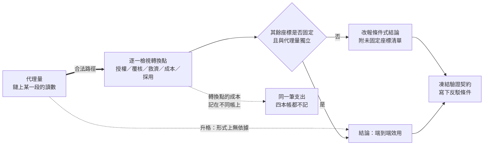

# 從代理量到可追責結果：AI 效用宣稱的轉換鏈

本系列處理一個問題域：當一項 AI 能力的價值主張以**某一段的觀察量**為證據時，那個觀察量與整條價值鏈的結果之間隔了幾次轉換，而每一次轉換各自能失效成什麼樣子。

**範圍聲明（系列邊界）**：本系列只處理**升格**問題——一個讀數已經取得，要決定它能支持多大的結論。每一篇的起點都是一個看起來充分的證據：一次成功的輸出、一句流暢的回答、一個考試分數、一筆資本支出、一份固定月費、一條上升的登入率曲線。問題永遠是「這個證據支持到哪裡」，而不是「這個系統為什麼壞了」。

這個限制是刻意的。從一個負面訊號往回找成因，是識別問題——多個機制映射到同一個觀察值。從一個正面讀數往前推結論，是**外推問題**——讀數本身可能完全誠實，而它與最終結果之間有若干個沒有被量測的轉換點。本系列只做後者。

系列因此不討論如何把模型做得更好，也不討論失效的歸因程序。它討論一件更前置的事：**在什麼條件下，鏈上某一段的讀數才有資格升格為關於整條鏈的主張。**

**series**: `從代理量到可追責結果：AI 效用宣稱的轉換鏈`

## 系列因果弧

所有升格錯誤都卡在同一個位置：從「某一段的讀數」跨到「整條鏈的結果」的那一步。下圖是全系列共用的骨架。

圖有三條路徑。虛線往右是實務中最常走的捷徑，它在形式上就沒有依據。粗線是唯一合法的路徑：不從讀數外推，而是逐段檢視轉換點。左下那條虛線是本系列反覆出現的結構性問題——轉換點的成本落在不同部門的帳上，因此可以同時從每一本帳消失而不產生矛盾。

而最右邊那個節點是整個系列的收束：任何一種結論，若沒有事前寫下什麼觀察會推翻它，都還不在可討論的類型裡。

四段結構因此是：先建立升格這個形式錯誤（第 1 篇），再逐一展開它在交付、介面、測量、組織、財務五個領域的樣貌（第 2 至 13 篇），最後處理宣稱自身的資格條件（第 14 篇）。

## 報告角色與閱讀順序

順序由因果與依賴決定。

| 順序 | 報告 | 核心問題 | 不可替代角色 | 邊界 | tags |
| :--- | :--- | :--- | :--- | :--- | :--- |
| 1 | [一段的證據，整條鏈的結論：代理量升格的形式錯誤](proxy-metric-escalation/report.zh-TW.md) | 從一段觀察量跨到整條鏈的結論，何時合法？ | 立本體：升格是形式錯誤而非估計失誤；並給出四詞最小詞彙 | 不涉及任何單一領域的具體參數 | 端到端效用、中介變數、AI 經濟與社會 |
| 2 | [買到的是哪幾層：模型輸出與可追責結果之間的交付邊界](delivery-boundary-layers/report.zh-TW.md) | 企業實際買到的交付邊界在哪裡？ | 建立六層交付鏈與盤點式；證明鏈對層的身分對稱 | 不處理模型能力本身 | 社會技術系統、端到端效用、貢獻利益 |
| 3 | [文字在哪一點變成後果：授權閘門的兩個參數](authorization-gate/report.zh-TW.md) | 輸出如何被授權成為外部行動？ | 唯一處理放行寬度與停止時間這兩個旋鈕的一篇 | 不處理覆核者的有效性 | 社會技術系統、校準、中介變數 |
| 4 | [覆核何時只是責任裝飾：人工補償的四本帳](human-compensation-ledgers/report.zh-TW.md) | 人工節點在什麼條件下真的吸收風險？ | 把人工補償從四個不同科目集中為一個變數 | 不處理組織生產力的異質效果 | 人工補償、貢獻利益、社會技術系統 |
| 5 | [語氣不是權限：一個名字吞掉的四個角色](four-roles-behind-the-voice/report.zh-TW.md) | 語言介面為何產生行動者外觀？ | 生成／授權／執行／救濟的可稽核形式 | 不處理揭露義務的規範設計 | 擬人化、中介變數、AI 經濟與社會 |
| 6 | [告知之後還缺什麼：揭露的資格條件與救濟鏈](disclosure-qualification/report.zh-TW.md) | 一次揭露要附帶什麼才具備治理效力？ | 分開辨識與校正兩種功能；依據的忠實度為獨立軸 | 不處理擬人化本身的心理機制 | 擬人化、測量契約、AI 經濟與社會 |
| 7 | [挑選之後的最佳值：公開分數與部署表現之間的三段落差](best-of-k-scores/report.zh-TW.md) | 有限測量何時足以支撐更大的宣稱？ | 量化挑選增益並證明它可翻轉排名 | 不推薦評測指標清單 | 適應性過擬合、不確定性、校準、幻覺 |
| 8 | [組織那一半的因果：同一個工具為何產生相反的結果](organizational-half/report.zh-TW.md) | 模型品質固定時，什麼決定產出？ | 互補與異質效果；證明平均值可與兩組符號皆不一致 | 不處理人工節點的責任面 | 技術與組織互補、人機協作、資料回流 |
| 9 | [留下來的案例更難：自動化反諷與人工後盾的兩段衰退](skill-decay-under-automation/report.zh-TW.md) | 自動化接手後，人為何更難接管？ | 分離「與人無關」與「與人有關」兩段衰退 | 不處理覆核的治理設計 | 自動化反諷、人工補償、人機協作 |
| 10 | [兩個口徑不同步：用量成長為何吃掉貢獻利益](two-ledgers-out-of-sync/report.zh-TW.md) | 採用擴大何時收縮貢獻利益？ | 唯一處理價格口徑與成本口徑分離的一篇 | 不取代 GAAP 毛利定義 | 貢獻利益、反彈效應、自回歸、人工補償 |
| 11 | [敘事寫進哪一個參數：成長、機率、成本與折現率的重分配](narrative-into-valuation-parameters/report.zh-TW.md) | 敘事如何變成估值參數？ | 證明內部一致的樂觀敘事可以降低估值 | 不預測任何公司的價格 | 折現現金流、不確定性、AI 經濟與社會 |
| 12 | [四段轉換：反身迴圈在哪一段沒有閉合](four-conversions/report.zh-TW.md) | 反身性何時閉合成可驗證效用？ | 給出雙穩性與臨界信念的封閉形式 | 不預測產業規模或時程 | 反身性、端到端效用、折現現金流 |
| 13 | [系統參與造成的世界：回流資料與表演性預測](feedback-and-performativity/report.zh-TW.md) | 輸出改變後續資料時，重訓在追蹤什麼？ | 唯一處理自我確認觀察與標籤內生性的一篇 | 不處理不影響後續資料的預測 | 表演性預測、資料回流、中介變數 |
| 14 | [一個效用宣稱要附什麼：驗證契約的九個欄位](refutability-contract/report.zh-TW.md) | 可反駁性的最低形式是什麼？ | 把全系列各篇的驗證段提升為正面論證 | 不處理參考點本身的資格 | 測量契約、不確定性、校準 |

## 展開方向盤點表

| 展開類型 | 狀態 | 歸屬報告 / 去向 |
| :--- | :--- | :--- |
| 共用前提（就地自含） | `本次就地承載` | `盤點式 ≠ 會計恆等式` 於順序 2 就地建立——含成本項的算式其功能是強迫每個欄位被填，不是算出正確答案；順序 10、11、12 各自在其脈絡中重述同一區分，措辭一致，不互相引用。`授權函數不在模型裡`（$a(y,u,p)\in\{0,1\}$ 由組織設定）於順序 3、5 各自就地重述 |
| 概念地圖 / 詞彙表 | `本次補寫` | 順序 1 建立四詞最小詞彙（代理量／轉換點／未固定座標／端到端效用），後續各篇皆以此承載而不新造同義詞 |
| 反例與不適用邊界 | `本次補寫` | 順序 6、14 為專責的邊界報告：前者處理揭露的資格條件，後者處理宣稱自身的可反駁性。此外每篇的反思段皆含至少一個反例與一段實驗限制說明 |
| 結構化資產（Mermaid / example code） | `本次補寫` | 全部 14 篇皆附可實際執行的純標準庫程式與實測輸出，共 33 個程式區塊；順序 1、2、3、4、5、6、9、10、12、13、14 另附 Mermaid 承載因果鏈、決策程序或責任邊界 |

## 本次形成的報告

14 篇，涵蓋四段：本體（順序 1）、交付與介面（順序 2–6）、測量與組織（順序 7–9）、財務與回饋（順序 10–13）、方法論收束（順序 14）。

其中順序 1、3、4、6、9、13、14 為順勢新增或拆深的報告：

- **順序 1** 補上升格這個形式錯誤本身。後面十三篇的失效都是它的特例，缺少這個本體會讓它們各自重複鋪陳同一個前提。
- **順序 3** 從交付鏈中拆出授權閘門。放行寬度與停止時間是兩個獨立於模型品質的旋鈕，而它們決定同一個錯誤的後果量級。
- **順序 4** 把人工補償集中成一篇。它原先散在交付、單位經濟、組織生產力與反身迴圈四處各記一次，因此可以同時從四本帳消失而不產生矛盾。
- **順序 6** 從介面問題中拆出揭露的資格條件。揭露處理辨識、校正需要另外三樣東西，兩者混談會讓法規遵循被當成治理完成。
- **順序 9** 從組織問題中拆出自動化反諷。留下來的案例更難與練習量下降是兩段獨立的衰退，且第一段與人的態度完全無關。
- **順序 13** 把表演性預測與資料回流合為一篇。兩者是同一個機制在系統外部與系統內部的兩種形式，合讀才看得出「重訓在追蹤系統自己造成的世界」。
- **順序 14** 補上宣稱自身的資格條件。全系列每篇都以一段驗證設計收尾，而那個設計自身的必要條件需要獨立論證，否則各篇的收尾只是形式。

## 後續展開方向

1. **代理系統的放行範圍不可列舉**：順序 3 指出授權閘門的第二個旋鈕需要「可列舉的動作集合」。當模型被賦予工具使用能力時，可執行動作是組合出來的，此時放行範圍必須改以能力邊界描述，而能力邊界的完備性無法從內部證明。這是一個獨立的問題域，移入後續 backlog。
2. **覆核者資訊來源的獨立性**：順序 4 給出人工節點的四個必要條件，並指出第五個條件——覆核者的判準必須與模型可取用的資訊不同——通常最貴。誰有資格建立這條獨立資訊管道、成本如何分攤，值得獨立處理。
3. **多指標評估與名次的張力**：順序 7 指出增加指標能暴露取捨，代價是結果無法排序，而市場需要名次。如何在不可排序的評估結果上做採購決策，本次未處理。
4. **不可得欄位的宣稱強度分級**：順序 14 提出把不可得的契約欄位明文標記而非留空，但未給出「標記為不可得」後宣稱強度該如何降級的具體規則。觀察性資料上的宣稱分級是一個獨立主題。
5. **共用資產的資本報酬歸屬**：順序 11、12 皆指出同一座資料中心服務多類業務時，AI 的資本報酬率不是可計算的量。在既有分部報告制度下能做到什麼程度的間接觀察，值得獨立處理。
6. **詞庫的跨域撞名**：`主體`（Subject）在詞庫中承載 Linux 權限域的定義，而其中文主鍵恰好是責任歸屬語境的常用字串。順序 5 需要「責任主體」這個意義時以書寫規避處理——寫全稱、不使用單獨的該詞。作用域機制屬術語治理範圍，移入後續處理。
