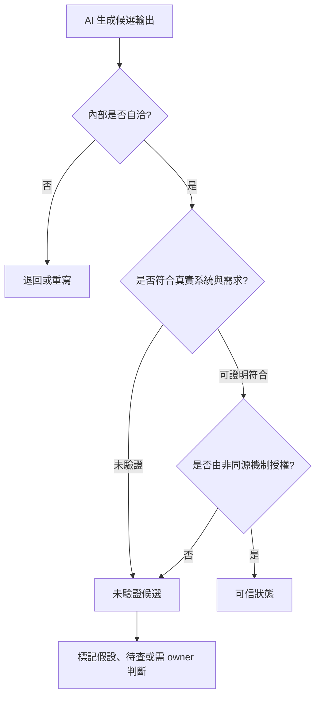
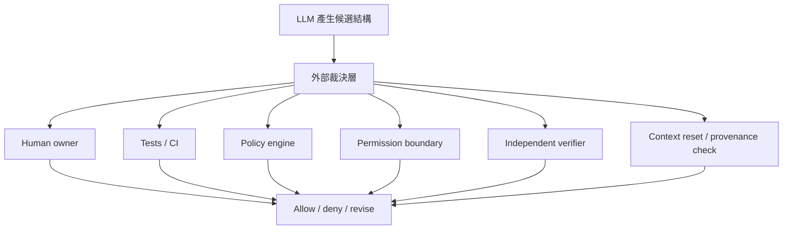

# 信任邊界與驗證瓶頸：自洽輸出如何被外部裁決授權

**Structure**: Analytical Essay
**Date**: 2026-06-14T17:20
**Model**: GPT-5.5
**Agent**: Codex VS Code extension 26.609.30741
**Source**: reconstruction

---

## 導言

AI 協作最容易被低估的風險，不是模型偶爾產生荒謬答案。荒謬答案通常很好處理：語法錯了、測試爆了、說法明顯不合常識，防線會自然啟動。真正麻煩的是另一種輸出：格式正確、語氣專業、內部自洽、通過局部檢查，但它的語意沒有被驗證，風險沒有被授權，責任也沒有落到任何可以承擔後果的邊界上。

因此，AI 協作的信任問題不能只問「這段輸出看起來對不對」。它至少要拆成三個不同判斷：

```text
自洽：輸出內部是否說得通。
正確：輸出是否符合系統真實狀態與目標。
可信：正確性是否經過可檢查證據與外部授權支撐。
```

自洽不等於正確，正確也不自動等於可信。可信不是文字本身的屬性，而是輸出穿過驗證流程、權責邊界與非同源裁決後取得的狀態。

本文的核心主張是：AI 協作的主要瓶頸已經從「能否生成」轉移到「能否驗證與授權」。當生成速度、模型漂移、知識幻覺與局部審查工具一起提高產出密度時，真正稀缺的是人的判斷力、確定性檢查與能打斷流暢敘事的外部裁決。

## 信任判斷的最小模型

可以先用一個最小流程描述可信狀態如何成立：



這張圖的重點是：候選輸出就算自洽，也只能停在候選狀態。它要成為可信產物，必須同時通過兩件事。第一，它要對應真實世界：程式碼是否符合實際 runtime、規格是否符合需求、知識報告是否符合一手資料或可重現實驗。第二，它要被授權：誰能接受風險，哪個測試或 policy 能拒絕錯誤，哪個 owner 需要為後果負責。

這也界定了「確定性邊界 vs 統計執行層」的分工。LLM 屬於統計執行層，擅長生成候選、展開可能性、找局部缺口與重組材料。確定性邊界則由測試、型別系統、schema、CI、policy engine、權限邊界與人工 owner 構成。前者能提高候選密度，後者負責把候選分成可接受、需修改與不可接受。

若把這兩層混在一起，AI 就會開始自己生成、自己解釋、自己審查、自己批准。這不是自動化成熟，而是閉環自洽：同一個敘事系統把風險寫成可接受，把不確定性寫成已處理，最後把授權變成一句看似專業的「looks good」。

## 地基會動：模型漂移讓驗證基準失穩

信任問題的第一個緣起，是底層模型行為會變。傳統工具鏈升級通常有明確版本、changelog、breaking change 與 regression suite。LLM 作為開發工具的核心引擎時，情況不同：同一份 prompt、同一組 skill、同一份團隊指引，在不同模型版本下可能產生微妙但全面的行為差異。

一個規格驅動開發團隊曾把一組規格生成、差量同步與驗證 skill 調校到穩定狀態。底層模型更替後，沒有單一功能立刻壞掉，卻出現一連串分散漂移：生成的規格多了先前沒有的章節標題，差量同步變得更保守而保留更多舊內容，驗證警告變多，使團隊逐漸習慣忽略警告。每個變化單獨看都在容忍範圍內；累積起來，規格品質基準已經下移。

這種漂移很難靠一般防線攔住。Lint 和 schema 能檢查格式，卻無法判斷「最近的規格讀起來不太一樣」。版本歷史能記錄檔案變化，卻不會標出「從這裡開始是品質滑坡」。回饋迴路能觀測治理摩擦成本，但訊號很慢，而且需要有人先覺得不對。

版本鎖定也不是根治。鎖定可以爭取緩衝時間，卻把漸進漂移變成未來某一刻的被迫遷移；鎖定期間累積的 skill 與 prompt 調校仍然依賴舊模型行為，一旦解鎖，過去的穩定性可能失效。模型漂移暴露的不是單一模型版本問題，而是信任基準本身會動。

所以，可信工作流不能預設「工具地基穩定」。它需要把模型版本、生成行為、驗證警告率、輸出風格與人類直覺異常都視為觀測對象。當地基會動，治理機制不只要驗證產物，也要驗證自己的有效性是否仍然成立。

## 技能幻覺：驗證者也可能沒有基準

模型漂移之所以危險，還有一個更深的前提：偵測漂移需要人知道什麼是「正常」。但 AI 工具也可能製造另一種錯覺：人或組織從未真正具備某項能力，卻因為工具能產出那項能力的外觀，而誤以為能力已存在。

這就是技能幻覺。它通常需要三個條件同時成立。第一，工具輸出看起來像能力產物：一份 AI 生成的規格文件格式完整、欄位齊全、語氣專業，和資深工程師手寫的規格在流程系統中難以區分。第二，驗證門檻低於產出門檻：review 檢查檔案是否存在、格式是否正確、欄位是否齊全，卻沒有檢查撰寫者是否理解系統行為。第三，回饋延遲夠長：錯誤不在下一步立即爆炸，而是在整合測試、生產事故或下一季需求變更時才浮現。

這種幻覺在私有知識場景特別危險。客服或品保團隊若用 agent 分析內部事件紀錄，agent 可以產出根因分類、影響範圍與修復建議。報告像工程分析，但模型並不知道私有產品架構、錯誤碼語意或生產環境約束。它只是用通用模式推測。若使用者也缺乏產品理解，就無法分辨「基於理解的正確分析」和「碰巧符合通用模式的推測」。

技能幻覺會自我強化：

```text
AI 產出專業外觀
  -> 流程驗證格式通過
  -> 組織記錄為個人能力
  -> 更多任務被分配
  -> 更多 AI 輸出被歸功於人
  -> 錯覺固化為組織信念
```

這直接打到信任邊界。很多治理機制預設最後會有人類 owner 判斷。但若 owner 的判斷基準本身是由 AI 外觀餵養出來的，他可能不知道自己不知道。AI 只能賦能使用者已經理解的能力；對尚未建立的能力，它給出的不是能力，而是能力的外觀。

## 速度陷阱：生成端擴張，驗證端沒有擴張

AI 的可見價值是速度。一份規格初稿、一次 code review、一組測試建議，過去要數小時，現在可能幾分鐘內完成。但這個效率敘事暗含一個錯誤假設：產出端變快後，驗證端也會同步變快。

驗證容量沒有同步擴張。人類 reviewer 一天能深度理解的規格數量、架構師能有效判斷的設計取捨、QA 能仔細驗收的功能範圍，都有認知上限。AI 加速的是候選產物生成，不是人的理解頻寬。

規格驅動開發讓這個不對稱更明顯。一個功能不只產生 code，還可能產生規格、測試、文件、規格與程式碼一致性檢查，以及多輪修訂。AI 可以一次生成所有層，但每一層都需要驗證：

```text
spec -> code -> test -> code doc -> consistency check
```

確定性防線能分擔一部分。Lint 和 schema 可以攔格式、參照和欄位錯誤；活躍開源專案與社群 review 可以降低已知錯誤模式；編譯器與型別系統可以拒絕一整類非法狀態。這些防線都重要，但它們覆蓋的是可以被規則表達的正確性。

剩下的仍然是人要判斷：需求是否正確，規格是否描述了真實意圖，設計是否長期可維護，風險是否值得承擔。當生成速度超過這些判斷容量，未驗證產物會以格式合規、CI 通過、語氣專業的外觀累積成未驗證語意債務。

這種債務和傳統技術債不同。傳統技術債常有 TODO、workaround 或已知重構項目；未驗證語意債務沒有標記，外觀看起來和已驗證成果相同。它也難以償還，因為事後 review 會失去原始 context，後續變更會覆蓋初始 diff，當初的意圖已經模糊。

速度陷阱不是因為 AI 太差，而是因為 AI 大部分時候夠好。若輸出很爛，防線會立刻啟動；若輸出 95% 正確，少量錯誤就會混入通過流程的產物裡。

## 靜默語意偏差：95% 正確的危險地帶

靜默語意偏差是速度陷阱中的典型債務。它指的是程式在語法上合法、在多數輸入下正確、在 review 時外觀無異常，卻在特定條件下偏離意圖。

最表層的例子是語言隱式行為：

```javascript
const count = input || 10;
```

這行在多數場景下正確，但當 `input` 是合法的 `0` 時會被覆蓋。正確寫法可能是：

```javascript
const count = input ?? 10;
```

AI 容易生成前者，因為訓練資料中更常見；reviewer 也容易放過前者，因為它是慣用寫法。類似問題出現在 truthy / falsy、`==`、optional chaining、隱式回傳、magic number 與過度壓縮的條件式裡。語法合法，語意卻依賴未明說的前提。

再深一層是版本與依賴契約漂移。同一段語法在不同 runtime 可能不存在或行為不同；看似相容的函式庫替換，可能在邊界輸入、錯誤處理或 strict mode 上有不同契約。從 moment.js 換到 dayjs，日期解析的寬鬆度就可能成為差異來源。工具能攔住「函式不存在」，很難攔住「相同 API 名稱在邊界語意上不同」。

更深的是設計模式的隱含契約。Observer pattern 的結構可能完全正確：`save()` 後 emit 事件，listener 收到事件處理後續工作。但「saved」是 ORM flush 完成，還是 DB commit 完成？若 listener 立刻查詢同一筆資料，結果會依 transaction 隔離層級而變。這不是模式選錯，而是模式內部的時機契約沒有被明確表達。

最深層則是領域模型漂移。折扣計算、權限判斷、地址驗證在寫下當下完全正確，但業務規則後來變了。AI 參考既有 codebase 生成新程式碼，會忠實延續舊假設；reviewer 看到一致性，反而更放心。領域變動不會自動在程式碼裡發光，於是「與既有做法一致」從可信訊號變成陷阱。

三層共同指向一件事：AI 協作沒有讓審查變不重要，而是改變了審查的問題。過去審查問「這段 code 有沒有 bug」；現在還要問「這段 code 的隱含假設是否仍符合當前 context」。這個答案往往不在 diff 裡。

## 拓撲補償：多 agent review 的有效邊界

既然人的驗證容量有限，一個自然想法是：能不能用 agent 審 agent？答案是可以，但只能補一部分。

多 agent、多模型、多 session 的交叉 review 有真實價值，因為不同模型或不同 context 的注意力盲區不完全重疊。一個 agent 生成規格時漏掉併發條件，另一個 agent 可能從 review 角度提出 race condition；一個 session 沒注意到 null 邊界，另一個 session 可能提醒。

這種拓撲補償補的是注意力盲區，不是知識盲區。若問題涉及私有產品架構、團隊特殊約定、未公開業務規則，所有模型都同樣不知道。它們可能用不同方式猜，但猜測不會因為彼此獨立就變成知識。

拓撲補償還會增加速度陷阱。若一個 agent 生成、一組 agent review，人要看的不只原產物，還包括多份 review 意見、彼此矛盾的建議、修改後是否引入新問題。拓撲把「找問題」轉成「仲裁問題」。若仲裁者是人，人的判斷仍是瓶頸；若仲裁者也是 agent，就進入更深的閉環自洽。

因此，多 agent review 的健康使用條件很清楚：

| 條件 | 原因 |
| :--- | :--- |
| 問題屬於公開或通用知識範圍 | 注意力差異能補遺漏，而不是共同猜私有事實。 |
| review 維度可預先指定 | 各 agent 檢查不同面向，避免自由發揮製造噪音。 |
| 人有能力仲裁矛盾 | 否則只是把驗證負擔改寫成仲裁負擔。 |
| 產出量在消化容量內 | 更多 review 不等於更可信；過量意見本身會成為債務。 |

拓撲補償是緩衝，不是解法。它能擴大觀察面，不能授權信任狀態。

## 知識蒸餾：回收理解，也可能固化錯誤

AI 不只生成程式，也生成知識資產：摘要、報告、表格、Mermaid 圖、runbook、決策紀錄。這些產物很有價值，因為一次探索往往買到的不只是答案，還有分類、排除路徑、反例、未解問題、判斷順序與語彙校準。若不回收，下次遇到相似問題就要重跑一次探索。

但知識回收的 ROI 不是自動為正：

```text
知識回收 ROI =
  未來重用價值
  - 蒸餾成本
  - 校驗成本
  - 錯誤固化風險
```

長對話、長 debug 或長會議只代表成本已經花掉，不代表內容值得保存。蒸餾真正要回收的是可重用理解結構，不是把所有 context 包裝成漂亮報告。

這裡的信任問題在於：結構化文字會製造權威感。段落順了、表格齊了、圖有箭頭了，不確定性很容易從版面上消失。原本對話中的「可能」「待查」「版本差異」「要實測」進入報告後，可能被寫成平滑結論。讀者感到理解順暢，便誤以為可信度也提高。

健康的蒸餾需要兩層防禦。第一層是主題可信度預估：公開、成熟、可驗證、一手資料密度高的主題，可以先把蒸餾結果當學習地圖；封閉、快速變動、私有或高風險主題，只能把蒸餾結果當假設整理。第二層是內容懷疑：基礎定義、心智模型、API 細節、安全結論、操作建議、新推論，各自需要不同程度的查證、實驗或 owner 判斷。

所以，蒸餾可以產生候選知識資產，但不能自動授權它為真。漂亮結構提高的是可讀性，不是可信度。

## Code review：局部一致性可以檢查，全局合理性必須授權

AI code review 是信任邊界最具體的場景。AI 很適合掃描語法、型別、API 引用、常見局部 bug、測試缺口與 obvious edge cases。它能提高檢查密度，讓人類 reviewer 不必把注意力花在所有低層細節上。

但 code review 不只是找 bug。它還在判斷一個 change 是否符合需求、產品承諾、架構方向、權限模型與風險接受。這些問題通常不在 diff 本身：

```text
這個需求是否應該存在？
這個抽象是否會污染長期架構？
這個權限變更是否符合安全模型？
這個 cache 是否跨 tenant？
這個 workaround 是修根因還是掩蓋症狀？
```

AI 可以檢查局部一致性，不能自我授權全局合理性。最危險的 review 不是胡說，而是把局部自洽的錯誤改動包裝成合理工程敘事：severity 有了、檔案行號有了、建議有了、測試清單有了，但沒有人承擔 merge 後的後果。

正確分工應該是：

```text
AI:
  檢查引用、型別、局部 bug、測試缺口
  產生疑點清單
  標出需要 owner 判斷的風險

Human / Owner:
  判斷需求是否合理
  判斷架構方向是否可接受
  決定風險是否值得承擔
  授權 merge 或拒絕
```

若流程變成 AI 寫 code、AI review、AI approve、AI merge，code review 就從風險控制退化成流暢敘事。局部檢查有價值，但 merge 授權必須留在責任邊界上。

## 外部裁決：可信狀態必須由非同源機制授權

外部裁決不是永遠由人手動點頭。它可以是人、測試、CI、policy engine、permission boundary、type checker、runtime guard、獨立 verifier，甚至是乾淨 context 下的獨立重驗。重點不在形式，而在它必須提供不同於生成敘事的約束來源，並且有能力拒絕。



不同工作流需要不同裁決者。知識蒸餾需要主題可信度、人類校驗與一手資料。長跑 agent 需要 context isolation、tool allowlist 與高風險確認。Code review 需要 owner 對需求、架構與風險授權。部署需要 CI、policy、權限邊界與 rollback plan。安全判斷需要威脅模型 owner、實測與獨立審查。

外部裁決的核心不是「反 AI」，而是把 AI 放在正確位置：AI 產生候選、展開風險、提高檢查密度；非同源機制決定信任狀態。可信工作流不應追求全程順滑。它要在高風險位置故意留下摩擦：要求證據、要求測試、要求權限、要求 owner、要求重驗。

## 邊界條件與誤用

第一個誤用是把「自洽」當成「可信」。一份報告或 review 可以非常流暢，卻只是把未驗證推論排列得更好。流暢性是閱讀品質，不是驗證結果。

第二個誤用是把「確定性工具通過」當成「語意正確」。型別、lint、schema、CI 可以攔住能被形式化的錯誤，但業務邏輯、領域漂移、設計取捨與風險承擔仍需要 owner。

第三個誤用是把「多 agent 同意」當成「外部裁決」。多個模型可能共享訓練盲區，也可能共同不知道私有脈絡。共識若來自同源統計推測，不等於證據。

第四個誤用是把「人類在迴路中」當成安全保證。若人沒有理解能力、沒有權限、沒有時間或沒有責任承擔，他只是流程裡的一個按鈕，不是裁決者。

第五個誤用是把所有工作都升級成重裁決。低風險、可逆、可由測試完全覆蓋的工作，不需要同樣厚重的人審。外部裁決的設計要依風險分級，否則會把驗證容量耗在低價值摩擦上。

## 結論

AI 協作中的信任問題，不是單純要求模型更聰明，也不是把所有輸出交給人重審。真正的問題是：生成速度已經超過驗證容量，而輸出又足夠自洽，足以讓未驗證內容看起來像可信成果。

本系列的收束可以列成四個命題：

```text
自洽不是正確。
正確不是可信。
可信不是輸出屬性，而是被授權後的狀態。
授權必須來自能拒絕的非同源機制。
```

模型漂移讓信任基準移動，技能幻覺讓驗證者可能沒有基準，速度陷阱讓未驗證語意債務堆積，靜默語意偏差讓 95% 正確的產物穿過局部檢查，拓撲補償只能補注意力盲區，知識蒸餾會同時回收理解與固化錯誤，AI code review 能提高觀察面但不能授權 merge。

因此，可信 AI 工作流的核心不是讓 LLM 自己變成裁判，而是讓 LLM 生成候選結構，讓測試、policy、權限邊界、獨立 verifier 與有責任的 owner 授權信任狀態。自動化的價值在於提高候選密度；治理的價值在於決定哪些候選可以進入世界。
