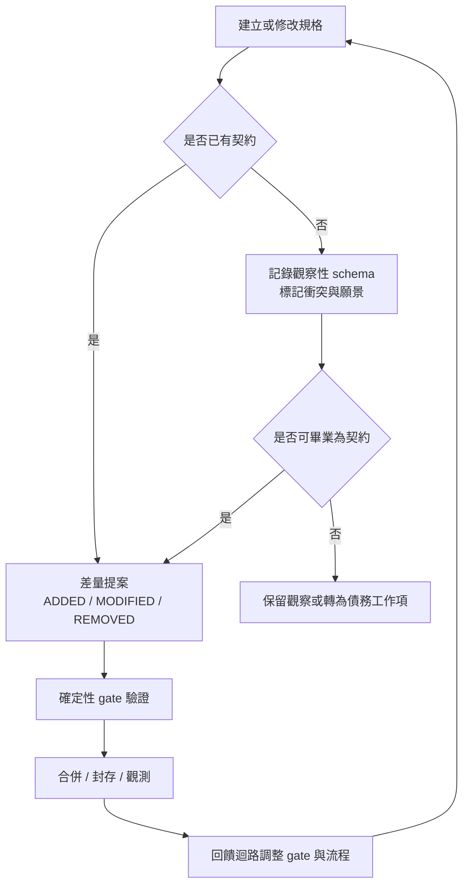

# 規格驅動開發與棕地治理：從觀察性 schema 到確定性契約

**Structure**: Analytical Essay
**Date**: 2026-06-14T16:24
**Model**: GPT-5.5
**Agent**: Codex VS Code extension 26.609.30741
**Source**: notes

## Introduction

規格驅動開發在棕地專案中最容易被誤解成兩種極端。第一種是瀑布式幻想：先把所有規格補完，再允許程式碼繼續演化。第二種是文件式幻覺：把現有行為、未來願景與零散命名全部寫進一份看似正式的 schema，然後宣稱規格已經成為單一事實來源。前者讓開發停擺，後者讓不可信的文字獲得權威外殼。

棕地專案的起點不同於綠地專案。程式碼已經存在，行為已經運作，歷史命名與資料格式早已在系統中留下痕跡。此時缺少規格不是例外，而是常態。真正的治理問題不是「如何立刻擁有完整規格」，而是「如何讓規格在不說謊的前提下逐步變成可信契約」。

本報告的核心主張是：棕地規格化必須先承認規格債，再用雙層結構區分觀察與意圖，接著把高確定性操作移入 script、schema validator、linter 或 CI gate，最後用回饋迴路觀測治理是否真的有效。規格不是一開始就可信；規格是在被正確標記、被確定性工具守護、被持續觀測後，才逐步獲得可信狀態。

這裡需要先就地定義一個共用前提：確定性邊界與統計執行層不同。需要 100% 可重現、全局一致或二元判斷的操作，屬於確定性邊界，應由 deterministic code 執行。LLM 屬於統計執行層，適合整理意圖、提出可行方案、解釋脈絡與協助判斷，但不適合作為最終完整性驗證或精確寫入層。模型可以降低錯誤率，不能把錯誤率歸零。

## Analysis

### 棕地起點：規格債不是瀑布的前置任務

規格債是指系統中已經實作、卻尚未被明確規格定義的行為。它不代表系統錯了，而是代表「正確」尚未被寫成可驗證的契約。技術債通常指程式碼品質或設計妥協；規格債則是驗證風險：當行為只存在於程式碼中，任何修改都只能依賴維護者或 agent 對現有實作的理解。

這個債務不能用「先補完所有規格」清償。棕地系統的行為太多、歷史太深，一次性補規格很容易退化成自然語言抄寫程式碼，或者把尚未確認的推測寫成設計意圖。可行路徑是增量形式化：每次功能開發或修復接觸到某段行為時，順手把新理解的現況與意圖放到正確位置。

規格稀疏期因此不是失敗狀態，而是過渡狀態。當某個領域已有規格，就用差量流程管理對該規格的新增、修改與移除。當某個領域沒有規格，就穿透到共置文件與程式碼，以程式碼作為暫時事實來源，同時在理解最深的時候留下觀察。判斷標準不是「全專案規格覆蓋率是否足夠」，而是「本次被修改的具體行為是否已有契約」。

### 觀察與意圖：雙層結構防止虛假權威

棕地規格化的主要危險是把觀察誤升格為契約。逆向工程得到的是「系統現在如何運作」；規格契約描述的是「系統應該如何運作」。兩者可以寫在同一份檔案中，但必須位於不同結構位置，使用不同語言，承擔不同權威。

最小概念地圖如下：

| 概念 | 問題 | 正確去向 |
| :--- | :--- | :--- |
| 觀察性 schema | 記錄現況、缺陷、衝突與未確認行為 | 可被程式碼推翻的描述層 |
| 約束性規格 | 定義已審查、應被保護的行為 | 必須被程式碼遵守的契約層 |
| 規格債 | 已實作但未定義的行為 | 在接觸時逐步形式化 |
| 觀察債務 | 大量現況被記錄，但尚未判斷是否為意圖 | 嵌入工作流的畢業判斷 |
| 願景 | 未來希望系統具備的能力 | 明確降級，避免被 agent 當作已存在 |
| 衝突 | 文件、程式碼、規格或歷史互相矛盾 | 轉為可追蹤工作項，不藏在 schema 中 |

觀察層可以寫「目前 API 回傳逗號分隔字串」。契約層若要保護行為，則需要寫成可驗證場景，例如 Given / When / Then，並明確使用 MUST、SHOULD 或 MAY。未來願景不能偽裝成當前契約；它可以被保留，但要被標記為 planned，且明確告訴 agent 不得假設它已實作。

```yaml
# 觀察性 schema：收容現況與願景，不宣稱已成契約
UserExport:
  observed_format: "comma-separated string"
  x-status: "observed"
  x-conflict: "legacy document claims array payload"
  planned_payload:
    x-status: "planned-vision"
    note: "Do not assume this exists at runtime."
```

```yaml
# 約束性規格：已確認並應被 gate 保護
UserExport:
  required:
    - user_id
  properties:
    user_id:
      type: string
      pattern: "^[a-z0-9_]+$"
  x-contract: "runtime and CI MUST reject payloads without user_id"
```

這個差異看似格式細節，實際上是權威邊界。觀察性 schema 的目的不是命令系統，而是讓混亂可見。約束性規格的目的不是描述混亂，而是定義系統必須遵守的行為。把兩者混在同一層，會製造虛假權威：形式上是規格，實質上只是未確認觀察。

### 外部框架：採納思維模型，不盲目採納工具鏈

OpenSpec 或類似 SDD 框架的價值，主要在三個思維模型：規格作為行為真相來源、差量變更作為一等公民、結構位置承載語意。`specs/`、`changes/`、`archive/` 這類結構讓文件狀態可見：基線契約、變更提案與歷史封存不再靠人工標籤猜測。

但外部框架不應被整包神聖化。棕地專案通常已經有既有治理、技能、lint、CI 與文件路由。若框架的 CLI 與既有工具鏈並行操作同一批規格，卻不共享狀態，就會製造兩條互不知情的寫入路徑。此時較好的選擇可能是概念級採納：保留目錄語意、差量流程與契約格式，但由既有工具鏈負責操作。

鷹架辨識也很重要。某些治理機制只為過渡期存在，例如用來保護舊知識庫遷移的層級規則。當被治理對象消失、依賴圖指向已完成任務、移除後系統功能不退化，該機制就是鷹架而非基礎設施。棕地治理若不能退役過期鷹架，就會把舊防線變成新摩擦。

### 物理邊界：沒有 gate 的規格只是高成本文件

一份規格要成為契約，必須能被某種確定性機制守護。命名規則若只存在於文件中，agent 仍可能生成 `userName`、`user_name`、`buyer_id` 等同義變體。schema 若不接入型別檢查、runtime validation、pre-commit hook 或 CI gate，就只是結構化註解。

這裡的原則很簡單：越需要零錯誤的操作，越不能交給 LLM 作為最後執行層。檢查 spec ID 是否存在、schema 欄位是否合規、跨文件引用是否 orphan、程式碼型別是否符合契約，都是全局一致或二元判斷。它們應由 deterministic script 執行。

```python
def validate_contract(schema, code_index):
    missing = []
    for ref in schema.references:
        if ref.id not in code_index.ids and ref.id not in schema.ids:
            missing.append(ref.id)

    if missing:
        raise SystemExit(f"orphan references: {missing}")
```

LLM 可以協助解釋為什麼某段行為應該成為契約，可以草擬差量提案，也可以整理衝突脈絡。但最後的完整性檢查要由 script 做。這不是不信任 agent 的能力，而是不把統計推論放在需要確定性保證的位置。

### 耦合、封存與閉環：規格治理進入運營期

當規格與程式碼開始互相約束，治理問題會從「如何建立規格」轉向「如何運營規格」。code-spec 耦合後，回滾不再只是沿著 Git 時間線往回走。程式碼可以 revert，但規格之間的引用、下游工作與歷史語意不一定能同步反轉。對一個人的恢復操作，可能是另一個人的引用斷裂。

archive 的智慧在於承認一致性是暫態，而歷史需要可溯源。它把舊版本封存為演化軌跡，避免把所有漂移都當成孤立 bug。但 archive 不是 reconciliation。它不會自動更新跨 spec 引用，不會判斷現在應該採用哪個契約，也不會消除漂移偵測的需求。

因此，規格治理需要回饋迴路。Lint 只能回答「這次有沒有問題」；回饋迴路要回答「這個治理機制整體是否有效」。觀測至少分三層：

| 層次 | 可觀測問題 | 適合方式 |
| :--- | :--- | :--- |
| 規則遵守率 | gate 被繞過幾次、orphan 被攔截幾次、spec-code diff 有多少 | deterministic 統計與 dashboard |
| 規則有效性 | 被攔截的問題是否真有風險、漂移多久才被發現、恢復成本是否上升 | 半自動資料整理 + 人判斷 |
| 治理摩擦成本 | 團隊是否為合規產生空洞 artifact、流程是否拖慢交付 | 人主導，LLM 可輔助摘要 |



這個閉環讓 SDD 從 open-loop 治理變成可調整的運營系統。規則不是寫完就永遠正確；它們需要被觀測、被調整，也需要在摩擦高於收益時退役或降級。

## Reflection

棕地規格化最深的張力，是「誠實」與「收斂」之間的張力。若只追求誠實，團隊可能永遠停留在觀察性 schema，什麼都不敢升格為契約。若只追求收斂，團隊又會把未確認行為快速包裝成規格，重新製造虛假權威。

雙層結構的價值在於把這個張力顯性化。觀察層允許團隊承認「我只知道系統現在這樣做」，契約層要求團隊明確說出「我們同意系統應該這樣做」。畢業不是定期審計儀式，而是在實作接觸時發生：當某段行為要被修改、保護或對外依賴時，團隊才有足夠語境判斷它是否應升格。

確定性邊界則提醒我們，不要把治理意願誤認為治理能力。文件可以宣稱某命名不可違反，但只有編譯、lint、schema validation 或 runtime check 能真正阻止違反。Prompt 可以提醒 agent 不要帶入過時引用，但只有 reference integrity script 能穩定阻止 orphan reference 進入系統。

這也意味著 SDD 的成熟不是規格數量增加，而是權威鏈變短、邊界變清楚、漂移變可觀測。規格越多但 gate 越弱，只會增加文件漂移面積。規格較少但每條契約都有明確驗證與封存路徑，反而更接近可信治理。

## Conclusion

棕地專案導入規格驅動開發，不應從「補完所有規格」開始，而應從「誠實標記知識成熟度」開始。觀察、意圖、願景、衝突與債務必須住在不同位置；只有被審查、被驗證、被 gate 保護的內容，才應被視為約束性契約。

可遷移的原則有四個。第一，規格債是可管理風險，不是必須一次清零的缺陷。第二，觀察性 schema 是棕地過渡期的必要容器，但不能被誤讀為契約。第三，凡是需要全局一致、二元判斷或零錯誤的操作，都應落在確定性邊界內。第四，規格治理需要回饋迴路，否則規則會在模型、團隊與系統演化中逐漸偏離。

SDD 的終點不是更多文件，而是更可信的契約。契約之所以可信，不是因為它被命名為 spec，而是因為它誠實區分來源、能被確定性工具驗證、能在漂移時被封存與追溯，並且能透過觀測持續修正自身的治理成本。
