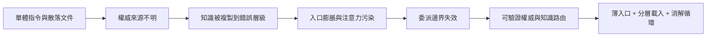

# AI 協作治理與知識架構：系列地圖

## 系列邊界

本系列處理的是 AI 協作中「治理知識應該住在哪裡、由誰授權、如何被正確載入」的問題。它不把治理理解成更多文件或更厚的指令，而是把治理拆成入口、權威、委派、路由、分層與退場機制：入口要薄，權威要可驗證，委派要有邊界，知識要能流向正確層級，過時內容要能消解。

核心問題鏈如下：



本系列的邊界是 AI 協作治理架構、知識分層、權威文件驗證、治理入口、AGENTS.md / 規則檔角色、預設委派與知識路由。它不處理一般 prompt 技巧，不展開規格驅動開發的契約細節，不處理術語生命週期，也不把 Linux / sandbox 權限模型納入；這些應在其他系列各自自含展開。

## 本次形成的報告

| 閱讀順序 | 報告 | 核心問題 | 不可替代角色 | 邊界 |
| :--- | :--- | :--- | :--- | :--- |
| 1 | AI 協作治理與知識架構：薄入口、可驗證權威與知識路由 | AI 協作中，治理文件如何避免變成權威漂移、入口膨脹與知識複製的來源？ | 建立一個統一模型：治理入口只做索引，權威來源必須可驗證，既有權威應被委派而非複製，知識按耐久性與消費者路由到正確層級，過渡知識需有退場機制。 | 不替特定工具定義完整設定檔，不處理 CI / lint / spec 的具體實作，不將報告變成可引用的專案規則。 |

## 概念槽位與角色

本系列最後形成一篇主報告，因為所有材料都服務同一個核心問題：AI 協作治理的失效通常不是缺少文件，而是文件、規則、記憶、對話、工具與外部權威之間沒有清楚的授權與路由。各槽位不是平行文章，而是同一套治理架構的不同支柱。

| 槽位 | 核心功能 | 決策 |
| :--- | :--- | :--- |
| 知識層級模型 | 區分倉庫層、個人記憶層、對話層，以及規則、流程、報告、程式碼之間的責任。 | 保留為主報告基礎模型，並補入主體 / 客體 / 能力 / 邊界的最小詞彙。 |
| 治理入口 | 說明永遠載入的入口應該是地圖，而不是全文規則與完整知識庫。 | 保留為入口網關與索引模式，不拆成 AGENTS.md 專文。 |
| 權威驗證 | 說明官方文件、原始碼、執行時行為與專案規則衝突時，必須有驗證優先序。 | 保留為「權威不是宣告，而是可驗證狀態」的核心段落。 |
| 預設委派 | 說明已有穩定權威時，治理文件應宣告委派與偏離，而不是重述全部規則。 | 保留為反權威複製段落，銜接 context 成本與漂移風險。 |
| 知識路由與消解 | 說明知識不是搬家或翻譯，而是提煉後流向最自然的永久位置。 | 保留為治理生命週期段落，作為過時知識退場機制。 |
| 多 Agent / 多工具邊界 | 說明 AGENTS.md 類入口無法彌補不同工具的執行能力落差，只能建立人類對機器的語意契約。 | 保留為適用邊界與反例，不展開成工具標準比較。 |

## 合併、移出與保留決策

本系列只需要一篇主報告。原因是材料雖然涵蓋遺留專案治理、知識萃取工具、權威文件漂移、三層記憶模型、原生規則分域、預設委派與 AGENTS.md，但它們的因果鏈高度一致：治理內容一旦被放錯層級，就會造成權威漂移、入口膨脹、注意力污染與維護債務；解法則是讓每種知識回到自己的權威層、載入時機與退場路徑。

本次保留為主報告內部分工段落的子題：

- 單體指令檔與散落文件：作為治理失效的起點。
- 知識分層：作為耐久性、可見性與消費者差異的基礎模型。
- 權威文件出錯：作為驗證優先序的必要性案例。
- 知識萃取與路由：作為對話知識如何從短暫層晉升或外化的機制。
- 預設委派：作為避免複製既有權威的治理模式。
- 入口網關與漸進式披露：作為多工具環境下的薄入口模型。
- 消解循環：作為知識庫從資產視角轉向債務指標後的退場機制。

移出本系列的部分不是刪除，而是因為它們回答不同層級的治理問題：

| 去向 | 移出理由 |
| :--- | :--- |
| 信任邊界與驗證瓶頸 | 自洽、正確、可信與外部裁決是信任狀態授權問題；本系列只討論治理知識本身的權威來源與載入邊界。 |
| 規格驅動開發與棕地治理 | 規格契約、規格債、描述性 schema 與棕地導入路徑需要更具體的開發流程模型；本系列只保留知識路由與外部規格邊界。 |
| 架構約束與決定性管線 | SSOT、pipeline gate、schema validation 與 extension point 是結構執行層問題；本系列只建立治理入口與權威分層。 |
| 術語治理與可逆投影 | 術語生命週期、穩定鍵、顯示值與錨點屬於語彙制度問題；本系列只保留術語漂移作為權威文件失效案例。 |
| 人機協作與能力培育 | 使用者記憶、團隊擴散與能力養成可延伸為協作成熟度問題；本系列只處理知識是否應晉升到團隊可見層。 |

## 展開方向盤點

| 展開類型 | 狀態 | 歸屬報告 / 去向 |
| :--- | :--- | :--- |
| 共用前提（就地自含） | `本次就地承載` | 主報告就地承載「主體 / 客體 / 能力 / 邊界 的最小詞彙」：治理文件的主體是會讀取並行動的 agent 或人，客體是被操作的程式碼、文件與工具，能力是載入、檢索、修改與驗證，邊界則決定何時可讀、可寫、可委派、可相信。 |
| 概念地圖 / 詞彙表 | `本次補寫` | 主報告補寫知識層級、治理入口、權威來源、預設委派、偏離列舉、知識路由、知識消解、入口網關、漸進式披露與退化路徑。 |
| 反例與不適用邊界 | `本次補寫` | 主報告補入反例：把入口寫成百科全書、把外部權威整份複製、把個人記憶當團隊知識庫、把翻譯當消解、期待 AGENTS.md 彌補工具執行能力落差。 |
| 結構化資產（Mermaid / example code） | `本次補寫` | 主報告使用 Mermaid 呈現治理路由與載入決策流，並以簡短 markdown 範例對比錯誤的單體入口與正確的薄入口。 |

## 生成式展開去向

| 展開類型 | 去向 | 理由 |
| :--- | :--- | :--- |
| 拆分 | 本次不拆分 | 拆成「知識分層」「權威委派」「AGENTS.md」會讓讀者以為它們是平行技巧；單篇主報告更能呈現它們其實是同一個權威路由問題。 |
| 潛在深化 | 本次展開 | 知識層級模型、權威驗證優先序、預設委派、知識消解、入口網關與漸進式披露都在主報告中展開為自包含段落。 |
| 跨篇湧現主題 | 本次展開 | 跨篇合讀後浮現的主題是「治理不是把知識集中，而是讓每種知識保持在能被正確消費、驗證與退場的位置」；主報告以此作為總論證。 |

## 後續展開方向

- 可補一篇實務檢核清單，將常見知識項目映射到目的地：程式碼、共置 README、規格、規則、個人記憶、對話報告或外部權威。
- 可在規格與契約系列中展開外部規格何時成為 Level 2 權威，以及逆向工程知識如何轉成規格輸入。
- 可在架構與決定性管線系列中展開「治理聲明」如何落到 schema validation、CI gate、policy engine 與 deterministic pipeline。
- 可在術語治理系列中展開權威重命名如何避免 frontmatter、範例與註解殘留舊術語。

## Metadata

```toml
series = ["AI 協作治理與知識架構：薄入口、權威委派與知識路由"]

[[reports]]
slug = "ai-collaboration-governance-knowledge-architecture"
title = "AI 協作治理與知識架構：薄入口、可驗證權威與知識路由"
article_type = "Analytical Essay"
tags = ["AI 治理", "知識管理", "權威漂移", "知識萃取", "單一事實來源"]
```
