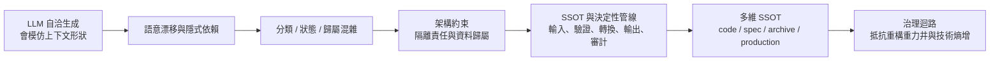

# 架構約束與決定性管線：系列地圖

## 系列邊界

本系列處理的是 AI agent 參與工程系統後，如何用架構約束、單一事實來源與決定性管線降低錯誤表面。它的核心問題不是「如何讓模型更聰明」，而是：當模型擅長自洽生成、模仿既有形狀與補齊空白時，哪些判斷必須留給人類意圖，哪些狀態必須交給 codebase 或 production，哪些轉換必須由 deterministic code 執行。

核心問題鏈如下：



本系列的邊界是 classification dispatch、資料歸屬、schema / workflow 隔離、SSOT、決定性文檔管線、DDD 式領域邊界、隱式依賴消除、跨語言重寫治理、逆向解壓縮與多維 SSOT。它不處理一般 AI 信任問題，不展開棕地規格導入方法，不討論術語可逆投影，也不把 Linux / sandbox 權限模型納入；這些應在其他系列各自自含展開。

## 本次形成的報告

| 閱讀順序 | 報告 | 核心問題 | 不可替代角色 | 邊界 |
| :--- | :--- | :--- | :--- | :--- |
| 1 | 架構約束與決定性管線：從 SSOT 到多維治理迴路 | 如何把 agent 的統計生成能力接到可驗證、可追蹤、可恢復的工程系統，而不是讓模型在模仿與補齊中擴散錯誤？ | 建立完整因果模型：先說明自由生成如何放大隱式依賴，再以分類集中、實體歸屬、schema 隔離與 SSOT 建立決定性管線，最後用多維 SSOT 抵抗重寫、漂移與技術熵增。 | 不寫特定框架導入手冊，不產出可直接發布的治理流程，不把所有架構問題都化約成文件或 prompt 問題。 |

## 概念槽位與角色

本系列最後形成一篇主報告，因為材料都服務同一個治理問題：agent 不是缺少資訊，而是缺少穩定的權威分工。分類規則、資料歸屬、schema gate、領域模型、黑盒考古與多維 SSOT 不是平行技巧，而是同一條收斂鏈上的不同層級。

| 槽位 | 核心功能 | 決策 |
| :--- | :--- | :--- |
| 分類全局性 | 說明分類、優先序與 fallback 是全局知識，不能假裝每個 kind 完全自包含。 | 保留為主報告起點，連接 declarative dispatch 與錯誤表面縮小。 |
| 絕對歸屬 | 將資料、schema、workflow、script 分別歸屬到不同消費者與責任層。 | 保留為物理隔離模型，避免 agent 將資料當指令、將願望當狀態。 |
| 決定性管線 | 將輸入、驗證、轉換、輸出與審計拆成可重放步驟。 | 保留為主報告核心模型，補入 Mermaid 與 pseudo-code。 |
| SSOT | 將 Markdown、JSON、schema、codebase 的權威角色區分清楚。 | 保留為中段主軸，從單一資料來源推進到多維 SSOT。 |
| DDD / 領域邊界 | 用領域實體與組裝器壓縮 agent 搜尋熵，移除排程器神物件。 | 保留為架構約束如何落到代碼邊界的案例。 |
| 隱式依賴 | 說明雙重狀態、隱式突變與 covert synchronization 如何形成技術債。 | 保留為反例與重構目標。 |
| 重構重力井 | 說明跨語言重寫中，舊代碼、白盒測試與 PoC 會把新系統拉回舊形狀。 | 保留為架構治理進入遷移期的風險模型。 |
| 逆向解壓縮 | 將 AI 的錯誤初稿用作專家知識萃取探針。 | 保留為 Archive / Living Spec 的知識來源。 |
| 多維 SSOT | 將 codebase、living specs、archive、production 分別作為不同真理維度。 | 保留為結論模型，閉合治理迴路。 |

## 合併、移出與保留決策

本系列只需要一篇主報告。若拆成「分類 dispatch」「SSOT 管線」「DDD 重構」「跨語言重寫」「多維 SSOT」多篇，會讓讀者以為它們是彼此獨立的工程偏好；單篇主報告更能呈現它們共同回答的問題：如何把不穩定的統計生成層，接到穩定、可審計、可回復的工程邊界。

本次保留為主報告內部分工段落的子題：

- 分類規則集中化、宣告式 dispatch 與 fallback 顯式化。
- 資料、schema、workflow 與 script 的歸屬隔離。
- SSOT 與單向資料流，取代文字探勘與啟發式猜測。
- 領域實體、組裝器、排程器瘦身與隱式突變消除。
- 黑盒考古、專家直覺逆向解壓縮與 Living Spec 形成。
- Codebase、Living Specs、Archive、Production 的多維 SSOT 治理。

移出本系列的部分不是刪除，而是因為它們回答不同層級的治理問題：

| 去向 | 移出理由 |
| :--- | :--- |
| Agent 認知限制與錯誤表面 | 無狀態生成、局部完備性與錯誤表面是更底層的模型限制；本系列只在需要時就地重述「agent 會模仿上下文、補齊因果空白」。 |
| 語意污染與反向治理 | 污染分類、歷史噪音與反向指引是上下文治理主題；本系列只處理污染進入架構邊界後如何被隔離與 gate。 |
| 信任邊界與驗證瓶頸 | 自洽、可信、驗證容量與外部裁決是一般信任問題；本系列聚焦管線結構如何提供可驗證的裁決點。 |
| 規格驅動開發與棕地治理 | 規格債、觀察性 schema 與棕地採納是規格成熟度問題；本系列只使用 Living Specs 作為多維 SSOT 的意圖層。 |
| 術語治理與可逆投影 | 術語生命週期、穩定鍵與顯示值屬於命名治理；本系列只保留 schema / code 中命名作為結構約束的角色。 |
| Linux 權限與 Sandbox 模型 | 主體、客體、能力與權限檢查可支撐 agent 執行安全，但本系列不展開 OS 權限模型。 |

## 展開方向盤點

| 展開類型 | 狀態 | 歸屬報告 / 去向 |
| :--- | :--- | :--- |
| 共用前提（就地自含） | `本次就地承載` | 主報告就地承載兩個前提：第一，agent 的統計生成層會在缺少因果時用可見形狀補齊空白，因此必須以架構約束降低可誤解空間；第二，確定性邊界 vs 統計執行層不同，需要全局一致、可重放、二元判斷的步驟必須由 deterministic code、schema validator、linter、CI 或 runtime assertion 執行。 |
| 概念地圖 / 詞彙表 | `本次補寫` | 主報告補寫架構約束、決定性管線、SSOT、多維 SSOT、歸屬、隱式依賴、黑盒考古、逆向解壓縮、Living Spec、Archive 與 Production feedback 的差異。 |
| 反例與不適用邊界 | `本次補寫` | 主報告補入反例：decorator chain 把行為名誤當身份、Markdown 被當資料庫探勘、排程器直接突變領域物件、跨語言逐行翻譯、白盒測試被誤當契約、PoC 定錨成新架構。 |
| 結構化資產（Mermaid / example code） | `本次補寫` | 主報告使用 Mermaid 呈現決定性管線與多維 SSOT 互制，並用 pseudo-code 展示 pipeline gate / schema validation / explicit domain assembly 的最小形狀。 |

## 生成式展開去向

| 展開類型 | 去向 | 理由 |
| :--- | :--- | :--- |
| 拆分 | 本次不拆分 | 材料雖橫跨分類、資料治理、DDD、重寫與多維 SSOT，但它們共同回答「架構如何約束 agent 的生成與重構能力」；拆分會破壞因果鏈。 |
| 潛在深化 | 本次展開 | 決定性管線、多維 SSOT、隱式依賴與重構重力井都在主報告中自含展開。 |
| 後續深化 | 移入後續 backlog | 可另寫操作手冊：pipeline gate 實作清單、Living Spec / Archive 範本、cross-language rewrite review checklist、多維 SSOT dashboard。這些是實作層材料，不是本次概念再結晶主體。 |

## 後續展開方向

- 可補一篇 pipeline gate 實作指南，展示 schema validation、reference integrity、idempotent output、audit log 與 replay check 的最小工具鏈。
- 可補一篇 cross-language rewrite governance checklist，將黑盒考古、白盒測試降級、bug compatibility 分類與 PoC 定錨檢查轉成 review 表。
- 可補一篇 multi-dimensional SSOT operating model，定義 codebase / specs / archive / production 衝突時的裁決流程。
- 可在術語治理系列中展開命名如何從自然語言歧義進入 schema 欄位、穩定鍵與 lint rule。

## Metadata

```toml
series = ["架構約束與決定性管線：從 SSOT 到多維治理迴路"]

[[reports]]
slug = "architecture-constraints-deterministic-pipeline"
title = "架構約束與決定性管線：從 SSOT 到多維治理迴路"
article_type = "Analytical Essay"
tags = ["AI 治理", "單一事實來源", "決定性管線", "領域驅動設計", "技術債"]
```
