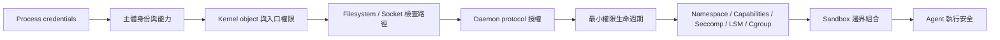

# Linux 權限與 Sandbox 模型：系列地圖

## 系列邊界

本系列處理的是 Linux 權限判斷如何從 process 主體一路連到 filesystem、socket、daemon 與 container sandbox 邊界。它不把權限問題簡化成「是不是 root」或「檔案 mode 對不對」，而是追問：kernel 在每一次操作中如何辨識主體、客體與能力，sandbox 又如何由多個限制層組合成可檢查的安全邊界。

核心問題鏈如下：



本系列的邊界是 process credentials、real/effective/saved/fs UID、groups、capabilities、filesystem path 權限、Unix socket 入口、peer credentials、protocol authorization、daemon privilege、container namespace、host object mount、seccomp、LSM 與 cgroup。它不展開一般雲端安全、Kubernetes 平台治理、完整 container runtime 實作，也不把 Agent 治理、信任邊界或規格管線納入；那些問題只在支撐本機執行安全時就地使用。

## 本次形成的報告

| 閱讀順序 | 報告 | 核心問題 | 不可替代角色 | 邊界 |
| :--- | :--- | :--- | :--- | :--- |
| 1 | Linux 權限與 Sandbox 模型：從主體憑證到邊界組合 | Linux 權限檢查如何從 process credentials、kernel object 與 daemon 授權，推導到最小權限與 sandbox 邊界？ | 建立主體 / 客體 / 能力 / 邊界的自含詞彙，串起 permission denied 排查、Unix socket 授權、container root 與 Agent 執行安全。 | 不提供完整 hardening checklist，不取代發行版或 runtime 文件，不把 sandbox 視為單一產品功能。 |

## 概念槽位與角色

本系列最後形成一篇主報告，因為所有材料都服務同一條因果鏈：權限不是單點設定，而是 process 在特定生命週期階段，用一組 credentials 與 capabilities，對某種 kernel object 發起操作，並穿過多層政策裁決後得到的結果。若拆成多篇，讀者會先看到 UID、socket、debug、container 等局部知識，卻延後看到它們其實都在回答同一個安全問題：這個 process 在此刻到底能代表誰、碰到什麼、要求誰代執行什麼。

| 槽位 | 核心功能 | 決策 |
| :--- | :--- | :--- |
| Process credentials | 說明權限主體不是登入者，而是一組 real、effective、saved、filesystem UID/GID、groups 與 capabilities。 | 保留為主報告起點，建立「主體是 process 狀態」的基礎。 |
| Kernel object | 說明權限檢查必須同時看客體類型：regular file、directory、Unix socket、device、pipe 或 daemon 入口。 | 保留為第二個基本詞彙，連接 filesystem 與 socket 的差異。 |
| Permission denied 排查 | 把 EACCES、EPERM、ECONNREFUSED、ENOENT 轉為拒絕層定位方法。 | 保留為主體 / 客體模型的實務應用，不拆成獨立技術 note。 |
| Unix socket daemon | 說明 socket file mode 只控制入口，peer credentials 與 protocol authorization 才決定命令權限。 | 保留為「入口權限不等於完整授權」的核心反例。 |
| 最小權限生命週期 | 說明初始化期特權、降權、清 group、移除復權能力與 capability 收斂。 | 保留為從權限模型走向安全設計的橋。 |
| Container / sandbox | 說明 namespace、capabilities、seccomp、LSM、cgroup 與 host object mount 共同形成邊界。 | 保留為主報告結論層，連接 Agent 執行安全。 |

## 合併、移出與保留決策

本系列只需要一篇主報告。材料雖然橫跨 Linux credentials、檔案與 socket、debug checklist、daemon authorization、最小權限與 container 權限，但它們不是平行教學主題，而是同一套權限推理模型的不同層次：先定義誰在操作，再定義操作什麼，再定位哪一層拒絕，再把授權與代執行責任分層，最後收束成 sandbox 的邊界組合。

本次保留為主報告內部分工段落的子題：

- Process credentials：作為權限主體模型。
- Filesystem 與 kernel object：作為客體與檢查路徑模型。
- Permission denied：作為拒絕層定位方法。
- Unix socket daemon：作為入口權限、peer credentials、protocol 授權與 daemon 權力的分層案例。
- 最小權限：作為生命週期與能力收斂原則。
- Container / sandbox：作為多層限制組合與 host object 暴露風險。
- Agent 執行安全：作為本系列的應用語境，說明為何 Agent sandbox 不能只靠 prompt 或單一開關。

移出本系列的部分不是刪除，而是因為它們回答不同層級的治理問題：

| 去向 | 移出理由 |
| :--- | :--- |
| 信任邊界與驗證瓶頸 | 外部裁決、自洽與可信差異是 AI 輸出驗證問題；本系列只處理 process 實際執行時的 OS 權限邊界。 |
| 架構約束與決定性管線 | Pipeline gate、SSOT 與 extension point 是系統架構約束；本系列只取用「把自由生成包進可檢查邊界」這個安全意圖。 |
| AI 協作治理與知識架構 | Agent 入口、委派與知識路由是協作制度問題；本系列只討論 Agent action 落到本機 process 後如何被 OS 限制。 |
| 規格驅動開發與棕地治理 | 規格與契約能描述權限需求，但完整 SDD / OpenSpec 採用策略不是本系列主題。 |

## 展開方向盤點

| 展開類型 | 狀態 | 歸屬報告 / 去向 |
| :--- | :--- | :--- |
| 共用前提（就地自含） | `本次就地承載` | 主報告就地承載「主體 / 客體 / 能力 / 邊界 的最小詞彙」，並把它落到 process credentials、kernel object、capabilities 與 sandbox layers。 |
| 概念地圖 / 詞彙表 | `本次補寫` | 主報告補寫最小詞彙表：主體、客體、能力、命名空間、入口、授權、代執行、邊界、sandbox。 |
| 反例與不適用邊界 | `本次補寫` | 主報告補入反例：把登入者當 process、只看最後檔案 mode、把 socket file 當普通檔案、把能 connect 當完整授權、把 container 當天然安全邊界、把 sandbox 當單一開關。 |
| 結構化資產（Mermaid / example code） | `本次補寫` | 主報告使用 Mermaid 呈現 Linux 權限檢查流程與 sandbox 邊界組合，並以 shell / pseudo-code 展示 credentials、path、socket authorization 的差異。 |

## 生成式展開去向

| 展開類型 | 去向 | 理由 |
| :--- | :--- | :--- |
| 拆分 | 本次不拆分 | 各槽位都依賴「權限是主體、客體、能力與邊界的合成結果」這個共同前提。拆分會使 UID、socket 與 container 變成孤立技巧。 |
| 潛在深化 | 本次展開 | 最小詞彙、權限檢查流程、permission denied 排查、Unix socket authorization 與 container sandbox 邊界都在主報告中自含展開。 |
| 跨篇湧現主題 | 本次展開 | 跨篇合讀後浮現的主題是「sandbox 不是權限開關，而是可見世界、可用能力、可呼叫 syscall、可接觸客體與代執行責任的組合邊界」。主報告以此作為總論證。 |

## 後續展開方向

- 可補一篇實作導向 checklist，把 systemd sandboxing、container runtime options、socket permission、capability drop 與 no_new_privs 整理成部署審查表。
- 可補一篇故障排查技術 note，專門收斂 `EACCES`、`EPERM`、`ENOENT`、`ECONNREFUSED` 在 service、container 與 socket daemon 中的診斷路徑。
- 可補一篇 Agent runtime 安全設計，將 workspace write root、network policy、tool escalation、plugin install 與 host socket exposure 納入同一個威脅模型。

## Metadata

```toml
series = ["Linux 權限與 Sandbox 模型：主體、客體、能力與邊界組合"]

[[reports]]
slug = "linux-permission-sandbox-boundary"
title = "Linux 權限與 Sandbox 模型：從主體憑證到邊界組合"
article_type = "Analytical Essay"
tags = ["Linux 權限", "Sandbox", "最小權限", "主體", "客體"]
```
