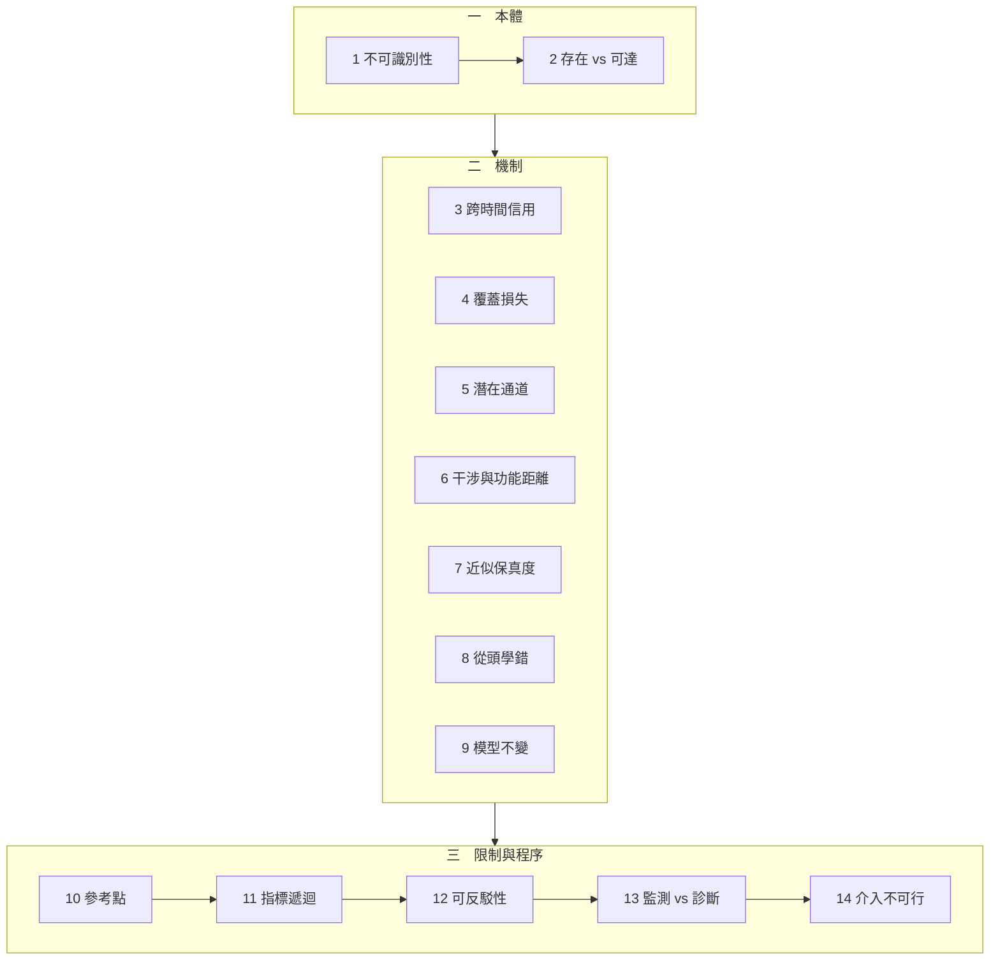

# 導讀：能力失效歸因

一個模型的分數掉了，或者它的某個行為明顯不對。接下來的第一句話幾乎決定了後面幾週的走向——而那句話通常是「模型退化了」。

這個系列的全部內容，是說明那句話為什麼不是結論，以及要補上什麼才算是。

## 這個系列在回答什麼

十四篇共用一個結構。每一次失效歸因都會走到同一個位置：手上有一個讀數的變動，需要說出是什麼造成的。而讀數與機制之間是一對多的關係——多個互不相同的機制可以映射到同一個數字，所以不存在任何從讀數回推機制的合法運算。

能繞過這件事的只有一個動作：主動製造反事實。固定其餘部分，只替換一處，再看讀數是否隨之改變。

系列的每一篇都是這個動作在某個具體處境中的形狀，加上該處境特有的陷阱。

## 三段結構

**第一段（1–2）建立本體。** 第 1 篇證明聚合讀數到機制的映射不是單射，並立下全系列共用的四個詞與三種時間結構。第 2 篇分開「能力存在於假設空間」與「訓練走得到」——中段有數篇的失效落在後者，缺少這個區分會讓它們看起來像同一件事。

這兩篇是後面所有篇章的前提，建議先讀。

**第二段（3–9）是機制篇。** 七篇各自處理一個具體處境，彼此獨立，可按需要跳讀。它們依時間結構排列：

- **從未取得**：第 3 篇（早期事件收不到信用）、第 8 篇（模型從第一天就在用不可轉移的規則）。
- **曾有後失去**：第 6 篇（新任務改寫共享方向）、第 7 篇（近似擾動使個體翻轉）。
- **模型未變而關係失效**：第 9 篇（世界、決策回饋、生成遞迴三條路徑）。
- **目標本身不要求該能力**：第 4 篇與第 5 篇處理一個更棘手的情形——看起來像失效的東西，可能是模型對它被給定的目標的正確回應。

**第三段（10–14）處理方法論自身。** 這一段有依賴順序，建議依序讀。

第 10 篇問前面所有判決所依據的基準從哪來，第 11 篇問前面反覆使用的「換一個更細的指標」憑什麼算改善，第 12 篇處理「所有座標都固定了」這個前提為何無法建立，第 13 篇分開監測與診斷這兩個常被混用的目標，第 14 篇處理介入被禁止時還剩下什麼。

這一段會削弱前面幾段的部分結論。那是刻意的——一個歸因方法若不能說出自己在什麼條件下失效，它就不是可反駁的。

## 幾條可以先記住的線

**每一篇都可以獨立讀。** 需要的前提都在篇內就地建立，不依賴讀過其他篇。

**所有程式都是純標準庫，都實際執行過，輸出是觀察值不是預期值。** 讀的時候值得對照程式與輸出，因為幾個關鍵結論違反直覺——例如「更細的替代指標可以嚴格更差」、「浮點基線本身不唯一」、「梯度裁剪在代數上不可能修復長程信用分配」。

**每一篇的反思段都在削弱該篇的主張。** 那裡放的是邊界條件與反例，包含幾個承認本篇無法解決的問題。跳過反思段會讓結論看起來比實際更強。

## 如果只讀三篇

第 1 篇建立整個系列的問題形狀。第 10 篇說明所有判決都相對於一個被選的參考點。第 12 篇給出在清單永遠不完備的情況下仍然可守的目標。

這三篇合起來是一個完整的立場：讀數不識別機制，判決相對於參考點，而可守的不是完備性而是可反駁性。中間的機制篇則是這個立場在具體處境中的驗證。
