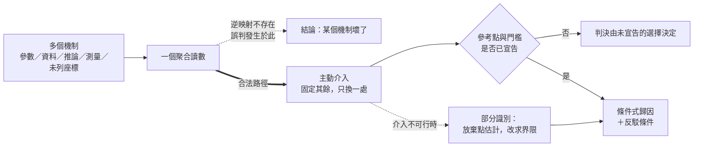

# 能力失效歸因：一個聚合讀數能證明什麼，不能證明什麼

本系列處理一個問題域：當一個模型的能力主張以**聚合觀察量**為證據時，該觀察量的變動如何被錯誤地當成因果結論。

**範圍聲明（系列邊界）**：本系列只處理**歸因**問題——某個讀數已經動了，或某個行為已經不對，要決定是什麼造成的。每一篇的起點都是一個負面訊號或一個不可接受的行為：分數掉了、長程規則沒學到、模式不見了、潛在通道沒在用、舊任務被改寫、壓縮後個體翻轉、換環境就崩、風險在模型不變時上升。問題永遠是「這是什麼造成的」，而不是「這個看起來變好的數字可信嗎」。

這個限制是刻意的。從一個正面讀數往前推能力，是儀表效度問題：讀數本身可能完全誠實，而它回答的問題比宣稱的窄。從一個已發生的失效往回找成因，是識別問題：多個資料生成故事可以映射到同一個觀察值，而要分開它們必須主動製造反事實。本系列只做後者。

系列因此不討論如何把模型訓練得更好，也不討論如何設計訓練期的成功指標。它討論一件更前置的事：**在什麼條件下，一個讀數的變動才有資格升格為關於機制的主張。**

**series**: `能力失效歸因：一個聚合讀數能證明什麼，不能證明什麼`

## 系列因果弧

所有失效歸因都卡在同一個位置：從「讀數」跨到「機制」的那一步。下圖是全系列共用的骨架。

圖有三條路徑。虛線往右是實務中最常走的捷徑，它在形式上就沒有依據。粗線是唯一合法的路徑：不從讀數回推，而是主動製造反事實。左下那條虛線是受規範領域的常態——介入被禁止時，能守住的是界限而非點估計。

而中間那個菱形是整個系列最容易被跳過的一步：任何判決都相對於一個參考點與一個門檻，兩者都是被選的。

三段結構因此是：先建立不可識別性這個本體（前兩篇），再逐一展示它在具體機制上的形狀（中間七篇），最後處理方法論自身的限制與可行的程序（後五篇）。

## 報告角色與閱讀順序

順序由因果與依賴決定。

| 順序 | 報告 | 核心問題 | 不可替代角色 | 邊界 | tags |
| :--- | :--- | :--- | :--- | :--- | :--- |
| 1 | [同一個數字，好幾個世界：能力歸因的不可識別性](aggregate-to-mechanism-mapping/report.zh-TW.md) | 聚合讀數與產生它的機制之間是什麼關係？ | 立本體：映射不是單射；並給出三種時間結構與最小詞彙 | 不涉及任何特定架構的機制 | 測量契約、中介變數、機器學習、退化診斷 |
| 2 | [存得住不等於學得到：表示能力與最佳化可達性的分離](expressible-but-unreachable/report.zh-TW.md) | 架構能表示某函數，為何不保證訓練後展現該行為？ | 建立「能力存在」與「能力可達」的區分，供全系列共用 | 不談具體最佳化器的調參 | 梯度下降、梯度消失、泛化、機器學習 |
| 3 | [五十步之外沒有信用：跨時間梯度通道的取得失敗](credit-across-time/report.zh-TW.md) | 早期事件為何得不到信用，該用什麼觀察量分流？ | 唯一單任務的「從未取得」案；證明全域裁剪先驗無效 | 不談推論時的記憶容量 | 信用分配、梯度消失、遞迴神經網路、反向傳播 |
| 4 | [少了模式，分數不會說：覆蓋損失的證據要另外找](mode-loss-versus-sample-quality/report.zh-TW.md) | 如何證明失去的是模式，而非品質或評估器偏差？ | 分離品質與覆蓋兩軸，並給出坍縮的可量化抵抗條件 | 不談生成訓練的配方選擇 | 模式坍縮、分佈覆蓋、生成對抗網路 |
| 5 | [同一個低 KL，四種病因：潛在通道失用的成因分流](latent-collapse-attribution/report.zh-TW.md) | 確認通道失用後，如何在候選機制間分流？ | 以構造比較把候選切成「目標不用」與「路徑到不了」兩類 | 不談生成品質，也不以潛在維度對應人類語意 | 後驗坍縮、證據下界、互資訊、變分自動編碼器 |
| 6 | [新任務如何改寫舊行為：共享方向上的干涉與功能距離](interference-and-functional-distance/report.zh-TW.md) | 新目標在什麼條件下改寫舊行為，為何線索不充分？ | 唯一的「曾有後失去」案；否證參數距離作為代理量 | 不比較各家持續學習方法的優劣 | 災難性遺忘、梯度干涉、彈性權重固化 |
| 7 | [同樣的平均分，不同的失真：三種近似機制的保真度帳](three-approximations-one-budget/report.zh-TW.md) | 平均準確率不變時失真藏在哪裡？ | 分開三種近似機制，並證明未壓縮基線本身不唯一 | 不裁決哪一種壓縮手段更好 | 模型壓縮、量化、剪枝、知識蒸餾、校準 |
| 8 | [不是後來壞掉，是從頭學錯：偽相關與跨環境反例](wrong-from-the-start/report.zh-TW.md) | 兩條規則都能降低經驗風險時，什麼證據能辨認？ | 唯一「錯從第一天起」的時間結構；證明偏好由可用性驅動 | 不談部署後的分佈變動 | 偽相關、捷徑學習、經驗風險、泛化 |
| 9 | [模型是常數，風險仍上升：通往下一期資料的三條路](three-paths-into-next-data/report.zh-TW.md) | 參數不變而風險上升時，三條資料路徑如何分流？ | 唯一「模型是常數」的一篇；含標籤延遲下的可觀測性 | 不涉及模型內部機制 | 分佈漂移、表演性預測、行為切片 |
| 10 | [用什麼當基準？判定失效所依據的參考點來源](where-the-reference-point-comes-from/report.zh-TW.md) | 判定失效所依據的參考點從哪裡來？ | 把全系列各處的自我限制集中為一個正面論證 | 不提供「正確參考點」的配方 | 測量契約、不確定性、校準 |
| 11 | [換一個指標為何不夠：替代量的遞迴不可識別性](replacement-metric-recursion/report.zh-TW.md) | 取代舊指標的新指標為何同樣不可識別？ | 全系列方法論的自我駁倒檢查 | 不推薦指標清單 | 測量契約、行為切片、損失函數 |
| 12 | [契約永遠不完備，所以改守可反駁性](from-completeness-to-refutability/report.zh-TW.md) | 完備性不可證時，可反駁性如何取代它？ | 把目標從座標對齊轉為反駁條件的正面論證 | 不含監測設計 | 退化診斷、測量契約、不確定性 |
| 13 | [早發現與正確歸因：兩個目標，兩個損失函數](alert-fast-attribute-right/report.zh-TW.md) | 早發現與正確歸因的目標為何衝突？ | 分離監測與診斷的損失函數，並量化混用的代價 | 不提供特定系統的門檻數值 | 損失函數、退化診斷、行為切片 |
| 14 | [不能做實驗的時候：因果階梯上還剩什麼](when-intervention-is-unavailable/report.zh-TW.md) | 介入不可行時因果階梯上還剩什麼？ | 給出三個退路與一條硬限制，依假設可見度排序 | 不處理介入為何不可行的審查判準 | 不確定性、分佈漂移、經驗風險 |

## 展開方向盤點表

| 展開類型 | 狀態 | 歸屬報告 / 去向 |
| :--- | :--- | :--- |
| 共用前提（就地自含） | `本次就地承載` | `確定性邊界 vs 統計執行層` 於順序 1 就地重述——確定性邊界上的「相同」可逐位元檢查，統計執行層上的「相同」只在事先宣告的容差內成立。順序 7、10 各自在其脈絡中重述同一區分，措辭一致，不互相引用 |
| 概念地圖 / 詞彙表 | `本次補寫` | 順序 1 建立四詞最小詞彙（聚合量／機制／反事實／介入），後續各篇皆以此承載而不新造同義詞 |
| 反例與不適用邊界 | `本次補寫` | 順序 10、11 為專責的邊界報告：前者處理判準所依據的參考點資格，後者處理替代指標自身的盲區。此外每篇的反思段皆含至少一個反例 |
| 結構化資產（Mermaid / example code） | `本次補寫` | 全部 14 篇皆附可實際執行的純標準庫程式與實測輸出；順序 1、3、4、5、9、12、13、14 另附 Mermaid 承載因果鏈或決策程序 |

## 本次形成的報告

14 篇，涵蓋三段：本體（順序 1–2）、機制（順序 3–9）、方法論限制與程序（順序 10–14）。

其中順序 2、10、11、13、14 為順勢新增的基礎報告：

- **順序 2** 補上「能力存在」與「能力可達」的區分。中段多篇的失效都落在可達性一側，缺少這個區分會讓它們各自重複鋪陳同一個前提。
- **順序 10** 補上參考點的資格論證。中段各篇原本各自承認一句「這個判準所依據的基準本身可疑」，集中成篇後才具備反駁力。
- **順序 11** 補上方法論的自我檢查。全系列反覆以較細的觀察量取代較粗的，而該動作自身的正當性條件需要獨立論證。
- **順序 13** 補上監測與診斷的目標分離。缺少它，讀者會把歸因程序的要求誤加到告警設計上。
- **順序 14** 補上介入不可行時的退路。全系列的診斷動作都建立在介入之上，而在受規範領域介入常被禁止。

## 後續展開方向

1. **詞庫的跨域撞名**：`Distill`（蒸餾）在詞庫中承載的是開發脈絡萃取的意涵，與 knowledge distillation 撞名；`Knowledge`（描述性知識）、`Projection`（投影）、`Compose`（組合）同樣帶有專案域定義，在機器學習語境中會被錯誤套用。本次以書寫規避處理——一律寫全稱「知識蒸餾」，避開裸詞「投影」與「組合」。詞庫本身的消歧屬術語治理範圍，移入後續處理。
2. **未收錄的主題 tags**：`模型評估`、`驗證設計`、`選擇偏差`、`部分識別`、`自然實驗`、`預註冊`、`可重現性` 在本系列有實質內容支撐，但尚未進入詞庫。移入後續 backlog。
3. **交互作用的正面方法**：順序 1、12 皆證明逐軸替換無法處理交互，也證明殘差無法區分交互與未列座標，但兩篇都未提供交互設計的正面方法。二乘二與更高階設計在成本受限下如何取捨，值得獨立處理。
4. **高維語義結構的劃分權責**：順序 4、10 皆指出模式與群的劃分依賴表示與距離的選擇，且該選擇通常無人負責。誰有資格下這個劃分、依據什麼、如何記錄，是一個治理問題而非技術問題。
5. **標籤延遲下的世代分群實作**：順序 9 指出世代必須按產生時的政策版本分群報告，但未給出在既有資料倉儲上的實作路徑。
