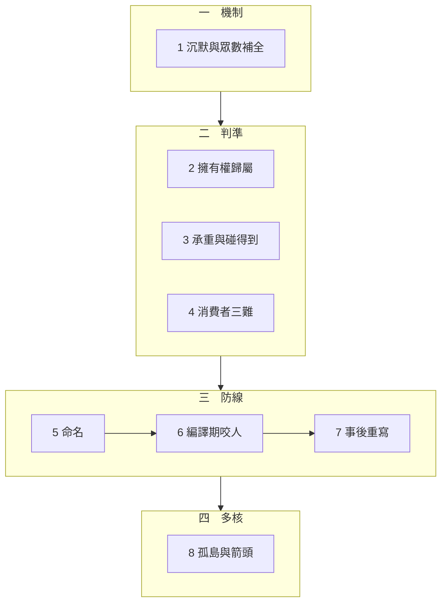

# 導讀：封裝邊界的劃界權

你要一個只管一件事的小東西。拿回來的是一個平台。

這個系列的全部內容，是說明那件事為什麼會發生、界該劃在哪裡由什麼決定、以及劃了以後怎麼守住。

## 這個系列在回答什麼

八篇共用一個結構。每一次過度擁有都經過同一條路徑：規格裡有一個未被指定的空缺，而補全端用它看過最多次的形狀把空缺填滿。

這件事不是粗心。薄意圖是由「沒說出口的那些不要」定義的，而補全端讀不到沉默——它讀得到的只有「這種東西通常怎麼做」。兩者是互不相關的分佈，所以不對齊是結構性的，不是品質問題。

系列的每一篇都是這條路徑上的某一個位置，加上該位置特有的判準或防線。

## 四段結構

**第一段只有一篇，它建立機制。** 第 1 篇證明三件事：眾數補全與薄意圖的落差可以算出來、否定式規格的成本隨周邊項數線性成長而肯定式的不成長、以及要求「補少一點」在形式上調錯了軸——那個旋鈕不分辨承重與否。

這一篇是後面所有篇章的前提，建議先讀。

**第二段（2–4）是三道判準，它們問的是不同的問題。** 第 2 篇問擁有權：一項行為的正確值由誰決定。第 3 篇問承重：缺了它會不會當場死。第 4 篇問判準的輸入：那些真實消費者從哪裡來。

三道判準的順序不可交換。第 2 篇裡有一類行為的動作集合沒有上界——它沒有正確的預設值，所以必須在討論「該設多少」之前先被辨認出來。

**第三段（5–7）是三道防線，按成本排序。** 第 5 篇是命名，成本是一次討論，而時機只有一次。第 6 篇是機械強制，成本是一套要維護的檢查。第 7 篇是事後重寫，成本是丟掉一版實作。

這一段有一個反直覺的結論：最有效的煞車在最晚的位置。原因不是紀律不足，是資訊不足——「這一項的值第二個人會不會給出不同答案」這個問題，要等第二個人出現才有答案。

**第四段只有一篇。** 第 8 篇處理多個薄核之間的關係，並指出同一條規則在元件、應用與 repo 三個尺度上重現。

## 幾條可以先記住的線

**每一篇都可以獨立讀。** 需要的前提都在篇內就地建立，不依賴讀過其他篇。

**所有程式都是純標準庫，都實際執行過，輸出是觀察值不是預期值。** 全系列共 20 個程式區塊。幾個關鍵結論違反直覺，值得對照程式與輸出——例如「全選不是報酬遞減而是斷崖」、「無消費者與多消費者取聯集的產出完全相同」、「當下克制把漂移壓到零的代價是誤削承重能力，而缺席不會報錯」、「四種結構的資料流箭頭數完全相同而波及範圍從 0 到 4」。

**每一篇的反思段都在削弱該篇的主張。** 那裡放的是邊界條件、反例，以及一段關於該篇實驗能證明什麼、不能證明什麼的說明。跳過反思段會讓結論看起來比實際更強。

**薄不是教條。** 有三種情形本系列明確判定不該求薄：慣例恰好等於這一次的實踐、核心承諾本身需要整合、以及元件永遠只服務一個消費者。判準始終回到消費者的承諾，不回到規模。

## 如果只讀三篇

第 1 篇建立整個系列的問題樣貌：薄意圖與眾數補全在形式上不對齊。第 2 篇給出唯一一道可執行的歸屬判準，也是全系列最常被引用的那一刀。第 7 篇說明為什麼最有效的煞車在最晚的位置，以及守界工具自身如何不變成下一個胖東西。

這三篇合起來是一個完整的立場：引力是結構性的，界的位置有判準可循，而守界的關鍵在時機而不在意志。中間五篇則是這個立場在具體處境中的驗證。
