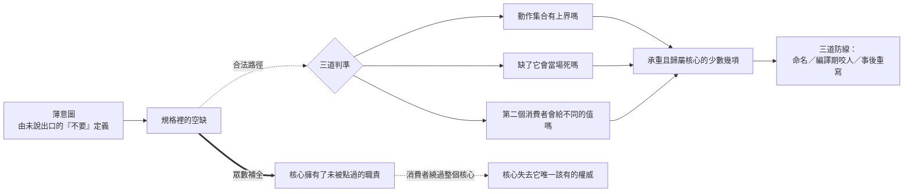

# 封裝邊界的劃界權：當補全端會替你把界劃肥

本系列處理一個問題域：元件化開發是在劃定**封裝邊界**，而生成端會用訓練語料裡最常見的形狀替你把那條界劃肥。系列問的是三件事——這股引力的機制是什麼、界該劃在哪裡由什麼判準決定、以及劃了以後如何守住。

**範圍聲明（系列邊界）**：本系列只處理**劃界權的歸屬**。每一篇的起點都是一個已經發生的過度擁有：核心握著別人的重試政策、握著別人的持久化選擇、握著一個沒人委託過的動作。問題永遠是「這一項為什麼在核心裡，以及它該在哪裡」，而不是「這個元件的實作品質如何」。

這個限制是刻意的。實作品質是一個關於程式碼的問題，可以靠審查與測試改善。劃界權是一個關於**誰決定**的問題——同一份實作，同一組功能，擁有權放在核心或放在呼叫者，會長出兩個行為完全不同的系統。本系列只做後者。

系列因此不討論如何把元件寫得更好，也不討論效能或可靠性工程。它討論一件更前置的事：**在什麼條件下，一項行為才有資格留在核心裡。**

**series**: `封裝邊界的劃界權：當補全端會替你把界劃肥`

## 系列因果弧

所有過度擁有都經過同一條路徑：一個未被指定的空缺，被語料的眾數填滿。下圖是全系列共用的骨架。

圖有兩條路徑。粗線是實務中的預設走法，它不需要任何人疏忽就會發生。虛線是唯一合法的路徑：三道判準各問一個不同的問題，且順序不可交換——動作集合無上界的行為沒有正確的預設值，所以第一道必須先問。

而最右下角是這個系列反覆回到的終點：過度擁有的代價不是核心變胖，是消費者繞過整個核心，連核心的不變式一起繞過。

四段結構因此是：先立引力的機制（第 1 篇），再給三道判準（第 2 至 4 篇），接著是三道防線（第 5 至 7 篇），最後處理多核心與跨 repo 的關係（第 8 篇）。

## 報告角色與閱讀順序

順序由因果與依賴決定。

| 順序 | 報告 | 核心問題 | 不可替代角色 | 邊界 | tags |
| :--- | :--- | :--- | :--- | :--- | :--- |
| 1 | [由沉默定義的需求：補全引擎為何系統性地把薄核補肥](completion-gravity/report.zh-TW.md) | 薄需求為何在生成管線裡被系統性補肥？ | 立機制：語料頻率與意圖是互不相關的分佈；並證明「補少一點」調錯了軸 | 不處理界該劃在哪裡 | 過度生成、封裝邊界、擁有權 |
| 2 | [這項行為屬於誰：擁有權歸屬的變異測試](whose-semantics/report.zh-TW.md) | 一項行為該由核心還是呼叫者擁有？ | 把兩個常見直覺合成一個可執行判準；並辨出第三類（動作集合無上界） | 不處理消費者從哪來 | 擁有權、封裝邊界、薄產品 |
| 3 | [承重與碰得到：把膨脹的能力清單收斂成薄核](load-bearing-versus-reachable/report.zh-TW.md) | 如何從膨脹的候選清單收斂出承重集合？ | 證明全選是斷崖而非遞減；DOA 是拒絕工具不是發現工具 | 不處理歸屬，只處理承重 | 決策漏斗、薄產品、封裝邊界 |
| 4 | [消費者三難：三條路的代價不對稱，而其中一條有出口](consumer-trilemma-asymmetry/report.zh-TW.md) | 劃界所依據的消費者從哪來，三條路各自的代價？ | 打開三難黑箱：證明聯集同時吃下兩種最壞，且交集＋附掛是出口 | 不聲稱能取代人對交集的判斷 | 消費者三難、薄產品、決策漏斗 |
| 5 | [名字是最便宜的範圍防線：品牌與 API 為何必須分兩層](naming-as-a-scope-defence/report.zh-TW.md) | 名字如何影響範圍，改名的代價由什麼決定？ | 唯一處理非機械式防線的一篇；量化品牌滲透深度的代價 | 不處理機械強制 | 多語源、封裝邊界、領域驅動設計 |
| 6 | [讓越界在編譯期失敗：把守界從記性換成機械](fail-at-compile-time/report.zh-TW.md) | 如何讓「不長大」在有人試圖讓它長大時真的失敗？ | 證明人審與機械檢查差一個量級；孤兒散文三分法給出可驗收目標 | 不處理治理自身的比例 | 孤兒散文、封裝邊界、擁有權 |
| 7 | [煞車踩在生成之後：事後重寫，以及治理自身的比例](rewrite-as-the-only-brake/report.zh-TW.md) | 攔不住當下時，煞車踩在哪裡？ | 證明兩種煞車付的是不同的東西；並處理治理的自我指涉 | 不處理已有大量下游依賴的情形 | 事後重寫、擁有權、孤兒散文 |
| 8 | [組合不等於耦合：一族薄核的兩張圖與跨 repo 的紀律傳播](islands-and-arrows/report.zh-TW.md) | 多個薄核如何在資料流密集時保持相依孤島？ | 唯一處理多核關係與紀律傳播的一篇；證明資料流圖不含耦合資訊 | 不處理單一核心的內部邊界 | 參考實作、封裝邊界、薄產品 |

## 展開方向盤點表

| 展開類型 | 狀態 | 歸屬報告 / 去向 |
| :--- | :--- | :--- |
| 共用前提（就地自含） | `本次就地承載` | `薄核 ＝ 有某種權威的核心 − 平台擁有權`（薄不是規模小，是擁有權的克制）於順序 1 就地建立；順序 2、3、7 各自在其脈絡中重述同一區分，措辭一致，不互相引用。`核心的不變式是被宣告的，不是自然事實` 於順序 2 建立，順序 6 就地重述 |
| 概念地圖 / 詞彙表 | `本次補寫` | 順序 1 建立三詞最小詞彙（薄意圖／規格空缺／眾數補全），順序 2 補上第四詞（動作集合），後續各篇皆以此承載而不新造同義詞 |
| 反例與不適用邊界 | `本次補寫` | 順序 3、4 為專責的邊界報告：前者處理「本質上該整合的東西不該薄化」，後者處理「交集為空或太小」。此外每篇的反思段皆含至少一個反例與一段實驗限制說明 |
| 結構化資產（Mermaid / example code） | `本次補寫` | 全部 8 篇皆附可實際執行的純標準庫程式與實測輸出，共 20 個程式區塊；8 篇皆另附 Mermaid 承載判定程序、回饋延遲或相依結構 |

## 本次形成的報告

8 篇，涵蓋四段：機制（順序 1）、判準（順序 2–4）、防線（順序 5–7）、多核與跨 repo（順序 8）。

其中順序 2、4、5、6、7、8 為順勢新增或拆深的報告：

- **順序 2** 補上擁有權歸屬的正面判準。原素材在兩處各暗示了一個直覺——「答案因業務而異者屬使用者」與「裁決 vs 業務決策」——但沒有一處把它們合成，也沒有辨出第三類：動作集合無上界的行為沒有正確的預設值，修法是移除而非移出。
- **順序 4** 打開消費者三難的黑箱。原素材兩處都以「只有人的判斷」收尾，而三條路的失敗種類其實不同：聯集同時吃下缺漏與強加的最壞情形，而取交集加附掛是一個取決於前置機制的出口。需要人判斷的部分因此比原本的說法窄得多。
- **順序 5** 把命名從一節展開成一篇。它是三道防線裡唯一非機械的一道，也是唯一「現在幾乎免費、以後很貴」的一道；品牌滲進 API 的代價可以逐層算出來。
- **順序 6** 把型別鎖界與孤兒散文合為一篇。兩者的共同結構是「把判斷移到失敗會發生的地方」，而三分法給出一個可驗收的目標——孤兒數為 0，而非機械化率。
- **順序 7** 把事後重寫與治理的比例合為一篇。治理自身也是會被同一股引力劃肥的產品，這個自我指涉在原素材裡碰到但沒有閉合；規則的觸發率提供了一個可觀察的失衡訊號。
- **順序 8** 把組合與耦合、跨 repo 紀律合為一篇。同一條規則在元件、應用與 repo 三個尺度上重現，而三個尺度的失效形狀相同：一個被全部依賴的節點取消獨立演化。

## 後續展開方向

1. **孤島架構的成本交叉點**：順序 8 指出橋接數量在核心數的平方階成長，因此孤島架構的維護成本增長快於中央架構，兩者存在一個交叉點。那個交叉點的位置與判定方式本次未處理，移入後續 backlog。
2. **忠實度不可量測時的解釋策略**：順序 2 的第三類判定依賴「誰決定了那個動作」，而在以回呼或工具授權為介面的系統上，授權來源的追溯本身是一個獨立問題。
3. **動態語言的守界替代方案**：順序 6 指出把藍圖鎖進型別在表達力弱的語言裡做不到，此時能守的只有回饋延遲較長的層。在動態語言上取得秒級回饋的可行手法，值得獨立處理。
4. **共用序列化格式造成的隱性耦合**：順序 8 的波及範圍計算只看相依邊，而兩個形式上獨立的核心可以因共用一個資料格式而必須同步發布。格式作為隱性相依邊的量測方式本次未處理。
5. **單消費者元件的邊界驗證**：順序 2、4 皆指出判準的輸入是兩個以上消費者，而永遠只有一個消費者的元件無法驗證自己的邊界。這類元件該採取什麼替代判準，是一個獨立主題。
6. **詞庫的子字串命中**：本次盤點發現 `導讀`（ReadingGuide）命中的位置是「誤**導讀**者」——錨點注入對中文不設字界，因此通用二字詞會匹配到跨詞邊界的位置。這與跨域撞名是同一個機制的另一種形式，且無法靠檢視定義發現，只能靠逐一檢視命中位置。本次以書寫規避處理（改寫為「讓讀者誤以為」）；字界機制屬術語治理範圍，移入後續處理。
