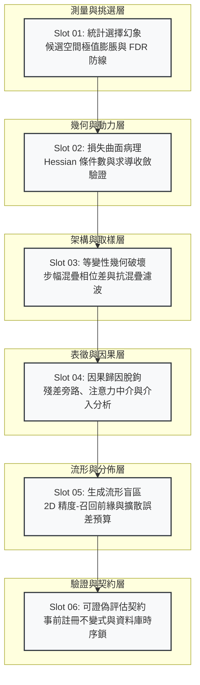

# 訓練訊號與能力證據：當指標變好，你到底知道了什麼

## 1. 問題域界定與認知拓撲 (Problem Domain & Narrative Topology)

在機器學習與深度經驗系統中，「評估指標改善」與「系統能力確證」之間存在巨大的語義與因果鴻溝。任何純量訓練或驗證指標（如 Loss、Accuracy、Inception Score、ELBO）本質上都是特定資料切分、特定最佳化軌跡與特定計算路徑下的**代理讀數（Proxy Readouts）**，絕非部署環境中真實能力與分佈適應性的客觀本體。

本系列徹底解構訓練訊號與能力證據之間的脫鉤機制，突破傳統線性階梯的敘事束縛，從統計極值、幾何曲面、架構誘導偏差、表徵因果中介、生成流形動力學，到可證偽評估契約六大正交維度，建立完備的認知與防衛拓撲：



---

## 2. 篇章角色、不可替代性與閱讀順序 (Slot Manifest)

```toml
series = ["訓練訊號與能力證據：當指標變好，你到底知道了什麼"]
```

| 順序 | 報告目錄 slug | 核心問題 | 不可替代角色 | 邊界聲明 | 建議 Tags |
| :--- | :--- | :--- | :--- | :--- | :--- |
| **01** | `statistical-selection-illusions` | 為什麼候選模型越多，手上的評估數字越不可信？ | 奠定評估動作本身的統計極值偏差理論，闡明同一資料兼任擬合、挑選與證明的根本矛盾與 FDR 截斷防線。 | 不處理網路架構或連續最佳化動力學，專注於離散選擇程序本身的極值分佈。 | `選擇偏差`, `假設檢定`, `統計推論`, `度量自欺` |
| **02** | `loss-curvature-optimization-dynamics` | 為什麼純量損失持續下降，模型可能完全沒有學會規律？ | 解耦求導正確、步幅收斂與泛化成立三道門，揭露 Hessian 條件數失衡如何形成幾何陷阱。 | 不涵蓋模型內部特徵的可解釋性或因果關係，嚴格聚焦於損失曲面與參數步長動態。 | `損失函數`, `梯度下降`, `條件數`, `優化動力學` |
| **03** | `architectural-equivariance-breakdown` | 為什麼數學上可證明的卷積平移不變性，移一個像素就翻車？ | 揭示離散實作對連續數學前提的幾何破壞，量化跨步下採樣造成的頻譜混疊與有效感受野高斯衰減。 | 僅針對具備空間或時序誘導偏差的算子架構，不外推至無先驗拓撲的純全連接或圖神經網路。 | `平移等變性`, `感受野`, `取樣定理`, `卷積神經網路` |
| **04** | `representation-probing-causal-decoupling` | 為什麼「中間特徵含有資訊」或「熱圖點亮關鍵區域」不是決策理由？ | 嚴格區分關聯觀測與因果中介，揭示殘差旁路如何繞過注意力權重，確立反事實介入檢驗規範。 | 不否定前向探針在表示學習分析中的診斷價值，僅否決其直接作為因果信用的推論。 | `注意力機制`, `中介分析`, `因果推論`, `表徵探測` |
| **05** | `generative-manifold-coverage-dynamics` | 為什麼品質評估極佳的生成模型，可以遺漏絕大多數真實分佈模式？ | 拆解純量生成評估盲點，確立 2D Precision-Recall 流形前緣、後驗坍縮解析平衡與擴散離散化誤差預算。 | 專注於生成分佈覆蓋度與數值軌跡積分，不涉足判別模型的分類決策邊界。 | `生成模型`, `模式坍縮`, `擴散模型`, `變分推斷` |
| **06** | `falsifiable-evaluation-contracts` | 如何防止研究者自由度將無效實驗的偽陽性率推高至 80%？ | 建立八欄事前凍結可證偽實驗契約，以不可變時序不變量與資料庫約束阻斷事後選擇與指標調換。 | 不保證外部真實分佈的未見漂移，專注於實驗室內部驗證流程的統計嚴謹度與可稽核性。 | `實驗設計`, `可證偽性`, `研究治理`, `資料洩漏` |

---

## 3. 四類展開方向盤點表 (Expansion Audit Matrix)

| 展開類型 | 狀態 | 處理說明與落地位置 |
| :--- | :--- | :--- |
| **共用前提就地自含** | `完全落實` | 各篇報告對「代理讀數 $\ne$ 能力本體」、「經驗風險 $\ne$ 期望風險」等基礎公理就地給出第一性原理定義，無外部跨篇依賴。 |
| **概念地圖／因果拓撲** | `完全落實` | 每篇報告均配備承載責任邊界、破壞機制或狀態轉移的 Mermaid 因果流程圖。 |
| **反例與不適用邊界** | `完全落實` | 每篇「反思」章節均深入剖析極限案例（如真實差異遠大於噪聲時極值偏差之退化、全對稱任務中等變性前提破壞之豁免等）。 |
| **結構化資產工程規格** | `完全落實` | 每篇均規劃「走一遍表（數值型或決策型）」＋「四維範式診斷表」，並搭配跨語言（Python, Rust, TypeScript, Go, SQL+Bash）之自驗證代碼。 |
