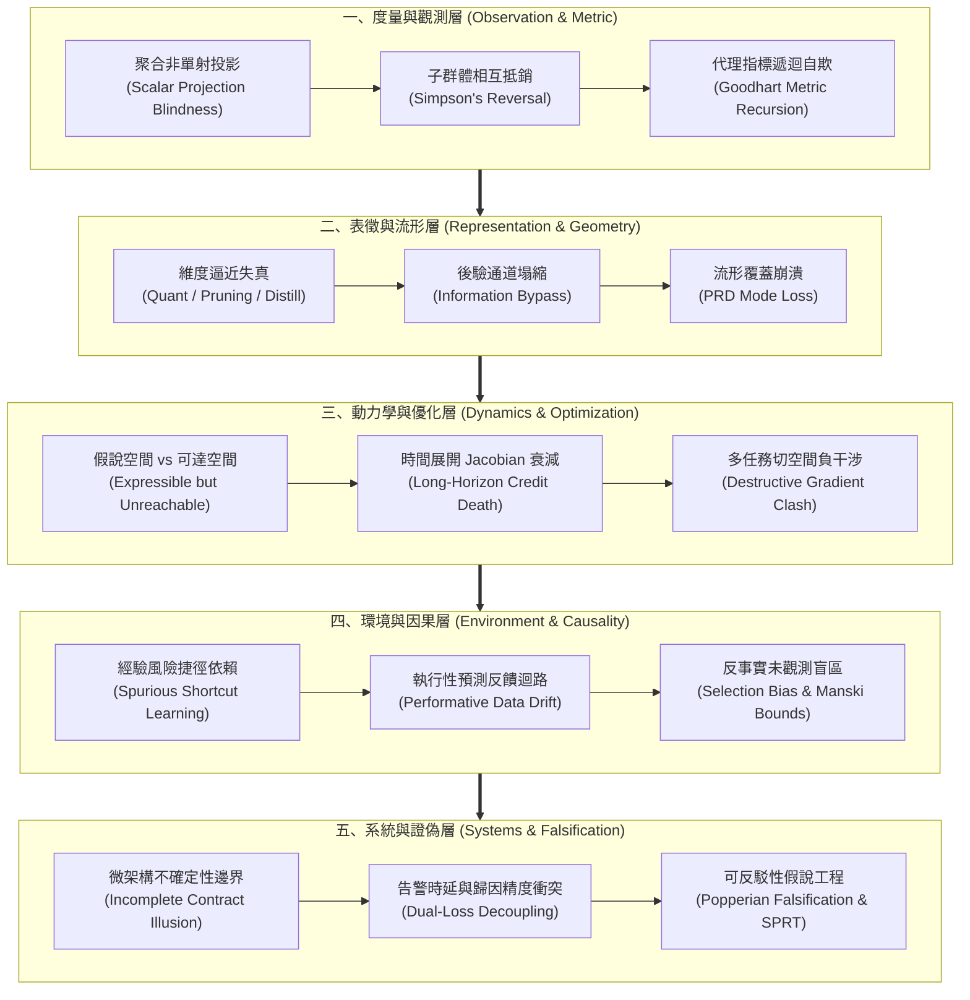

# 能力失效歸因：模型評估盲區、幾何失真與因果邊界的工程重建 (Guide)

在現代機器學習與高維經驗模型的工程落地中，最危險的事故往往不是程式崩潰或顯著的錯誤爆發，而是**「儀表板一切正常，而系統已在真實世界中全面失效」**。

這種能力失效的本質，在於我們試圖用低維、標量、靜態且局部的工程工具，去觀測並約束一個高維、非線性、動態且受反饋影響的複雜物理系統。當聚合讀數、優化目標或度量合約被誤認為真實世界的全貌時，模型退化便會在各種隱蔽的盲區中積累，直到引發災難性後果。

本導讀梳理了貫穿機器學習系統生命週期的五個正交維度，為工程師與架構師提供一套穿透表象、直抵底層物理病灶的審查視野。

---

## 1. 五維因果架構與全景拓撲 (Five-Dimensional Topology)

五個維度各自處理不同層級的物理約束與理論邊界，並形成環環相扣的工程縱深：

---

## 2. 自然閱讀順序與問題域導覽 (Reading Roadmap)

讀者可依據具體遭遇的系統症狀或工程階段，切入相應的獨立專題報告。五篇報告互不依賴，各自包含完整的理論推導、實務個案回推與可執行驗證代碼：

### 第一步：穿透標量度量的幻覺
- **專題報告**：[度量自欺與不可識別性邊界：標量讀數下的子群體塌縮與指標遞迴失效](metric-unidentifiability-and-subgroup-collapse/report.zh-TW.md)
- **診斷痛點**：監控指標看似平穩，使用者卻大量投訴特定族群判斷錯誤；改用翻轉率等新代理指標後，指標迅速再次失真。
- **核心工具**：Go 語言實作的型別安全度量引擎、辛普森逆轉偵測器與子群體單調性不變式驗證。

### 第二步：解構模型壓縮與表徵失真
- **專題報告**：[高維幾何壓縮與流形覆蓋盲區：後驗塌縮、譜半徑衰減與逼近失真權衡](geometric-distortion-and-manifold-coverage/report.zh-TW.md)
- **診斷痛點**：量化、剪枝或蒸餾後的模型在驗證集上「無損」，線上極端樣本卻頻繁崩潰；生成模型輸出樣本逼真，覆蓋率卻嚴重萎縮。
- **核心工具**：Python 數值腳本計算奇異值譜半徑衰減、PRD（分佈精確率與召回率）凸包檢定與資訊繞道判定。

### 第三步：診斷訓練動力學與梯度干涉
- **專題報告**：[最佳化可達性與動態梯度干涉：長程信用退化、鞍點阻斷與負向遷移正交化](optimization-reachability-and-gradient-interference/report.zh-TW.md)
- **診斷痛點**：盲目擴大模型層數反而導致損失停滯；序列模型無法捕捉長程依賴；微調新任務引發舊任務能力急遽退化。
- **核心工具**：Rust 高效能模組模擬時間展開 Jacobian 譜衰減、負向內積干涉偵測與 PCGrad 切空間正交投影算子。

### 第四步：防範開放環境漂移與反事實陷阱
- **專題報告**：[開放環境漂移、反事實缺失與因果不變性：捷徑歸納破滅與部分識別界限](environmental-drift-and-counterfactual-bounds/report.zh-TW.md)
- **診斷痛點**：模型權重凍結數月後準確率自動崩跌；訓練集高分模型換到新機構全面失效；業務篩選規則造成未核准樣本永遠沒有真實標籤。
- **核心工具**：TypeScript/Node.js 模組模擬選擇偏差下的 Manski 偏識別界限、反事實區間鎖定與執行性預測反饋狀態轉移。

### 第五步：建立可證偽的系統工程防線
- **專題報告**：[從完備性幻覺到可反駁契約：序貫檢驗、告警解耦與機器學習系統證偽工程](systemic-refutability-and-attribution-contracts/report.zh-TW.md)
- **診斷痛點**：試圖追求 100% 位元級重現卻被硬體微架構擾動擊潰；為縮短故障處理時間而強制告警填寫未經證實的根因，引發錯誤處置。
- **核心工具**：POSIX Bash 自動化證偽檢驗工具、Wald SPRT 序貫統計檢定器與雙軌告警損失分離架構。
