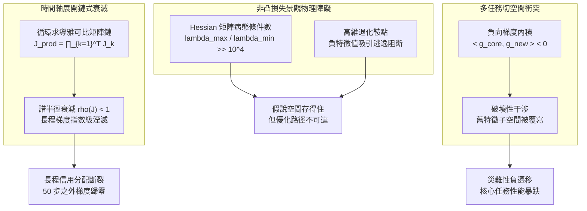

# 最佳化可達性與動態梯度干涉：長程信用退化、鞍點阻斷與負向遷移正交化

<!-- front matter -->
**Structure**: Analytical Essay
**Date**: 2026-09-13T17:30
**Model**: Gemini 3.8 Flash
**Agent**: Antigravity IDE 2.5.5
**Source**: reconstruction

## 導言

在一個複雜邏輯推論模型的開發過程中，演算法團隊遭遇了難以解釋的訓練停滯。任務要求模型在多個邏輯實體之間執行三步以上的符號關聯推理。根據神經網路架構診斷報告，工程師認為四層 Transformer 模組的「參數容量不足」，遂將模型深度從四層劇烈擴展至十二層，參數量翻了整整三倍。然而，擴容後的模型訓練損失曲線在初始下降後便徹底陷入水平鈍化，其在驗證集上的準確率甚至顯著落後於原本的四層輕量版本。儘管通用逼近定理在數學上證明了十二層網路的假說空間絕對包含目標推理函數，但基於隨機梯度下降（SGD）的局部搜尋演算法在非凸曲面上根本無法尋得通往該全域最優解的導引路徑。**「能夠表達（Expressible）」並不等同於「在最佳化上可達（Optimization Reachable）」**。

與此同時，另一套處理長文本序列對齊的模型展現了時間維度上的信用分配死局。該序列模型被要求在第 200 步輸出一個關鍵代碼標記，而決策依據取決於第 3 步輸入的一個前綴參數。任務結構本身極為清晰，但無論如何調整學習率或更換優化器，模型在反向傳播時皆無法建立跨越 197 個時間步的依賴連結。展開後的計算圖（Unrolled Computational Graph）在進行鏈式求導時，雅可比矩陣乘積的譜半徑小於一，導致誤差信號在逆流過程中發生指數級湮滅；第 3 步的權重根本接收不到來自第 200 步的有效梯度，跨時間的信用分配（Credit Assignment）徹底中斷。

更嚴重的工程失控發生在多任務微調（Multi-Task Fine-Tuning）管線中。團隊在已收斂的核心通用模型上微調一個新增的領域問答任務。新任務的指標在數個週期內迅速達標，但回歸測試套件卻發出紅色警報：模型在原始核心任務上的準確率暴跌了 20 個百分點。值班工程師直覺地採取暴力對策，將兩個任務的損失函數進行簡單的標量加權 $\mathcal{L}_{\text{total}} = \mathcal{L}_{\text{core}} + \lambda \mathcal{L}_{\text{new}}$ 並嘗試搜尋最佳權重 $\lambda$。然而，進一步的梯度幾何分析表明：兩個任務在共享參數子空間上的梯度向量內積持續為負（$\langle g_{\text{core}}, g_{\text{new}} \rangle < 0$）。沿著複合梯度更新參數，本質上是在物理維度上強行擦除核心任務已經構築的參數吸引子。

這些事故揭示了深度學習工程中一個被廣泛忽視的本質：**優化動力學（Optimization Dynamics）是獨立於架構容量的物理規律約束**。當梯度流在時間軸上消亡或在任務空間中相互廝殺時，盲目擴增網路容量只會加速系統崩潰。

---

## 分析

神經網路訓練本質上是高維非凸景觀上的受限動力學系統。設模型參數為 $\theta \in \mathbb{R}^P$，假說空間為 $\mathcal{H} = \{f_\theta \mid \theta \in \mathbb{R}^P\}$。目標風險為 $R(\theta) = \mathbb{E}[\ell(f_\theta(x), y)]$。通用逼近定理僅保證：

$$\inf_{f \in \mathcal{H}} R(f) \le \epsilon$$

但並未保證一階優化器軌跡 $\theta_{t+1} = \theta_t - \eta g_t$ 能夠收斂至具有泛化能力的流形區域。



上圖清晰梳理了三條導致最佳化破滅的動力學機制。在實務中，其數學本質可分別由以下原理精確刻劃：

### 1. 雅可比譜半徑與跨時間信用分配坍塌

在時間軸展開序列模型中，狀態轉移方程為 $h_t = \sigma(W_{hh} h_{t-1} + W_{xh} x_t)$。總損失相對於早期狀態 $h_0$ 的偏導數遵循鏈式法則：

$$\frac{\partial \mathcal{L}}{\partial h_0} = \frac{\partial \mathcal{L}}{\partial h_T} \prod_{t=1}^T \frac{\partial h_t}{\partial h_{t-1}} = \frac{\partial \mathcal{L}}{\partial h_T} \prod_{t=1}^T J_t$$

正如 [Pascanu 等人，2013 / 《On the difficulty of training recurrent neural networks》](https://proceedings.mlr.press/v28/pascanu13.html) 的開創性研究所證明的，若轉移雅可比矩陣 $J_t$ 的最大奇異值（或譜半徑 $\rho(J)$）在大部分區域滿足 $\rho(J) < 1$，則：

$$\left\| \frac{\partial \mathcal{L}}{\partial h_0} \right\| \le \left\| \frac{\partial \mathcal{L}}{\partial h_T} \right\| \prod_{t=1}^T \|J_t\| \le c \cdot \gamma^T \quad (\gamma < 1)$$

當序列長度 $T = 200$ 且 $\gamma = 0.95$ 時，傳播至起點的梯度模長將衰減至原值的 $3.5 \times 10^{-5}$。此時梯度信號完全被數值浮點噪聲掩埋，神經網路在物理上喪失了辨識時間因果的能力。

### 2. 多任務梯度干涉與切空間正交投影 (PCGrad)

當多個任務共享同一組網路主幹參數 $\theta$ 時，任務 $i$ 與任務 $j$ 各自產生的更新方向分別為 $g_i = \nabla_\theta \mathcal{L}_i$ 與 $g_j = \nabla_\theta \mathcal{L}_j$。兩者的餘弦相似度定義為：

$$\cos(\phi_{ij}) = \frac{\langle g_i, g_j \rangle}{\|g_i\| \|g_j\|}$$

當 $\cos(\phi_{ij}) < 0$ 時，表明沿著 $g_j$ 的更新步伐將嚴格增加任務 $i$ 的損失值：

$$\mathcal{L}_i(\theta - \eta g_j) \approx \mathcal{L}_i(\theta) - \eta \langle \nabla_\theta \mathcal{L}_i, g_j \rangle = \mathcal{L}_i(\theta) - \eta \langle g_i, g_j \rangle > \mathcal{L}_i(\theta)$$

[Yu 等人，2020 / 《Gradient Surgery for Multi-Task Learning: Cross-Gradient Projection》](https://proceedings.neurips.cc/paper/2020/hash/3fe78a8ac530e0ab59720b2d600377e4-Abstract.html) 提出了投影正交化手術（PCGrad）。其核心思想是在偵測到衝突時，將 $g_i$ 投影到 $g_j$ 的正交切平面上：

$$g_i^* = g_i - \frac{\langle g_i, g_j \rangle}{\|g_j\|^2} g_j \quad (\text{if } \langle g_i, g_j \rangle < 0)$$

經過投影後，$\langle g_i^*, g_j \rangle = 0$。此項變換嚴格保證了在更新任務 $i$ 時不會破壞任務 $j$ 的已有幾何結構，消除毀滅性負遷移。

為展示干涉偵測與正交化手術的因果演進，下表呈現了狀態轉移走一遍的詳細推演：

| 迭代步驟 | 任務 A 梯度向量 $g_A$ | 任務 B 梯度向量 $g_B$ | 梯度內積 $\langle g_A, g_B \rangle$ | 系統衝突狀態 | 投影手術處置 (PCGrad) | 修正後更新方向 $g^*$ | 系統狀態與效能收斂 |
| :--- | :--- | :--- | :--- | :--- | :--- | :--- | :--- |
| **Step 01** | $[1.0, 2.0, 0.5]$ | $[1.2, 1.8, 0.4]$ | $+5.00$ ($\cos \approx 0.98$) | 諧振協同 | 無需介入，直接相加 | $g = g_A + g_B$ | 兩任務同向收斂 |
| **Step 02** | $[1.0, -2.0, 0.5]$ | $[-2.0, 1.0, 0.2]$ | **$-3.90$** ($\cos \approx -0.87$) | **破壞性干涉** | 啟動正交投影手術 | $g_A^* = g_A - \frac{\langle g_A, g_B \rangle}{\|g_B\|^2} g_B$ | 阻斷任務 A 對任務 B 的負向侵蝕 |
| **Step 03** | 投影後向量 | 原始反向向量 | **$0.00$** ($\cos = 0.00$) | **嚴格正交** | 沿切平面更新 | 兩任務損失同時單調不增 | 帕累托最優邊界得以保持 |
| **反例：暴力加權** | 忽略負內積，強制執行 $g_{\text{naive}} = g_A + 2.0 g_B = [-3.0, 0.0, 0.9]$ | **持續侵蝕** | 任務 B 強行覆寫參數空間 | 任務 A 準確率暴跌 $20\%$ | 災難性遺忘發生 |

下表進一步對比傳統優化迷思與基於動力學的第一性原理工程防衛：

| 診斷維度 | 表面現象與觀測指標 | 底層動力學病灶 | 舊代脆弱反射做法 | 新代嚴格工程防衛 |
| :--- | :--- | :--- | :--- | :--- |
| **損失曲線鈍化** | 網路加深至十二層後，訓練損失停滯，驗證集表現倒退。 | Hessian 矩陣病態條件數與高維退化鞍點阻斷了一階梯度的有效導航。 | 盲目進一步擴容網路，或調大學習率。 | **殘差跳躍與動態等距初始化**：強制限制 Jacobian 譜半徑接近 1.0，確保可達路徑。 |
| **長程記憶消失** | 序列模型在間隔 100 步以上無法傳遞資訊，注意力權重發散。 | 時間展開乘積鏈中的雅可比譜半徑 $\rho(J) < 1$，梯度指數級消亡。 | 增加模型寬度或堆疊密集全連接層。 | **梯度流門控結構（Gated Flow）與跨時間跳躍連結**：維持跨時間步的高速無阻通道。 |
| **多任務負遷移** | 微調新任務達標，但原有核心能力遭遇斷崖式崩潰。 | 共享參數空間上多任務梯度內積為負，更新方向直接抹除舊特徵。 | 人工手動微調損失加權係數 $\lambda$。 | **梯度手術（PCGrad）與模組化參數隔離（LoRA/Adapters）**：切空間投影正交化，物理隔離更新基底。 |

---

## 反思

優化動力學防線的深層張力，體現在**「共享表徵的泛化紅利」**與**「參數干涉的穩定性風險」**之間的經典權衡。

多任務學習的核心初衷，是希望不同任務在共享的主幹網路中互相汲取歸納偏置（Inductive Bias），以更少的樣本學得更具通用性的表徵。然而，當兩個任務在特徵需求上並非完全對齊時（例如一個任務需要高度不變性抽象，另一個任務需要細粒度局部邊緣），參數空間的幾何吸引子必然產生拓撲排斥。

如果為了絕對避免干涉而走向極端——對每個任務完全隔離權重（例如各自訓練獨立模型），則會徹底喪失參數共享帶來的推論能耗節省與跨任務知識遷移紅利。反之，如果過度迷信單一萬能大模型，將所有正交目標強行壓縮進同一個不可拆分的密集矩陣中，優化器在梯度反向傳播時便會淪為多方拉扯的震盪系統。

因此，優化治理的實質不是消滅衝突，而是**在編譯期與執行期顯式監控梯度幾何關係**，並在衝突不可調和時提供優雅降級的架構隔離機制。

---

## 實務對比

為具體防禦多任務訓練中的破壞性干涉並確保長程梯度傳播，以下透過 Rust 實作嚴格的幾何不變式檢驗代碼。錯誤做法盲目執行加權向量合成，而正確做法實作了雅可比譜半徑衰減監控與 PCGrad 梯度切空間正交化。

```rust
// 梯度計算與動態干涉正交化模組 (PCGrad & Optimization Invariants)

fn dot_product(a: &[f64], b: &[f64]) -> f64 {
    assert_eq!(a.len(), b.len(), "Dimension mismatch in dot product");
    a.iter().zip(b.iter()).map(|(x, y)| x * y).sum()
}

fn norm_squared(a: &[f64]) -> f64 {
    dot_product(a, a)
}

// 錯誤做法：盲目加權求和，完全忽略負向內積引發的破壞性特徵覆寫
pub fn naive_gradient_merge(g1: &[f64], g2: &[f64], weight: f64) -> Vec<f64> {
    g1.iter().zip(g2.iter()).map(|(x, y)| x + weight * y).collect()
}

// 正確做法：實作 PCGrad 切空間正交化，將衝突梯度投影至彼此的法平面
pub fn pcgrad_project(g1: &[f64], g2: &[f64]) -> (Vec<f64>, Vec<f64>) {
    assert_eq!(g1.len(), g2.len(), "Dimension mismatch in PCGrad");
    let mut g1_star = g1.to_vec();
    let mut g2_star = g2.to_vec();

    let dot = dot_product(g1, g2);

    // 衝突偵測不變式：僅在梯度方向夾角大於 90 度 (內積為負) 時介入手術
    if dot < 0.0 {
        let n2_sq = norm_squared(g2);
        if n2_sq > 1e-12 {
            let scale1 = dot / n2_sq;
            for i in 0..g1.len() {
                g1_star[i] -= scale1 * g2[i];
            }
        }

        let n1_sq = norm_squared(g1);
        if n1_sq > 1e-12 {
            let scale2 = dot / n1_sq;
            for i in 0..g2.len() {
                g2_star[i] -= scale2 * g1[i];
            }
        }
    }

    (g1_star, g2_star)
}

// 時間展開雅可比譜半徑衰減模擬
pub fn verify_temporal_gradient_decay(
    initial_grad: f64,
    spectral_radius: f64,
    steps: usize,
) -> f64 {
    let mut grad = initial_grad;
    for _ in 0..steps {
        grad *= spectral_radius;
    }
    grad
}

fn main() {
    // 1. 驗證時間展開長程信用衰減
    let init_norm = 1.0;
    let rho = 0.95; // 雅可比譜半徑小於 1.0
    let horizon = 200;
    let final_grad = verify_temporal_gradient_decay(init_norm, rho, horizon);

    println!("[Temporal Credit Check] Steps: {}, Initial: {:.2}, Final: {:.6e}", horizon, init_norm, final_grad);
    // 斷言：200 步後梯度必然衰減至小於 1e-4，驗證跨時間信用分配斷裂
    assert!(final_grad < 1e-4, "Invariant failure: gradient should vanish under sub-unitary spectral radius");

    // 2. 驗證多任務梯度破壞性干涉
    // 任務 1 (核心任務) 與任務 2 (微調任務) 的梯度向量
    let g_core = vec![1.0, -2.0, 0.5];
    let g_new = vec![-2.0, 1.0, 0.2];

    let initial_dot = dot_product(&g_core, &g_new);
    println!("[Interference Check] Initial Gradient Inner Product: {:.2}", initial_dot);
    
    // 斷言：初始狀態必須為破壞性衝突 (< 0)
    assert!(initial_dot < 0.0, "Setup failure: initial vectors should be in conflict");

    // 脆弱做法結果
    let naive_update = naive_gradient_merge(&g_core, &g_new, 1.0);
    let erosion = dot_product(&naive_update, &g_core);
    println!("[Naive Update] Inner product with g_core: {:.2} (Erosion occurred)", erosion);

    // 嚴格工程做法：啟動 PCGrad 正交手術
    let (g_core_star, g_new_star) = pcgrad_project(&g_core, &g_new);
    let post_dot_1 = dot_product(&g_core_star, &g_new);
    let post_dot_2 = dot_product(&g_new_star, &g_core);

    println!("[PCGrad Update] Projected g_core* dot g_new: {:.6e}", post_dot_1);
    println!("[PCGrad Update] Projected g_new* dot g_core: {:.6e}", post_dot_2);

    // 斷言不變式：投影後的修正梯度向量，與對立任務的內積必須收斂至正交 (零或極微小數值)
    assert!(post_dot_1.abs() < 1e-9, "PCGrad invariant failure: g_core_star must be orthogonal to g_new");
    assert!(post_dot_2.abs() < 1e-9, "PCGrad invariant failure: g_new_star must be orthogonal to g_core");

    println!("All Rust Optimization and PCGrad Verification Invariants Successfully Passed.");
}
```

此段 Rust 程式碼展現了零成本抽象（Zero-cost Abstractions）在模型治理中的威力。透過強型別切片操作與編譯期確定的邊界檢查，它將高維梯度衝突的幾何檢查直接落實為毫秒級執行的常規斷言，在多任務更新合流前建立起不可動搖的切空間正交性防線。

---

## 結論

在深度學習的工程構建中，不能將優化過程視為一個可以無窮透支的黑盒求解器。模型在假說空間上的理論存在性，無法代替梯度下降在非凸景觀上的可達性；時間展開求導中的雅可比譜半徑衰減，直接決定了模型信用分配的物理長度；而多任務共享參數空間中的負內積干涉，則是引發災難性遺忘的直接力學源頭。

成熟的工程實踐必須將「優化動力學的可達性審查」置於「網路架構擴展」之前。在跨時間架構中，必須嚴格維持轉移矩陣的動態等距性以抵禦梯度消亡；在多任務與微調管線中，則必須引入幾何干涉偵測與 PCGrad 正交化投影。唯有當梯度流被約束於無衝突的切空間之內，高維系統的能力積累才不再是一場相互毀滅的零和博弈。
