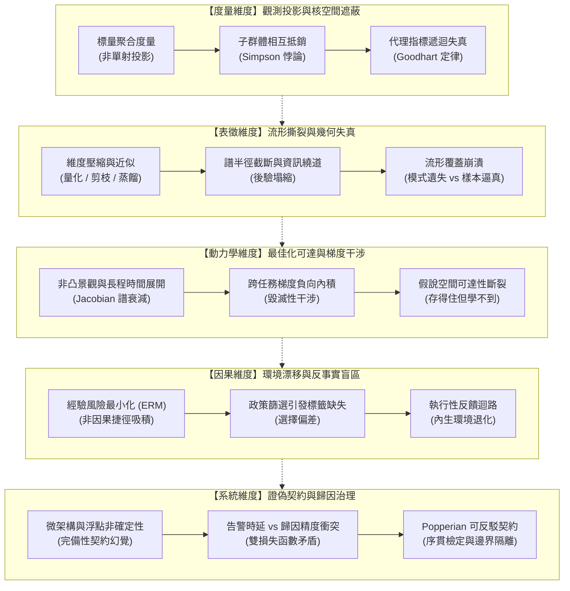

# 能力失效歸因：模型評估盲區、幾何失真與因果邊界的工程重建 (Series Map)

## 1. 核心問題域與敘事拓撲 (Problem Domain & Narrative Topology)

本系列處理機器學習系統與高維經驗模型在工程實踐中最隱蔽、最具破壞性的失效模式：**表面讀數平穩、聚合度量達標，然而底層機制已發生災難性功能坍縮或因果破裂**。

傳統觀點常將模型失效簡化為「資料量不足」或「模型容量不夠」，並試圖透過單純替換代理指標、放大網路參數量或頻繁重訓來掩蓋問題。然而，在非凸優化、高維幾何流形與開放環境動態的交織作用下，能力失效本質上源於五個正交維度的內在物理與數學規律限制：



---

## 2. 四類展開方向盤點表 (Expansion Audit Matrix)

| 展開維度 | 狀態 | 具體處置與設計說明 |
| :--- | :--- | :--- |
| **共用前提就地自含** | `就地重述` | 關於高維統計估計、梯度下降局部性、Lipschitz 連續性與因果 DAG 的基本數學前提，在各報告引導段落中以自含散文嚴格重述，不建立跨報告前置相依。 |
| **概念地圖／拓撲** | `全部落實` | 各報告皆具備專屬的 Mermaid 因果傳播流程圖或狀態轉移圖，明確標定病灶形成路徑、破壞機制與邊界防線。 |
| **反例與邊界條件** | `全部落實` | 各報告皆包含嚴格的極限案例剖析、失效反例，並清楚界定該工程防禦方案的失效邊界（何時不適用、何時成本過高）。 |
| **結構化資產** | `全部落實` | 每篇報告配備標準四維資產：流程圖 (Mermaid) + 雙重非退化表格 (Walkthrough + Diagnostic) + 跨語言最小驗證代碼 (Go, Python, Rust, TypeScript, Bash) + 形式化數學/不變式模型。 |

---

## 3. 獨立報告清單 (Master Report Manifest)

本系列包含五篇具備完整閉環論證、互不引用的獨立結晶報告。每篇報告皆由真實工程案例驅動，回推至物理機制與數學本質：

### Slot 1: `metric-unidentifiability-and-subgroup-collapse`
- **報告目錄**：`metric-unidentifiability-and-subgroup-collapse`
- **核心問題**：標量聚合指標為何無法單射到底層機制的健康狀態？在面對子群體漂移與樣本翻轉時，代理指標遞迴為何必然引發 Goodhart 塌縮？
- **不可替代角色**：揭示度量維度的觀測極限，建立多維切片單調性檢驗與辛普森反轉防禦。
- **邊界聲明**：專注於評估管道中的度量失真，不外溢至模型參數量化或訓練優化調校。
- **程式碼語言**：`Go`（型別安全度量引擎、辛普森反轉判定與單調性不變式斷言）
- **建議 Tags**：`度量評估`, `不可識別性`, `辛普森悖論`, `模型監控`

### Slot 2: `geometric-distortion-and-manifold-coverage`
- **報告目錄**：`geometric-distortion-and-manifold-coverage`
- **核心問題**：模型壓縮（量化、剪枝、蒸餾）與潛在變數模型在降低有效維度時，如何在聚合損失看似正常的假象下，導致高維流形撕裂與模式覆蓋遺失？
- **不可替代角色**：剖析高維空間幾何失真機制，釐清後驗塌縮的四種根因，並以 PRD 分佈測度取代樣本品質自欺。
- **邊界聲明**：專注於高維流形表徵與幾何逼近失真，不直接處理跨時間序列梯度消失。
- **程式碼語言**：`Python`（純標準庫計算奇異值譜截斷、後驗資訊繞道判定與 PRD 凸包覆蓋率）
- **建議 Tags**：`模型壓縮`, `流形學習`, `後驗塌縮`, `分佈覆蓋`

### Slot 3: `optimization-reachability-and-gradient-interference`
- **報告目錄**：`optimization-reachability-and-gradient-interference`
- **核心問題**：假說空間具備表達能力，為何基於梯度的局部優化器無法在非凸曲面上收斂？長程時間依賴與多任務共享參數如何引發梯度破壞性干涉？
- **不可替代角色**：解開表示容量與最佳化可達性的分離難題，建立 Jacobian 譜半徑約束與切空間投影手術（PCGrad）。
- **邊界聲明**：專注於訓練期梯度傳播動力學與多目標衝突，不涉足推論期標籤缺失處理。
- **程式碼語言**：`Rust`（Jacobian 矩陣鏈乘積衰減模擬、梯度負內積偵測與 PCGrad 切空間正交化計算）
- **建議 Tags**：`最佳化`, `梯度干涉`, `信用分配`, `多任務學習`

### Slot 4: `environmental-drift-and-counterfactual-bounds`
- **報告目錄**：`environmental-drift-and-counterfactual-bounds`
- **核心問題**：模型在凍結權重下為何風險仍持續上升？面對非干預觀測與政策篩選造成的「反事實完全缺失」，如何藉由因果圖與 Manski 偏識別界限抵禦偽相關？
- **不可替代角色**：建立環境漂移的三條傳播路徑（共變異數、概念與執行性反饋），給定反事實未觀測區間的最壞界限估計。
- **邊界聲明**：專注於分佈漂移與因果推論邊界，不涉及分散式叢集通訊與微架構除錯。
- **程式碼語言**：`TypeScript`（選擇性偏差放款評分模擬、Manski 偏識別界限演算與 Performative 漂移狀態機）
- **建議 Tags**：`因果推論`, `分佈漂移`, `反事實`, `捷徑學習`

### Slot 5: `systemic-refutability-and-attribution-contracts`
- **報告目錄**：`systemic-refutability-and-attribution-contracts`
- **核心問題**：在微架構擾動與非確定性邊界下，機器學習系統的「確定性完全重現」為何是致命幻覺？如何解耦快速告警與深層因果歸因，建立可反駁性契約？
- **不可替代角色**：重構機器學習工程的治理認識論，落實 Wald 序貫檢定（SPRT）與雙損失函數架構分離。
- **邊界聲明**：專注於系統工程、告警管線與證偽契約，不重複論述單一任務的損失函數推導。
- **程式碼語言**：`Bash`（POSIX 嚴格語法、Wald SPRT 序貫檢定器與自動化假說證偽邊界檢查）
- **建議 Tags**：`系統證偽`, `告警機制`, `序貫檢定`, `軟體工程`

---

## 4. 系列與主題標籤配置 (Metadata)

```toml
series = ["能力失效歸因：模型評估盲區、幾何失真與因果邊界的工程重建"]
```
