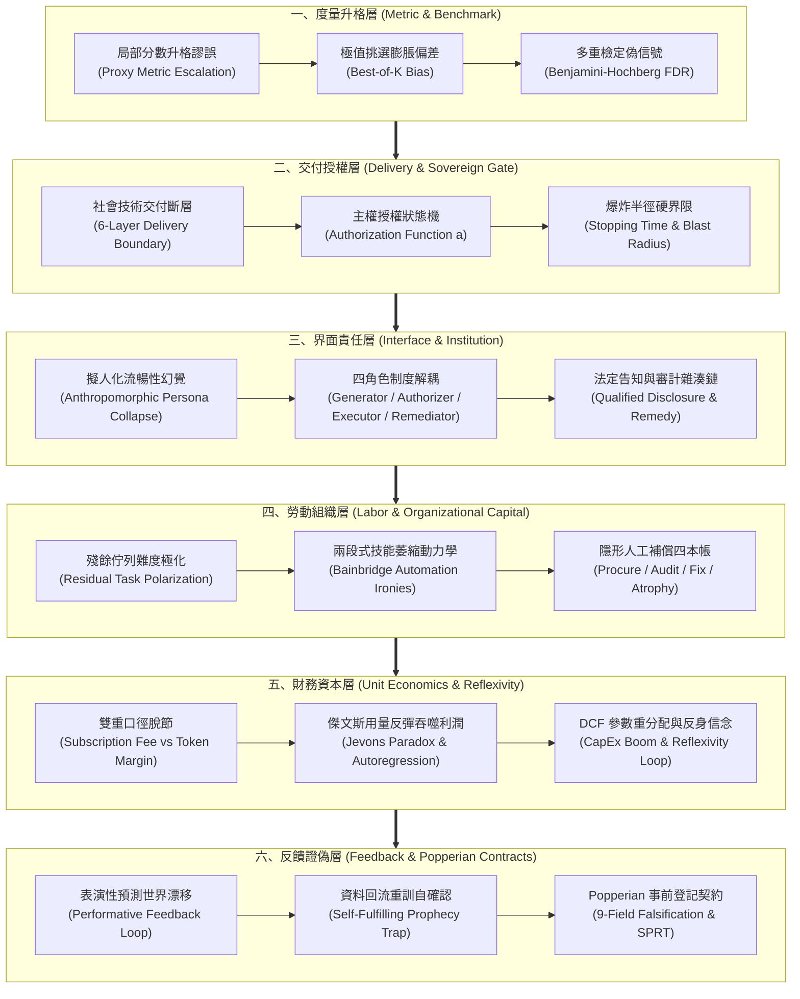

# AI 效用宣稱的轉換鏈：從代理量、界面承諾到資本反身性與可證偽驗證 (Guide)

在當代人工智慧、機器學習系統與認知自動化的落地浪潮中，最深刻且代價高昂的治理危機往往不是演算法的徹底崩潰，而是**「評測讀數名列前茅、界面回應極致流暢、用量成長勢如破竹，然而整體組織的實際產出、貢獻利益與追責防線卻全盤瓦解」**。

這種全面性錯位的根本原因，在於技術採購者與系統架構師經常陷入一種「線性升格幻覺」——誤以為在封閉測試集上的局部分數（代理量），可以直接等價於真實社會技術系統中的端到端效用；誤以為流暢的自然語言界面可以替代制度上的權責劃界；誤以為用量擴大等於規模經濟；誤以為模型可以自發性地逃離因果反饋與表演性世界。

本導讀旨在梳理貫穿「AI 效用宣稱轉換鏈」的六個關鍵斷裂點。六篇獨立結晶報告互不引用、自包含且各自閉合，為工程師、架構師與技術決策者提供一套從底層統計極值、微架構授權狀態機，延伸至組織互補資本與資本市場反身性的嚴密審查與防禦地圖。

---

## 1. 六維因果架構與全景拓撲 (Six-Dimensional Conversion Topology)

六個維度依循因果傳播與系統邊界層層遞進，構成一個嚴密的社會技術轉換鏈：

---

## 2. 自然閱讀路徑與專題導覽 (Reading Roadmap)

讀者可依據專案所處的生命週期階段、組織遭遇的具體瓶頸，自由切入對應的獨立結晶報告：

### 第一步：拆解基準測試與評測自欺
- **專題報告**：[代理量升格謬誤與基準測試選擇偏差：高階統計失真、極值排序反轉與多重檢定校正](proxy-escalation-and-benchmark-divergence/report.zh-TW.md)
- **核心痛點**：內部 Benchmark 或公開評測集分數創新高，但部署至線上業務後真實業務價值（如挽留率、診斷準確率）絲毫未動甚至倒退。
- **治理工具**：Python 實作之極值順序統計量膨脹計算、Best-of-$K$ 評測偏差模擬、Benjamini-Hochberg 假發現率（FDR）校正器。

### 第二步：構築輸出後果化的主權授權防線
- **專題報告**：[社會技術交付鏈與主權授權閘門：輸出後果化、爆炸半徑約束與停止時間不變式](delivery-boundary-layers-and-authorization-gates/report.zh-TW.md)
- **核心痛點**：將大模型輸出文字直接連接到生產 API、交易下單或臨床建議，一旦模型產生非預期 Token 輸出，系統缺乏不可旁路的停止時間與限額防線。
- **治理工具**：Rust 強型別編譯期狀態機、零成本抽象的不可旁路主權授權閘門、爆炸半徑（Blast Radius）熔斷監控器。

### 第三步：擊破擬人化界面並落實制度救濟
- **專題報告**：[擬人化界面幻覺與制度性救濟鏈：四角色職能解耦、告知資格與可爭訟審計追蹤](anthropomorphic-interface-and-institutional-remedy/report.zh-TW.md)
- **核心痛點**：對話型機器人以「我」自稱並給予錯誤政策承諾，企業以「機器人只是演算法」試圖卸責；或是告知使用者有演算法介入，卻不提供實質爭議救濟途徑。
- **治理工具**：TypeScript 嚴格區分聯合型別（Discriminated Unions）落實生成、授權、執行、救濟四角色隔離、密碼學 SHA-256 審計雜湊鏈。

### 第四步：揭開人工補償黑洞與自動化反諷
- **專題報告**：[人工補償四本帳與自動化反諷：殘餘佇列難度極化、警覺度衰退與組織互補資本](human-compensation-ledgers-and-automation-decay/report.zh-TW.md)
- **核心痛點**：AI 導入後名義工時縮短，但覆核人員因長年面對罕見疑難雜症而喪失處置能力，系統陷入「出事時沒人懂如何接管」的致命僵局。
- **治理工具**：Go 並發安全遙測引擎，即時量測工人警覺度衰退週期、難度極化指數與四本帳（採購、審計、修復、萎縮）分攤會計模型。

### 第五步：穿透單位經濟逆轉與資本反身性泡沫
- **專題報告**：[微觀邊際逆轉與資本反身性閉環：用量成長的毛利侵蝕、傑文斯反彈與估值折現重分配](unit-economic-divergence-and-capital-reflexivity/report.zh-TW.md)
- **核心痛點**：用戶活躍度與 Token 調用量爆發性增長，但公司雲端成本翻倍暴增、毛利率直線下滑；巨額資本支出建立在不可驗證的信念假設之上。
- **治理工具**：Python 純標準庫精確模擬自回歸邊際成本非線性爬升、傑文斯彈性利潤坍縮矩陣、DCF 折現率動態敏感度分析。

### 第六步：以可證偽契約終結表演性資料自欺
- **專題報告**：[表演性資料反饋與可反駁效用契約：自確認世界退化、序貫檢定與事前登記九欄位](performative-data-feedback-and-falsifiable-contracts/report.zh-TW.md)
- **核心痛點**：模型預測誘導了使用者行為，回流資料「印證」了模型的先驗預測，形成虛假的自我確認循環；評估指標在事後隨意調整以迎合成功敘事。
- **治理工具**：POSIX 嚴格語法 Bash 工具套件，落實九欄位事前登記驗證契約、Wald 序貫比檢驗（SPRT）與不可篡改的證偽判定器。
