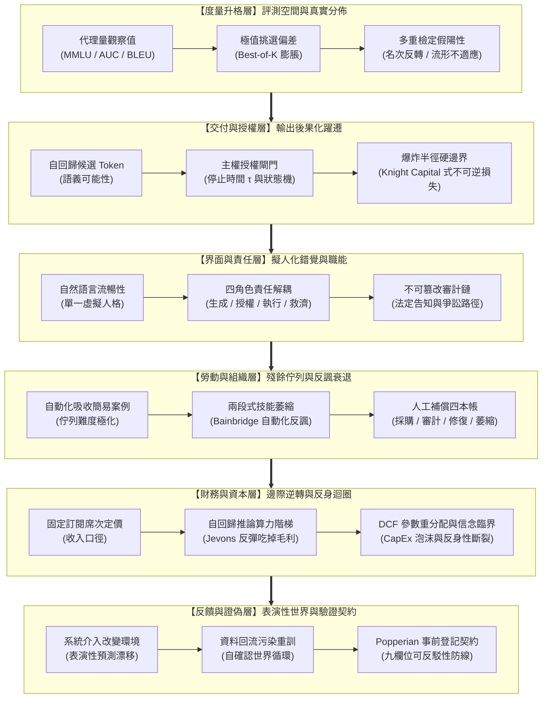

# AI 效用宣稱的轉換鏈：從代理量、界面承諾到資本反身性與可證偽驗證 (Series Map)

## 1. 核心問題域與敘事拓撲 (Problem Domain & Narrative Topology)

本系列處理人工智慧（AI）能力與商業效用宣稱在真實世界中最普遍、最具欺騙性的認知與工程斷層：**「鏈上局部環節的度量讀數或表面流暢性，被未經證成地升格為整條社會技術價值鏈的端到端效用結論」**。

在傳統軟體工程與商業決策中，評測分數提高通常等價於系統能力提升，而系統能力提升進而推動邊際成本下降與淨利潤增長。然而在生成式模型與複雜人機協作系統中，這個「能力 $\to$ 效用 $\to$ 經濟回報」的因果鏈條存在六處正交的物理與制度斷裂點：



---

## 2. 四類展開方向盤點表 (Expansion Audit Matrix)

| 展開維度 | 狀態 | 具體處置與設計說明 |
| :--- | :--- | :--- |
| **共用前提就地自含** | `就地重述` | 關於「代理量 $\neq$ 端到端效用」、「授權函數不在模型內部而在宿主環境」以及「盤點式 $\neq$ 會計恆等式」等公理化前提，在各報告引導章節中以自含散文嚴格重述，嚴禁建立跨篇前置相依。 |
| **概念地圖／拓撲** | `全部落實` | 六篇報告皆配備專屬 Mermaid 流程圖或狀態轉移圖，精確定義因果擴散鏈、狀態機不變式與責任邊界防線。 |
| **反例與邊界條件** | `全部落實` | 各報告皆明訂失敗邊界與反例（如全域靜態受限環境下的無害代理、不可撤銷事務下的閘門鎖死、高雜訊環境下的 SPRT 提早終止風險）。 |
| **結構化資產** | `全部落實` | 每篇報告配備標準四維資產：流程圖 (Mermaid) + 雙重非退化表格 (Walkthrough + Diagnostic) + 跨語言最小驗證代碼 (Python, Rust, TypeScript, Go, Python, Bash) + 形式化數學/狀態不變式模型。 |

---

## 3. 獨立報告清單 (Master Report Manifest)

本系列包含六篇具備完整閉環論證、互不引用的獨立結晶報告。每篇報告皆由真實工程或產業事故驅動，回推至物理機制與數學本質：

### Slot 1: `proxy-escalation-and-benchmark-divergence`
- **報告目錄**：`proxy-escalation-and-benchmark-divergence`
- **核心問題**：標量代理度量（如 MMLU、BLEU、AUC）為何無法單射到底層端到端效用？在面對高維評測空間時，Best-of-$K$ 挑選增益如何引發名次反轉與適應性過擬合？
- **不可替代角色**：建立全系列度量維度的升格形式錯誤，從極值統計推導多重檢定偏差與 Benjamini-Hochberg FDR 防衛。
- **邊界聲明**：專注於評測與度量維度之形式謬誤，不外溢至微架構授權執行或定價模型。
- **程式碼語言**：`Python`（極值順序統計量計算、Best-of-$K$ 期望膨脹模擬、Benjamini-Hochberg FDR 多重檢定校正器）
- **建議 Tags**：`代理量升格`, `基準測試`, `選擇偏差`, `極值統計`, `端到端效用`

### Slot 2: `delivery-boundary-layers-and-authorization-gates`
- **報告目錄**：`delivery-boundary-layers-and-authorization-gates`
- **核心問題**：自回歸候選文字在何時、依據何種條件轉化為不可逆的實體行動？缺乏獨立授權閘門與爆炸半徑約束如何釀成災難性損失？
- **不可替代角色**：解構模型輸出與社會技術系統的六層交付邊界，建立基於停止時間 $\tau$ 與爆炸半徑 $B$ 的強型別主權授權狀態機。
- **邊界聲明**：專注於外部宿主環境之授權閘門與交易防線，不介入模型權重微調。
- **程式碼語言**：`Rust`（強型別編譯期狀態機、不可旁路授權閘門、爆炸半徑限額監控器與自驗證單元測試）
- **建議 Tags**：`交付邊界`, `授權閘門`, `爆炸半徑`, `狀態機`, `軟體架構`

### Slot 3: `anthropomorphic-interface-and-institutional-remedy`
- **報告目錄**：`anthropomorphic-interface-and-institutional-remedy`
- **核心問題**：自然語言的流暢對話外觀如何造成虛擬人格錯覺，進而吞噬制度上的權限分立？合法的演算法告知需要哪些資格條件與救濟鏈？
- **不可替代角色**：解耦單一界面背後的生成、授權、執行、救濟四個法律與工程角色，建立不可篡改的審計日誌雜湊鏈與爭訟程序。
- **邊界聲明**：專注於人機交互界面之責任法理與審計架構，不涉足大規模訓練基礎設施。
- **程式碼語言**：`TypeScript`（嚴格 Discriminated Unions 四角色隔離、密碼學 SHA-256 審計日誌雜湊鏈、可爭訟交易回滾驗證）
- **建議 Tags**：`擬人化界面`, `角色解耦`, `審計追蹤`, `救濟機制`, `演算法治理`

### Slot 4: `human-compensation-ledgers-and-automation-decay`
- **報告目錄**：`human-compensation-ledgers-and-automation-decay`
- **核心問題**：自動化接管常規任務後，殘餘極端案例的難度極化如何導致人工後盾失能？隱藏於四本帳中的人工補償成本為何反噬生產力？
- **不可替代角色**：推導 Bainbridge 自動化反諷下的兩段式技能萎縮動力學，重構包含外部採購、審計、修復與技能損耗的人工補償會計模型。
- **邊界聲明**：專注於人機分工之認知心理學、警覺度衰退與組織資本互補，不處理宏觀股票估值模型。
- **程式碼語言**：`Go`（並發安全工人警覺度遙測、佇列難度極化追蹤、四本帳即時分攤計算與自檢斷言）
- **建議 Tags**：`人工補償`, `自動化反諷`, `技能衰退`, `組織互補`, `人機協作`

### Slot 5: `unit-economic-divergence-and-capital-reflexivity`
- **報告目錄**：`unit-economic-divergence-and-capital-reflexivity`
- **核心問題**：固定訂閱席次收入與自回歸 Token 邊際推論成本之間為何存在系統性口徑脫節？資本開支的宏大敘事如何在 DCF 參數中引發反身性斷裂？
- **不可替代角色**：推導傑文斯反彈下的邊際貢獻利益坍縮模型，量化資本折現率與增長率參數的非對稱敏感度，揭示反身性信念臨界值。
- **邊界聲明**：專注於微觀單位經濟學、算力彈性與巨額資本配置循環，不處理單一演算法的收斂性證明。
- **程式碼語言**：`Python`（純標準庫，自回歸 Token 邊際成本曲線、Jevons 需求彈性模擬、多情境 DCF 估值折現率敏感度矩陣與自檢）
- **建議 Tags**：`單位經濟`, `傑文斯悖論`, `反身性`, `折現現金流`, `資本配置`

### Slot 6: `performative-data-feedback-and-falsifiable-contracts`
- **報告目錄**：`performative-data-feedback-and-falsifiable-contracts`
- **核心問題**：預測性模型在介入真實世界後，如何透過行為反饋塑造未來資料並使自身成為「自確認偽證」？如何以 Popperian 可反駁性契約終結資料自欺？
- **不可替代角色**：剖析表演性預測與封閉反饋迴路的內生分佈漂移，建立九欄位事前登記效用契約與 Wald 序貫比檢驗防線。
- **邊界聲明**：專注於因果推論、表演性分佈演化與科學證偽哲學，不涉及個別硬體核心排程。
- **程式碼語言**：`Bash`（POSIX 嚴格語法，九欄位可反駁性契約驗證器、Wald SPRT 序貫比檢定器、分佈偏移自檢斷言）
- **建議 Tags**：`表演性預測`, `資料回流`, `可證偽契約`, `事前登記`, `序貫檢定`

---

## 4. 系列與主題標籤配置 (Metadata)

```toml
series = ["AI 效用宣稱的轉換鏈：從代理量、界面承諾到資本反身性與可證偽驗證"]
```
