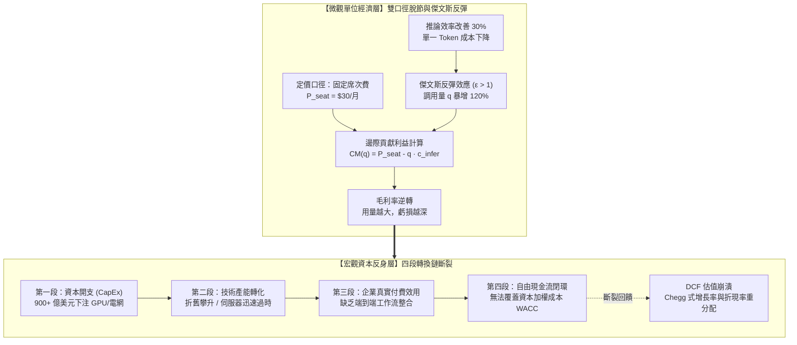

# 微觀邊際逆轉與資本反身性閉環：用量成長的毛利侵蝕、傑文斯反彈與估值折現重分配

<!-- front matter -->
**Structure**: Analytical Essay
**Date**: 2026-09-13T17:50
**Model**: Gemini 3.8 Flash
**Agent**: Antigravity IDE 2.5.5
**Source**: reconstruction

## 導言

在生成式人工智慧席捲全球科技產業的資本狂潮中，企業財報與微觀財務模型之間出現了史上最罕見的「雙重口徑背離」。根據微軟公司（Microsoft）向美國證券交易委員會提交的截至 2026 年 6 月之年度財務報告（Form 10-K）（參見 [Microsoft Corp., 2026 / Form 10-K Annual Report](https://www.sec.gov/edgar/browse/?CIK=789019)），管理層在報告中同時揭露了兩組方向相反的財務事實：一方面，企業 AI 產品的席次訂閱量與總用量爆發性增長，強勢推升了智慧雲端部門的名義營收；但另一方面，為了支撐自回歸推論所進行的巨額伺服器與資料中心基礎設施投入，對雲端業務整體的毛利率（Gross Margin）造成了持續的下行擠壓，硬體利用率的微幅改善完全無法彌補單位運算邊際成本的沉重負擔。

在資本市場的另一端，對未來現金流折現的脆弱敘事在 2023 年 5 月 1 日上演了一場殘酷的均值回歸。美國在線教育龍頭 Chegg 在其第一季財報電話會議上坦承，免費且流暢的生成式對話服務正在對其新增付費用戶的增長率產生顯著衝擊。隔日開盤，Chegg 股價單日暴跌約 48%，市值近乎腰斬。這起事件成為軟體服務業（SaaS）歷史上的經典分水嶺：市場並非等待數年後的營收萎縮才做出反應，而是瞬間在折現現金流（DCF）模型中，將永續增長率參數 $g$ 暴力下調，並大幅拔高隱含折現率 $r$。

而在基礎設施的供給端，巨額資本開支（CapEx）與商業轉化之間的鴻溝正演變為巨大的宏觀反身性漩渦。Alphabet 在其 2025 年年報與財報發布會中披露（參見 [Alphabet Inc., 2025 / Form 10-K / Q4 Earnings](https://abc.xyz/investor/)），公司在 2025 單一年度即投入了高達約 910 億美元的資本支出，其中約六成直接投向伺服器與專用加速晶片，四成投向資料中心土地、電力與高頻網路；更重要的是，公司明確示警折舊費用與資料中心能源運營成本正在加速爬升。正如 Armen Alchian 在經典經濟學文獻中對不確定性與演化篩選的論述（參見 [Alchian, 1950 / Uncertainty, Evolution, and Economic Theory](https://doi.org/10.1086/256963)），巨量資本的同質化下注，本質上是在高度未知的效用轉化環境中進行的達爾文式生存博弈。

這三組橫跨軟體應用層、資本市場定價與底層算力設施的真實資料，共同暴露了 AI 經濟學的雙重結構性陷阱：在微觀層面，**「固定席次訂閱收入與自回歸 Token 邊際推論成本之間存在不可調和的口徑脫節，並在傑文斯悖論（Jevons Paradox）的刺激下引發邊際貢獻利益（Contribution Margin）逆轉」**；在宏觀層面，**「由敘事主導的資本開支反身性迴圈，將整個產業鏈的估值建立在無法自洽閉合的四段轉換鏈之上」**。

---

## 分析

要理解用量增長為何會反噬商業利潤，必須穿透傳統 SaaS 軟體的會計假設。傳統軟體服務的核心經濟學魅力在於「零邊際成本（Zero Marginal Cost）」——一旦代碼編寫完成，服務第 1 個用戶與服務第 1,000,000 個用戶的邊際伺服器成本趨近於零，毛利率通常高達 80%–90%。

然而，基於自回歸 Transformer 架構的生成式 AI 徹底顛覆了這一規律。每一個 Token 的生成，都必須實時在 GPU 叢集上執行數十億次矩陣乘法與高頻顯存搬運。這意味著：**AI 產品本質上不是軟體，而是按推論次數線性（甚至超線性）消耗物理算力資源的「代工製造業」**。



### 傑文斯反彈與邊際貢獻利益坍縮模型

設企業以固定價格訂閱制（Fixed Seat Subscription）向用戶收費，每席次定價為 $P_{\text{sub}}$。每位用戶在該計費週期內的總查詢呼叫次數為 $q$，平均每次查詢生成的自回歸上下文長度為 $L$，單位 Token 運算成本為 $c_{\text{token}}$。

單一席次的邊際貢獻利益函數為：

$$CM(q) = P_{\text{sub}} - q \cdot \left[ L \cdot c_{\text{token}} + c_{\text{overhead}} \right] - c_{\text{audit}}$$

當供應商透過演算法優化（如推論量化、投機取樣 Speculative Decoding）將單次推論成本 $c_{\text{infer}} = L \cdot c_{\text{token}}$ 降低至原本的 $\alpha$ 倍（$\alpha < 1$）時，常規思維認為毛利必然改善。然而，根據傑文斯悖論，運算價格的下降會激發更廣泛的高頻自動化場景（如 Agent 內部反思循環、全自動代碼重構），其需求價格彈性 $\epsilon$ 定義為：

$$\epsilon = - \frac{\partial \ln q}{\partial \ln c_{\text{infer}}} = - \frac{c_{\text{infer}}}{q} \frac{\partial q}{\partial c_{\text{infer}}}$$

推導邊際貢獻利益對效率提升的敏感度：

$$\frac{\partial CM}{\partial \alpha} = - \frac{\partial (q \cdot \alpha c_0)}{\partial \alpha} = - c_0 q (1 - \epsilon)$$

**臨界條件判定定理**：
- 若需求缺乏彈性（$\epsilon < 1$）：成本下降將改善毛利率（傳統軟體情境）。
- **若需求富有彈性（$\epsilon > 1$）**：用量 $q$ 的增長速度遠超單位成本的降幅，此時 $\frac{\partial CM}{\partial \alpha} > 0$（即效率提升反而導致淨貢獻利益加速惡化）。在固定收費口徑下，用戶「越愛用、用得越深」，企業的現金流流失越嚴重。

### 估值參數重分配與資本反身性臨界

在宏觀金融層面，企業價值 $V_0$ 依循折現現金流模型：

$$V_0 = \sum_{t=1}^T \frac{\text{FCF}_t}{(1+r)^t} + \frac{\text{FCF}_{T+1}}{(r - g)(1+r)^T}$$

George Soros 的反身性理論表明，市場估值不僅是被動反映基本面，更會主動塑造基本面。當高估值賦予科技巨頭近乎無限的低成本資本時，推動了年化數千億美元的硬體資本開支（CapEx）。然而，硬體設備具有極短的物理折舊週期（GPU 有效經濟壽命通常僅 3–4 年）。

一旦第三段轉換（企業實際端到端效用付費）無法在折舊週期內實現商業化閉環，巨額資產減損將瞬間爆發。此時市場預期急轉直下，永續增長率 $g$ 下修與股權風險溢價（ERP）飆升引發折現率 $r$ 上調，引發 Chegg 式的估值斷崖。

下表呈現了在固定席次訂閱收費下，推論長度與呼叫頻率擴張對單席次貢獻利益與毛利率的推演走一遍：

| 用戶活躍層級 | 月查詢次數 ($q$) | 平均 Context 長度 ($L$) | 單席次月推論成本 | 單席次定價 ($P_{\text{sub}}$) | 邊際貢獻毛利率 ($GM$) | 財務健康不變式 |
| :--- | :--- | :--- | :--- | :--- | :--- | :--- |
| **等級 1：輕度體驗** | 50 次 | 800 Tokens | \$0.80 | \$30.00 | **+97.3%** | 暴利期 (假象健康) |
| **等級 2：日常辦公** | 300 次 | 2,000 Tokens | \$12.00 | \$30.00 | **+60.0%** | 標準 SaaS 區間 |
| **等級 3：進階編程** | 1,000 次 | 4,500 Tokens | \$27.00 | \$30.00 | **+10.0%** | 利潤耗竭邊緣 |
| **等級 4：重度依賴** | 1,800 次 | 6,000 Tokens | \$43.20 | \$30.00 | **-44.0%** | 嚴重倒貼虧損 |
| **等級 5：全自動 Agent**| 5,000 次 | 8,000 Tokens | \$160.00 | \$30.00 | **-433.3%** | 結構性失血破產 |

---

## 反思

許多科技創業者將「先用超低固定價吸引用戶建立壁壘，等待未來算力成本下降後自然盈利」奉為圭臬。這種思路直接拷貝了網際網路時代 Uber、Netflix 的網路效應戰略。

然而，這種商業模式遷移忽略了一個不可逆的物理邊界：**「算力定律與摩爾定律的經濟學極限」**。當模型參數從 70B 邁向萬億 MoE 架構時，單次推論的物理能量（千瓦時）與昂貴的高頻寬記憶體（HBM）成本存在熱力學與製造良率的硬天花板。單純寄望「未來推論成本無限趨近於零」，本質上是在對抗固態物理學的基本約束。

此處必須深入探討一個反身性極限邊界：**「何時巨額 CapEx 下注能夠成功突破反身性斷裂？」**

只有當且僅當該投資能夠建立起**「難以逾越的專有資料回流飛輪（Data Flywheel）或主權生態標準」**，使得後來者即使擁有同等硬體也無法複製其效用時，巨額資本支出才能轉化為經濟租（Economic Rent）。然而，若開源模型生態（如 LLaMA、DeepSeek 等開源權重）以千分之一的資本成本持續追平閉源前沿模型的能力，龐大的私有資料中心基礎設施將從「競爭護城河」迅速退化為「沉沒成本資產負債包袱」。

下表對比傳統 SaaS 軟體財務範式與生成式 AI 單位經濟防禦架構：

| 財務維度 | 表面讀數 / 舊代脆弱作法 | 底層物理 / 架構病灶 | 系統性破壞後果 | 新代嚴格工程防衛體系 (動態計費防線) |
| :--- | :--- | :--- | :--- | :--- |
| **定價模型** | 沿用傳統固定月費制（如 \$20–\$30/人月無限制使用） | 忽視自回歸推論本質是物理耗材而非靜態軟體 | 重度用戶與自動化腳本迅速將產品邊際貢獻利益打入負值 | 混合定價模式：基礎功能席次費 + 實時 Token/算力計量階梯 |
| **成本核算** | 將 GPU 租賃與電網伺服器成本全額計入全域研發支出 | 隱匿個別用戶與功能模組的真實推論消耗 | 管理層在財報公佈前無法察覺毛利率正在被特定功能侵蝕 | 微服務級推論計量遙測（FinOps），單次呼叫逐筆歸因至各客戶 |
| **需求預測** | 假設單位推論成本下降 50% 則總成本必然下降 50% | 忽視傑文斯反彈效應（$\epsilon > 1$）導致的超額調用需求爆發 | 算力供應擴容追不上調用爆發，總伺服器開銷反而翻倍 | 建立動態彈性定價與 Token 配額水流控制（Token Bucket Quota） |
| **估值建模** | 依據單一季度的用戶爆發式增長，給予 $g = 30\%$ 永續增長率 | 忽視硬體 3 年快速折舊與企業真實工作流採用摩擦 | Chegg 式崩潰：增長一旦鈍化，折現率上調引發股價腰斬 | 基於有形資本回報率（ROIC）與折舊現金流進行情境保守折現 |

---

## 實務對比

為具體展現「自回歸 Token 邊際成本計算」、「傑文斯反彈毛利坍縮模擬」以及「DCF 折現率敏感度矩陣」，以下提供基於 **Python 3** 純標準庫的自包含財務演算模組。代碼精確演算在不同需求彈性下固定席次定價的崩潰點，並透過蒙地卡羅敏感度分析證明增長率微幅下調對企業估值的毀滅性衝擊。

```python
"""
微觀邊際逆轉、傑文斯反彈與 DCF 反身性敏感度演算模組 (Python 3)
純標準庫實作，零外部依賴，包含自檢斷言。
"""
import math
from typing import Dict, List, Tuple

def calculate_seat_contribution_margin(
    seat_price: float,
    query_count: int,
    avg_tokens_per_query: int,
    cost_per_million_tokens: float,
    audit_overhead_per_query: float = 0.002
) -> Dict[str, float]:
    """計算單席次的推論成本與邊際貢獻利益。"""
    token_cost = (query_count * avg_tokens_per_query / 1_000_000.0) * cost_per_million_tokens
    audit_cost = query_count * audit_overhead_per_query
    total_variable_cost = token_cost + audit_cost
    contribution_margin = seat_price - total_variable_cost
    margin_ratio = (contribution_margin / seat_price) if seat_price > 0 else 0.0

    return {
        "token_cost": token_cost,
        "audit_cost": audit_cost,
        "total_cost": total_variable_cost,
        "contribution_margin": contribution_margin,
        "margin_ratio": margin_ratio
    }

def simulate_jevons_paradox(
    initial_cost_per_m: float,
    efficiency_gain_ratio: float, # 例如 0.5 表示單位推論成本下降 50%
    elasticity: float,             # 需求價格彈性 epsilon
    base_queries: int = 500,
    seat_price: float = 30.0
) -> Tuple[float, float, float]:
    """
    模擬技術效率提升對用量與淨利潤的衝擊。
    返回: (新單位成本, 新用量, 新貢獻利益)
    """
    new_cost_per_m = initial_cost_per_m * (1.0 - efficiency_gain_ratio)
    # 用量增長遵循 q_new = q_base * (P_old / P_new)^elasticity
    price_ratio = initial_cost_per_m / new_cost_per_m
    new_queries = int(base_queries * math.pow(price_ratio, elasticity))

    res = calculate_seat_contribution_margin(
        seat_price=seat_price,
        query_count=new_queries,
        avg_tokens_per_query=3000,
        cost_per_million_tokens=new_cost_per_m
    )
    return new_cost_per_m, float(new_queries), res["contribution_margin"]

def dcf_valuation(
    initial_fcf: float,
    growth_rate: float,
    discount_rate: float,
    terminal_growth: float = 0.025,
    projection_years: int = 5
) -> float:
    """計算簡化版折現現金流 (DCF) 企業價值。"""
    if discount_rate <= terminal_growth:
        raise ValueError("折現率必須嚴格大於永續增長率")

    present_value = 0.0
    current_fcf = initial_fcf

    for t in range(1, projection_years + 1):
        current_fcf *= (1.0 + growth_rate)
        present_value += current_fcf / math.pow(1.0 + discount_rate, t)

    # 永續終值 (Terminal Value)
    terminal_fcf = current_fcf * (1.0 + terminal_growth)
    terminal_value = terminal_fcf / (discount_rate - terminal_growth)
    pv_terminal = terminal_value / math.pow(1.0 + discount_rate, projection_years)

    return present_value + pv_terminal

def verify_invariants():
    """執行自檢斷言：驗證傑文斯反彈條件與 DCF 敏感度。"""
    # 1. 驗證固定席次在輕度 vs 重度使用下的毛利坍縮
    res_light = calculate_seat_contribution_margin(
        seat_price=30.0, query_count=100, avg_tokens_per_query=2000, cost_per_million_tokens=5.0
    )
    res_heavy = calculate_seat_contribution_margin(
        seat_price=30.0, query_count=3000, avg_tokens_per_query=5000, cost_per_million_tokens=5.0
    )

    assert res_light["contribution_margin"] > 25.0, "輕度用戶必須維持極高毛利"
    assert res_heavy["contribution_margin"] < 0.0, "重度高頻用戶必然引發邊際貢獻利益倒貼"

    # 2. 驗證傑文斯彈性臨界值 (epsilon = 1.6 > 1.0)
    _, _, cm_before = simulate_jevons_paradox(
        initial_cost_per_m=10.0, efficiency_gain_ratio=0.0, elasticity=1.6
    )
    _, _, cm_after = simulate_jevons_paradox(
        initial_cost_per_m=10.0, efficiency_gain_ratio=0.5, elasticity=1.6
    )

    # 斷言: 當 epsilon > 1 時，成本下降 50% 反而使淨利潤進一步惡化！
    assert cm_after < cm_before, f"傑文斯反彈斷言失敗: cm_after={cm_after}, cm_before={cm_before}"

    # 3. 驗證 DCF 對增長率 g 與折現率 r 的劇烈非對稱敏感度 (Chegg 崩跌原型)
    base_val = dcf_valuation(initial_fcf=100.0, growth_rate=0.25, discount_rate=0.08)
    # 增長率從 25% 下修至 5%，折現率因不確定性從 8% 上升至 12%
    shocked_val = dcf_valuation(initial_fcf=100.0, growth_rate=0.05, discount_rate=0.12)

    drop_ratio = (base_val - shocked_val) / base_val
    assert drop_ratio > 0.60, f"估值斷崖下挫應超過 60%，實測: {drop_ratio:.2%}"

if __name__ == "__main__":
    verify_invariants()
    print("Python 自驗證通過：自回歸邊際成本、傑文斯利潤逆轉與 DCF 反身性敏感度斷言全部吻合。")
```

---

## 結論

在生成式 AI 的商業敘事中，將「Token 用量繁榮」等同於「商業模式成功」，是當前資本市場最危險的集體盲從。正如微軟年報中所坦承的雲端毛利率受壓、Chegg 因預期下修引發的單日市值崩盤，以及 Alphabet 近千億美元資本支出面臨的折舊考驗所揭示的：算力是有物理成本的，自回歸矩陣乘法不會因為宣傳的熱度而免除其對電力、顯存與折舊的真實消耗。

構建具備財務自洽性的科技架構，要求我們徹底告別網際網路時代「零邊際成本」的思維慣性。技術團隊與財務決策層必須建立起深度的口徑對齊：以動態的階梯計費取代脆弱的固定席次包打天下、以傑文斯彈性矩陣即時監控真實邊際利潤演變，並將基礎設施資本開支嚴格綁定至可驗證的端到端企業現金流之上。唯有穿透資本反身性的迷霧，讓每一枚運算 Token 的產出皆能匹配實體世界的真實經濟效益，人工智慧產業才能真正擺脫估值泡沫的週期性反噬。
