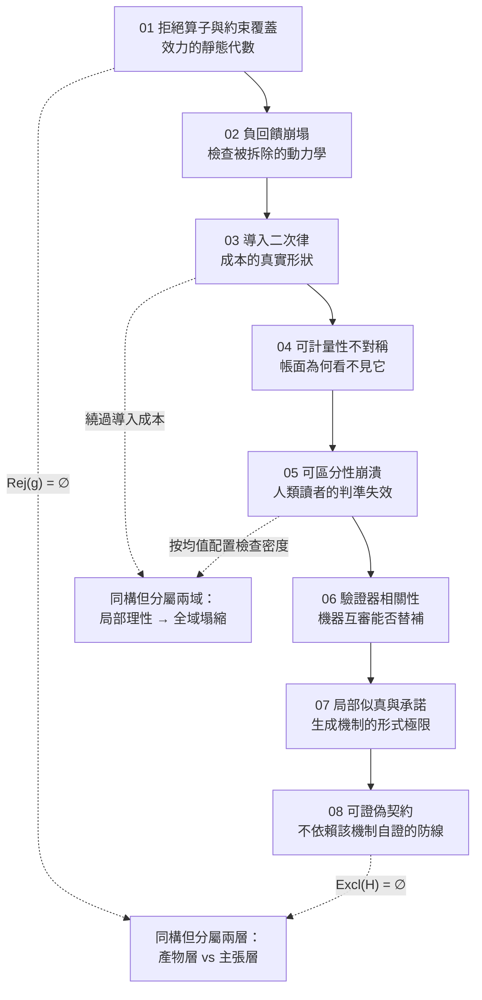

# 可失敗性工程：閱讀導引與概念拓撲

<!-- front matter -->
**Structure**: Reading Guide
**Date**: 2026-09-14T14:45
**Model**: Claude Opus 5
**Agent**: Claude Code VSCode Extension 2.1.270
**Source**: reconstruction

## 這組報告在處理什麼

一份產物的可信度，被它的表面完備性所代表，而不是被它實際承受的拒絕能力所代表。

這個等號在成熟工程體系裡長期成立，因為它背後有一組隱性的物理前提：文字寫得越細，通常表示有人想得越清楚；指標越漂亮，通常表示能力確實提升；文字越流暢，通常表示作者確實理解。三個「通常」各自依賴一個會被移除的前提，而當前提被移除時，等號兩側就完全脫鉤——脫鉤後的系統不會發出任何告警，因為它的每一項讀數都仍然正常。

這組報告把該脫鉤拆成八個彼此正交的節點，每一個都獨立成立、各自閉環、互不引用。

## 八個節點與它們的分工

| 順序 | 節點 | 核心問題 | 不可替代之處 |
| :--- | :--- | :--- | :--- |
| 01 | 拒絕算子與約束覆蓋代數 | 規格的效力該以什麼量度？ | 建立形式底座：效力 = 拒絕集對違規集的覆蓋率；以不可判定性證明三類算子互補 |
| 02 | 負回饋崩塌與品質漂移 | 檢查為何總在「降低摩擦」下被拆除？ | 證明移除誤差訊號的後果是無方向擴散而非劣化；給出摩擦的可操作判別式 |
| 03 | 導入二次律與可修改跑道 | 生產變便宜為何不等於交付變強？ | 推導 $O(N^2)$ 累計成本與可修改半徑；證明撞牆時間對產能反比敏感 |
| 04 | 可計量性不對稱與成本位移 | 指標全綠的專案為何愈來愈難改？ | 形式化最適解偏移；把「後來很難改」分流為外部性與債；推導注意力乘數盈虧點 |
| 05 | 可區分性崩潰與篩選經濟學 | 表面品質不再攜帶資訊時，信任該依據什麼？ | 以似然比與互資訊證明徵候判準歸零；證明期望損失對平均品質非單調 |
| 06 | 驗證器相關性與獨立性幻覺 | 多個審查者等於多倍偵測力嗎？ | 以 Jensen 不等式給出共同失效下界；導出有效偵測器數的硬上界與單邊效力判準 |
| 07 | 局部似真與承諾不可逆 | 生成給的是自洽，還是未經計算的全域？ | 以鏈式分解與濾過單調性證明全域約束缺席；證明精煉收斂到連貫不動點而非真值 |
| 08 | 非定常下的可證偽契約 | 介入一直在變時還能不能做出可被推翻的宣稱？ | 形式化排除觀察集；區分淘汰與反駁；以母體層檢定、部分識別與資料處理不等式建立契約 |

## 因果階梯

階梯的方向不是編輯順序，而是因果依賴。前四篇沿「約束 → 動力 → 成本 → 度量」建立工程物理：先有拒絕算子的定義，才能談它被拆掉的動力學；先有成本的真實形狀，才能談帳面為何看不見它。後四篇沿「信任 → 驗證 → 生成 → 契約」建立認識論防線：先有人類讀者的判準失效，才能問機器互審能否替補；先有生成機制的形式極限，才能設計不依賴該機制自證的契約。

圖中兩條虛線標出的是**跨篇湧現的同構**——它們在各篇中由各自的前提獨立建立，不由任何一篇代另一篇證明。

## 怎麼讀

**若你想要完整的認識論閉環**，依 01 到 08 的順序讀。每一篇的結論是下一篇的問題背景，但不是下一篇的前提：所有前提都在各篇內就地建立。

**若你面對的是具體症狀**，可以從對應的節點單獨切入：

- 規格寫得很完整卻擋不住任何東西 → 01
- 流程「變順了」而品質開始飄 → 02
- 產出翻倍而交付持平、舊碼沒人敢動 → 03
- 所有指標都在改善而系統愈來愈難改 → 04
- 分不出哪些產物該多看兩眼 → 05
- 加了很多層審查而缺陷照樣漏 → 06
- 產物讀起來完美卻在邊緣系統性地錯 → 07
- 一個宣稱永遠無法被驗證或推翻 → 08

**若你只讀一篇**，01 與 08 是這組報告的兩端：前者處理產物層「什麼東西會拒絕」，後者處理主張層「什麼觀察會推翻」。兩者結構同構而層級不同，各自獨立成立。

## 一條貫穿全部八篇的線

每一篇最終都停在同一個動作上：**把某個原本靠人記得的判斷，降成一個不做就過不去的結構事實。**

01 把它降成型別狀態與變異存活計數；02 降成閘門的攔截日誌；03 降成資料庫觸發器與可修改半徑閾值；04 降成兩種成本不可相加的型別隔離；05 降成依驗證覆蓋而非表面品質分配信任；06 降成獨立性宣告必須由不同機制族證成的型別約束；07 降成欠指定處的強制標記與前置假設清點；08 降成六欄位契約與退出碼診斷。

八個降法不同，方向一致：**能被結構擋住的，不要留給注意力。**
