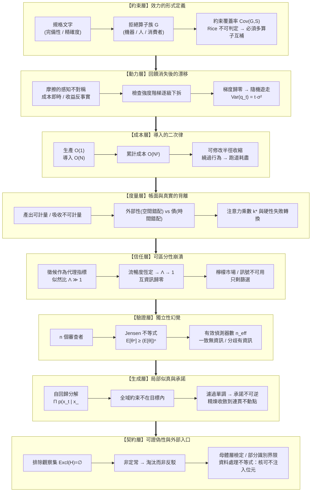

# 可失敗性工程：從拒絕算子、成本位移到驗證獨立性與可證偽契約 (Series Map)

## 1. 核心問題域與敘事拓撲 (Problem Domain & Narrative Topology)

本系列處理一個橫跨形式方法、軟體經濟學、資訊經濟學與生成模型的共同斷層：**「一份產物的可信度被它的表面完備性所代表，而不是被它實際承受的拒絕能力所代表」**。

在成熟工程體系中，「文字完整」與「行為受約束」被預設為同一件事：規格寫得越細，系統越可靠；指標越漂亮，能力越強；文字越流暢，作者越理解。這三組等號在**拒絕機制稀薄化**的系統中全部失效。本系列把該失效拆解為八個互相正交、由因果依賴串成階梯的物理節點：



階梯的方向性不是編輯順序，而是因果依賴：**先有拒絕算子的定義（L1），才能談它被拆掉的動力學（L2）；先有成本的真實形狀（L3），才能談帳面為何看不見它（L4）；先有人類讀者的判準失效（L5），才能問機器互審能否替補（L6）；先有生成機制的形式極限（L7），才能設計不依賴該機制自證的契約（L8）。**

---

## 2. 篇章重組對照與拓撲決策 (Structural Decisions)

原始素材為四篇，每篇實際承載兩個可獨立成立的核心問題。本次重構採「全域解耦 + 逐核心深化」，不採 1:1 鏡像。

| 新 Slot | 來源核心映射 | 拓撲操作 | 核心因果鏈 |
| :--- | :--- | :--- | :--- |
| 01 拒絕算子與約束覆蓋 | 「規格效力」核心 | `[SPLIT]` + `[DEEPEN]` | 效力判準 → 不可判定性 → 必須多算子互補 → 缺席的零訊息量 |
| 02 負回饋崩塌與漂移 | 「摩擦／階梯」核心 | `[SPLIT]` + `[DEEPEN]` | 感知不對稱 → 逐級下拆 → 梯度歸零 → 方差線性發散 |
| 03 導入二次律與跑道 | 「兩條成本曲線」核心 | `[SPLIT]` + `[DEEPEN]` | 線性生產 × 線性對帳 → 二次累計 → 繞過 → 可修改半徑塌縮 |
| 04 可計量性不對稱 | 「儀表板／注意力投資」核心 | `[SPLIT]` + `[DEEPEN]` | 指標遺漏項 → 外部性與債分流 → 乘數盈虧點 → 硬性失敗轉換 |
| 05 可區分性崩潰 | 「徵候／檸檬市場」核心 | `[SPLIT]` + `[DEEPEN]` | 似然比塌縮 → 互資訊歸零 → 按均值配置檢查 → 只剩篩選 |
| 06 驗證器相關性 | 「機器互審」核心 | `[SPLIT]` + `[DEEPEN]` | 獨立性假設 → Jensen 下界 → n_eff 衰減 → 單邊效力判準 |
| 07 局部似真與承諾 | 「生成機制」核心 | `[SPLIT]` + `[DEEPEN]` | 鏈式分解 → 全域約束缺席 → 濾過不可逆 → 精煉不動點 |
| 08 可證偽契約 | 「自我封閉／非定常」核心 | `[SPLIT]` + `[DEEPEN]` | 排除集為空 → 個例逃生口 → 非定常淘汰 → 母體檢定與界限 |

**跨篇湧現主題（原素材未明說、合讀才浮現，本次展開）**：
- `Rej(g) = ∅`（產物層無拒絕算子）與 `Excl(H) = ∅`（主張層無排除觀察）是同一結構在兩個層級的實例 —— 於 Slot 01 與 Slot 08 各自就地建立，互不引用。
- 「繞過導入成本」與「按均值配置檢查密度」都是**局部理性導致全域塌縮**的實例 —— 分別於 Slot 03、Slot 05 以各自的效用函數獨立推導。

---

## 3. 四類展開方向盤點表 (Expansion Audit Matrix)

| 展開維度 | 狀態 | 具體處置與設計說明 |
| :--- | :--- | :--- |
| **共用前提就地自含** | `本次就地承載` | 兩個跨系列共用前提在本系列出現：`自洽 ≠ 正確 ≠ 可信`（Slot 07 就地重述，措辭與一致性參考對齊）與 `確定性邊界 vs 統計執行層`（Slot 01、Slot 06 各自就地重述）。兩者皆以自含散文加形式定義給出，嚴禁跨篇連結或中央化。 |
| **概念地圖／拓撲** | `全部落實` | 八篇報告各配備至少一張承載論證的 Mermaid 圖（flowchart / stateDiagram-v2 / sequenceDiagram），標注因果傳播鏈、狀態不變式或責任邊界，不作裝飾。 |
| **反例與邊界條件** | `全部落實` | 每篇明訂主張的失效邊界與具體反例：導入成本近零的機械工作、慣例即正解的領域、局部機械缺陷的低相關偵測、規定性需求的構成性真值、封閉可列舉微世界的單射代理量等。 |
| **結構化資產** | `全部落實` | 每篇配備四維資產：Mermaid 圖 + 雙重非退化表格（走一遍表 + 跨維度診斷表）+ 領域適配之最小自驗證程式碼（Rust / Python / SQL / Go / Python / TypeScript / Python / Bash）+ 嚴密數學或形式化不變式模型。全部程式碼於撰寫後實際執行驗證通過。 |

---

## 4. 獨立報告清單 (Master Report Manifest)

本系列包含八篇論證閉環、互不引用、各自可獨立閱讀的結晶報告。閱讀順序由因果依賴決定。

### Slot 1: `refutability-algebra-and-constraint-coverage`
- **核心問題**：一份規格的效力該以什麼量度？當任何單一檢查器都不可能完備時，為何機器、人與消費者三類拒絕算子在形式上不可互相替代？
- **不可替代角色**：建立全系列的形式化底座——把「規格價值」從文字性質重新定義為拒絕集對違規集的覆蓋率，並以不可判定性論證三算子互補的必然性；區分「移除」與「缺席」的可觀測性落差。
- **邊界聲明**：只處理約束的靜態代數與覆蓋結構，不處理檢查器隨時間被拆除的動力學，也不處理成本會計。
- **程式碼語言**：`Rust`（typestate 編譯期閘門：未附拒絕算子的規格無法通過型別檢查；附變異注入測試驗證覆蓋非空）
- **Tags**：`規格效力`, `約束覆蓋`, `型別狀態`, `不可判定性`, `驗收閘門`

### Slot 2: `negative-feedback-collapse-and-quality-drift`
- **核心問題**：檢查機制為何總是在「降低摩擦」的正當理由下被逐級拆除？當誤差訊號歸零，系統會變壞，還是會失去方向？
- **不可替代角色**：把品質演化寫成隨機逼近過程，證明移除負回饋的後果不是劣化而是方差線性發散的無向漂移；並給出「摩擦是純成本或失效點」的可操作判別式。
- **邊界聲明**：只處理回饋訊號存廢對品質軌跡的動力學影響，不處理誰付出成本的會計歸屬，也不處理讀者能否辨識品質。
- **程式碼語言**：`Python`（標準庫隨機逼近模擬：有回饋收斂 vs 無回饋方差線性成長，含確定性 assert）
- **Tags**：`負回饋`, `隨機逼近`, `摩擦判別`, `檢查衰減`, `品質漂移`

### Slot 3: `integration-cost-quadratics-and-modifiability-runway`
- **核心問題**：為何生產成本下降不會自動轉換為交付能力提升？當導入成本與系統規模成正比，系統還剩多少可安全修改的跑道？
- **不可替代角色**：推導線性生產撞上線性對帳所產生的二次累計成本，定義可修改半徑並給出撞牆時間對產能的反比敏感度；解釋「繞過舊碼」為何是局部理性而全域致命的反應。
- **邊界聲明**：只處理成本的物理形狀與可修改性衰減，不處理這些成本為何不進入指標系統（屬度量層），也不處理品質訊號的可辨識性。
- **程式碼語言**：`SQL`（SQLite DDL/DML：變更帳的 CHECK 與 TRIGGER 不變式、長期更新率視圖、跑道耗盡的 RAISE(ABORT) 攔截）
- **Tags**：`導入成本`, `可修改半徑`, `軟體演化`, `複雜度增長`, `技術跑道`

### Slot 4: `measurability-asymmetry-and-cost-displacement`
- **核心問題**：為什麼所有指標都在改善的專案會同時變得愈來愈難修改？被移走的成本落到誰身上、在什麼時點、該用哪一種處方？
- **不可替代角色**：形式化指標遺漏項導致的最適解偏移，將「後來很難改」這個共同症狀嚴格分流為空間錯配（外部性）與時間錯配（債），並推導附帶檢查的注意力乘數盈虧點。
- **邊界聲明**：只處理成本的歸屬、折現與可計量性，不重複推導成本的規模依賴形狀，也不處理生成機制本身的缺陷。
- **程式碼語言**：`Go`（型別強制產出與吸收成對登記的並發安全帳本；只記產出時指標與真實效用背離的自檢對比）
- **Tags**：`可計量性不對稱`, `外部性`, `折現偏誤`, `注意力投資`, `指標治理`

### Slot 5: `distinguishability-collapse-and-screening-economics`
- **核心問題**：當產物的表面品質不再攜帶製作過程的資訊，讀者的信任該依據什麼分配？為什麼平均品質上升反而會讓殘留錯誤更貴？
- **不可替代角色**：以似然比與互資訊證明徵候判準的資訊量歸零，推導「信任 ↑ → 檢查密度 ↓ → 期望損失在某區間隨品質上升而上升」的非單調性，並說明訊號為何在此不可用、篩選為何是唯一出口。
- **邊界聲明**：只處理人類讀者對單一產物的可區分性與注意力配置，不處理多個驗證器之間的相關性（屬驗證層）。
- **程式碼語言**：`Python`（貝氏後驗與期望損失模型：Λ=1 時後驗等於先驗、期望損失對品質的非單調區間，含 assert）
- **Tags**：`可區分性`, `檸檬市場`, `自動化偏誤`, `篩選機制`, `信任校準`

### Slot 6: `verifier-correlation-and-independence-illusion`
- **核心問題**：增加審查者能否等比例增加偵測力？當審查者與作者來自同一分佈，多重驗證的殘餘漏檢率被低估了多少倍？
- **不可替代角色**：以 Jensen 不等式給出共同失效機率的嚴格下界，導出有效偵測器數的衰減公式，並建立「一致不具資訊、分歧具資訊」的單邊效力判準與機器審查的最適部署位置。
- **邊界聲明**：只處理驗證器之間的統計相關性與偵測力折損，不處理單一產物對人類讀者的表面可辨識性。
- **程式碼語言**：`TypeScript`（判別聯集型別強制宣告驗證器來源與獨立性證據；相關失效蒙地卡羅與獨立假設估計的倍數落差自檢）
- **Tags**：`相關失效`, `多版本程式設計`, `偵測獨立性`, `交叉驗證`, `審查部署`

### Slot 7: `local-plausibility-and-commitment-irreversibility`
- **核心問題**：自回歸生成給出的究竟是自洽，還是每個局部都像真的全域未經計算？為何多輪精煉不構成保護？
- **不可替代角色**：以鏈式分解與濾過單調性證明全域一致性從未進入目標函數、承諾一旦寫入即不可撤回；建構貪婪局部最優違反全域約束的可執行反例；並以不動點論證說明精煉收斂到連貫而非真值。
- **邊界聲明**：只處理生成機制的形式極限與需求真值來源的分類，不設計治理契約（屬契約層）。
- **程式碼語言**：`Python`（顯式轉移矩陣：貪婪解碼違反全域校驗的反例枚舉、精煉不動點收斂於連貫度而非真值，含 assert）
- **Tags**：`局部似真`, `自回歸分解`, `承諾不可逆`, `均值回歸`, `需求真值`

### Slot 8: `falsifiability-contracts-under-nonstationarity`
- **核心問題**：一個不排除任何觀察的主張為何取得經驗描述的權威卻不承擔其義務？當介入本身持續改變，還能不能做出可被推翻的宣稱？
- **不可替代角色**：形式化排除觀察集為空的主張結構，區分「缺乏決定論因果」與「不可證偽」，證明非定常的後果是主張被淘汰而非被反駁，並以母體層檢定、部分識別界限與資料處理不等式建立可執行的六欄位契約與信任分配規則。
- **邊界聲明**：只處理主張層的可反駁性與外部證據入口，不重新推導產物層的約束覆蓋代數。
- **程式碼語言**：`Bash`（POSIX 六欄位可反駁性契約驗證器：排除觀察集非空、門檻可量測、自我封閉句式攔截，正反例以非零退出碼自檢）
- **Tags**：`可證偽性`, `非定常`, `事前登記`, `部分識別`, `驗證覆蓋`

---

## 5. 閱讀順序 (Reading Order)


前四篇沿「約束 → 動力 → 成本 → 度量」建立工程物理；後四篇沿「信任 → 驗證 → 生成 → 契約」建立認識論防線。任一篇皆可單獨閱讀：每篇的前提在篇內自含建立，不假設讀者讀過其他篇。

---

## 6. 系列與主題標籤配置 (Metadata)

```toml
series = ["可失敗性工程：從拒絕算子、成本位移到驗證獨立性與可證偽契約"]
```

---

## 7. 後續展開方向 (Deferred, 本 session 不展開)

- **變異算子的設計空間**：Slot 01 以變異注入偵測「檢查缺席」，但變異算子本身的充分性（何種變異族足以覆蓋語意缺陷類別）需要獨立的實證設計，不在本系列問題域內 → 移入後續 backlog。
- **多語料去相關的可達上界**：Slot 06 指出不同來源模型可略降相關係數但存在下限，該下限的量化需要跨模型實測資料 → 本次不展開，理由是無可查驗的公開量測可錨定，強行推導會退化為裝飾性假設。
