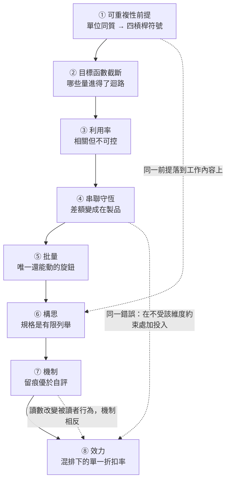

# 進不了控制迴路的量：閱讀導引與概念拓撲

<!-- front matter -->
**Structure**: Analytical Essay
**Date**: 2026-09-14T13:00
**Model**: Claude Opus 5
**Agent**: Claude Code VSCode Extension 2.1.270
**Source**: reconstruction

## 這組報告在處理什麼

一個組織實際優化的，永遠只是它能估計的那些量。一個量若沒有讀數，它不是被賦予較小的權重，而是它的梯度分量恆為零——於是它的終值不由它的重要性決定，而由其餘約束的可行域邊界決定。

這條結構在研發系統裡有三層表現，而它們通常被當成三個互不相干的管理問題：流動（為什麼把人排滿會讓交付變慢）、構思（為什麼把「做什麼」和「怎麼做」拆給兩個人會讓系統失去一致性）、效力（為什麼把規則寫得更嚴不會讓它更被遵守）。三層各有一個真實存在、決定系統行為、而沒有讀數的量：資訊型在製品、設計理念、條款可執行性。

八篇報告把這條結構拆成八個互相正交的節點。每一篇自己閉合——自己的個案、自己的形式模型、自己的可執行驗證與自己的邊界聲明，不需要讀過其他篇。

---

## 八個節點與它們的分工

| 順序 | 節點 | 核心問題 | 形式核心 |
| :--- | :--- | :--- | :--- |
| 1 | 可重複性前提 | 四條管理槓桿共用哪一個未被寫下的假設？ | 充分統計量；$\operatorname{Var}=0 \Rightarrow H=0 \Rightarrow I=0$ |
| 2 | 目標函數截斷 | 沒有讀數的量會被怎麼對待？ | 可觀測性矩陣秩虧；投影梯度的邊界解 |
| 3 | 利用率的不可控性 | 高度相關的量為何不能當控制訊號？ | Kingman VUT；$\partial L/\partial\rho=(1-\rho)^{-2}$ |
| 4 | 串聯守恆 | 被改善出來的產能去了哪裡？ | $\Theta=\min_i\mu_i$；Amdahl 延遲上界 |
| 5 | 批量的平方根律 | 速度與品質在批量上是取捨嗎？ | $B^\ast=\sqrt{2DK/h}$；$C^\ast=\sqrt{2DKh}$ |
| 6 | 構思作為偏函數 | 規格的完整性上限在形式上是什麼？ | 全函數 vs 有限列舉；$\binom{n}{2}$ 相容約束 |
| 7 | 可觀測動作與反轉 | 什麼樣的補償機制才可稽核，何時反轉？ | $\sigma'=\sigma$ 判準；誘因相容不等式 |
| 8 | 惰性條文與折扣率 | 沒有檢查的強制條款是什麼？ | $\Lambda=1 \Rightarrow I(X;E)=0$；pooling 均衡 |

---

## 因果階梯

階梯的方向性是因果依賴而非編輯順序。先確認單位是否可重複，才知道哪些槓桿的符號是對的；先建立「哪些量進得了迴路」，才能解釋為什麼錯誤的槓桿會被持續拉滿。有了流動的非線性才談得上守恆如何位移它，有了守恆才看得出批量是唯一還能動的旋鈕。把視角從工作流轉到工作內容後，同一個前提落到構思上；構思交接的損失需要補償機制，而補償機制本身受同一條可觀測性約束；最後當補償機制退化為純文字，效力問題就從執行層升到讀者的推論層。

虛線是合讀才浮現的橫向連結，不構成閱讀依賴。

---

## 怎麼讀

**想弄清楚「為什麼指標全綠而結果變差」的人**，從 ① 與 ② 開始。這兩篇建立全組的底座：前者證明四條標準管理動作共用一個關於工作單位的統計假設，後者證明沒有讀數的維度會被擠到可行域邊界，而同一時間帳面指標反而更漂亮。

**手上有交付週期問題的人**，直接進 ③ 與 ④。前者給出為什麼「查利用率 → 判定產能不足 → 排入更多工作」是一條沒有退出條件的迴路，並給出替代的控制對象；後者給出為什麼某一段的改善可以同時是真的（延遲加速 1.466 倍）與假的（吞吐加速 1.000 倍）。

**正在設計或修改流程的人**，讀 ⑤ 與 ⑥。前者算出「把一個關卡拆成四個而各自保留完整儀式」會使最低總成本恰好翻倍，並指出能動的旋鈕是單批固定開銷而非批量本身；後者把「概念完整性」從價值判斷改寫成可用編譯器檢查的形式性質。

**正在寫規則或治理文件的人**，讀 ⑦ 與 ⑧。前者給出一條規則可稽核的充要形式與它被指標化後的反轉曲線；後者把規則書從待精簡清單改寫成按位置排列的機制缺口清單，並給出容量假說與資訊假說的可證偽判別。

八篇沒有規定的閱讀順序。表格的順序是因果順序，而任何一篇都可以被單獨取出閱讀。

---

## 一條貫穿全部八篇的線

每一篇都在同一個位置上找到同一個東西：一個真實存在、影響結果、而沒有任何機制會因它變差而發出訊號的量。

- 資訊型在製品不佔據物理空間，因此看板上沒有它的欄位。
- 被改善出來的產能變成在製品，堆積在一個沒有報表欄位的位置。
- 設計理念是一組偏好，而文件只能承載它在有限情境上的取值。
- 自我評估不改變任何系統狀態，因此它的違反集合是空集。
- 從未產生可觀測違反的條款，在報表上與被完美遵守的條款無法區分。

五個實例的處置方向也是同一個：要嘛給那個量建立一個真正由它驅動的訊號，要嘛承認它不可觀測並把它從目標函數移到約束集合——用一個不需要梯度就能檢查的下界守住它。

宣告「我們應該更重視某件事」之前，先回答一個更窄的問題：這件事變差的時候，什麼東西會知道。答不出來時，那句話不是一個決定，是一個願望。
