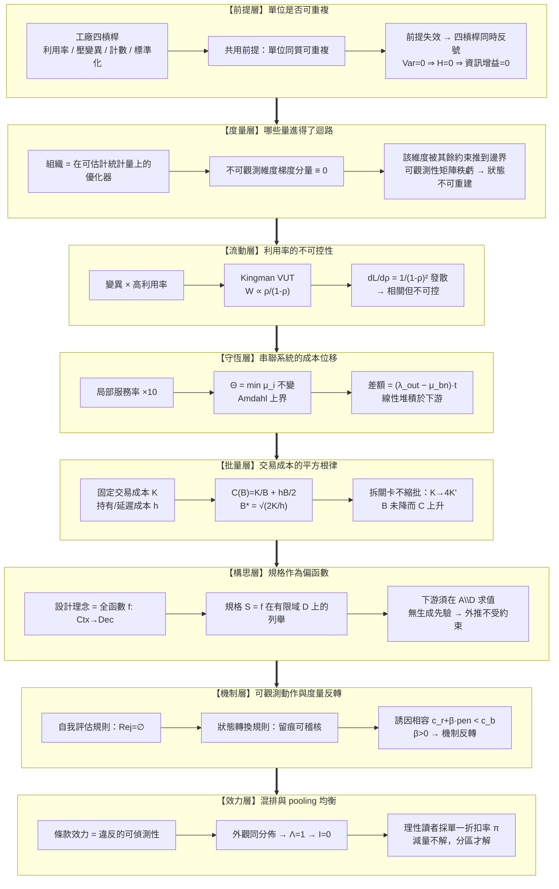
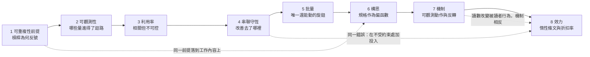

# 進不了控制迴路的量：從可重複性前提、流動守恆到文字效力 (Series Map)

## 1. 核心問題域與敘事拓撲 (Problem Domain & Narrative Topology)

本系列處理一個橫跨排隊論、生產經濟學、型別理論、機制設計與資訊經濟學的共同斷層：**一個組織實際優化的，永遠只是它能估計的那些量；一個量若無法產生可觀測訊號，它不是被低估，而是根本不進入目標函數。**

這個斷層在研發系統中有三層表現，而它們通常被當成三個互不相干的管理問題：流動（為什麼把人排滿會讓交付變慢）、構思（為什麼把「做什麼」和「怎麼做」拆給兩個人會讓系統失去一致性）、效力（為什麼把規則寫得更嚴不會讓它更被遵守）。把三者放在同一個座標系裡，浮現的是同一個結構：**每一層都有一個真實存在、決定系統行為、但沒有讀數的量**——資訊型在製品、設計理念、條款可執行性。組織的優化器在這些維度上的梯度分量恆為零，於是它們被其餘約束推到可行域邊界。

本系列把該斷層拆解為八個互相正交、由因果依賴串成階梯的節點：



階梯的方向性不是編輯順序，而是因果依賴：**先確認單位是否可重複（L1），才知道哪些槓桿的符號是對的；先建立「哪些量進得了迴路」（L2），才能解釋為什麼錯誤的槓桿會被持續拉滿；有了流動的非線性（L3）才談得上串聯守恆如何位移它（L4），有了守恆才看得出批量是唯一還能動的旋鈕（L5）；把視角從工作流轉到工作內容後，同一個「不可重複」前提落到構思上（L6）；構思交接的損失需要補償機制，而補償機制本身受同一條可觀測性約束（L7）；最後，當補償機制退化為純文字，效力問題就從執行層升到讀者的推論層（L8）。**

---

## 2. 篇章重組對照與拓撲決策 (Structural Decisions)

原始素材為三篇，每篇實際承載二到三個可獨立成立的核心問題，且三篇共用一條從未被寫明的骨幹（可觀測性決定目標函數）。本次重構採「跨篇熔接骨幹 + 逐核心解耦深化」，明確不採 1:1 鏡像。

| 新 Slot | 來源核心映射 | 拓撲操作 | 核心因果鏈 |
| :--- | :--- | :--- | :--- |
| 01 可重複性前提與單位同質 | 「四槓桿對照」＋「泰勒制前提」兩處核心的熔接 | `[MERGE]` + `[DEEPEN]` | 四槓桿共用前提 → 前提失效 → 同時反號 → 變異即資訊量 |
| 02 可觀測性與目標函數截斷 | 「在製品不可見」＋「概念完整性不可觀測」＋「規則無讀數」三處熔接 | `[MERGE]` + `[DEEPEN]` | 優化器只見可估計量 → 不可觀測維度梯度為零 → 被推到邊界 |
| 03 利用率作為預測因子 | 「利用率不是控制槓桿」核心 | `[SPLIT]` + `[DEEPEN]` | 變異×利用率 → Kingman → 敏感度發散 → 控制對象替換 |
| 04 串聯守恆與在製品位移 | 「不對稱產能衝擊」核心 | `[SPLIT]` + `[DEEPEN]` | 局部改善 → 吞吐受 min 約束 → 差額線性堆積 → 宣告範圍謬誤 |
| 05 批量交易成本與偽拆分 | 「批量是槓桿最大的一項」核心 | `[SPLIT]` + `[DEEPEN]` | 交易/延遲對偶 → 平方根律 → 拆關卡使 K 上升而 B 不變 |
| 06 構思作為偏函數 | 「概念完整性不能被交接」＋「文件承載決定不承載直覺」熔接 | `[MERGE]` + `[DEEPEN]` | 理念是全函數 → 規格是有限列舉 → 外推域無定義 → 相容約束無人持有 |
| 07 可觀測動作與度量反轉 | 「補償機制的正確形狀」核心 | `[SPLIT]` + `[DEEPEN]` | 自我評估不可稽核 → 狀態轉換留痕 → 阻力排序 → 指標化使機制反轉 |
| 08 惰性條文與 pooling 均衡 | 「假約束析出」＋「稀釋效應」＋「地圖診斷」三核心整併為一條因果鏈 | `[MERGE]` + `[DEEPEN]` | 接縫無對帳 → 條文析出 → 混排使 Λ=1 → 單一折扣率 → 缺口地圖 |

**跨篇湧現主題（原素材未明說、合讀才浮現，本次展開）**：

- 「不可重複的單位」（L1）與「不能被交接的構思」（L6）是同一個前提在**工作流**與**工作內容**兩個層面的實例：前者問「這批工作能不能用同一套最佳方法」，後者問「這個決策能不能用同一份文件複製」。兩處各自就地建立完整論證，互不引用。
- 「改善非瓶頸工站」（L4）與「把規則寫得更嚴」（L8）是同一個錯誤：**在一個不受該維度約束的地方加大投入**。前者的約束是 $\min_i \mu_i$，後者的約束是 $\mathrm{Rej}(g)=\varnothing$。兩處以各自的形式模型獨立推導。
- 「受阻標記被當成負面指標而反轉」（L7）與「混排使讀者採單一折扣率」（L8）都是**讀數本身改變被讀者行為**的實例，但機制相反：前者是訊號被賦予代價後消失，後者是訊號從未攜帶資訊。兩處分別以誘因不等式與似然比獨立建模。

---

## 3. 四類展開方向盤點表 (Expansion Audit Matrix)

| 展開類型 | 狀態 | 歸屬報告 / 去向與理由 |
| :--- | :--- | :--- |
| 共用前提（就地自含） | `本次就地承載` | 兩個跨系列共用前提在本系列出現：`確定性邊界 vs 統計執行層`（Slot 07、Slot 08 各自就地重述，措辭與一致性參考對齊）與 `主體 / 客體 / 能力 / 邊界 的最小詞彙`（Slot 06 就地重述為「誰持有決策、決策的對象是什麼、可判定範圍到哪」）。兩者皆以自含散文加形式定義給出，不抽成中央報告、不跨篇連結。 |
| 概念地圖 / 詞彙表 | `已承載` | 不另立概念地圖篇。八篇各自在導言後就地界定本篇所需的最小詞彙（如「工站／服務率／到達率」「全函數／偏函數／定義域」「拒絕算子／折扣率」），並由該篇的 Mermaid 圖承載概念間的因果關係。獨立詞彙表會迫使讀者跨篇閱讀，違反自包含。 |
| 反例與不適用邊界 | `全部落實` | 每篇明訂主張失效邊界與具體反例：可重複的樣板工作、封閉可完全列舉的微世界、變異趨近零的產線、被改善者本身就是瓶頸、交易成本趨近零的流程、簡單到可被文件完整承載的構思、上報阻力高於繞過阻力的環境、明確標記為期望而非約束的陳述。 |
| 結構化資產（Mermaid / example code） | `全部落實` | 每篇配備四維資產：Mermaid 圖（flowchart / stateDiagram-v2 / sequenceDiagram）＋雙重非退化表格（走一遍表＋跨維度診斷表）＋領域適配之最小自驗證程式碼（Python / Python / Python / Go / Python / Rust / SQL(node:sqlite) / JavaScript）＋嚴密數學或形式化不變式模型。全部程式碼於撰寫後實際執行，輸出以腳本回填。 |

---

## 4. 獨立報告清單 (Master Report Manifest)

本系列包含八篇論證閉環、互不引用、各自可獨立閱讀的結晶報告。閱讀順序由因果依賴決定，不由主題親近度決定。

### Slot 1: `repeatability-premise-and-unit-homogeneity`
- **核心問題**：製造業的四條標準槓桿搬進研發後為何不是「效果打折」而是「符號反轉」？它們共用的那一個前提是什麼，以及為什麼這個前提的檢查從未被執行？
- **不可替代角色**：建立全系列的前提底座——證明利用率拉滿、壓低變異、計數產出、標準化產品四者共用「單位同質且可重複」這一個假設，並以充分統計量與熵給出「變異為零即資訊增益為零」的形式結果。
- **邊界聲明**：只處理「工作單位的性質如何決定槓桿符號」，不處理佇列動力學（屬 Slot 3）、不處理串聯守恆（屬 Slot 4）、不處理構思能否被文件承載（屬 Slot 6）。
- **程式碼語言**：`Python`（標準庫；同質 vs 異質母體下「計數」是否為充分統計量的判別，附 assert）
- **Tags**：`可重複性前提`, `充分統計量`, `資訊增益`, `研發流程`, `度量設計`

### Slot 2: `observability-truncated-objectives`
- **核心問題**：一個真實存在且決定系統行為的量，若沒有任何讀數，組織會怎麼對待它？「被低估」與「不進入目標函數」在數學上是不是同一件事？
- **不可替代角色**：建立全系列的度量底座——以投影梯度與可觀測性矩陣秩虧，證明不可觀測維度的更新量恆為零，因此該維度的終值由其餘約束的可行域邊界決定，而非由它的重要性決定。
- **邊界聲明**：只處理「量能否進入控制迴路」的一般結構，不處理任何特定領域的動力學；佇列、批量、構思、條文效力四個實例僅作為邊界輸入案例出現，各自的完整機制由其他報告承載。
- **程式碼語言**：`Python`（標準庫；手寫線性代數計算可觀測性矩陣秩，並跑投影梯度下降驗證不可觀測維度收斂至約束邊界）
- **Tags**：`可觀測性`, `目標函數`, `投影梯度`, `度量治理`, `資訊理論`

### Slot 3: `utilization-as-predictor-not-control`
- **核心問題**：一個與目標高度相關的量，為什麼不能拿來當控制訊號？在變異高的系統裡，利用率與佇列的關係為何只能單向使用？
- **不可替代角色**：給出流動層的定量核心——Kingman 的 VUT 分解、Little 定律、以及敏感度 $\partial L/\partial \rho = (1-\rho)^{-2}$ 的發散，並論證控制對象必須從利用率換成佇列長度，其可執行形式是拒絕開始新工作。
- **邊界聲明**：只處理單一工站的排隊非線性與控制訊號選擇，不處理多工站之間的守恆與位移（屬 Slot 4），不處理批量的成本結構（屬 Slot 5）。
- **程式碼語言**：`Python`（標準庫 `random` + `heapq` 的 M/G/1 離散事件模擬，比對 Kingman 近似並驗證敏感度發散）
- **Tags**：`排隊論`, `控制訊號`, `在製品`, `流動治理`, `敏感度分析`

### Slot 4: `serial-conservation-and-wip-displacement`
- **核心問題**：當串聯系統中某一個工站的服務率突然提高一個數量級而其餘不變時，被改善出來的產能去了哪裡？「效率提升」的宣告在什麼層級為真、什麼層級為假？
- **不可替代角色**：給出守恆層的定量核心——串聯吞吐受 $\min_i \mu_i$ 約束、Amdahl 上界、以及在製品堆積速率 $(\lambda_{\text{out}} - \mu_{\text{bn}})$ 的線性發散；並論證「一個數量級的產能不對稱」是新尺度而非新機制。
- **邊界聲明**：只處理多工站之間的通過率守恆與庫存位移，不處理單站排隊的非線性成因（屬 Slot 3），不處理改善本身的成本（屬 Slot 5）。
- **程式碼語言**：`Go`（標準庫；以 goroutine + buffered channel 建三段串聯管線，改善非瓶頸段服務率後斷言吞吐不變而下游佇列線性增長）
- **Tags**：`瓶頸理論`, `吞吐守恆`, `在製品位移`, `Amdahl 定律`, `效能宣告`

### Slot 5: `batch-transaction-cost-and-pseudo-decomposition`
- **核心問題**：批量為什麼同時傷害速度與品質，因而不構成兩者之間的取捨？把一個大批量拆成四個關卡，為什麼不是縮小批量？
- **不可替代角色**：給出批量層的定量核心——交易成本與延遲成本的對偶、$B^\ast=\sqrt{2K/h}$ 的平方根律與最小總成本 $\sqrt{2Kh}$，並以此算出「偽拆分」使 $K$ 上升而 $B$ 不變時總成本的實際變化量。
- **邊界聲明**：只處理批量這一個旋鈕的成本結構與其下界，不處理利用率（屬 Slot 3）、不處理工站之間的守恆（屬 Slot 4）。
- **程式碼語言**：`Python`（標準庫；EOQ 數值最佳化與「四關卡偽拆分」的成本對比，附解析解與數值解一致性 assert）
- **Tags**：`批量經濟`, `交易成本`, `回饋延遲`, `流程設計`, `平方根律`

### Slot 6: `design-intent-as-partial-function`
- **核心問題**：為什麼實作可以被分散給很多人，而構思跨越一次交接就失去持有者？一份「寫得非常完整」的規格，其完整性的上限在形式上是什麼？
- **不可替代角色**：把「概念完整性」從一個價值判斷改寫成一個可檢查的形式性質——設計理念是全函數，規格是它在有限域上的列舉，下游必須在定義域之外求值；並以 $\binom{n}{2}$ 條跨模組相容約束說明分散決策者為何無人負責跨界約束。
- **邊界聲明**：只處理構思的可交接性與規格的表達上限，不處理交接失敗後的補償機制（屬 Slot 7），不處理規則文字的執行力（屬 Slot 8）。
- **程式碼語言**：`Rust`（標準庫；以窮盡比對與 typestate 對比「全函數」與「查表型偏函數」，展示新增情境時前者編譯失敗、後者靜默回退的差異）
- **Tags**：`概念完整性`, `偏函數`, `窮盡性檢查`, `職責劃界`, `規格設計`

### Slot 7: `observable-action-mechanisms-and-metric-inversion`
- **核心問題**：為什麼「遇到問題請即時反映」無效而「標記受阻並通知」有效？一個有效的機制，在什麼條件下會因為被拿來當指標而反轉？
- **不可替代角色**：給出機制層的形式核心——可稽核性要求狀態轉換而非自我評估、誘因相容不等式 $c_r + \beta\cdot\text{pen} < c_b + p_d\cdot\text{sanc}$、以及 $\beta>0$ 時的反轉條件；並以資料層約束展示「未留痕即不可轉移」如何成為結構事實。
- **邊界聲明**：只處理補償機制的設計與其反轉條件，不處理構思為何需要補償（屬 Slot 6），不處理純文字條款的效力（屬 Slot 8）。
- **程式碼語言**：`SQL`（透過 Node.js 內建 `node:sqlite` 執行；以 CHECK 約束與觸發器把「狀態轉換必須留痕」寫成不可繞過的資料約束，並對比自我評估欄位的零拒絕）
- **Tags**：`機制設計`, `可稽核性`, `誘因相容`, `指標反轉`, `狀態約束`

### Slot 8: `inert-clauses-and-pooling-equilibrium`
- **核心問題**：一條從未產生過任何可觀測違反的強制條款，它是冗餘還是別的什麼？當會咬人的與不會咬人的條款外觀相同時，一個完全理性的讀者會怎麼讀這份文件？
- **不可替代角色**：把規則書從「待精簡清單」改寫成「未對帳邊界的地圖」——建立條文析出機制、區分缺席／移除／死亡三種零效力、以似然比 $\Lambda=1$ 證明混排下互資訊為零因而理性讀者只能採單一折扣率，並給出容量假說與資訊假說的可證偽判別實驗。
- **邊界聲明**：只處理文字條款的效力來源與讀者側的推論崩潰，不處理機制的誘因設計（屬 Slot 7），不處理構思的表達上限（屬 Slot 6）。
- **程式碼語言**：`JavaScript`（Node.js 標準庫 `node:assert`；貝氏後驗模擬，驗證 pooling 下折扣率與條款數量無關、separating 下分裂為兩個折扣率）
- **Tags**：`規則效力`, `訊號賽局`, `可區分性`, `治理診斷`, `貝氏推論`

---

## 5. 閱讀順序 (Reading Order)



前五篇沿「工作流」推進：先問單位性質（1），再問哪些量有讀數（2），再進入單站非線性（3）、多站守恆（4）與批量結構（5）。後三篇沿「工作內容」推進：構思的表達上限（6）、交接損失的補償機制（7）、補償機制退化為文字後的效力問題（8）。虛線是合讀才浮現的橫向連結，不構成閱讀依賴——八篇任一篇皆可單獨閱讀。

---

## 6. 系列與主題標籤配置 (Metadata)

```toml
series = ["進不了控制迴路的量：研發治理中的可重複性前提、流動守恆與文字效力"]
```

逐報告 tags 見 §4 各 Slot 條目。八篇共 40 個 tags，全部為問題域標籤；文體型（`分析論述`）、全域背景型（`AI 代理人`）、段落痕跡型（`導言`、`反思`、`實務對比`）與模糊形容型（`形狀`、`差異`）均未使用。

---

## 7. 後續展開方向 (Deferred, 本 session 不展開)

以下項目在本 session 的反推中浮現，但無法回溯至本系列問題域，或需要獨立開題，依擴張上限移出主文：

1. **餘裕的定價方法** — 已論證高利用率使佇列爆炸、必須保留餘裕，但「該保留多少」在需求分佈未知時是一個隨機規劃問題，其求解需要獨立的分佈估計方法論，不屬本系列的「哪些量進得了迴路」問題域。
2. **交易成本的實際下修路徑** — 已論證批量下界由交易成本決定，因此降低 $K$ 比降低 $B$ 更根本；但「哪些儀式的 $K$ 可被自動化吸收」是流程工程的獨立主題。
3. **相容約束的機械化檢查** — 已論證 $\binom{n}{2}$ 條跨模組相容約束在分散決策下無人負責；能否把其中一部分降為型別或介面契約，屬架構方法論的獨立開題。
4. **缺口清單的估價方法** — 已論證規則書可讀成按位置排列的機制缺口清單，但「補上一道對帳機制值多少」需要把避免的損失期望值與建置成本並置，屬投資決策的獨立主題。
5. **多消費者流程的瓶頸漂移** — 串聯守恆的結論假設瓶頸位置在觀測期內固定；當瓶頸隨工作類型漂移時，「改善哪裡」的判定需要時變瓶頸偵測，屬排程理論的獨立開題。
