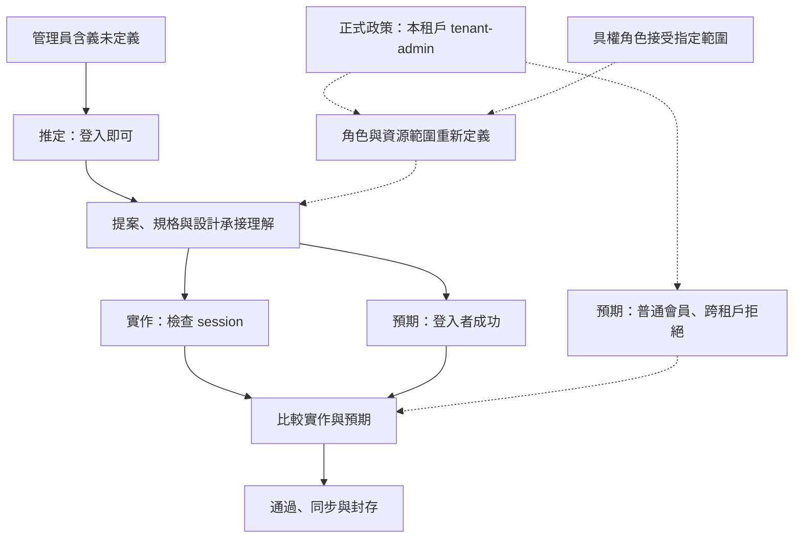

# 從需求到承諾：規格憑什麼驅動行動

**Structure**: Analytical Essay
**Date**: 2026-10-01T07:12
**Source**: notes
**Model**: GPT-6.1 Sol
**Agent**: GitHub Copilot Chat v0.68.0

## 導言 (Introduction)

使用規格工作流的工程師、產品負責人與審查者，需要防範一種不容易被符合性測試發現的錯誤：程式忠實實作了要求，要求卻沒有足以支持它的理由。AI 能迅速把一句需求展成提案、規格、設計與工作清單；若團隊只檢查這些產物是否相符，最早的誤解也可能被忠實地傳到部署環境。

設想客服提出：「系統已接受購買後 90 天的退款，請把規格從 30 天更新成 90 天。」這可以是一個修正文描述的請求，也可以是一個修改政策的提案。若該市場的有效政策仍要求 30 天，改文件不會修好部署，部署現況也不會自行修改政策。困難不是該選哪個數字，而是同一句話正在替哪個行動提供理由。

本文要建立的判斷能力，是辨認一項需求何時有資格驅動行動。答案不只在文件內容，也在內容的用途、支持、接受權限與有效條件。本文將主張升格（Claim Promotion）定義為：在明確範圍與條件下，接受一項陳述或決定來支持特定行動。升格不是宣布命題永遠為真，更不是授予一份文件無限的決策權。

以下先拆開一句需求承載的內容，再討論支持與許可的差別，接著說明檢查如何真正否定原理解，最後處理變更後的對帳與撤回。退款、夜間模式與租戶匯出都是設想，不是事故調查；它們用來展示處置方向、效益證據與資料權限的不同問題。OpenSpec 官方文件則提供一個具體工作流對照，不作為事故頻率或工具治理成效的實證。

## 分析 (Analysis)

### 一、先問這句話要拿來做什麼

「退款期限是 90 天」的句型，無法自行告訴我們它是描述還是要求。如果是在記錄一筆交易，它需要版本、時間與例外條件；如果是在設定今後的系統行為，它需要有效政策或有權角色的決定。把句子寫得更精確，可以減少歧義，卻不能免除對用途的辨認。

客服的原請求至少可以拆成四項內容：某筆第 90 天退款成功、文件目前寫 30 天、客服希望降低爭議，以及提議讓文件改寫為 90 天。第一項尚需重現；第二項可以查文件；第三項是要確認的需求意圖；第四項則仍要問文件是在描述現況還是保存要求。這些內容彼此有關，但沒有哪一項能單獨替其他三項過關。

主張（Claim）是一項可以被支持、質疑或接受的陳述。規格產物（Artifact）則是保存與傳遞內容的容器，例如提案、設計與任務文件。容器完整，不表示主張完整；一份提案可能同時包含已觀察的現象、尚未驗證的效益與暫定方案。審查若以檔案為單位給一個綠燈，這些差異就容易消失。

主張型別（Claim Typing）是按用途與支持方式分派問題，不是按檔名分類。下表把六種工程工作分類放回同一個夜間模式設想：產品負責人希望新增手動配色，並期待減少長時間操作的疲勞。各列的差別，決定接下來需要查什麼。

| 要使用的內容 | 工作型別 | 相稱的支持 | 不能拿什麼代替 |
| :--- | :--- | :--- | :--- |
| 指定版本尚無手動主題切換 | 觀察（observation） | 該版本、帳號與介面條件下的檢查 | 某人記得以前沒有 |
| 使用者希望自行選擇配色 | 意圖（intent） | 具名需求來源、使用對象與確認 | 開關測試通過 |
| 夜間模式能降低疲勞 | 假說（hypothesis） | 與效益問題相稱的研究、對照與替代解釋檢查 | 喜歡配色或功能已完成 |
| 介面須遵守既有可及性要求 | 規範（norm） | 有效要求及其適用關係 | 作者把句子標為必須 |
| 以配色變數而非逐頁分支實作 | 設計決定（design decision） | 技術限制、方案取捨與負責者接受 | 方案已被寫入 design |
| 指定環境已部署主題切換 | 完成主張（completion claim） | 變更、測試、部署與必要執行觀察 | 任務已勾選 |

這不是自然語言的完備分類，也不要求每一句說明都填表。它的作用，是使不相關的支持無法充數。缺疲勞研究時，要補的是效益證據；缺需求確認時，要找需求來源；缺部署證據時，要查目標環境。多寫一個功能測試，不能同時補足三種缺口。

容器與主張是多對多關係。一份提案可承載多個主張；同一項行為要求也可出現在規格、測試計畫與部署紀錄。本文推論，三個位置重述同一句話，不等於三份獨立支持。證據要連到命題與範圍，文件位置則用來協調查詢，不能將位置數量當作證據數量。

文字的要求強度也不替來源作答。RFC 2119 定義 IETF 文件中 MUST、SHALL、SHOULD 等用語的要求程度，也提醒其效力受文件本身的要求層級影響。RFC 8174 澄清，採用這套慣例時，全大寫用語才有其特別含義，而且規範文字不必使用這些詞。[1][2] 本文推論，SHALL 可以清楚表達一項要求，不能替作者創造制定要求的權限；缺少 SHALL，也不能使有效政策失去約束力。

設想工程師寫下「所有登入者 SHALL 匯出租戶資料」。這句話提出了強要求，但其權限範圍仍需查政策。即使測試證明所有登入者真的能匯出，也只支持行為存在，沒有補上要求的正當性。語法清楚、實作忠實與要求有效，是三個不同命題。

分類標籤本身同樣需要檢查。作者填了 `norm`，只說明他把內容當作規範提出；填了 `observation`，也不等於量測已重現。本文建議先辨認用途，再查來源是否足以支持這個用途，而非把型別當作新的可信徽章。否則主張分類只是把原本的文件權威換成欄位權威。

### 二、理由足夠與允許行動，是兩個問題

拆清內容後，仍不能只問「證據夠不夠」。證據可以支持對世界的判斷，授權則決定誰可在何種條件下採取行動。兩者常需要共同存在，但不會互相產生：研究可信，不等於資料使用已獲允許；有權角色願意試行，也不等於預期效益已被證明。

夜間模式恰好顯示這個差別。設想團隊已確認使用者希望自行選擇配色，但沒有足夠研究支持減少疲勞。本文建議，若既有義務允許，且已查可及性、影響與停止方式，有權角色可以接受受約束的功能試行。這個決定允許取得新資訊，不允許把「降低疲勞」寫成已證實的產品承諾。

反過來，設想某項研究確實支持一種配色在特定情境下的效益，團隊也不能因此取得任意蒐集使用者資料的權限。效益證據回答介入是否可能有效，不回答哪些資料能被取用。本文推論，把這兩個問題合成一個可信度分數，會使高分遮住未被接受的行動，或逼團隊把可接受的試驗偽裝成已知結論。

授權還必須有對象。某位產品負責人接受了主題切換，可能只是接受功能範圍；他未必能豁免安全政策，也不能改寫研究結果。政策負責角色、研究負責人與工程負責者各自能回答的問題不同。同一人可以兼任，但應說明本次以何種權限接受什麼，而不只留一個名字。

對會跨責任邊界的主張，本文建議至少讓六項資訊可查：用途型別、具體命題、適用範圍、來源、反駁條件與負責角色。反駁條件（Defeater）是會削弱支持或使目前使用資格失效的情況，例如觀察不能重現、政策已被替代，或資料範圍超出核准。它不只是「有人不同意」，也不必證明命題永遠為假。

範圍是一組會改變答案的條件。退款可能涉及市場、契約版本、交易種類、生效時間與例外；匯出可能涉及角色、租戶與資料類別。填了非空字串 `EU`，只能證明欄位有字，不能證明證據涵蓋哪些市場，也不能證明接受角色在那些市場均有權。結構能要求填欄位，適用性還要另外判斷。

接受許可也不宜用單一 `human reviewed = true` 表示。這只能記錄有人參與，無法辨認身分、權限、接受內容與期限。本文建議，把「讀過」「確認描述」「接受要求」「接受剩餘風險」分開理解；它們可以同時發生，但不能因其中一項被記錄，就補出其餘三項。

在租戶案例中，身分驗證（authentication）確認使用者身分；存取授權（authorization）決定這個身分對特定資源能做什麼。一個 session 可以支持「已登入」，不能支持「可匯出乙租戶」。甲租戶的管理員稱號，也不是全系統的資料許可。需求若只寫「管理員」，缺的可能是資源關係，而不只是角色名稱。

這種精確化不必立刻建立新資料庫。PR、有效政策與規格可分別保存支持與決定，只要能查回相同命題與範圍。真正接受權限仍應由可追責的角色或制度持有；自動測試可產生完成證據，部署平臺可產生執行資訊，卻不能把作者自報的 `policy-owner` 當成有效委派。

來源追蹤（Provenance）可協助表達誰透過什麼活動產生哪項資訊。W3C PROV-DM 分開實體、活動、代理者，以及生成、衍生、歸屬與委派關係。[7] 本文採它作關係表示的參考，不把它當作權限系統：描述「甲代表乙」與制度真的允許甲代表乙，仍需要不同支持。

### 三、一致的實作，必須有機會遇到不一致的答案

即使支持與接受資訊都有位置，最初的理解仍可能錯誤。設想「讓管理員匯出租戶資料」被解讀成「登入即可」，提案於是寫 `authenticated admin`，規格只要求 session，設計選登入中介軟體，任務加入匯出端點與登入成功測試。每次轉換可以忠實，整條鏈卻沒有查過管理員的正式意義。

規格坍縮（Specification Collapse）在本文指：多項需要不同支持的內容承接同一個未檢查前提，再以衍生結果的一致替前提背書。這不是檔案沒有分開，也不是同一作者必然失敗。形式上分工完備，仍可以讓同一個誤解占據需求、設計與測試預期。

假設正式政策只允許本租戶的 `tenant-admin` 匯出。以下走查呈現此設想中的資訊條件；它不是某次真實事故的復盤，也不估計發生頻率。

| 轉換位置 | 局部工作如何完成 | 原理解如何存活 | 能使它失敗的資訊 |
| :--- | :--- | :--- | :--- |
| 詞義解析 | 替「管理員」補上定義 | 模糊角色變成登入者 | 正式角色與租戶關係 |
| 文件展開 | proposal、spec、design 各有職責 | 未標明的假設被多份文件繼承 | 假設明示、政策版本 |
| 實作 | 中介軟體符合設計 | 登入條件變成資料權限 | 角色、資源與拒絕規則 |
| 驗證 | 登入者成功符合 scenario | 同一理解同時決定預期 | 普通會員與跨租戶應拒絕 |
| 同步或封存 | 文件一致、變更有紀錄 | 局部通過取得要求有效的外觀 | 具範圍接受與未解責任 |

只有角色未查、假設未暴露、檢查沒有相反依據等條件成立，錯誤才會沿表中路徑存活。把正式政策接進適當位置，就可能打破這條鏈。新增更多文件或更多登入成功測試，若沒有改變判斷依據，則沒有新增這種反駁能力。

測試判準（oracle）是決定結果應為何的依據，受測程式則是被比較的對象。測試一定要接觸程式，卻不必從程式抄出預期。預期若來自正式租戶政策，普通會員成功會成為反例；預期若只是現有輸出的重述，同樣的成功就會被接受。差別不在測試是否有讀 code，而在答案由什麼決定。

PROV-DM §2.1.2 指出，一個活動使用了某項實體、也生成另一項實體，不足以推出後者由前者衍生；還需要影響關係。[7] 本文據此推論，「審查者讀過 code」不能單獨證明判準受 code 控制；「沒讀 code」也不能證明判準未從同源摘要取得。要分別追受測版本、預期的來源與版本，以及產生比較結果的活動。

下圖將兩種答案放進同一比較位置。實線是設想中的錯誤生成路徑，虛線是能迫使原理解重查的政策與接受關係，不表示外部資料天然正確。



左側的實作與預期可以完全一致，卻同時違反右側的政策。這足以排除「衍生物一致就證明起始前提正確」的普遍推論，不表示同源測試沒有用途。它們仍能找轉換錯誤，只是不能單靠共享的預期判定那個預期是否適合。

以下 Python 模型以角色、使用者所屬租戶與目標租戶為輸入。所有政策與角色都是本文設定；比較涵蓋本租戶管理員、普通會員、匿名與跨租戶四種情況。

```python
cases = (
    ("tenant-admin", "alpha", "alpha"),
    ("ordinary-member", "alpha", "alpha"),
    ("anonymous", "alpha", "alpha"),
    ("tenant-admin", "alpha", "beta"),
)

def implementation(role, home_tenant, target_tenant):
    return role in {"tenant-admin", "ordinary-member"}

def local_oracle(role, home_tenant, target_tenant):
    return role in {"tenant-admin", "ordinary-member"}

def policy_oracle(role, home_tenant, target_tenant):
    return role == "tenant-admin" and home_tenant == target_tenant

def mismatches(oracle):
    return {
        case for case in cases
        if implementation(*case) != oracle(*case)
    }

assert mismatches(local_oracle) == set()
assert mismatches(policy_oracle) == {cases[1], cases[3]}
assert implementation(*cases[0]) == policy_oracle(*cases[0])
assert implementation(*cases[2]) == policy_oracle(*cases[2])
```

同一實作在第一個判準下沒有差異，在政策判準下則有普通會員與跨租戶兩個反例。這個模型檢查的是不同預期如何改變比較，不認證政策合法，也沒有真實 session、資料列過濾、角色撤銷與端點安全機制。不能把模型中的拒絕條件當成真實產品已具備的控制。

獨立性在此是相對於某項誤解。角色矩陣雖未由本次程式生成，也可能把普通會員錯列成管理員。它能反駁「登入即可」，不表示它自己已可靠。本文建議問「這項依據能排除哪個前提錯誤」，而不只填 `independent = true`。

來源敘述本身也可以被查來源。PROV-DM 以來源束表示一組具名的來源描述，來源束也是可描述其生成與歸屬的實體。[7] 因此作者自報「判準獨立」仍是一項待查主張；讀者應能回到判準文件、版本與取得活動，不在那個自報標籤前停止。

共享脈絡則不必被全面消除。同一作者了解需求、設計與 code，可以減少交接損失，也可能看見跨層矛盾。本文推論，重要的不是換人本身，而是關鍵前提是否有被新資訊否定的機會。多人只複述同一組 artifacts，不保證增加這種機會；同一作者真正查政策，反而可能做到。

### 四、支持與許可必須跟著內容變，而不是跟著檔名走

有了反駁入口，團隊還要知道哪些支持能沿用。穩定文件位置方便查詢，但文件內容可以變。設想原核准是「tenant-admin 匯出本租戶」，改稿後成為「管理員匯出所有租戶」；同一標題、同一個識別符與同一個核准勾選，都不會把原決定擴張到新資料邊界。

PROV-DM 將實體表為具有某些固定方面的對象，另有修訂與失效關係。[7] 本文據此建議，區分議題身分與命題版本：前者追蹤正在討論哪件事，後者指出接受的究竟是哪一句話。來源連結與核准應能查到具體版本，不能只連到「最新規格」。

沿用舊證據不是複製已通過狀態，而是重新判斷適用性。角色擴大，需要查原測試是否仍涵蓋；資料範圍改變，需要查原接受是否仍有效。純標點修正可能不改命題，不必因此全面重核，但沿用理由仍需能說明。本文推論，範圍縮小也不必然安全：刪去某些交易，可能違反原承諾或改變例外處理，集合較小不能代替語義判斷。

時間同樣會改變答案。設想 14 天退款政策已核准，下月才生效；此刻有效要求仍是 30 天。若把未來目標寫進當前規範欄位，就會提早把正確部署判成偏離。若 14 天今天已生效，部署仍為 30 天，則不能以「遷移計畫已核准」替當前符合性作答。

這要求團隊分開四個問題。觀察狀態（observed）是實際發生什麼；主要紀錄（canonical）是共同查詢位置記了什麼。規範狀態（normative）是有效規則要求什麼；授權狀態（authorized）是哪個行動已由有權角色接受。這是工程上的用途區分，不是四種哲學真理。

主要紀錄仍然必要。若每個人都得重新搜尋交易、契約與決定，協作成本與誤讀可能更高。但它的查詢權威不等於其中所有內容已成立。本文建議讓主文件能保存「要求 30、現況 90、處置待接受」等差距，不把整潔誤認為正確。

「共同同意」也須有對象：同意現況描述、同意維持該行為，或有權接受其風險。團隊可能同意第 90 天退款確實發生，卻不同意繼續保留；一致希望保留，也未必有權改政策。把這些同意壓成單一完成條件，會在交接中抹掉原本沒有被接受的內容。

在相同市場、有效時間與交易語義下，退款差距可以更精確地表示。本文設定 $O$ 為觀察所指的退款期限上限、$C$ 為主文件記錄的上限、$N$ 為當前有效規範指定的上限，三者皆為整數天數。這裡假設規範明確指定上限，而不是只給最低保障，且已排除不在比較範圍內的例外。採普通相等，方括號在條件成立時取 1，否則取 0：

$$
(d_D,d_I,d_R)=([O\ne C],[O\ne N],[C\ne N]).
$$

三個位元分別表示觀察與紀錄、觀察與規範、紀錄與規範的偏離，不是風險分數，也不直接定位缺陷。單筆第 90 天退款成功，只能證明該筆成功，不能單獨確定期限上限就是 90 天。本文建議先重現、查設定與例外，確認觀察可代表正在比較的行為，再決定差距應修程式、設定、文件或政策適用判斷。

本文推導，恰一個位元為 1 不可能：若另外兩對相等，遞移性迫使第三對也相等。三值全同為 `000`；僅 $O=C$ 為 `011`；僅 $O=N$ 為 `101`；僅 $C=N$ 為 `110`；三值互異為 `111`。這五種相等分組窮盡所有情況，不是排除 `111` 的 XOR 規則。

例如 90、90、30 得到 `011`：紀錄與觀察相符，兩者均與規範不同；若已核實觀察代表該範圍的行為，才可進一步判定行為偏離。若同一快照顯示 `001`，就違反普通相等的比較規則，應查取樣時刻、單位或計算。以下模型用三個代表值檢查相同關係；一般推導來自相等分組，不來自小值域本身。

```python
from itertools import product

def drift_bits(observed, canonical, normative):
    return (
        int(observed != canonical),
        int(observed != normative),
        int(canonical != normative),
    )

patterns = {
    drift_bits(*values) for values in product((14, 30, 90), repeat=3)
}
assert patterns == {
    (0, 0, 0), (0, 1, 1), (1, 0, 1), (1, 1, 0), (1, 1, 1)
}
assert drift_bits(90, 90, 30) == (0, 1, 1)
assert drift_bits(90, 30, 14) == (1, 1, 1)
assert all(sum(pattern) != 1 for pattern in patterns)
```

模型只檢查相等比較，不裁定政策適用性。容許誤差的比較未必具遞移性，不能直接沿用；未知、衝突與空值也尚未被定義。本文建議回報未知或衝突，不把它們當成 `000`。授權更不是第四個天數，即使三值全同，也不能推出風險已接受、疲勞效益成立或所有環境均符合。

接受處置、實作、部署與觀察也是不同事件。NIST SP 800-171r3 的 03.04.03 分開變更範圍、審查核准或否決、實作紀錄與監測；03.04.04 區分變更前的安全影響與變更後的要求符合性。[8] 本文用它作事件分離的規範對照，不推定所有團隊有同一義務。

該文件 §1.1 限定處理、儲存、傳輸受控非機密資訊（CUI），或保護這些元件的非聯邦系統元件，且相關 CUI 類別沒有法律、法規或政府整體政策另定的特定保護要求。其要求預定透過聯邦機關與非聯邦組織的契約或其他協議使用。該節另排除依文件定義代表聯邦機關蒐集或維護資訊、或代為使用或操作系統的組織，註腳 8 指明這些情況須遵守 FISMA 要求。本文引用的只是此限定範圍內的事件分工。

批准修回 30 天，不證明已部署；受測版本通過，不證明所有 production 節點已切換。本文建議，完成主張跟著實際版本與環境走，仍未完成的交易處理與觀察責任繼續保留。歸檔可以收束本次作業，不能讓這些不同時刻的事件自動合而為一。

### 五、工作流能傳遞材料，不能替缺席的理由作答

前面的判讀也適用於規格工具。本文於 2026-10-01 查閱 OpenSpec 官方文件，以下描述固定於 commit `3a34ea309d80df7c5defb388133eceacb4aeba17`。[3][4][5][6] 這裡討論文件中的 OPSX 工作流，不將其全部行為等同直接 CLI 命令，也不把該版本推廣到所有專案設定。

OpenSpec 將主規格放在 `openspec/specs/`，變更以 change folder 保存提案、差量規格（Delta Spec）、設計與任務。差量規格描述相對基線的新增、修改與移除，讓既有系統不必每次重述全貌。行為規格聚焦外部行為、介面、錯誤與限制，具體函式、函式庫與實作步驟則歸 design 或 tasks。[3][6] 這些是實際協作能力，不應因工具沒有包辦治理而被抹去。

預設 schema 中，specs 與 design 各依賴 proposal，tasks 依賴兩者。官方稱 dependencies 是 enablers 而非僵硬階段閘門；specs 與 design 均以 proposal 為前置，不能由概覽的順序圖推定 specs 必須先於 design。[3] 前置材料提供產生下一份內容的條件，不等於確認材料中的每句話。

本文區分四種依賴：語意依賴是理解某項工作需要哪些內容；生成依賴是產生內容用了什麼輸入。證據依賴連接支持與主張；授權依賴連接具權角色與行動。`requires` 可以讓文件前置關係可查，卻不能單靠前置存在保證內容已讀懂、證據相關或核准有效。

以夜間模式為反例，本文設定 $D$ 表示 artifact 的指定前置文件均已建立，$S$ 表示疲勞效益有相關支持，$A$ 表示該效益宣稱有有效授權。只依文件前置規則，並沒有能產生後兩項的條件：

$$
D\not\Rightarrow(S\land A).
$$

所有文件都有、研究與宣稱核准卻缺席，是左側為真、右側為假的設定，足以否定普遍蘊含。研究與核准均存在時，兩側可以一起為真，這不反駁非蘊含。以下模型只表示前置就緒，不模擬 OpenSpec 全部驗證：

```python
requires = {
    "proposal": set(),
    "specs": {"proposal"},
    "design": {"proposal"},
    "tasks": {"specs", "design"},
}

def dependencies_ready(created):
    return all(required <= created for required in requires.values())

created = set(requires)
supported_benefits = set()
authorized_claims = set()
assert dependencies_ready(created)
assert not dependencies_ready(created - {"specs"})
assert "fatigue-reduction" not in supported_benefits
assert "fatigue-reduction" not in authorized_claims
```

它使「前置存在而支持缺席」這種狀態可檢查，不認證研究品質、授權身分或外部控制。若團隊另有研究與政策審查，就要檢查那些控制，不可因 schema 沒有某欄便宣稱整個組織缺乏治理。本文以儲存、操作與認識三個平面區分文件位置、儲存庫事件與支持判斷，不要求建立三個新服務。

該版 OPSX 的 core profile 包含 propose、explore、apply、update、sync、archive；verify 屬 expanded workflow。verify 搜尋實作證據，對照 completeness、correctness、coherence，會提示問題但不阻擋 archive。archive 檢查 artifacts 與 tasks，可提示同步差量並移動目錄；未完成 tasks 會警告，不硬性阻擋。[4] 因此不能把 verify 縮成只查檔案，也不能把 archive 擴成產品效益與政策正當性的證明。

customization 支持專案內、可版本控制的自訂 schema，可以加入研究或 review artifact 與前置依賴。[5] 新增 `evidence.md` 能提供材料位置，不能認證其內容。官方對 operation guidance 明示它是建議而非可強制檢查；社群 schema `anvil` 列中的「只檢查 artifacts 存在」，也只是該列的執行提醒，不是所有 OpenSpec 命令的一般保證。[5]

本文建議，把支持材料接到協作結構，把必要身分與拒絕控制接到 CI、Git hosting、IAM 或既有部署平臺。模板寫了規則、流程執行了規則，以及規則足以辨識本次錯誤，仍是三項不同判斷。這個分工的目的，是補足真正缺席的理由或權限，而不是讓同一前提出現在更多檔案。

## 反思 (Reflection)

### 一、未知不應被核准改寫成已知

主張分型不表示每個問題都要在開始前完全解決。研究不足、交易尚未重現與政策衝突，是不同的不確定狀態。缺少疲勞研究，不等於已證明配色無效；來源過期，不等於來源從未適用。本文建議分開缺支持、存在反例與失效來源，因為它們分別可能需要補資料、改結論與更新依據。

有權角色可以在權限內接受受約束的行動，不能用核准把未知批准成事實。對不可逆資料行為，未知可能足以阻止行動；對可逆、低風險的探索，未知可能在限制與停止條件下被保留。這是具後果的決策，不由主張分類或欄位完整性自動算出。

規範來源也可能衝突。法規、契約與產品政策可能適用不同市場或時間，需確認來源、優先關係與裁決責任。本文框架能保存問題並指出誰欠答案，不能代替法律適用判斷。把某文件命名為更高的 truth，並不完成這種裁決。

### 二、低風險不需要同樣厚的流程

最強反方是，成熟團隊已有 PR、CODEOWNERS、必要審查、安全測試與部署限制，規格工具只負責協作。這個反方成立時，本文要查的是現有控制是否涵蓋此主張，而不是要求工具重做一套組織治理。缺欄位與缺控制，不能畫等號。

私有函式改名也不必送進政策資料庫。若契約清楚、影響局部，相關測試與 review 足以辨識本次錯誤，簡短變更就可以合理。OpenSpec 官方亦宣告 fluid、iterative、brownfield-first，並依風險與協作複雜度提高嚴密程度。[3][6] 輕量不是缺陷，輕量卻被宣稱為全面驗證才是推論問題。

本文建議只結構化會跨責任邊界的內容，例如正式政策、跨租戶資料、難以回收的操作與對外效益宣稱。「低風險」仍須能說明影響、可逆性與判準；若作者自報後就免查資料後果，這個標籤本身便重演了欄位權威問題。

### 三、來源可追，仍不等於方法可靠

正式角色矩陣可能錯，測試方法可能漏掉錯誤，來源關係也可能被作者誤述。PROV-DM 提供描述關係的方式，不認證量測誠實、方法有效或委派合法。[7] 本文建議查回材料版本、取得方式與實際權限，而不只確認連結非空。

同一作者也可以產生有用反例。設想格式轉換有明確 schema、限定案例集合與可重現比較，作者執行檢查仍可能遇到自己的錯誤。但往返轉換（round-trip）不能單獨證明符合外部格式：編碼與解碼可能共享同一誤解。本文推論，獨立性需求由要排除的錯誤決定，不由固定換作者儀式決定。

支持的沿用因此不應變成無限追問所有來源，也不應在「外部」標籤前停止。實務上需依行動後果選擇查證深度，並如實說明剩下的未知。可靠性不是消除所有不確定性，而是不讓某項未回答的問題被另一項已回答的問題冒名代替。

## 實務對比 (Practical Contrastive Examples)

### 一、相同請求，應由不同支持導向不同處置

以下設想沿用前面的三種問題，再加入資料保留與私有函式改名。對比的重點是改變判斷依據，而不是增加文件數量。

| 請求 | 只求一致的處置 | 具範圍的處置 | 多回答了什麼 |
| :--- | :--- | :--- | :--- |
| 把退款期限寫成 90 天 | 依部署現況改唯一數字 | 查有效政策，分開修描述、修程式與改要求 | 現況是否適合成為要求 |
| 做夜間模式以減疲勞 | 功能完成就宣稱效益 | 功能驗收與研究支持分開，必要時受約束試行 | 功能與效益的支持是否相稱 |
| 讓管理員匯出租戶資料 | session 存在就放行 | 查角色與資源政策，測普通會員與跨租戶拒絕 | 「管理員」對哪些資料有權 |
| 同步資料保留規格 | 將目前保留方式當新要求 | 並列現況與義務，由具權角色處置 | 目前做法是否正是待修偏離 |
| 改名私有函式 | 為完整性新增所有核准文件 | 相關測試與 review，保存原契約 | 本次影響是否已被控制 |

右側不保證絕對安全，但讓團隊能指出具體欠缺：研究、政策、角色、部署或契約，而不是泛泛要求更嚴謹。若這些支持已存在，核對可能很快完成；沒有必要為證明流程完整，再建立一個只有簽名的附件。

### 二、退款對帳不能用最後寫入的數字結案

客服提出 90 天回報後，本文建議先重現交易，記市場、版本、購買與申請時間及例外條件。不可重現時保留待確認，不直接改基線。接著取得適用政策，確認 30 天不是過期要求或另一市場的值；客服降低爭議的意圖另行確認，不藉此自動更改政策。

若 30 天必須保持，先查明同條件下的行為是否偏離，以及原因落在程式、設定、例外處理或政策適用判斷，再修正相應部分、評估受影響交易與必要補償；若制度允許改成 90 天，才由相應角色接受影響與生效條件。主要文件可以記要求並附現況差距，也可以記現況並連到要求，但應宣告各欄用途。下表使用本文設定的相同範圍快照，將差異連到調查與修復責任。

| 快照 | $(d_D,d_I,d_R)$ | 可以宣稱什麼 | 尚需做什麼 |
| :--- | :---: | :--- | :--- |
| O=90，C=30，N=30 | 110 | 主文件記有效要求，觀察與要求不同 | 核實差距原因，確認實作偏離後修復並評估交易 |
| O=90，C=90，N=30 | 011 | 主文件與觀察相符，兩者仍與規範不同 | 查行為與適用性，不把同步當核准 |
| O=30，C=30，N=14 | 011 | 新政策已生效，觀察與紀錄均未符合新規範 | 核實遷移狀態，追責任與期限 |
| O=14，C=14，N=14 | 000 | 此快照三值對帳 | 保留來源與必要觀察 |
| O=90，C=30，N=14 | 111 | 三者互異 | 分開文件、實作與政策適用問題 |

前兩行只改主要紀錄，改善了與觀察的相符程度，沒有改變觀察與規範的差距；仍須核實行為與原因，不能只靠位元定位程式缺陷。第三行只有在 14 天已生效時才成立。若它是未來目標，此刻 $N$ 仍是 30。把這些狀態壓成一個紅綠燈，就失去進一步調查的方向。

驗收還要區分決定與結果。核准修回 30，不等於已部署；部署紀錄存在，也不等於每筆交易均已採新規則。本文建議用相應版本的測試與必要執行觀察支持完成範圍，讓未完成的交易處理繼續有責任人。封存收束變更，不取消那些仍存在的義務。

### 三、修訂與封存不應替接受決定作答

規格工作流中的事件可以幫忙保存進度，卻需要按其輸入解讀。下表以所引版本的 OPSX 描述為準，[4] 將夜間模式走過的事件與尚欠的判斷分開；不是命令操作教學，也不表示每項事件都是部署的必經順序。

| 事件 | 工作流能完成什麼 | 不可單獨推出什麼 |
| :--- | :--- | :--- |
| propose | 結構化目的、範圍與規劃材料 | 疲勞效益或需求來源已確認 |
| apply | 推進實作並標記任務 | 目標環境已部署、使用者可正確使用 |
| verify | 對照實作與 artifacts 的完整、正確與一致 | 開始的假說正確、判準適用所有宣稱 |
| update | 修訂既有規劃 artifacts 並協調內容 | 確認寫入等於批准政策改變 |
| sync | 合併差量到主規格，change 仍可活躍 | 現況描述自動成為規範 |
| archive | 保存 artifacts 並移動變更目錄 | 執行觀察與殘餘風險已結案 |

update 在該版文件中不編輯 code，並要求逐份 artifact 確認寫入。[4] 這是對文字變更的控制，不是所有接受問題的總入口。本文建議修訂保留觸發來源、改變的命題、撤回的假設、接受角色與影響範圍，讓同一行 diff 可以被理解為學習、描述修正或要求變更。

新 benchmark 顯示方案不合適，可以迫使設計改變；程式已經如此，也可以促使補記現況。但若把「程式已如此」拿來證明「要求應如此」，就欠缺另一項支持。合法的觀察更新不能偷偷成為政策制定，對帳也不能只選文件或程式中較容易改的一方。

主規格的角色也須如實命名。所引 Concepts 正文以目前如何運作描述 specs，glossary 則使用 current agreed-upon behavior。[3] 本文推論，成熟團隊可以同時使用兩種表述，但必須限定同意的對象。自然語言驅動的 agent 若只收到「讓兩者一致」，可能把文件追著 code 改，卻沒有回答有效要求是否應維持。

最後，本文建議在接受行動時確認哪些後果不能回復。功能旗標（feature flag）可限制可逆配色試行的開放對象，搭配觀察與停止方式；但已匯出的資料不會因關閉端點而自動收回，退款也可能留下交易責任。回復部署、停止新增後果與處理既有後果，是不同工作；一個可關閉的按鈕，不會使整個行動都可逆。

這也讓撤回有明確意義。研究不再涵蓋新的使用情境、政策版本失效、角色或資料範圍擴大，都可能要求重查原支持。歷史紀錄仍可用來了解當時如何決定，卻不必繼續提供當前行動資格。本文推論，將這兩種用途分開，可以同時保存歷史與撤銷承諾，而不在刪掉紀錄與永久沿用之間二選一。

## 結論 (Conclusion)

規格能驅動行動，不是因為它完整、正式或位於共同基線，而是其中的內容在指定用途上有相稱支持，且行動已由有權角色在明確範圍內接受。這需要先拆開觀察、意圖、假說、規範、設計與完成，才能知道每項缺口該補哪種答案。

一致性提供局部資訊，不能替前提背書。提案、規格、程式與測試可能忠實承接同一誤解；有效檢查須能帶入足以否定該理解的依據。要追查的是預期答案如何形成、能排除哪種錯誤，而不是用檔案數、作者數或自報獨立性代替反駁能力。

支持與許可也必須跟著命題版本、範圍與時間重新判斷。觀察、主要紀錄、有效要求與接受決定各有任務，不能由同步或封存合併。當條件改變，歷史可以保留，當前資格可以撤回；仍存在的資料與交易後果則需要另外處置。

可靠的規格因此不必消除所有分歧。它應讓分歧有可查來源、讓支持有清楚邊界、讓接受有可追責對象，也讓承諾在失去條件時能重新被檢查。這樣的協作結構既能推進工作，也不讓一次局部完成取得它尚未證明的權威。

## 參考文獻 (References)

工具文件固定於同一 commit，W3C 採日期版；讀取日期為 2026-10-01。文獻支持正文所指的規則與文件描述，不為本文設想案例提供事故或成效證據。

1. Bradner, S. (1997). *Key words for use in RFCs to Indicate Requirement Levels*. RFC 2119, BCP 14. [doi:10.17487/RFC2119](https://doi.org/10.17487/RFC2119).
2. Leiba, B. (2017). *Ambiguity of Uppercase vs Lowercase in RFC 2119 Key Words*. RFC 8174, BCP 14，尤其 §2。 [doi:10.17487/RFC8174](https://doi.org/10.17487/RFC8174).
3. Fission AI. (2026). *Concepts*. OpenSpec 官方文件，commit `3a34ea309d80df7c5defb388133eceacb4aeba17`。 [固定版本](https://github.com/Fission-AI/OpenSpec/blob/3a34ea309d80df7c5defb388133eceacb4aeba17/docs/concepts.md).
4. Fission AI. (2026). *Commands*. OpenSpec 官方 OPSX 工作流文件，同上版本。 [固定版本](https://github.com/Fission-AI/OpenSpec/blob/3a34ea309d80df7c5defb388133eceacb4aeba17/docs/commands.md).
5. Fission AI. (2026). *Customization*. OpenSpec 官方文件，同上版本。 [固定版本](https://github.com/Fission-AI/OpenSpec/blob/3a34ea309d80df7c5defb388133eceacb4aeba17/docs/customization.md).
6. Fission AI. (2026). *OpenSpec Conventions Specification*. 同上版本，引用 Behavior-First Specification Boundary 與 Progressive Rigor。 [固定版本](https://github.com/Fission-AI/OpenSpec/blob/3a34ea309d80df7c5defb388133eceacb4aeba17/openspec/specs/openspec-conventions/spec.md).
7. Moreau, L., & Missier, P. (Eds.). (2013). *PROV-DM: The PROV Data Model*. W3C Recommendation, 30 April 2013，尤其 §§2.1.2、2.2.2、5.1.1、5.1.8、5.2、5.3、5.4。 [日期版](https://www.w3.org/TR/2013/REC-prov-dm-20130430/).
8. Ross, R., & Pillitteri, V. (2024). *Protecting Controlled Unclassified Information in Nonfederal Systems and Organizations*. NIST Special Publication 800-171, Revision 3，尤其 §§1.1、03.04.03、03.04.04。 [doi:10.6028/NIST.SP.800-171r3](https://doi.org/10.6028/NIST.SP.800-171r3).