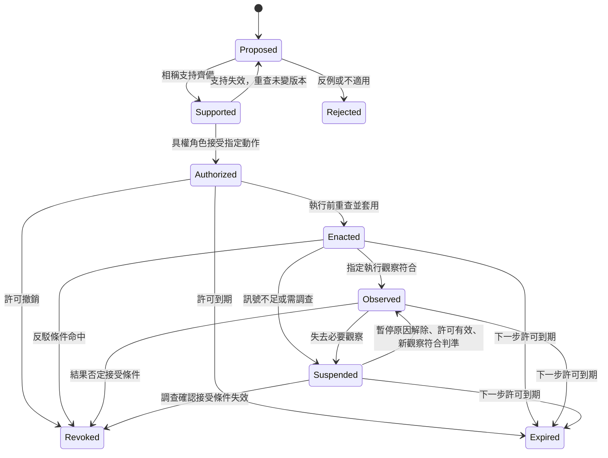

# 全綠之後：讓變更有條件生效，也能真正撤回

**Structure**: Analytical Essay
**Date**: 2026-10-01T09:10
**Source**: notes
**Model**: GPT-6.1 Sol
**Agent**: GitHub Copilot Chat v0.68.0

## 導言 (Introduction)

準備部署的工程師、接受風險的負責角色與維持服務的操作者，面對的不是同一個完成問題。程式可以已實作、測試可以全通過，行動卻尚未被允許；行動可以已獲核准，目標環境卻尚未套用；新版本可以已運作，仍不知道它是否造成某種難以回收的後果。把這些情況都叫「完成」，會使責任在最需要交接時失去對象。

設想一項「刪除離職員工資料」的變更。刪除 API 回傳成功，任務全勾，規格與程式也相符。但刪除範圍是否包含副本與備份？保留要求是否允許此刻刪除？錯選資料時能停止下一批，還是能恢復上一批？這些問題不是再跑一次同樣的測試就會有答案，也不能從一份核准紀錄倒推出來。

本文的核心問題是：驗證全綠以後，什麼條件才足以讓變更生效，而那些條件失去時，什麼能力能使許可真正停止？本文以主張升格（Claim Promotion）表示在指定版本、範圍與條件下接受一項內容來驅動行動；升格閘門則是在責任轉移處檢查條件、允許或拒絕下一步的控制。閘門不是替每句話打可信度總分，也不是另一個只負責填欄位的作者。

以下先檢查綠燈到底帶來哪種資訊，再把證據綁到實際要執行的對象，接著設計風險相稱的拒絕規則，最後處理上線觀察、停止能力與歷史保存。資料刪除、租戶匯出、私有重構與緊急修補均為設想，不是真實事故紀錄。本文的模型展示明示條件下的關係，不提供事故頻率、風險機率或治理成效的實測估計。

## 分析 (Analysis)

### 一、綠燈的價值，取決於錯誤時它會不會變紅

一項檢查通過，只有對它能區分的錯誤才有意義。若它查的是「程式是否符合目前規格」，它可以找到漏做任務、缺少情境或設計與實作不一致；若要判斷規格是否適合使用者與環境，則需要能挑戰起始理解的判斷依據。兩者互補，不能由檢查名稱互相代替。

NASA 的系統工程手冊將產品查證（verification）連到符合規格，將產品確效（validation）連到預定用途、利害關係人期望與使用情境；其 V&V 計畫綱要也要求說明責任與變更核准權（NASA, n.d.）。這是本文採用的工作區分，不表示所有團隊必須照搬 NASA 的生命週期，也不表示查證一定只查文字、確效一定要等上線才做。

測試判準（oracle）是決定結果應為何的依據。設想正式政策只允許本租戶管理員匯出資料，但規格把管理員解讀成任何登入者。程式與測試若都採這個解讀，通過就支持「此解讀被忠實實作」，不支持「此解讀符合政策」。查證可以完成自己取得的任務，確效所需的問題卻仍未被問到。

本文以封閉驗證（Closed-Loop Verification）描述這種驗證拓撲：規格、實作與預期共享未檢查的前提，迴圈能修內部差異，卻沒有足以否定共同前提的入口。共模故障（Common-Mode Failure）則提醒，看似分離的檢查可能受同一機制支配。此處只是對資訊關係的分析，不把共享前提換成已知的失敗機率。

因此，一致性與目的適用性應分開記錄。下表的「成立」限於指定版本、範圍與現有證據，不是全系統永久保證；「不成立」須有相應反例，尚未檢查不算不成立。

| 實作與指定要求相符 | 要求與結果適合本次目的及限制 | 可作的判斷 | 下一個工作 |
| :---: | :---: | :--- | :--- |
| 不成立 | 不成立 | 方向與實作都有問題 | 先釐清要求，再修實作差距 |
| 不成立 | 成立 | 目標有根據，尚未落實 | 修正實作或材料對齊 |
| 成立 | 不成立 | 忠實實作了不適用的要求 | 修前提，不能只加同類測試 |
| 成立 | 成立 | 目前範圍內得到兩種支持 | 另查許可與運行條件 |
| 成立 | 未判定 | 尚缺目的或外部限制的判斷 | 補相稱支持，不把未知填成綠 |

第三行的危險是容易被只顯示一致性的儀表板漏掉，不是本文已量測出它在所有情境風險最高。第四行也還不是部署許可，因為相符與適用不授予角色權限。這樣分開後，團隊才知道要修程式、修理解，還是補一項尚缺的檢查。

證據增益還可以用條件機率釐清。本文設定 $H$ 為「這項角色解讀符合指定政策」，$T$ 為某項檢查通過的事件；先驗 $p=P(H)$ 滿足 $0<p<1$，並設定 $P(T\mid\neg H)>0$。似然比（Likelihood Ratio）與通過後的機率關係為：

$$
\Lambda(T)=\frac{P(T\mid H)}{P(T\mid\neg H)},\qquad
P(H\mid T)=\frac{P(T\mid H)p}{P(T\mid H)p+P(T\mid\neg H)(1-p)}.
$$

這是由條件機率分解得到的本文推導，不是在估計產品安全。若檢查在解讀正確與錯誤時同樣容易通過，$\Lambda=1$，通過不改變對 $H$ 的判斷。若錯誤解讀更容易失敗，通過才可能增加這項支持；它仍受起始機率與方法假設限制。

設想 $p=1/2$，兩種解讀下檢查都必然通過，後驗仍為 $1/2$。若某程式在此設定卻算出更高值，就違反上述關係。另一個設想令正確時通過機率為 $3/4$、錯誤時為 $1/4$，得到 $3/4$。以下模型只計算本文設定的數值，不把它們當作真實測試的量測：

```python
from fractions import Fraction

def posterior(prior, pass_if_correct, pass_if_wrong):
    numerator = prior * pass_if_correct
    denominator = numerator + (1 - prior) * pass_if_wrong
    if denominator == 0:
        raise ValueError("The observed event has zero probability")
    return numerator / denominator

prior = Fraction(1, 2)
assert posterior(prior, Fraction(1), Fraction(1)) == prior
assert posterior(prior, Fraction(3, 4), Fraction(1, 4)) == Fraction(3, 4)
```

重複讀同一個結果，不會取得新的事件。若不同檢查在給定 $H$ 或 $\neg H$ 後仍互相依賴，也不能把它們的似然比分別相乘。本文推論，「十份報告都通過」不能直接當成十次獨立量測；先要知道每份結果在假設錯誤時是否真的有機會不同。

異源證據（Heterogeneous Evidence）在本文指針對某項待排除前提，帶入不由該前提自行決定的判斷依據。正式角色矩陣、非管理員測試帳號與執行觀察可以提供這種入口，但仍可能過期、偏誤或漏測。另一位 reviewer 有助於局部缺陷發現，若仍只讀相同預期，卻不保證新增這項資訊。

### 二、被檢查的東西，必須就是被允許執行的東西

取得相關支持後，還可能出現較安靜的失效：測的是甲版本，部署的是乙版本；核准的是一批資料，實際選出另一批。結果本身可以真實，卻不支持正在執行的對象。本文建議把接受問題限定到一個具體候選，而不是只問某個 change 名稱曾否通過。

候選至少包含行為或命題版本、程式與組態、政策版本、環境、資料範圍與本次操作。對刪除工作，執行前清單（manifest）列出準備處理的對象；對匯出工作，角色、租戶與資料類別限定資源邊界。這些條件改變，就要重新檢查哪些證據與許可仍可沿用。

來源追蹤（Provenance）把受測對象、取得結果的活動與負責者分開表示。W3C 的來源資料模型 PROV-DM 還區分使用與衍生：活動讀了程式、又產出報告，不足以單獨證明預期答案由程式決定（Moreau & Missier, 2013）。因此證據紀錄應分別指向受測版本、判準版本、資料或 fixture、執行時間與結果，而不是只寫 `tests passed`。

本文建議，讓版本綁定包含組態與政策，而不只包含 commit。相同 binary 配上不同開關、角色資料或查詢條件，可能產生不同結果。部署平臺若只比對程式碼識別符，仍可能接受「程式沒變、環境已變」的錯配。這是對支持適用性的延伸，不是所有證據都要使用同一種序列化格式。

摘要值（digest）以指定演算法與編碼提供內容識別，摘要比對的可靠性仍受碰撞等限制，不能判定內容是否合法或完整。設想 manifest 的筆數相同，資料身分已換；只比較筆數會漏掉集合差異。比較一致編碼的摘要可協助發現內容變動，但清單是否涵蓋所有資料位置、是否誤列員工，仍需盤點與領域判斷。

「已簽署」也需分開看。簽章核對可以支持某個金鑰接受了那些位元組，金鑰是否代表本次具權角色、是否已撤銷、是否涵蓋目標環境，則需相應信任與權限關係。本文推論，真實來源、正確內容與有效許可是三種不同檢查，不能以一個安全格式代替全部。

這也帶來檢查時刻與使用時刻的差距。上午完成 dry run，下午執行時保留政策或資料集合已變，上午的通過不會自動延續。本文建議在不可逆動作前重新核對候選版本與適用條件，必要時使用快照、交易、鎖定或版本前提，讓「接受的是什麼」與「執行的是什麼」有可檢查的一致關係。

外部服務未必能提供跨系統的原子快照。此時仍可以指定每項查證的時間、變動偵測與重新核對方式，不能把實際存在的時間窗宣稱為已消失。尤其資料刪除不能只在工作開始時查一次保留期，之後任由重試與新批次沿用同一許可。

### 三、拒絕規則應由後果決定，而不是由作者自報決定

知道候選與支持的關係後，才有條件決定檢查強度。影響是錯誤會波及哪些使用者、資料與資產；不可逆性（Irreversibility）是能否完整回復先前狀態；不確定性則涉及範圍、方法與環境還有多少未解問題。這些維度不同，不能不經定義就平均成一個風險數字。

本文建議採非補償式的最低要求：只要某個維度需要更強控制，其他維度低不會自動取消那項要求。大量刪除即使程式改動很小，資料後果也不會縮成小變更；角色權限即使測試快速，仍要有相稱判準。這是一項可被團隊接受或調整的政策選擇，不是通用風險公式。

若把各維度先映射到同一套有定義的審查等級，取最大等級可以作保守選路；它不是把損失、不可逆性與機率當成相同量。各維度使用不同序位編碼時，直接比較數值便可能改變路徑。本文推論，應保存原判斷與觸發理由，不只保存最後的 `high`，更不能讓未知值落入低風險預設。

下表是本文建議的處置對比，並非 NIST 或 OpenSpec 的通用分級。各列列出不同後果需要補的資訊，不按文件數量決定品質。

| 變更後果 | 合理支持與接受 | 執行中及之後的控制 | 不可放行的缺口 |
| :--- | :--- | :--- | :--- |
| 局部、可回復且契約清楚 | 相關測試與工程 review | 一般回復方式與觀察 | 受測版本不符 |
| API 或有限資料行為改變 | 測試與領域確認、相應負責角色 | 分段開放、期限內核對 | 影響對象未界定 |
| 權限、付款或大量資料操作 | 相稱政策、負向測試或演練、適用時的角色分離 | 可停止新操作、可查執行結果 | 自報標籤取代實際權限 |
| 範圍未知且後果難回收 | 先盤點、縮小或改成不生效的探索 | 保持不執行 | 用核准將未知說成已知 |

授權可以接受已知剩餘風險，不會把未知範圍變成已知。若還不清楚備份與副本在哪裡，有權角色的簽名不會完成盤點。本文建議先把操作縮成可查範圍或模擬，再取得新資訊，而不是用更多 approval 消除缺席的證據。

角色分離也要有能力與權限。NIST SP 800-171 第 3 版（美國 NIST 為保護非聯邦系統中受控未分類資訊所訂的安全要求）的 03.01.04 要求辨識需要分離的職責，並用存取授權支持這種分離；其說明涉及程式設計、評估、組態與稽核等職責（Ross & Pillitteri, 2024）。本文用它作制度對照，不推出所有軟體變更都需雙人簽核。第二人若只能看同一摘要，或無權拒絕，分離仍可能只是外觀。

GitHub environments（GitHub Actions 的部署環境設定）提供一個具體執行例子：在適用方案與 repository 設定下，使用該 environment 的 workflow job 要先滿足已配置的 protection rules，才能執行或取用相關 secrets。Required reviewers 可列多人，但其中一人核准即可；Prevent self-review 排除的是觸發該次 workflow run 的人，不是自動辨認程式作者或需求產出者（GitHub, n.d.）。

因此，本文建議不要將某個產品開關當作完整職責分離。還要核對誰能改 workflow、修改 environment、繞過規則或取得另一條執行通道。GitHub 文件也提供禁止管理員繞過的設定，且規則能力受方案與 repository 可見性影響（GitHub, n.d.）。能配置一個閘門，與實際動作無法避開該閘門，是不同問題。

下面以資料操作表示一個最小許可模型。本文設定 `Subject` 的程式摘要、政策、環境與目標集合共同識別候選；`profiles`、`producers`、`evidence`、`controls` 與可核准角色均假設來自已核實、由執行平臺掌握且提交者不可寫入的登錄資料，產出者身分不能靠作者自報或核准者改填。傳入的 `Approval` 亦假設核准事件與身分已驗證，並綁定其中的候選與有效區間。它們不是作者提交的 YAML；模型不實作取得與認證這些資料的過程，直接建構同名物件不會在真實平臺取得許可。

```python
from dataclasses import dataclass, replace

@dataclass(frozen=True)
class Subject:
    artifact: str
    policy: str
    environment: str
    targets: frozenset[str]

@dataclass(frozen=True)
class Approval:
    subject: Subject
    principal: str
    valid_from: int
    valid_until: int

subject = Subject("build-a", "policy-r3", "production", frozenset({"record-7"}))
profiles = {subject: "sensitive"}
producers = {subject: "engineer-a"}
evidence = {subject: frozenset({"policy", "negative-test", "recovery-drill"})}
controls = {subject: frozenset({"scope-known", "stop-ready", "observe-ready"})}
approvers = {("production", "policy-r3"): frozenset({"data-owner"})}
requirements = {
    "routine": frozenset({"test", "engineering-review"}),
    "reviewed": frozenset({"test", "domain-review"}),
    "sensitive": frozenset({"policy", "negative-test", "recovery-drill"}),
}

def permitted(candidate, approval, now, claimed_profile):
    profile = profiles.get(candidate)
    if profile not in requirements or not candidate.targets:
        return False
    if approval.subject != candidate:
        return False
    if not approval.valid_from <= now < approval.valid_until:
        return False
    allowed = approvers.get((candidate.environment, candidate.policy), frozenset())
    if approval.principal not in allowed:
        return False
    if not requirements[profile] <= evidence.get(candidate, frozenset()):
        return False
    if not {"scope-known", "stop-ready", "observe-ready"} <= controls.get(candidate, frozenset()):
        return False
    producer = producers.get(candidate)
    return profile != "sensitive" or (
        bool(producer) and approval.principal != producer
    )

approval = Approval(subject, "data-owner", 100, 200)
assert permitted(subject, approval, 150, "low")
assert not permitted(subject, approval, 200, "low")
assert not permitted(subject, approval, 99, "high")
assert not permitted(subject, replace(approval, principal="engineer-a"), 150, "high")
assert not permitted(replace(subject, targets=frozenset({"record-8"})), approval, 150, "low")
producers[subject] = "data-owner"
assert not permitted(subject, approval, 150, "low")
producers.pop(subject)
assert not permitted(subject, approval, 150, "low")
producers[subject] = "engineer-a"
profiles[subject] = "routine"
evidence[subject] = frozenset({"test"})
assert not permitted(subject, approval, 150, "low")
evidence[subject] = frozenset({"test", "engineering-review"})
assert permitted(subject, approval, 150, "high")
profiles[subject] = "unknown"
assert not permitted(subject, approval, 150, "low")
profiles[subject] = "sensitive"
evidence[subject] = frozenset({"agent-review"})
assert not permitted(subject, approval, 150, "low")
```

這裡 `claimed_profile` 刻意不決定選路。自報低風險的候選仍須滿足平臺判定的 sensitive 規則；換目標集合、過期、無權角色與未知等級都被拒絕。routine 要有測試與工程 review，但本文設定不要求產出者與接受者分離；sensitive 才加上這項限制。時間使用本文設定的整數刻度，有效區間包含起點、不含終點。這檢查最低匹配與拒絕關係，不證明 `recovery-drill` 真有用或兩份 evidence 真的異源。

`build-a` 只是摘要識別符的示意值，不是密碼學實作。若真實系統允許提交者修改登錄資料、把任意字串當作已核實結果，模型的信任前提就不存在。本文建議將核准與證據取得放在能實際驗證身分、版本與方法的邊界，讓純規則只消費核實後的結果。

### 四、上線不是最後一個閘門

許可存在，還需要知道它接下來准許哪個動作。本文把 implementation complete、authorized、enacted 與本次 validated outcome 分開：前者是實作完成，第二是動作被接受，第三是目標環境已套用，第四是指定觀察支持預定目的與限制。它們可以在不同時刻成立，封存目錄不能替它們同時作答。

本文設定以下狀態機處理一個固定版本、固定範圍的候選。Proposed 表示待評估，Supported 表示此步所需支持齊備，Authorized 表示有限許可有效，Enacted 表示已執行，Observed 表示指定觀察符合本次判準。狀態名是工作分類，不是把所有支持排成哲學上的單一可信度階梯。



每條箭頭的判斷在相應執行控制中完成，狀態名不會自行產生證據。Suspended 表示暫停擴大或新批次、等待查明；若因必要訊號缺席而暫停，須恢復訊號、查明暫停原因，並取得符合判準的新觀察與仍有效的許可，才能回到 Observed。Revoked 表示此許可不再可用。停止不能恢復已發生的結果，也不能在尚未取得執行證據時，把 Authorized 直接寫成 Observed。

本文建議，候選內容變更就另建版本，不讓修改範圍的工作沿原狀態往前走。未變候選的支持若失效，可以回到評估；已撤銷的許可不能靠重送同一事件復活。重新接受需要新的決定與必要支持，舊撤銷仍保留。Expired 也不表示歷史證據從未有效，只表示不能繼續拿該許可支持下一步。

以下模型只檢查正向責任轉移與撤銷後不得繼續的有限路徑，不涵蓋圖中暫停、到期、恢復與所有守衛條件。本文假設每個事件在進入模型前已由相應控制核實；字串本身沒有這種能力。

```python
transitions = {
    ("Proposed", "support"): "Supported",
    ("Supported", "authorize"): "Authorized",
    ("Authorized", "enact"): "Enacted",
    ("Enacted", "observe"): "Observed",
    ("Authorized", "revoke"): "Revoked",
    ("Enacted", "revoke"): "Revoked",
    ("Observed", "revoke"): "Revoked",
}

def advance(state, event):
    next_state = transitions.get((state, event))
    if next_state is None:
        raise ValueError("Unsupported transition")
    return next_state

def rejected(state, event):
    try:
        advance(state, event)
    except ValueError:
        return True
    return False

state = "Proposed"
for event in ("support", "authorize", "enact", "observe"):
    state = advance(state, event)
assert state == "Observed"
assert rejected("Proposed", "enact")
assert rejected("Authorized", "observe")
assert advance("Observed", "revoke") == "Revoked"
assert rejected("Revoked", "enact")
assert rejected("Revoked", "authorize")
```

合法路徑經過各責任事件；跳過授權、核准即宣稱已觀察、或撤銷後沿用許可，都沒有對應轉移。這不證明部署平臺真的拒絕了動作，也不證明上述流程適合所有 change。狀態機提供可以問責的表示，執行層仍要負責把拒絕變成實際效果。

金絲雀發布（canary）提供一種有限暴露的觀察方式。Google 的 Google 的 SRE Workbook 將它定義為部分、限時部署與評估；需要部署到子群的能力、判斷好壞的過程，以及把評估接進發布流程（Warner et al., 2018）。本文建議把它視為補足環境資訊的機制，不把「有 canary」當成接受許可的快捷鍵。

觀察還要有足夠代表性。只服務少數正常請求，沒有普通會員或跨租戶輸入，不會測出拒絕條件；平均成功率也可能掩蓋少數嚴重的資料權限錯誤。SRE 對樣本、持續時間、指標歸因與共用依賴均提醒限制，並指出 canary 與 control 可以一同惡化（Warner et al., 2018）。相對差異不大，不能因此宣稱兩邊均正常。

本文建議同時定義相對比較與不能跨越的絕對限制。例如可容許一定延遲變化，不表示可容許普通會員成功匯出；可用性錯誤預算也不是洩漏資料的許可。所引 SRE 章節的可用性簡化模型明示不涵蓋資料洩漏等事故影響（Warner et al., 2018）。不同後果需要不同判準。

停止能力應在放行前確認。反駁條件（Defeater）是使現有支持或許可失效的指定條件；緊急停用控制（kill switch）則是停止某類新動作的執行能力。本文建議明確誰能操作、作用於哪些節點、如何查到生效，以及停止新請求是否還有在途工作。寫了「可回滾」不是已演練的恢復能力。

### 五、保存責任關係，而不是讓最後一個綠燈覆蓋歷史

要讓上述控制可追問，需要保存各事件接受了什麼、由誰產生何種結果、失去條件後如何處置。變更帳本（Change Ledger）在本文是承諾與責任的關係紀錄：連結提案、行為差量、支持、接受、執行觀察與撤銷事件。它不必是一個獨立資料庫，更不是把所有內容擠進一個 `complete` 欄位。

不同角色仍應有不同產出來源。需求意圖由利害關係人提供、相應負責角色確認，agent 可草擬；行為規格由 agent 或工程師產出可觀察契約，技術設計由技術負責者承擔取捨與停止方案。證據由實際測試、review 或執行活動產生；核准由具權角色接受；執行觀察由環境或操作者取得；具執行權的閘門或負責角色依明確觸發條件發起撤銷，修訂則交由相應內容的負責角色重新評估。作者不能以預測代填觀察，也不能在沒有執行權時自報已完成撤銷。

本文建議將主規格用作共同查詢的當前行為描述或明示要求，將觀察、接受與歷史差距放在適當的既有變更紀錄中，以具版本的事件銜接。不是所有 log 都要放進主規格；但主規格不能因最後一次同步，就將尚未接受的偏離變成有效要求。撤銷也不應抹除原先做過的決定與動作。

生成圖與生效圖因此需要分開理解。生成圖回答建立下一份材料需要哪些上下文；生效圖回答什麼證據與權限准許下一個動作。模板可以生成 approval record，卻不能自己成為批准者。增加 `requires` 邊能改善材料依賴，未必增加任何會拒絕無權執行的控制。

OpenSpec（以提案、規格、設計與任務組織變更的規格工作流工具）是一個可用的協作對照。本文於 2026-10-01 核對其官方文件，工具描述固定於 commit `3a34ea309d80df7c5defb388133eceacb4aeba17`。該版 OPSX verify 查 completeness、correctness、coherence，搜尋實作證據並報告問題，不阻擋 archive；archive 可提示同步並保存 change，未完成 tasks 會警告（OpenSpec Commands, 2026）。這些是有價值的局部工作，不等於本文設計的生效閘門已存在。

官方支持專案內可版本控制的自訂 schema、templates 與 `requires`；慣例規格亦要求以行為契約為主，並按風險與協作複雜度增加嚴密程度（OpenSpec Customization, 2026；OpenSpec Conventions, 2026）。本文建議低風險可將問題與負責者、行為契約、測試結果放在既有材料中；高風險才明確展開核准與運行責任，不要求每項變更都產生七份長文。

實際拒絕應放在有能力的系統。資料結構檢查由 CLI 或 CI 完成，角色與接受關係由 Git hosting 或 IAM 核對，證據由 test runner 取得，部署由 CD 平臺受限執行，觀察與停止則由監測和運行控制承擔。人工控制可以有價值，但沒有可強制執行的介面時，不能把人工承諾寫成機械保證。

本文建議漸進導入。先精確命名讀數，將「實作與 artifacts 的檢查通過」和「變更可生效」分開；再為後果較大的候選補足版本、支持與接受關係；最後將拒絕與停止接到實際動作。這個順序讓團隊先看見缺口，再補有用控制，而不是先堆一套看似完整、沒人能拒絕的文件。

## 反思 (Reflection)

### 一、真正的獨立要針對失效原因

獨立 reviewer 不等於獨立判準，獨立判準也不等於可靠資料。組織上的分離能限制自核，資訊上的分離能提供不同問題，執行上的分離能防止產出者任意改結果；本文用這三種問題分析控制，不宣稱它們已被某個產品設定全面實現。

正式政策可能過期，fixture 可能只是另一份錯誤規格的翻譯，production telemetry 也可能因漏記而顯示正常。本文建議查每項材料能反駁什麼、來源與適用範圍，以及失敗時誰能改動判準。若反例一出現就把預期改成實際輸出，來源不同也可能再次變成封閉驗證。

封閉問題不必機械換人。型別檢查、特定編碼的摘要比對與完整限定案例的檢查，可以對自身規則提供有效資訊；但編譯成功不證明需求適用，摘要相同不證明刪除合法，round-trip 也可能讓編解碼共享同一錯誤。本文推論，判準的強度是相對於主張，而不是整項變更的萬用等級。

### 二、撤銷許可，不等於回復世界

功能旗標可以停用，已匯出資料卻未必能收回；刪除程式可以回滾，資料與備份的歷史未必一起恢復。隔離區（quarantine）保留暫時恢復能力，可以是分階段操作的一部分，但不能宣稱已完成不可恢復的刪除。若有效規範要求不可恢復清除，保留恢復窗口是否允許，需先確認。

本文建議分開三項能力：停止新增影響、恢復可恢復部分，以及處理不能恢復的後果。大量刪除可先隔離、演練恢復、待條件滿足再清除；匯出則需要追已取得資料的後續處置。停止 endpoint 不會取消 incident 調查、通知或補救責任，也不能把「有備份」當成總是可以恢復的證據。

到期也有不同用途。一次刪除許可的期限約束何時可執行，不意味著已刪除資料會在到期時復活；長期功能則需另定持續運行與擴大開放的條件。本文推論，期限應綁到動作與責任，不能將所有系統在 approval 到期時一律強制關閉，再把這種關閉稱為安全。

### 三、例外路徑不能讓缺口失去名字

緊急修補可能來不及走常規流程。本文建議若制度允許，使用明示的緊急例外（break-glass）：限定操作者、範圍、短期許可、實際支持與事後審核責任。這是另一條受限路徑，不是把所有缺證據的狀態改成可接受，也不應留下永久繞過的權限。

範圍未知且不可逆的動作，不會因被稱為緊急就變成已知。可以考慮停止新增請求、限制開放對象或使用不改資料的診斷，以取得支持；能否如此處置仍需看既有義務與後果。本文不提供可豁免法規或安全要求的通用例外模板。

完整閘門也有成本與盲區。低風險私有改名不必經全公司 change board，跨租戶權限也不應只靠作者自核。持續觀察不能預先發現所有未知風險，但可以使失效有機會到達責任人。好控制的判斷不在材料多寡，而在拒絕了什麼、停止了什麼，以及剩下什麼仍需人判斷。

## 實務對比 (Practical Contrastive Examples)

### 一、資料刪除的每個階段都要改變可接受的動作

設想團隊要處理離職員工資料，本文建議先界定主資料、replica、備份與外部副本，以及本次刪除承諾涵蓋哪些位置。若備份有獨立保留與到期機制，就明確記其處置，不因主資料刪除成功而宣稱所有副本清除。適用保留要求由具權角色確認，非由刪除 API 決定。

dry run 產生固定 manifest，讓資料集合可審查；執行前再次核對清單、政策與許可。若採隔離後清除，兩項動作分別接受，不能把可恢復隔離記成最終刪除。下表是本文設定的完整處置路徑，狀態名稱依前面的固定候選模型，不以表格進度冒充已觀察結果。

| 輸入與責任事件 | 關鍵判斷 | 候選狀態或許可用途 | 不滿足時 |
| :--- | :--- | :--- | :--- |
| 需求與資料盤點 | 資料位置、對象與義務是否明確 | Proposed，尚不可執行 | 縮小或補盤點 |
| 政策與 dry run | 保留條件適用、manifest 可查、恢復或補救方案相稱 | Supported | 修正或拒絕 |
| 具權角色接受 | 候選版本、集合、動作與期限相符 | Authorized，限定本批次 | 拒絕無權或過期許可 |
| 執行前核對與分段操作 | 版本及集合未變、停止能力可用 | Enacted，已執行本次動作 | 不開始，或停止後續批次 |
| 執行後稽核 | 對象集合與動作結果符合本次判準 | Observed | Suspended 或 Revoked，查明後補救 |

結果核對應比較資料身分與動作，而不只比較筆數。刪了十筆與清單十筆相同，不代表刪的是同十筆；核准刪除甲集合，也不能讓重試動態選出乙集合。本文建議把重試界定為同候選的冪等重試，或視為新候選重新接受，不能讓 retry 成為範圍擴張入口。

停止下一批和恢復上一批仍是兩個不同操作。演練證明某個環境能恢復哪些資料，不一定涵蓋所有副本、加密金鑰或外部服務。最後清除一旦不可恢復，撤銷只會限制未來行動，既有後果要另由相應責任角色處理。這個區分決定何時需要預先提高證據，而不是事後多寫一張事故表。

### 二、租戶匯出要驗證的不只是端點，而且是控制鏈

另一項設想需求是「讓管理員匯出本租戶資料」。正式政策只允許該租戶的 `tenant-admin`；登入只證明身分，不提供資源許可。本文建議用正式角色與租戶關係決定允許及拒絕案例，並檢查 CI fixture 是否真的表示這些角色，而不只是換了一個字串名稱。

下表將需求、政策、測試、接受與運行接成一條可被否定的路徑。它保留規格工作流的效率，但每段都新增相關材料或能力，不靠上一段的摘要替下一段作答。

| 邊界輸入 | 新取得的判斷或能力 | 可以取得的狀態 | 不能偷推的結論 |
| :--- | :--- | :--- | :--- |
| 管理員需求 | 需求來源確認角色與 use case | Proposed | 所有登入者均有權 |
| 正式 role matrix | 本租戶允許、普通會員與跨租戶拒絕 | 對相關要求取得 Supported | 政策永遠不變 |
| 技術設計 | 資源授權、稽核事件與停用方式可查 | 有可審查的實作方案 | 計畫就是可操作能力 |
| CI 實作與測試 | 具體版本通過指定正負案例 | 補足相關支持 | scenario 數量等於獨立性 |
| 安全與服務責任角色接受 | 許可限版本、租戶、環境與時間 | Authorized | 核准者自報即有效 |
| 受限開放與 export logs | 已部署，指定觀察符合判準 | Enacted，再取得 Observed | 沒看見錯誤即沒有錯誤 |
| 普通會員成功匯出 | 反駁條件命中，停止新匯出並處理影響 | Revoked | 關閉端點已收回資料 |

「普通會員成功」應由可核對身分、租戶、版本與時間的事件支持，不把不可靠 log 字串直接當成政策事故。但若接受規則已指定可信事件命中即停止新匯出，控制也不能只生成一則告警後繼續放行。本文建議驗證停用傳播、在途工作與結果查詢，讓撤銷有實際生效範圍。

沒有錯誤事件可能是沒有遇到該情境、訊號漏記或本次期間未發生。本文建議事前的負向檢查與事後的執行觀察互補；必要訊號缺席時，暫停擴大，不把空白當成通過。Canary 只涵蓋實際暴露的範圍，後續擴大本身仍是新的接受問題。

### 三、把新增控制放在能拒絕的位置

對團隊而言，採用這些分離不必等於重寫工具。下表比較材料位置與執行責任，全部為本文建議；實際能力要依環境、平臺設定與組織權限核對。

| 表面完成 | 仍可能缺什麼 | 適合承擔責任的位置 | 相稱修正 |
| :--- | :--- | :--- | :--- |
| schema 或 CLI validation 通過 | 內容與政策不適用 | 領域判準與責任角色 | 保留結構檢查，另查內容 |
| verify 沒有重大問題 | 共同前提沒被挑戰 | policy、fixture、runtime 檢查 | 加針對前提的反例 |
| approval artifact 存在 | 身分、版本、範圍未核實 | Git hosting、IAM、執行入口 | 無權或錯配時拒絕 |
| rollback plan 寫完 | 無操作權或未演練 | 部署與資料運行平臺 | 演練作用範圍與限制 |
| archive 完成 | 尚欠觀察、期限與撤銷 | 監測、批次入口、停止控制 | 保存歷史，不關閉未完責任 |

私有函式改名可以保留簡短變更、相關測試與一般回復方式；API 變更加入領域確認與分段開放；大量刪除需要 manifest、保留要求、相稱的恢復或補救能力。緊急修補則採制度允許的短期例外與事後審核，不等於將常規拒絕永久移除。各自的新負擔都應對應實際後果。

NIST 03.04.03、03.04.04 亦分開核准、實作紀錄、監測與變更前後的安全判斷（Ross & Pillitteri, 2024）。但其 §1.1 限定 CUI 非聯邦系統相關元件、沒有其他法律或政策特定保護要求的情況，並透過契約或協議使用；依定義代表聯邦機關處理資訊或操作系統的情況另受 FISMA 要求。本文引用這種事件分工，不替所有團隊宣告相同法律義務。

若平台無法強制某項要求，可以先保存具名人工決定與可查連結，讓缺口可見，再決定是否值得補執行介面。不能因無法自動化就說它沒有價值，也不能因已有人工確認就說已具機械拒絕保證。協作材料與外部控制應連結，不應互相冒充。

## 結論 (Conclusion)

驗證全綠提供的是指定判準下的支持，不是所有後續行動的許可。要接受變更，需要知道檢查能否否定關鍵錯誤、支持是否綁到準備執行的版本與範圍，以及拒絕規則是否由具權來源決定。增加同源報告、提高欄位完整度或改寫風險標籤，都不能代替這些資訊。

有效閘門在責任轉移處限制下一個動作，低風險維持輕量，高後果或未知範圍取得相稱支持。執行前還要重查候選與許可，不能讓先前通過跨越資料、政策或環境變化。核准不是部署，部署不是觀察；暫停、到期與撤銷也有不同作用。

撤銷則必須能到達實際動作。觀察需要代表性與可靠訊號，停止需要權限、傳播與可確認的結果；回復部署不能保證回復資料或其他既有後果。保存這些事件及其範圍，才能在不抹除歷史的情況下停止沿用失效許可。

好的變更流程不是把所有狀態送進同一個完成旗標，而是讓每項綠燈如實命名、每次接受有具體對象、每個反例能改變下一步。工作流組織材料，執行控制限制行動，運行觀察持續檢查承諾；三者相接，才使「暫時允許」成為真正可撤回的工程決定。

## 參考文獻 (References)

文中以（作者, 年份）標示出處，條目依作者字母排序。讀取日期為 2026-10-01。OpenSpec 使用同一 commit，W3C 使用日期版；NASA、GitHub 與 SRE 為所列官方網頁，其內容與產品能力仍須按版本及適用條件判讀。本文的風險路徑、許可模型與狀態機是明示設定或建議，不是文獻已測得的治理成效。

- Fission AI. (2026). *Commands*（文中簡稱 OpenSpec Commands）. OpenSpec 官方 OPSX 工作流文件，commit `3a34ea309d80df7c5defb388133eceacb4aeba17`。 [固定版本](https://github.com/Fission-AI/OpenSpec/blob/3a34ea309d80df7c5defb388133eceacb4aeba17/docs/commands.md).
- Fission AI. (2026). *Customization*（文中簡稱 OpenSpec Customization）. OpenSpec 官方文件，同上 commit。 [固定版本](https://github.com/Fission-AI/OpenSpec/blob/3a34ea309d80df7c5defb388133eceacb4aeba17/docs/customization.md).
- Fission AI. (2026). *OpenSpec Conventions Specification*（文中簡稱 OpenSpec Conventions）. 同上 commit，引用 Behavior-First Specification Boundary 與 Progressive Rigor。 [固定版本](https://github.com/Fission-AI/OpenSpec/blob/3a34ea309d80df7c5defb388133eceacb4aeba17/openspec/specs/openspec-conventions/spec.md).
- GitHub. (n.d.). *Managing environments for deployment*. Required reviewers、Prevent self-review、protection rules 與適用方案的設定說明。 [官方文件](https://docs.github.com/en/actions/managing-workflow-runs-and-deployments/managing-deployments/managing-environments-for-deployment).
- Moreau, L., & Missier, P. (Eds.). (2013). *PROV-DM: The PROV Data Model*. W3C Recommendation, 30 April 2013，尤其 §§2.1.2、5.1、5.2、5.3。 [日期版](https://www.w3.org/TR/2013/REC-prov-dm-20130430/).
- National Aeronautics and Space Administration. (n.d.). *System Engineering Handbook: Appendix*. 線上附錄，尤其 Appendix B: Glossary 中 Verification (of a product)、Validation (of a product) 定義，及 Appendix I 中 V&V 計畫綱要 §§1.1、1.2；頁面標示更新日 2023-07-26。 [官方網頁](https://www.nasa.gov/reference/system-engineering-handbook-appendix/).
- Ross, R., & Pillitteri, V. (2024). *Protecting Controlled Unclassified Information in Nonfederal Systems and Organizations*. NIST SP 800-171, Revision 3，尤其 §§1.1、03.01.04、03.04.03、03.04.04。 [doi:10.6028/NIST.SP.800-171r3](https://doi.org/10.6028/NIST.SP.800-171r3).
- Warner, A., & Davidovič, Š., with Hidalgo, A., Beyer, B., Smith, K., & Duftler, M. (2018). *Canarying Releases*. In *The Site Reliability Workbook*, Chapter 16，尤其 Canary Implementation、Selecting and Evaluating Metrics、Dependencies and Isolation、Requirements on Monitoring Data。 [官方線上章節](https://sre.google/workbook/canarying-releases/).
