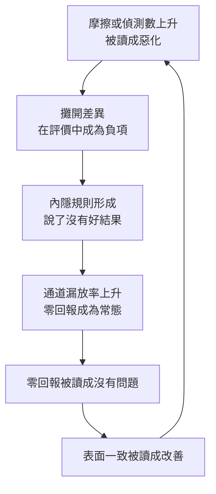

# 通過、摘要與零回報：決策者的讀數何時才有鑑別力

**Structure**: Analytical Essay
**Date**: 2026-10-02T03:20
**Source**: notes
**Model**: GPT-6.1 Sol
**Agent**: GitHub Copilot Chat v0.68.0

## 導言 (Introduction)

一個離現場很遠的決策者，判斷「沒事」時依賴的通常是三種東西：規則檢查通過了、層級報告說風險可接受、沒有人回報問題。設想一次會議結束前，主持人問：有沒有人有任何限制事項或疑慮？沒有人開口，會議紀錄寫下「無」。這個「無」可以由兩個完全不同的世界生成：真的沒有問題，或有問題但知道的人沒有把它送進這個房間。紀錄本身分不出兩者。

本文要回答的問題是：這三種讀數，在什麼條件下才真的能區分「沒事」與「有事」？讀者是依賴這些讀數做放行、驗收或審查決定的管理者、技術主管與稽核者。讀完之後可以帶走的是一個可操作的檢查，對每個讀數問：如果問題真的存在，這個讀數還會長這樣嗎？以及這個檢查如何用來辨認規則通過、摘要與沉默各自失效的位置。

答案分幾步。第一步，把「讀數是不是證據」寫成一個可以計算的條件，也就是似然比。第二到第四步，檢查三種讀數各自在哪裡失去鑑別力。第五步，檢查一個反方向的誤讀：讀數上升被當成惡化，並說明這種誤讀如何製造前面所說的沉默。第六步，說明為什麼來自同一成因的幾個「全綠」不是幾個獨立證據，以及什麼樣的對策才會恢復鑑別力，又為什麼對策本身也會被通過。

本文的主要現場是 1986 年挑戰者號（Challenger）事故總統調查委員會的報告，另以火星氣候軌道器事故調查報告補一個不同年代、不同專案團隊的對照。報告只引用調查報告寫明的事實；設想的情境一律標明「設想」，用來標出機制，不是事故紀錄。本文不判定任何人的動機，也不主張那些決策者失職。

## 分析 (Analysis)

### 一、一個讀數何時是證據

令 $H_1$ 為「有重大問題」，$H_0$ 為「沒有問題」，$O$ 為決策者看到的一個讀數，例如「通過檢查」「摘要寫可接受」「沒有收到回報」。貝氏定理（Bayes' theorem）的勝算形式說，看到 $O$ 之後兩種狀態的勝算，等於看到之前的勝算乘以似然比（likelihood ratio）：

$$
\frac{P(H_1 \mid O)}{P(H_0 \mid O)} = \frac{P(O \mid H_1)}{P(O \mid H_0)} \cdot \frac{P(H_1)}{P(H_0)}
$$

右邊第一個分式就是似然比：這個讀數在有問題的世界裡出現的機率，除以它在沒有問題的世界裡出現的機率。比值接近 1 時，看到讀數之後的勝算幾乎等於看到之前的勝算，也就是這個讀數幾乎沒有改變任何信念。本文把「讀數對兩種狀態的區分能力」簡稱鑑別力，並以似然比離 1 的遠近衡量。

為了讓比值只剩一個要討論的量，本文設定：沒有問題時，這三種讀數必定是正常的，$P(O \mid H_0) = 1$；有問題時，讀數仍正常的機率記為 $\ell$，稱為漏放率。於是似然比等於 $\ell$。放寬這個設定時，比值改為 $\ell / P(O \mid H_0)$；比值接近 1 時，讀數沒有鑑別力，大於 1 或小於 1 則分別使讀數偏向有問題或沒有問題。這個設定不是事實，是為了讓問題可以被看清楚。

這個框架支持的主張是：讀數有沒有鑑別力，是通道的性質，不是讀數的字面意義。同一個「無」，通道是否真的會在有問題時變成「有」，決定它能不能被讀成安全。Altman 與 Bland（1995，〈Absence of evidence is not evidence of absence〉）在統計學上討論了這個形狀：一個不顯著的結果若來自檢定力不足的小樣本，不能被讀成沒有效果。這是同一個結構：不存在的證據，只有在「問題若存在，證據多半會出現」時，才是不存在的證據。

下面用一個模型把這個陳述寫成可以失敗的斷言。設想事前認為有重大問題的機率是 0.20。沉默由制度生產，因此「有問題的世界裡仍然沒有回報」的機率 $\ell$ 很高；管道可信時，$\ell$ 低。模型只檢查貝氏更新的算術，不檢查這些機率是否真實。

```python
def posterior(prior: float, likelihood_ratio: float) -> float:
    odds = prior / (1 - prior) * likelihood_ratio
    return odds / (1 + odds)

PRIOR = 0.20  # 設想：事前認為有重大問題的機率

def lr_all_ok(leak: float) -> float:
    """leak = 有問題時讀數仍正常的機率；無問題時讀數必定正常（設定）。"""
    return leak / 1.0

# 零回報：通道敏感度 s = 有問題時會被回報的機率，leak = 1 - s
open_channel = posterior(PRIOR, lr_all_ok(1 - 0.90))
silent_climate = posterior(PRIOR, lr_all_ok(1 - 0.05))

assert abs(silent_climate - PRIOR) / PRIOR < 0.05  # 沉默由結構生產時，零回報讓信念的相對改變不到 5%
assert 0.02 < open_channel < 0.03                   # 管道可信時，同一個零回報讓機率降到原來的八分之一左右
```

依所列數字計算，沉默由結構生產時，同一個零回報只讓問題的機率從 0.20 移到約 0.19，幾乎沒有更新。管道可信時，同一個零回報讓它降到約 0.024。兩種情形的讀數完全一樣，鑑別力不同。模型不告訴決策者自己處在哪一種情形，那要靠另外的證據，後面幾節就是在問：什麼會使通道偏向前者。

### 二、第一種失去鑑別力的方式：規則通過

規則檢查的是可觀察的形式：步驟有沒有執行、欄位有沒有填、簽核有沒有完成。決策者想知道的是另一件事：決定對系統是不是好的。令 $S$ 為所有需要決定的情境，$R \subseteq S$ 為規則已明確覆蓋的情境，$C(x)$ 表示決定 $x$ 通過合規（compliance）檢查，$Q(x)$ 表示決定 $x$ 對系統的長期健康是好的。本文要檢查的主張寫成兩條：

$$
\exists x \in R:\ C(x) \land \neg Q(x), \qquad S \setminus R \neq \emptyset
$$

第一條說，即使在規則覆蓋的範圍內，也存在通過檢查卻有害的決定；它不說每一個合規的決定都是錯的。第二條說，規則覆蓋不了全部情境（此處 $R$ 指所有已制定規則的完整適用範圍），落在 $S \setminus R$ 的決定沒有規則可以通過，只能由判斷（judgment）承擔。兩條要分開被推翻：第一條被推翻，若在 $R$ 上 $C$ 蘊含 $Q$；第二條被推翻，若 $R = S$。「把規則寫得夠完整，人就無法做錯」預設兩者同時成立。本文不證明這個世界在原理上不可能，只檢查它能不能靠持續補規則逼近。

在似然比的語言裡，這是「通過」這個讀數的漏放率偏高：有害決定也能通過。漏放率不是固定值。行動者的任務一旦變成讓那個形式成立，讓形式成立的最便宜路徑通常不經過形式想要代表的東西。設想一條規則要求每個變更附一份「風險已評估」的欄位；欄位被填寫是便宜的，風險被評估是昂貴的，所以填寫率會高於評估率，通過的鑑別力下降。這是設想的機制說明，不是統計。

規則還有另一層限制：它是過去某個判斷的沉澱物。寫下它的那一刻，某個人在某個情境裡判斷「這種情況應該這樣做」，規則把這個判斷凍結，交給之後的人使用，省下重新判斷的成本，也拿走重新判斷的機會。之後的情境若與當時相同，凍結的判斷仍然有效；若不同，規則仍然可以被通過，卻已不再攜帶當初那個判斷。本文推論，預防性工作讓這個困難更尖銳：架構、安全、可靠性的產出在成功時不可見，事故沒有發生，系統沒有腐化，結果無從考核，組織只能考核過程；而過程一旦成為考核對象，檢查就只能看到形式。

挑戰者號的紀錄是一條規則被補上、然後被通過的完整案例。以下事實出自事故總統調查委員會報告第六章（Presidential Commission, 1986, ch. VI）。1982 年 12 月 17 日，固態火箭推進器接頭的密封被從 Criticality 1R 改列為 Criticality 1，承認第二道 O 形環在接頭轉動後不能作為備援。太空梭計畫的 Level I 需求文件第 2.8 段規定，除主結構、熱防護與壓力容器外，各子系統的冗餘不得低於故障安全。1983 年 3 月，Level I 與 Level II 批准了一份 Criticality 1 狀態的豁免；報告寫明，這份豁免是為了避免第 2.8 段加諸於太空梭計畫的義務而批准的。規則要求冗餘，接頭沒有冗餘，豁免讓這項要求不再適用於它。

1985 年 4 月 29 日發射的 STS 51-B，噴嘴接頭的主 O 形環被侵蝕 0.171 英吋而沒有密封，第二道 O 形環被侵蝕 0.032 英吋。推進器專案經理稱第二道環被侵蝕是「新而重大的事件」，隨後他與馬歇爾太空飛行中心的問題評估委員會對太空梭設下一道發射限制（launch constraint）。依 1980 年的定義，這類限制持續到問題解決，或有充分理由判定問題不會發生。他說明限制的意思是：必須處理這些觀察，檢查上次飛行有沒有出現改變先前理由的東西，並在飛行準備審查中提出，目的是確保「我們仍在測試經驗範圍內」（Presidential Commission, 1986, ch. VI）。

限制設下之後，他在 1985 年 7 月 10 日之後的每一次飛行都把它豁免。委員會的結論寫得很直接：51-L 之前連續六次豁免發射限制，使它在沒有任何豁免紀錄、甚至沒有明示限制的情況下飛行。委員會也沒有在任何飛行準備審查簡報文件中找到這道限制或它的豁免。同年 12 月，承包商工程師依要求提出將 O 形環侵蝕問題「結案」，而改良工作仍在進行。委員會主席問他，既然還在想辦法修，為什麼要結案，他說：「因為我被要求這麼做。」問題追蹤系統隨後記下承包商已申請結案與問題視為已結案；專案經理與另一位經理事後作證說這兩筆紀錄是錯的。結果是，51-L 的飛行準備審查沒有把這道限制當成未結的限制提出（Presidential Commission, 1986, ch. VI）。

用上面的兩條式子讀這段紀錄，每一步的 $C$ 都為真：豁免有簽核，限制在審查中處理過，結案有申請、有紀錄。而這些決定所涉及的 $Q$，也就是接頭的密封能不能被信賴，沒有成立：接頭沒有被修好。更要緊的是順序。51-B 的損壞是一次「合規但不正確」，組織的回應是一條新規則，也就是發射限制；這條新規則隨即成為一個可以被通過的形式，連續被通過了六次。限制本來攜帶的判斷，是「這次的觀察是否仍在已知範圍內」；豁免與結案只要求形式成立，沒有要求這個判斷被重做一次。

委員會也記下判斷如何被形式取代。專案經理說明，主 O 形環沒有密封的情形，不在先前預測最大侵蝕 0.090 英吋的模型內，因為那個最大值是在主環密封的前提下算出的（Presidential Commission, 1986, ch. VI）。一個可被通過的上限一旦寫成數字，就容易被當成對現實的描述；現實落在模型的前提之外時，上限仍然「通過」。

報告沒有支持「有人刻意規避規則」這個讀法。它記下的是每個人都在做規則要求他做的事。委員會的第三項發現說，NASA 與承包商接受了不斷升高的風險，是因為「上一次沒出事」。Vaughan（1996）在《The Challenger Launch Decision》中對這次決策的社會學研究，把這個過程稱為偏離的正常化（normalization of deviance），並主張個別決定大多符合當時的組織規則與文化，不是蓄意違規。這與本文的讀法一致，但本文不借它的結論去判定每一項決定的成因。

補規則為什麼不能使通過重新有鑑別力？本文推論，因為每補一條規則，就多一個可以被通過的形式；真正需要判斷的空白沒有縮小，只是被更厚的形式蓋住。蓋住之後更難看見，因為每一層都回報「已通過」。Goodhart 定律（Goodhart's law）說的是：任何被觀察到的統計規律，一旦被拿來控制，就傾向崩解；Campbell 定律（Campbell's law）補的是社會面：量化指標愈被用來做決策，愈承受腐化壓力，也愈會扭曲它本來要監測的過程（Goodhart, 1984；Campbell, 1979）。Manheim 與 Garrabrant（2018） 把「指標被過度最佳化」區分為至少四種不同機制，並指出術語混用使這類失敗難以被理解。本文不判定挑戰者號的紀錄屬於哪一型，也不聲稱存在蓄意操弄；只借用這個區分，提醒不同機制可能需要不同的檢查。

下表把同一類檢查通過時能證明什麼、不能證明什麼並排。

| 形式 | 通過時證明了什麼 | 通過時沒有證明什麼 | 挑戰者號紀錄中的對應 |
| :--- | :--- | :--- | :--- |
| 需求文件的冗餘條款 | 冗餘要求有處置 | 硬體有冗餘 | 1983 年 3 月的 Criticality 1 豁免 |
| 發射限制 | 觀察在審查中被處理過 | 問題被解決 | 1985 年 7 月之後連續六次豁免 |
| 問題結案 | 有申請、有紀錄 | 修正已完成並被驗證 | 1985 年 12 月依要求申請結案，紀錄其後被認為錯誤 |

這張表的三列都是規則被滿足、規則原本要防的事仍在。它們共同的形狀不限於太空梭：只要有一個形式可以被通過，且通過的成本低於做對的成本，通過的鑑別力就會下降。這不是反制度論。完全沒有外在控制的組織防不住最壞的行為，也無法讓陌生人協作；委員會自己指出，當時沒有任何制度使發射限制及其豁免必須被各級管理層考慮，那是應該補的規則（Presidential Commission, 1986, ch. V）。本文排除的是另一件事：補上之後，就認為下一次決定會是對的。

### 三、第二種失去鑑別力的方式：層級摘要

第二種漏放發生在資訊往上傳的路上。設想一線工程師寫下一句完全真實的話：這個系統沒有出事，但有幾個脆弱的耦合正在累積。這句話有三個成分：目前的事實（沒有出事）、對結構的判斷（耦合脆弱）、對趨勢的預測（正在累積）。讓它沿著層級往上傳，每經過一層，接收者都要把它摘要一次，而摘要的選擇壓力偏向可驗證、可比較、能放進一格表格的成分。到了決策者手上，可能只剩「無事故、服務水準達標、審查已完成」。

本文推論，摘要丟東西的順序不是隨機的：事實可驗證，留得最久；判斷不可驗證，先被丟；預測既不可驗證又不可比較，最早被丟。這個順序是本文的詮釋，來源沒有量測它。有一項研究支持它的前半：Glauser（1984）回顧向上資訊流的文獻，把影響因素分成下屬特性、主管特性、上下級關係、訊息特性與結構特性五類。資訊能否準確上傳，不只是說話者誠不誠實，結構也決定訊息的命運。

決策者離現場越遠，這個結構的約束越強。設想一位管三百人的主管，一天只有二十四小時，不可能直接觀察所有一線情境，只能依賴摘要、指標、流程與代理人；這是注意力預算的約束，不是能力問題。小團隊裡這個問題較輕：主管能直接知道誰真正解決了問題、哪個模組其實沒人敢碰。本文推論，這種默會知識（tacit knowledge）本身就是一條未經壓縮的通道。組織一大，這條通道消失，只能以形式化的代理取代：用文件代替共事，用評分代替了解。Whetsell 等人（2020）在一個 143 位員工的小型市政府中發現，正式地位、權限路徑與部門歸屬都會影響員工向誰尋求資訊；組織圖決定了哪些訊息有機會相遇。

挑戰者號的紀錄讓這個形狀可以逐頁對照。以下事實出自調查委員會報告第六章（Presidential Commission, 1986, ch. VI）。太空梭的飛行準備審查（Flight Readiness Review）是多層審查：承包商往上到馬歇爾太空飛行中心的專案（Level III），再到詹森太空中心的計畫辦公室（Level II），最後到總部（Level I）。NASA 政策手冊為中間一層審查列出的第一個目標，是提供審查團隊足夠的資訊，使他們能對飛行準備狀態做出獨立判斷。

1985 年 1 月 24 日發射的 STS 51-C，O 形環溫度為 53°F，是當時最冷的一次。兩具推進器都出現 O 形環侵蝕，且第二道環第一次出現受熱的痕跡。承包商為下一次飛行的審查準備了到當時為止最詳盡的分析，第一次把溫度列為侵蝕與竄氣（blow-by，燃氣越過 O 形環）的因素。結論寫著：低溫提高了竄氣的機率，51-C 經歷了佛羅里達史上最差的溫度變化，下一次飛行可能出現同樣的表現，「狀況不理想但可接受」。這份分析被帶進馬歇爾專案辦公室的審查時是 18 頁。1985 年 2 月 21 日的 Level I 審查上，這 18 頁被縮成一頁圖表，結論是「可接受的風險，因為暴露時間有限且有冗餘」。報告寫明，Level I 的報告裡找不到任何關於溫度的字。

用三個成分讀這一頁：事實（侵蝕發生過）留下，化成「可接受的風險」；判斷（低溫提高竄氣機率）被丟掉；預測（下一次可能重演）被丟掉。留下的「有冗餘」，是一個在 1982 年底已被正式撤銷的前提，因為那時接頭已被改列為沒有備援。委員會還指出，Thiokol 與馬歇爾在 NASA 正式宣告密封不再冗餘之後，仍長期依賴第二道環的冗餘。報告沒有說有人刻意刪掉溫度，本文也不這樣讀。它記下的是一份分析在上傳時被摘要成最能放進一頁、最能跨次比較的形狀，而那個形狀正好不含決定性的那一項。

摘要鏈解釋了為什麼「接受標準」會隨經驗上升。委員會觀察到，後來的審查因為相信飛行中的 O 形環侵蝕「在資料庫之內」，只做粗略的檢視，常以「可接受」或「容許」的範圍打發反覆出現的侵蝕。聽證中，委員問專案經理：當侵蝕超過預期的最大值時，你們豁免那次飛行，說還有餘裕；隨著經驗累積，放行標準也跟著上升，是嗎？他確認，就主密封失效的那一次而言，是的（Presidential Commission, 1986, ch. VI）。代理指標（proxy metric）沒有被造假，它只是隨著每一次沒出事的飛行，把自己的邊界往外推。Karwowski 等人（2023）在強化學習中把這個問題形式化：當獎勵函數只是真實目標的不完美代理時，最佳化代理超過某個臨界點，真實目標的表現反而下降。 Fire 與 Guestrin（2019） 分析了逾一億兩千萬篇論文，報告以論文數、引用數為基礎的指標，其有效性正在被削弱。這兩項研究領域不同，與本文的連接只在一點：代理在被用於控制之後可以和它代表的東西脫鉤。

本文推論，這些環節接成一個回到起點的迴圈：層級增加迫使壓縮，決策者只看見壓縮後的現實，不確定感上升而要求更多可驗證的形式，下層學會最佳化可上報的現實，指標與真實狀態脫鉤。這個迴圈裡沒有壞人。上層要求更多可驗證的東西是合理的，因為他們看不見現場；下層最佳化可上報的現實也是合理的，因為他們被這些東西考核。

壓縮與 Goodhart 是同一條因果鏈的上下游。壓縮說明代理為什麼被引入；Goodhart 說明代理被引入之後為什麼失真。只處理下游，會以為換一個更好的指標就好；更好的指標仍是摘要，它縮小誤差，不縮短距離，甚至可能讓事情更糟，因為代理越可信，決策者越放心地把判斷交給它，脫鉤被發現得越晚。

### 四、第三種失去鑑別力的方式：沉默與零回報

組織沉默（organizational silence）指組織成員保留、而非表達與工作相關的想法、資訊與意見。當沉默由結構生產時，「沒有收到回報」的漏放率 $\ell$ 接近 1，似然比也接近 1，零回報就幾乎沒有鑑別力。Van Dyne 等人（2003）從另一個方向得到相近的命題：沉默比發聲更模糊，觀察者更容易誤判沉默背後的動機；發聲至少留下一段可以被檢查的話，沉默什麼都沒留下。

挑戰者號發射前一天的紀錄，是一次可以逐小時對照的零回報。以下事實出自調查委員會報告第五章（Presidential Commission, 1986, ch. V）。1986 年 1 月 27 日中午 12 時 36 分，任務管理小組因側風取消當天的發射。隨後約半小時的討論中，所有相關人員被徵詢 24 小時內發射是否可行，並被要求提出任何限制事項；報告寫道，這次討論沒有產生任何關於固態火箭推進器表現的限制或疑慮。下午 2 時的任務管理小組會議討論了低溫對發射設施的影響，沒有人對推進器的 O 形環表示疑慮，所有成員被要求重新檢視狀況，若有任何問題就打電話回報。

同一天下午約 2 時 30 分，在猶他州的承包商工廠，一位經理召集了工程師，他事後回憶，工程師們對這個低溫「非常堅決地表達了疑慮」，因為它遠低於資料庫的範圍，也遠低於資格驗證的溫度。當晚的電話會議上，承包商工程部門建議不要在 O 形環溫度低於 53°F 時發射。承包商管理層在一次離線討論之後改變立場，建議發射。委員會的第四項發現寫道，Thiokol 管理層是在馬歇爾的催促下，違反工程師的看法，為了遷就一個主要客戶而改變立場（Presidential Commission, 1986, ch. V）。本文不評斷這個動機判斷，只記下它是委員會的結論。

資訊沒有繼續往上走。第一次電話會議之後，Level II 的計畫經理沒有被告知。委員問馬歇爾的太空梭專案辦公室經理，他是不是實際上做出不把此事升級到 Level II 的人，他答：是的。推進器專案經理說明，他認為那是 Level III 的問題，沒有違反任何發射準則，不需要豁免。晚上約 11 時 30 分他打給 Level II 的計畫經理，談的是回收區的天氣，作證說沒有和對方談剛結束的那場會議。1 月 28 日上午 9 時的任務管理小組會議討論發射台的結冰，年表記著沒有明顯討論溫度對 O 形環密封的影響。馬歇爾中心主任被問到為何沒有轉告上級時說：那不是回報管道。委員會主席逐一詢問甘迺迪太空中心主任、發射主任、Level II 計畫經理與 Level I 的太空飛行副署長，發射前是否知道承包商的反對，四個人都答：不知道（Presidential Commission, 1986, ch. V）。

從 Level I 與 Level II 的位置看，從 1 月 27 日下午到發射當天早上，他們得到的觀測就是 $O$：要求有問題就回報，沒有回報；而 $H_1$ 為真。委員會的結論是：做出發射決定的人不知道 O 形環與接頭近期的問題歷史，不知道承包商最初的書面建議，也不知道管理層改變立場後工程師持續的反對；如果決策者知道全部事實，極不可能在 1 月 28 日發射（Presidential Commission, 1986, ch. V）。

這份紀錄不能被整齊地歸成「員工不敢說」。工程師說了，而且說得很清楚。資訊停在一個判斷「這不需要往上送」的層級。報告第六章另記下一位承包商經理的證詞：他曾認為在問題修好之前不應再出貨任何火箭發動機；被問到是否表達過這個疑慮時，他說：「很不幸，沒有對對的人說。」（Presidential Commission, 1986, ch. VI） 另一位工程師描述當晚的離線討論時說，他在發現沒有人要聽之後就停下了（Presidential Commission, 1986, ch. V）。報告沒有提供足夠的材料判定這些人的動機，本文不把他們歸入任何一種沉默的類型。本文只需要一件事：從決策者的位置看，機制是什麼並不改變 $O$ 的鑑別力。

這份紀錄還有兩個細節，說明零回報為什麼不只是沒人說。第一，舉證責任被顛倒了。參與電話會議的承包商工程師說，他無法把疑慮量化：他沒有資料，他和同事自前一年 10 月起就一直想取得 O 形環彈性隨溫度變化的資料；他說，他感受到的氣氛是他們被放在必須證明不該發射的位置，而不是證明有足夠資料可以發射。承包商工程部門的副總也作證說，那晚的角色對調了：他們必須向馬歇爾證明自己還沒準備好，而他們無法絕對證明那個發動機不會運作（Presidential Commission, 1986, ch. V）。委員會在另一段關於發射台結冰的發現中寫道，NASA 似乎要求承包商證明發射不安全，而不是證明發射是安全的（Presidential Commission, 1986, ch. V）。在這個結構下，「沒有被證明危險」被當成「安全」。能產生危險證據的測試並非完全不存在：第六章記錄，Thiokol 在 1985 年做過 O 形環彈性的台架測試，50°F 時 O 形環在十分鐘內沒有重新接觸（Presidential Commission, 1986, ch. VI）。但工程師被要求量化疑慮時，說他沒有足以量化的資料；委員會也認為，若仔細分析過 O 形環損傷的飛行歷史，就會看到損傷與低溫的相關，而 NASA 與 Thiokol 都沒有做這項分析（Presidential Commission, 1986, ch. VI）。換成似然比的語言，$P(\text{沒有可量化的危險證據} \mid \text{危險存在})$ 接近 1，不是因為沒有危險，而是因為能在危險存在時產出可量化證據的分析與測試，在當時的決策流程中不足。這一句是本文推論。

第二，有一組讀數從頭到尾沒有被看。報告第六章記下，1 月 27 日晚上，管理者只比較了「觀察到 O 形環熱損傷的那些飛行」在不同溫度下的分布。在這樣的比較中，損傷分布在 53°F 到 75°F 的各個溫度，沒有什麼不規則。把全部飛行都納入，包含沒有損傷的「正常」飛行，比較的結論就大不相同：在 O 形環溫度 66°F 以上的二十次飛行中，只有三次出現熱損傷；在 63°F 以下的四次飛行，每一次都出現熱損傷（Presidential Commission, 1986, ch. VI）。這四次與二十次是委員會文字給出的計數，是描述，不是推論統計；後來 Dalal 等人（1989，〈Risk analysis of the space shuttle: Pre-Challenger prediction of failure〉）用全部先前飛行的資料建立統計模型，分析 O 形環熱損傷與溫度的關係。重點在這裡：沒有損傷的飛行，就是一組「零回報」。它們是觀察，只是沒有人把它們放進分母。零只有在被收集、被放進比較時，才是證據。

火星氣候軌道器的調查報告顯示了一個結構相似的形狀；這是結構類比，不是同因。報告寫道，導航團隊在資料衝突浮現時，用電子郵件處理，沒有使用正式的事件、意外、異常通報程序（ISA），而未善用問題追蹤系統，使這個問題「從縫隙中漏過」（Stephenson et al., 1999）。正式系統裡看不到任何一條紀錄，不等於沒有人提出疑慮；疑慮存在，只是沒有走進決策者會讀的通道。IEEE Spectrum 記者 Oberg（1999）記錄，NASA 官員在記者會上對導航團隊為何沒有得到管理層回應的說明，是團隊沒有使用現有的正式程序。一個要求填表才算數的通道，把不填表的疑慮擋在外面，使正式紀錄中的空白不再能代表沒有疑慮。

那麼沉默從哪裡來？Morrison 與 Milliken 把沉默從個人屬性重新定位為集體現象，提出沉默氛圍（climate of silence）的概念：組織中廣泛共享的信念，認為談論問題是徒勞的，或是危險的。依他們的模型，這個信念在成員彼此交換「說了會怎樣」的判讀中形成；這是理論命題，不是該文的實證發現（Morrison & Milliken, 2000）。Milliken 等人（2003）訪談 40 位員工，多數人都曾對某個問題有疑慮卻沒有向上提出，最常被提到的理由是怕被看成負面角色而損害珍視的關係。 Detert 與 Edmondson（2011）提出內隱發聲理論（implicit voice theories）：人把「什麼話不能說」當成理所當然的規則並據此自我審查，規則不一定被寫下來。若沉默是氛圍，本文推論，招募更敢說的人就不是解方，新人學習組織規範的第一課，就是觀察什麼話沒有人說。

Van Dyne 等人（2003）依動機把沉默分為三型；本文推論，三型對應不同的失效，介入不能通用。

| 類型 | 驅動動機 | 對應的介入 |
| :--- | :--- | :--- |
| 順從性沉默（acquiescent silence） | 認為說了也沒用，放棄 | 用可見的行動證明發聲會被處理 |
| 防衛性沉默（defensive silence） | 害怕後果，判斷仍在，主動隱瞞 | 建立程序正義（procedural justice），證明說真話不會被記下來秋後算帳 |
| 親社會沉默（prosocial silence） | 為保護他人或組織而保留，仍投入 | 把「讓組織知道真相」納入忠誠的內容 |

第三型最反直覺：動機常常是好的，結果與前兩型相同。由此得出一個不舒服的推論：成員忠誠度高，不能作為沉默不存在的證據。表中的介入欄是本文依三種動機做的推論，Van Dyne 等人的研究區分三種動機，沒有檢驗這些介入。

主流研究預設沉默是管理層想解決的問題。Donaghey 等人（2011）拒絕這個預設：要理解沉默，必須承認沉默有時對管理層有利，管理層可能有維持甚至製造沉默的動機，機制不是明文禁言，而是議程設定與制度結構。 Pinder 與 Harlos（2001） 把沉默界定為員工對感知到的不公所做的回應。沿著這條線，在設計任何發聲機制之前，先查現有制度在功能上獎勵什麼。若異議在考核、晉升與議程設定中實際被懲罰，不需要明文，只需要可觀察的模式，新增的管道只是表演。

管道還有前置條件。Tangirala 與 Ramanujam（2008） 對 30 個工作群體、606 名護理師的調查發現，程序正義氛圍較高時，群體認同與職業承諾抑制沉默的作用更強。 Colquitt（2001）把組織正義拆成多個構面，互動正義包含人際與資訊兩面。反過來，調查意見卻不行動，會留下具體的、可引用的「說了也沒用」的證據，這正是順從性沉默賴以維持的材料。

### 五、反方向的誤讀：讀數上升被當成惡化

前三節的失效都是讀數太容易顯示正常。還有一種相反方向的失效：一個讀數上升，被讀成惡化，而實際上只是感測變好了。這同樣是似然比的問題，方向相反：在「感測變好」的世界裡，讀數上升的機率也很高，所以上升本身不鑑別惡化。

管理者容易觀察的代理是摩擦、爭議、會議變多、決策變慢。這些被直接讀成組織效能下降。實際發生的常常只是隱性衝突變成顯性衝突，問題沒有增加，可見性提高了。只會壓低表面摩擦的管理，做的是把告警音量調小，不是把故障率降低。Edmondson（1996）對醫院病房團隊用藥錯誤的研究，指出各單位之間有系統性的差異，差異不只在錯誤的頻率，還在錯誤被偵測與被學習的可能性。這個發現支持一個謹慎的說法：偵測到的錯誤數同時反映真實錯誤與偵測的條件，不能單獨用它判斷品質。本文不據此斷言「發聲不被懲罰會使偵測率上升」，那需要原研究的更多細節。

不過，把差異攤開也確實會被正確地拒絕，只要它沒有終止的辦法。摩擦至少有三種：必要的認知摩擦，表示不同模型正在碰撞；結構性摩擦，表示責任、資源或邊界的設計有問題；無效摩擦，是資訊重複傳遞、權責含糊、反覆等待而沒有決策出口。沒有出口的那一種不會累積成觀察，會累積成迴避：下次沒有人再把差異攤開，因為攤開沒有終止條件。本文推論，可處理的摩擦要有五個性質：差異可以被命名，衝突有明確範圍，契約可以調整，決策權清楚，爭議有辦法結束。缺任何一項，攤開就只有成本沒有終止，組織把這種攤開讀成失敗，讀得並沒有錯；錯的是把這個拒絕延伸到有終止條件的那一種。

這兩種要求不矛盾。「不允許摩擦」要拆成兩個禁止：禁止差異被看見，任何顯性化方法都無法成立；禁止無出口的摩擦，反而是顯性化能持續的條件。前者是差異的可見性，後者是可見性的終止條件。

五個性質回答的是摩擦能不能結束，沒有回答人敢不敢把差異說出來。這是另一個條件。心理安全（psychological safety）在 Edmondson（1999）的用法裡，指團隊成員共有的一種信念：團隊對人際風險承擔是安全的。它是團隊共有的信念；本文把它與對特定個人的信任區分開來，這是本文的詮釋。Detert 與 Edmondson 的內隱規則解釋了為什麼終止條件齊全，差異仍可能不被說出：預期是懲罰，可見性在說話者的函數裡就是負項。組織可以同時擁有正式的開放政策與一套內隱規則，只改文件，預期不動。內隱規則也使無出口的摩擦污染有出口的摩擦：一次沒有結束方式的爭議被記住之後，被記住的是「說出來沒有好結果」，下一次即使五個性質齊全，預期仍按上一次計價。

把前面的片段接起來，得到一條本文推論的因果鏈：把可見的摩擦讀成惡化，使攤開差異的動作在說話者與管理者的評價裡成為負項；負項累積為內隱規則；內隱規則使 $\ell$ 升高；零回報於是被讀成沒有問題，而這個「沒有問題」又使管理者更確信摩擦下降是改善。這條鏈是一個迴路，不是兩個獨立的失效。下圖把它畫成狀態移動。



這張圖的關鍵在於 A 與 E 讀的是兩個方向相反、卻由同一個誤讀產生的結論：上升被讀成惡化，沉默被讀成安全。兩者都把讀數的字面意義當成它的鑑別力。破壞這個迴路，可以從 A 開始：先問讀數上升之前，有沒有一次被命名、有範圍、有結束方式的碰撞。沒有那個碰撞紀錄，摩擦的下降就不可解釋，它可能是真的一致，也可能是時間已被壓到零；本文不提供一個能從摩擦數字單獨判斷健康的公式。

另有兩個與感測範圍有關的限制。領域驅動設計（domain-driven design）把大系統分成多個界限上下文（bounded context），每個上下文有自己的模型，再用上下文映射（context map）把上下文之間的關係寫成可指名的模式（Evans, 2004）。這類把可見性裝在邊界上的儀器，能讓邊界上的不一致被看見，卻看不見不經過邊界的內部重組：詞還是那些詞，邊界還在，內部卻已重組出一份不可對照的文本，所有警報點都不會響。邊界上的可見性也沒有產生負責那條關係的人：有名字的不一致，仍可能沒有人承受它。第二個限制是：摩擦讀數一旦可比較、並被用來配置資源，參與者最佳化的就是跡象，不是摩擦。這是 Goodhart 與 Campbell 的形狀（Goodhart, 1984；Campbell, 1979）。心理安全也不能被收成另一個指標：它描述的是發聲的預期代價，不是可以拿來考核「你們夠不夠安全」的分數；一旦分數可比較，被最佳化的會是分數的外觀，例如多幾次被安排好的異議、少幾次會讓分數難看的沉默。

### 六、同源的綠燈不是獨立證據，以及恢復鑑別力需要什麼

前四節各自檢查一個通道。決策者實際看到的往往是幾個讀數同時為綠：規則通過、摘要正常、沒有回報。若這幾個讀數彼此獨立，三個漏放率相乘，鑑別力很強。若它們共享同一個成因，例如同一個使人不敢說話、又使形式被填滿的氛圍，則它們不是三個證據，更接近一個。

設想三個通道各自在獨立運作時漏放率為 0.5。以下都是在有問題的條件下的機率，並設定沒有問題時三者必定全綠。若三者獨立，有問題時三者全綠的機率是 $0.5^3 = 0.125$。再設想有一個共同狀態，以機率 $c = 0.30$ 使三個通道同時只顯示正常；其餘時間三者獨立運作，各自漏放率仍為 0.5。則有問題時三者全綠的機率是 $c + (1-c) \times 0.125$。下面的模型把這個設想寫成可檢查的斷言：同源讀數是否比獨立讀數提供更弱的證據。

```python
def posterior(prior: float, likelihood_ratio: float) -> float:
    odds = prior / (1 - prior) * likelihood_ratio
    return odds / (1 + odds)

PRIOR = 0.20          # 設想：事前認為有重大問題的機率
leaks = (0.5, 0.5, 0.5)
independent = 1.0
for l in leaks:
    independent *= l   # 三個通道獨立時，有問題而三者全綠的機率

C = 0.30               # 設想：共同成因使三個通道同時失去鑑別力的機率
common = C + (1 - C) * independent

p_independent = posterior(PRIOR, independent)
p_common = posterior(PRIOR, common)

assert p_common > p_independent  # 同源的三個綠燈，比獨立的三個綠燈弱
```

依所列數字計算，同源讀數之後仍然相信有問題的機率約 0.088，高於獨立讀數之後的約 0.030。它沒有證明三個通道真的共享成因，也沒有提供 $c$ 的估計。它指出一件事：把三個綠燈當成三個獨立的證據之前，要先問它們有沒有共同成因。前幾節的分析說明，至少沉默氛圍與形式被填滿這兩者，可能共享「說了沒有好結果、通過比做對便宜」的組織預期；這是本文推論。

恢復鑑別力的意思，是讓問題存在時，讀數更不容易維持正常，也就是降低漏放率 $\ell$。三個通道各有不同的做法，也各有被重新通過的方式。

先看摘要。縮短資訊路徑與保留未壓縮的通道，是兩類修法；改良指標只是縮小誤差，不縮短距離。下表列出五種通道，每一種繞過鏈上的一個環節，也各有典型的失效；失效欄是本文推論，沒有經驗資料。

| 通道 | 繞過的環節 | 典型的失效 |
| :--- | :--- | :--- |
| 決策者直接接觸一線案例 | 層級摘要本身 | 變成安排好的參訪，一線呈現的是排練過的現場 |
| 重大決定保留異議與少數意見 | 共識形成對異議的磨平 | 異議被記錄，但不影響結果 |
| 指標之外要求敘事 | 數字對脈絡的丟棄 | 敘事被模板化，成為另一種可最佳化的形式 |
| 定期回看決定的長期後果 | 決定當下對未來成本的不可見 | 回看沒有後果承擔，變成例行會議 |
| 決策者承擔部分運營後果 | 決策權與後果的分離 | 象徵性參與，痛苦仍由一線吸收 |

右欄有共同的規律：每一條通道一旦被做成可考核的形式，就會被它要繞過的那套邏輯重新殖民。參訪會被編排，因為接待本身可被考核；異議會被儀式化，因為「已記錄反對意見」比「反對意見改變了決定」更容易交代。這是同一個 Goodhart 機制，施加在對策上。挑戰者號的紀錄裡也有一條這樣的通道：承包商與馬歇爾工程師在 1985 年組成的密封問題任務小組，留下了逐步升高的擔憂與挫折的書面紀錄；但 Level II 不在這條路徑的回報線上。通道存在，沒有接到決策者（Presidential Commission, 1986, ch. V）。評估一條通道時，最直接的問題是：它的儀式化版本長什麼樣子，現在的實踐離那個版本有多遠。

通道也昂貴。決策者直接接觸一線，消耗組織最稀缺的注意力；保留異議，拖慢決策節奏。本文建議一個配置標準：決定越不可逆、越依賴判斷而非規則，越值得付這個成本；可逆而規則化的決定，讓摘要去處理。這是本文建議，沒有被檢驗過。

對規則通過，恢復鑑別力的條件是：檢查要能在有問題時變紅，也就是它檢查的是結果，不只是形式；規則的每一次豁免或結案，都要求當初寫下它的那個判斷被重做一次，而不是只讓形式成立。對沉默，順序是先查現有制度在功能上獎勵什麼，再依沉默的類型介入，並讓程序正義與可見的回應先於管道。管道先於這些條件，管道就是表演。

最後一個檢查是估計漏放率本身。決策者無法直接觀察 $\ell$，因為它是在「問題存在」的條件下才有定義，而決策者通常不知道問題是否存在。本文建議兩種可行的方向，都沒有被檢驗過：回溯過去已知的事故，檢查事故發生前通道顯示了什麼；以及在得到授權與保護的前提下，刻意放入已知的問題，觀察多久、經過哪些通道才會被回報。這兩種做法讓漏放率成為可以被量測的量，不再只是一個設想的數字。

## 反思 (Reflection)

本文不主張所有零回報都來自沉默。多數時候，沒有回報可能真的是因為沒有問題。本文的主張更窄：在沉默機制可能存在的組織裡，零回報不提供區分兩者的材料；要區分，得從別處取得證據。

本文也沒有證明失真程度是距離的函數。鏈上的每一環都有來源：距離迫使摘要，摘要迫使代理，代理在被用於控制之後脫鉤；「距離越遠、失真越快」是把各環接起來的推論，沒有被量化過。似然比框架本身也只是把定性問題寫成可檢查的形式：本文的數字都是設想，沒有一個是測量。

挑戰者號的紀錄容易被收成幾個不屬於本文的結論。第一個是「Level I 失職」：報告沒有這樣寫，本文也不需要，一頁的形狀是每一層都在做合理的摘要之後得到的形狀。第二個是「所以報告要寫長」：18 頁搬到 Level I，下一次仍會被摘要，因為 Level I 的注意力預算沒有變；問題不在頁數，在於沒有一條通道讓那句「下一次可能重演」繞過摘要。第三個是「工程師應該更勇敢」：工程師說了，資訊停在別處。第四個是「中間管理層隱瞞」：委員會用的詞是「傾向於把潛在的嚴重問題留在內部解決，而不是往前傳達」，並把它與一個容許內部安全問題繞過關鍵管理者的結構並列。從決策者的位置看，零回報在那一天不是證據，這句話成立不依賴任何人的動機。

同一個「合規與判斷」的問題還有兩處本文沒有處理。一是規則的密度是否使判斷力萎縮，這個說法可能成立，但本文沒有證據；二是判斷如何被養成，那需要另外的來源。

本文也沒有提供由似然比到放行門檻的規則：把似然比換成行動，還需要誤放與誤擋各自的成本；本文的數字全是設想，不構成門檻。各項對策的成本與效益也沒有被比較，本文只指出它們會被重新通過。挑戰者號與火星氣候軌道器各是一次事後調查，兩者共有的形狀是結構類比，不是同因，也不能單獨證明規則通過、摘要壓縮或沉默在其他組織同樣發生。

內部拔擢常被拿來解釋為什麼研發單位特別容易把摩擦讀成失敗。本文推論這個解釋不夠，更精確的機制是：在既有系統裡成功的局部能力，被誤當成管理複雜系統所需的能力。一個人因為判斷快、交付穩、救火強而被升上去，新角色要的卻是辨認摩擦的種類、容納暫時不一致、保護探索空間，這不是原能力的線性延伸。拔擢只是這個錯位的一條路徑，不是可見性被關掉的原因；即使決策層來自外部，只要他們的評價函數把「表面一致」當成正項，同一種關掉仍會發生。這一段沒有資料支持。

另一個邊界是：不是所有的表面一致都是假共識。有些系統的差異確實很小，摩擦下降是因為沒有東西要撞。分辨這兩種下降的方法不是看摩擦的絕對值，而是看下降之前有沒有一次被命名、有範圍、有結束方式的碰撞。

還有一個不能從心理安全推出的結論。發聲不被懲罰，只使差異有機會被說出，不使被說出的差異有主人，也不使無出口的摩擦變成有出口。一個讓人敢說話、卻沒有人有權結束爭議的房間，會正確地被參與者放棄。放棄的理由是沒有終止，不是懲罰；把心理安全補上，補的是發聲的代價，不是五個性質。

## 實務對比 (Practical Contrastive Examples)

同樣是「沒有聽到壞消息」，不同的讀數能排除的東西不同。下表把五種常見讀數並排，列出它能排除什麼、不能排除什麼，以及讓它有鑑別力需要的條件。

| 讀數 | 它能排除什麼 | 它不能排除什麼 | 讓它有鑑別力的條件 |
| :--- | :--- | :--- | :--- |
| 全部規則檢查通過 | 明文規則被違反 | 形式成立而實質有害 | 檢查的是結果；豁免與結案要求重做判斷 |
| 摘要寫「可接受風險」 | 已進入摘要的風險 | 被壓縮丟掉的判斷與預測 | 有一條繞過摘要的通道，且它的儀式化版本被監看 |
| 徵詢限制事項，無人回應 | 在場者願意當場提出的限制 | 停在其他層級、沒有進入這個房間的限制 | 先查制度獎勵什麼；回報的回應可見 |
| 摩擦或偵測到的錯誤數上升 | 沒有，這個讀數方向不確定 | 是惡化還是感測變好 | 查上升之前有沒有被命名、有範圍、有結束方式的碰撞 |
| 異議被提出、被記錄、回應可見 | 較少，這是少數能提供鑑別力的觀測 | 親社會沉默 | 回應真的改變決定，而不只是被記錄 |

前三列是三種讀數的漏放，第四列是反方向的誤讀，第五列是少數鑑別力較高的觀測，因為它不只是一個零，它是一個發聲被處理過的紀錄，並降低了之後每一次零回報的漏放率。挑戰者號落在前三列：規則被通過，摘要丟掉溫度，零回報由結構生產。火星氣候軌道器落在第三列：疑慮用電子郵件處理，沒有走正式通報程序。這兩個現場是公共調查報告；第四、第五列使用的是研究文獻與機制推論，證據強度不同。

## 結論 (Conclusion)

一個讀數是不是證據，取決於問題存在時它還會不會長這個樣子，也就是似然比。規則通過、層級摘要與零回報，各自在不同位置漏放：形式可以被滿足而實質有害，摘要先丟掉判斷與預測，沉默由結構生產而使零回報幾乎沒有鑑別力。

反方向的誤讀同樣存在。摩擦或偵測數上升可能只是感測變好；把它讀成惡化，會使攤開差異在評價中成為負項，累積為內隱規則，反過來使零回報更常出現。沒有終止條件的可見性會被正確地拒絕，該停的是無出口的摩擦，不是差異本身。

來自同一成因的幾個綠燈，不是幾個獨立的證據。要恢復鑑別力，必須降低漏放率：檢查結果而不只是形式，保留繞過摘要的通道，先查制度獎勵什麼再建管道。這些對策一旦被做成可考核的形式，就會被它要繞過的邏輯重新殖民，所以對每條對策都要問它的儀式化版本長什麼樣子。

決策者能帶走的只有一個習慣：看到「沒事」的讀數時，問它在有事時還會不會出現。

## 參考文獻 (References)

文中以（作者, 年份）標示出處，條目依作者字母排序。讀取日期為 2026-10-02。挑戰者號的事實以調查委員會報告第五、六章為限；火星氣候軌道器的事實以 NASA 的調查報告為限。含「引用範圍」的說明僅界定引用的部分。本文的模型、機率與數值為明示設定，不是測量。書目已核對者，其所載論點僅限於引用範圍所述。

- Altman, D. G., & Bland, J. M. (1995). Statistics notes: Absence of evidence is not evidence of absence. *BMJ, 311*(7003), 485. [https://doi.org/10.1136/bmj.311.7003.485](https://doi.org/10.1136/bmj.311.7003.485)。書目已核對；引用範圍限於不顯著的結果不等於沒有效果。
- Campbell, D. T. (1979). Assessing the impact of planned social change. *Evaluation and Program Planning, 2*(1), 67–90. [https://doi.org/10.1016/0149-7189(79)90048-X](https://doi.org/10.1016/0149-7189(79)90048-X)
- Colquitt, J. A. (2001). On the dimensionality of organizational justice: A construct validation of a measure. *Journal of Applied Psychology, 86*(3), 386–400. [https://doi.org/10.1037/0021-9010.86.3.386](https://doi.org/10.1037/0021-9010.86.3.386)
- Dalal, S. R., Fowlkes, E. B., & Hoadley, B. (1989). Risk analysis of the space shuttle: Pre-Challenger prediction of failure. *Journal of the American Statistical Association, 84*(408), 945–957. [https://doi.org/10.1080/01621459.1989.10478858](https://doi.org/10.1080/01621459.1989.10478858)。書目已核對；引用範圍限於以先前飛行資料分析 O 形環熱損傷與溫度的關係。
- Detert, J. R., & Edmondson, A. C. (2011). Implicit voice theories: Taken-for-granted rules of self-censorship at work. *Academy of Management Journal, 54*(3), 461–488. [https://doi.org/10.5465/amj.2011.61967925](https://doi.org/10.5465/amj.2011.61967925)
- Donaghey, J., Cullinane, N., Dundon, T., & Wilkinson, A. (2011). Reconceptualising employee silence: Problems and prognosis. *Work, Employment and Society, 25*(1), 51–67. [https://doi.org/10.1177/0950017010389239](https://doi.org/10.1177/0950017010389239)
- Edmondson, A. C. (1996). Learning from mistakes is easier said than done: Group and organizational influences on the detection and correction of human error. *The Journal of Applied Behavioral Science, 32*(1), 5–28. [https://doi.org/10.1177/0021886396321001](https://doi.org/10.1177/0021886396321001)
- Edmondson, A. (1999). Psychological safety and learning behavior in work teams. *Administrative Science Quarterly, 44*(2), 350–383. [https://doi.org/10.2307/2666999](https://doi.org/10.2307/2666999)
- Evans, E. (2004). *Domain-Driven Design: Tackling Complexity in the Heart of Software*. Addison-Wesley. ISBN 9780321125217。引用範圍：界限上下文與上下文映射的概念。
- Fire, M., & Guestrin, C. (2019). Over-optimization of academic publishing metrics: Observing Goodhart's Law in action. *GigaScience, 8*(6), giz053. [https://doi.org/10.1093/gigascience/giz053](https://doi.org/10.1093/gigascience/giz053)
- Glauser, M. J. (1984). Upward information flow in organizations: Review and conceptual analysis. *Human Relations, 37*(8), 613–643. [https://doi.org/10.1177/001872678403700804](https://doi.org/10.1177/001872678403700804)
- Goodhart, C. A. E. (1984). Problems of monetary management: The UK experience. In *Monetary Theory and Practice: The UK Experience* (pp. 91–121). Macmillan. [https://doi.org/10.1007/978-1-349-17295-5_4](https://doi.org/10.1007/978-1-349-17295-5_4)。此為 1975 年論文的重印。
- Karwowski, J., Hayman, O., Bai, X., Kiendlhofer, K., Griffin, C., & Skalse, J. (2023). Goodhart's law in reinforcement learning. [arXiv:2310.09144](https://arxiv.org/abs/2310.09144)
- Manheim, D., & Garrabrant, S. (2018). Categorizing variants of Goodhart's law. [arXiv:1803.04585](https://arxiv.org/abs/1803.04585)。引用範圍：指標過度最佳化可分為多種機制，混用會模糊對策。
- Milliken, F. J., Morrison, E. W., & Hewlin, P. F. (2003). An exploratory study of employee silence: Issues that employees don't communicate upward and why. *Journal of Management Studies, 40*(6), 1453–1476. [https://doi.org/10.1111/1467-6486.00387](https://doi.org/10.1111/1467-6486.00387)
- Morrison, E. W., & Milliken, F. J. (2000). Organizational silence: A barrier to change and development in a pluralistic world. *Academy of Management Review, 25*(4), 706–725. [https://doi.org/10.5465/amr.2000.3707697](https://doi.org/10.5465/amr.2000.3707697)
- Oberg, J. (1999, December 1). Why the Mars probe went off course. *IEEE Spectrum*. [官方網頁](https://spectrum.ieee.org/why-the-mars-probe-went-off-course)。記者報導；本文只引用其中記錄的 NASA 官員在 1999 年 11 月 10 日記者會上的說法（導航團隊未使用現有的正式程序），不引用其以非官方消息來源重建的段落。
- Pinder, C. C., & Harlos, K. P. (2001). Employee silence: Quiescence and acquiescence as responses to perceived injustice. In *Research in Personnel and Human Resources Management* (Vol. 20, pp. 331–369). [https://doi.org/10.1016/S0742-7301(01)20007-3](https://doi.org/10.1016/S0742-7301(01)20007-3)
- Presidential Commission on the Space Shuttle Challenger Accident. (1986). *Report of the Presidential Commission on the Space Shuttle Challenger Accident*, Vol. 1, Chapter VI: An Accident Rooted in History. National Aeronautics and Space Administration. [官方網頁](https://www.nasa.gov/history/rogersrep/v1ch6.htm)。引用範圍：Criticality 1 豁免、51-B 侵蝕、發射限制與六次豁免、結案紀錄、51-C 與 51-E 審查的 18 頁與一頁、聽證問答、溫度與損傷的計數、章末發現。
- Presidential Commission on the Space Shuttle Challenger Accident. (1986). *Report of the Presidential Commission on the Space Shuttle Challenger Accident*, Vol. 1, Chapter V: The Contributing Cause of the Accident. National Aeronautics and Space Administration. [官方網頁](https://www.nasa.gov/history/rogersrep/v1ch5.htm)。引用範圍：1 月 27 至 28 日的會議與電話會議紀錄、年表、聽證問答、舉證責任的證詞、密封任務小組路徑、章末發現。
- Stephenson, A. G., LaPiana, L. S., Mulville, D. R., Rutledge, P. J., Bauer, F. H., et al. (1999). *Mars Climate Orbiter Mishap Investigation Board Phase I Report* (November 10, 1999). National Aeronautics and Space Administration. [官方報告 PDF](https://llis.nasa.gov/llis_lib/pdf/1009464main1_0641-mr.pdf)。引用範圍：導航團隊以電子郵件而非 ISA 處理資料衝突，以及未善用問題追蹤系統的敘述。
- Tangirala, S., & Ramanujam, R. (2008). Employee silence on critical work issues: The cross-level effects of procedural justice climate. *Personnel Psychology, 61*(1), 37–68. [https://doi.org/10.1111/j.1744-6570.2008.00105.x](https://doi.org/10.1111/j.1744-6570.2008.00105.x)
- Van Dyne, L., Ang, S., & Botero, I. C. (2003). Conceptualizing employee silence and employee voice as multidimensional constructs. *Journal of Management Studies, 40*(6), 1359–1392. [https://doi.org/10.1111/1467-6486.00384](https://doi.org/10.1111/1467-6486.00384)
- Vaughan, D. (1996). *The Challenger Launch Decision: Risky Technology, Culture, and Deviance at NASA*. University of Chicago Press. ISBN 9780226851761。引用範圍：偏離的正常化概念，以及決定多數符合當時組織規則的主張。
- Whetsell, T. A., Kroll, A., & DeHart-Davis, L. (2020). Formal hierarchies and informal networks: How organizational structure shapes information search in local government. [arXiv:2006.08019](https://arxiv.org/abs/2006.08019)。引用範圍：以一個 143 位員工的小型市政府為對象的資訊尋求模式；本文依 arXiv 版摘要，未讀全文。
